```mermaid
classDiagram
 ResultValueStore --|> ScalarResultValuesType
 ResultValueStore --|> ColumnResultValuesType
 ResultValueStore : +GetScalarValue(oid string) ResultValue
 ResultValueStore : +GetColumnValues(oid string) map[string]ResultValue
 ResultToScalarValues : +convert(result *gosnmp.SnmpPacket) ScalarResultValuesType
 ResultToColumnValues : +build(columnOids []string, SnmpPacket *gosnmp.SnmpPacket) (ColumnResultValuesType, map[string]string)

%% Swimm:
%% classDiagram
%%  <SwmToken path="pkg/collector/corechecks/snmp/internal/valuestore/values.go" pos="34:12:12" line-data="// GetScalarValue look for oid in ResultValueStore and returns the value and boolean">`ResultValueStore`</SwmToken> --|> <SwmToken path="pkg/collector/corechecks/snmp/internal/valuestore/gosnmp_value.go" pos="38:12:12" line-data="func ResultToScalarValues(result *gosnmp.SnmpPacket) ScalarResultValuesType {">`ScalarResultValuesType`</SwmToken>
%%  <SwmToken path="pkg/collector/corechecks/snmp/internal/valuestore/values.go" pos="34:12:12" line-data="// GetScalarValue look for oid in ResultValueStore and returns the value and boolean">`ResultValueStore`</SwmToken> --|> <SwmToken path="pkg/collector/corechecks/snmp/internal/valuestore/gosnmp_value.go" pos="55:4:4" line-data="// - ColumnResultValuesType: column values">`ColumnResultValuesType`</SwmToken>
%%  <SwmToken path="pkg/collector/corechecks/snmp/internal/valuestore/values.go" pos="34:12:12" line-data="// GetScalarValue look for oid in ResultValueStore and returns the value and boolean">`ResultValueStore`</SwmToken> : +GetScalarValue(oid string) <SwmToken path="pkg/collector/corechecks/snmp/internal/valuestore/values.go" pos="36:17:17" line-data="func (v *ResultValueStore) GetScalarValue(oid string) (ResultValue, error) {">`ResultValue`</SwmToken>
%%  <SwmToken path="pkg/collector/corechecks/snmp/internal/valuestore/values.go" pos="34:12:12" line-data="// GetScalarValue look for oid in ResultValueStore and returns the value and boolean">`ResultValueStore`</SwmToken> : +GetColumnValues(oid string) <SwmToken path="pkg/collector/corechecks/snmp/internal/valuestore/values.go" pos="48:17:21" line-data="func (v *ResultValueStore) GetColumnValues(oid string) (map[string]ResultValue, error) {">`map[string]ResultValue`</SwmToken>
%%  <SwmToken path="pkg/collector/corechecks/snmp/internal/valuestore/gosnmp_value.go" pos="37:2:2" line-data="// ResultToScalarValues converts result to scalar values">`ResultToScalarValues`</SwmToken> : +convert(result <SwmToken path="pkg/collector/corechecks/snmp/internal/valuestore/gosnmp_value.go" pos="38:6:9" line-data="func ResultToScalarValues(result *gosnmp.SnmpPacket) ScalarResultValuesType {">`*gosnmp.SnmpPacket`</SwmToken>) <SwmToken path="pkg/collector/corechecks/snmp/internal/valuestore/gosnmp_value.go" pos="38:12:12" line-data="func ResultToScalarValues(result *gosnmp.SnmpPacket) ScalarResultValuesType {">`ScalarResultValuesType`</SwmToken>
%%  <SwmToken path="pkg/collector/corechecks/snmp/internal/valuestore/gosnmp_value.go" pos="54:2:2" line-data="// ResultToColumnValues builds column values">`ResultToColumnValues`</SwmToken> : +build(columnOids []string, <SwmToken path="pkg/collector/corechecks/snmp/internal/valuestore/gosnmp_value.go" pos="38:9:9" line-data="func ResultToScalarValues(result *gosnmp.SnmpPacket) ScalarResultValuesType {">`SnmpPacket`</SwmToken> <SwmToken path="pkg/collector/corechecks/snmp/internal/valuestore/gosnmp_value.go" pos="38:6:9" line-data="func ResultToScalarValues(result *gosnmp.SnmpPacket) ScalarResultValuesType {">`*gosnmp.SnmpPacket`</SwmToken>) <SwmToken path="pkg/collector/corechecks/snmp/internal/valuestore/gosnmp_value.go" pos="57:19:20" line-data="func ResultToColumnValues(columnOids []string, snmpPacket *gosnmp.SnmpPacket) (ColumnResultValuesType, map[string]string) {">`(ColumnResultValuesType`</SwmToken>, <SwmToken path="pkg/collector/corechecks/snmp/internal/valuestore/gosnmp_value.go" pos="57:23:27" line-data="func ResultToColumnValues(columnOids []string, snmpPacket *gosnmp.SnmpPacket) (ColumnResultValuesType, map[string]string) {">`map[string]string`</SwmToken>)
```

# Introduction to SNMP Value Store

The SNMP Value Store is a component responsible for storing and managing SNMP values retrieved from network devices. It uses two main data structures: <SwmToken path="pkg/collector/corechecks/snmp/internal/valuestore/gosnmp_value.go" pos="38:12:12" line-data="func ResultToScalarValues(result *gosnmp.SnmpPacket) ScalarResultValuesType {">`ScalarResultValuesType`</SwmToken> for scalar <SwmToken path="pkg/collector/corechecks/snmp/internal/valuestore/gosnmp_value.go" pos="56:11:11" line-data="// - nextOidsMap: represent the oids that can be used to retrieve following rows/values">`oids`</SwmToken> and <SwmToken path="pkg/collector/corechecks/snmp/internal/valuestore/gosnmp_value.go" pos="55:4:4" line-data="// - ColumnResultValuesType: column values">`ColumnResultValuesType`</SwmToken> for column <SwmToken path="pkg/collector/corechecks/snmp/internal/valuestore/gosnmp_value.go" pos="56:11:11" line-data="// - nextOidsMap: represent the oids that can be used to retrieve following rows/values">`oids`</SwmToken>. The <SwmToken path="pkg/collector/corechecks/snmp/internal/valuestore/values.go" pos="34:12:12" line-data="// GetScalarValue look for oid in ResultValueStore and returns the value and boolean">`ResultValueStore`</SwmToken> struct holds these values and provides methods to retrieve and manipulate them.

# Data Structures

The <SwmToken path="pkg/collector/corechecks/snmp/internal/valuestore/values.go" pos="34:12:12" line-data="// GetScalarValue look for oid in ResultValueStore and returns the value and boolean">`ResultValueStore`</SwmToken> struct is the core of the SNMP Value Store. It holds scalar and column values retrieved from SNMP packets. Here is the definition of the <SwmToken path="pkg/collector/corechecks/snmp/internal/valuestore/values.go" pos="34:12:12" line-data="// GetScalarValue look for oid in ResultValueStore and returns the value and boolean">`ResultValueStore`</SwmToken> struct:

<SwmPath>[pkg/collector/corechecks/snmp/internal/valuestore/values.go](pkg/collector/corechecks/snmp/internal/valuestore/values.go)</SwmPath>

```
28 type ResultValueStore struct {
29 	// TODO: make fields private + use a constructor instead
30 	ScalarValues ScalarResultValuesType `json:"scalar_values"`
31 	ColumnValues ColumnResultValuesType `json:"column_values"`
32 }
```

# Methods for Retrieving Values

The <SwmToken path="pkg/collector/corechecks/snmp/internal/valuestore/values.go" pos="34:12:12" line-data="// GetScalarValue look for oid in ResultValueStore and returns the value and boolean">`ResultValueStore`</SwmToken> struct provides methods to retrieve specific values based on <SwmToken path="pkg/collector/corechecks/snmp/internal/valuestore/gosnmp_value.go" pos="56:11:11" line-data="// - nextOidsMap: represent the oids that can be used to retrieve following rows/values">`oids`</SwmToken>. The <SwmToken path="pkg/collector/corechecks/snmp/internal/valuestore/values.go" pos="34:2:2" line-data="// GetScalarValue look for oid in ResultValueStore and returns the value and boolean">`GetScalarValue`</SwmToken> method retrieves a scalar value based on the OID, while the <SwmToken path="pkg/collector/corechecks/snmp/internal/valuestore/values.go" pos="44:2:2" line-data="// GetColumnValues look for oid in ResultValueStore and returns a map[&lt;fullIndex&gt;]ResultValue">`GetColumnValues`</SwmToken> method retrieves column values based on the OID.

<SwmSnippet path="/pkg/collector/corechecks/snmp/internal/valuestore/values.go" line="34">

---

The <SwmToken path="pkg/collector/corechecks/snmp/internal/valuestore/values.go" pos="34:2:2" line-data="// GetScalarValue look for oid in ResultValueStore and returns the value and boolean">`GetScalarValue`</SwmToken> method looks for an OID in the <SwmToken path="pkg/collector/corechecks/snmp/internal/valuestore/values.go" pos="34:12:12" line-data="// GetScalarValue look for oid in ResultValueStore and returns the value and boolean">`ResultValueStore`</SwmToken> and returns the value if found.

```go
// GetScalarValue look for oid in ResultValueStore and returns the value and boolean
// weather valid value has been found
func (v *ResultValueStore) GetScalarValue(oid string) (ResultValue, error) {
	value, ok := v.ScalarValues[oid]
	if !ok {
		return ResultValue{}, fmt.Errorf("value for Scalar OID `%s` not found in results", oid)
	}
	return value, nil
}
```

---

</SwmSnippet>

<SwmSnippet path="/pkg/collector/corechecks/snmp/internal/valuestore/values.go" line="44">

---

The <SwmToken path="pkg/collector/corechecks/snmp/internal/valuestore/values.go" pos="44:2:2" line-data="// GetColumnValues look for oid in ResultValueStore and returns a map[&lt;fullIndex&gt;]ResultValue">`GetColumnValues`</SwmToken> method looks for an OID in the <SwmToken path="pkg/collector/corechecks/snmp/internal/valuestore/values.go" pos="44:12:12" line-data="// GetColumnValues look for oid in ResultValueStore and returns a map[&lt;fullIndex&gt;]ResultValue">`ResultValueStore`</SwmToken> and returns a map of values where the key is the full index part of the instance OID.

```go
// GetColumnValues look for oid in ResultValueStore and returns a map[<fullIndex>]ResultValue
// where `fullIndex` refer to the entire index part of the instance OID.
// For example if the row oid (instance oid) is `1.3.6.1.4.1.1.2.3.10.11.12`,
// the column oid is `1.3.6.1.4.1.1.2.3`, the fullIndex is `10.11.12`.
func (v *ResultValueStore) GetColumnValues(oid string) (map[string]ResultValue, error) {
	values, ok := v.ColumnValues[oid]
	if !ok {
		return nil, fmt.Errorf("value for Column OID `%s` not found in results", oid)
	}
	retValues := make(map[string]ResultValue, len(values))
	for index, value := range values {
		retValues[index] = value
	}

	return retValues, nil
}
```

---

</SwmSnippet>

# Converting SNMP Packets

The <SwmToken path="pkg/collector/corechecks/snmp/internal/valuestore/gosnmp_value.go" pos="37:2:2" line-data="// ResultToScalarValues converts result to scalar values">`ResultToScalarValues`</SwmToken> and <SwmToken path="pkg/collector/corechecks/snmp/internal/valuestore/gosnmp_value.go" pos="54:2:2" line-data="// ResultToColumnValues builds column values">`ResultToColumnValues`</SwmToken> functions convert SNMP packets into structured types for easier access and processing.

<SwmSnippet path="/pkg/collector/corechecks/snmp/internal/valuestore/gosnmp_value.go" line="37">

---

The <SwmToken path="pkg/collector/corechecks/snmp/internal/valuestore/gosnmp_value.go" pos="37:2:2" line-data="// ResultToScalarValues converts result to scalar values">`ResultToScalarValues`</SwmToken> function converts SNMP packets into scalar values. It iterates over the variables in the SNMP packet, skips unsupported types using <SwmToken path="pkg/collector/corechecks/snmp/internal/valuestore/gosnmp_value.go" pos="41:3:3" line-data="		if shouldSkip(pduVariable.Type) {">`shouldSkip`</SwmToken>, and uses <SwmToken path="pkg/collector/corechecks/snmp/internal/valuestore/gosnmp_value.go" pos="44:11:11" line-data="		name, value, err := GetResultValueFromPDU(pduVariable)">`GetResultValueFromPDU`</SwmToken> to convert each variable to a <SwmToken path="pkg/collector/corechecks/snmp/internal/valuestore/gosnmp_value.go" pos="39:11:11" line-data="	returnValues := make(map[string]ResultValue, len(result.Variables))">`ResultValue`</SwmToken>.

```go
// ResultToScalarValues converts result to scalar values
func ResultToScalarValues(result *gosnmp.SnmpPacket) ScalarResultValuesType {
	returnValues := make(map[string]ResultValue, len(result.Variables))
	for _, pduVariable := range result.Variables {
		if shouldSkip(pduVariable.Type) {
			continue
		}
		name, value, err := GetResultValueFromPDU(pduVariable)
		if err != nil {
			log.Debugf("cannot get value for variable `%v` with type `%v` and value `%v`", pduVariable.Name, pduVariable.Type, pduVariable.Value)
			continue
		}
		returnValues[name] = value
	}
	return returnValues
}
```

---

</SwmSnippet>

<SwmSnippet path="/pkg/collector/corechecks/snmp/internal/valuestore/gosnmp_value.go" line="54">

---

The <SwmToken path="pkg/collector/corechecks/snmp/internal/valuestore/gosnmp_value.go" pos="54:2:2" line-data="// ResultToColumnValues builds column values">`ResultToColumnValues`</SwmToken> function builds column values from an SNMP packet. It processes each variable in the packet, skips unsupported types using <SwmToken path="pkg/collector/corechecks/snmp/internal/valuestore/gosnmp_value.go" pos="62:3:3" line-data="		if shouldSkip(pduVariable.Type) {">`shouldSkip`</SwmToken>, and converts each variable to a <SwmToken path="pkg/collector/corechecks/snmp/internal/valuestore/values.go" pos="36:17:17" line-data="func (v *ResultValueStore) GetScalarValue(oid string) (ResultValue, error) {">`ResultValue`</SwmToken> using <SwmToken path="pkg/collector/corechecks/snmp/internal/valuestore/gosnmp_value.go" pos="66:11:11" line-data="		oid, value, err := GetResultValueFromPDU(pduVariable)">`GetResultValueFromPDU`</SwmToken>.

```go
// ResultToColumnValues builds column values
// - ColumnResultValuesType: column values
// - nextOidsMap: represent the oids that can be used to retrieve following rows/values
func ResultToColumnValues(columnOids []string, snmpPacket *gosnmp.SnmpPacket) (ColumnResultValuesType, map[string]string) {
	returnValues := make(ColumnResultValuesType, len(columnOids))
	nextOidsMap := make(map[string]string, len(columnOids))
	maxRowsPerCol := int(math.Ceil(float64(len(snmpPacket.Variables)) / float64(len(columnOids))))
	for i, pduVariable := range snmpPacket.Variables {
		if shouldSkip(pduVariable.Type) {
			continue
		}

		oid, value, err := GetResultValueFromPDU(pduVariable)
		if err != nil {
			log.Debugf("Cannot get value for variable `%v` with type `%v` and value `%v`", pduVariable.Name, pduVariable.Type, pduVariable.Value)
			continue
		}
		// the snmpPacket might contain multiple row values for a single column
		// and the columnOid can be derived from the index of the PDU variable.
		columnOid := columnOids[i%len(columnOids)]
		if _, ok := returnValues[columnOid]; !ok {
```

---

</SwmSnippet>

# Main Functions

There are several main functions in this folder. Some of them are <SwmToken path="pkg/collector/corechecks/snmp/internal/valuestore/gosnmp_value.go" pos="21:2:2" line-data="// GetResultValueFromPDU converts gosnmp.SnmpPDU to ResultValue">`GetResultValueFromPDU`</SwmToken>, <SwmToken path="pkg/collector/corechecks/snmp/internal/valuestore/gosnmp_value.go" pos="37:2:2" line-data="// ResultToScalarValues converts result to scalar values">`ResultToScalarValues`</SwmToken>, and <SwmToken path="pkg/collector/corechecks/snmp/internal/valuestore/gosnmp_value.go" pos="54:2:2" line-data="// ResultToColumnValues builds column values">`ResultToColumnValues`</SwmToken>. We will dive a little into these functions.

## <SwmToken path="pkg/collector/corechecks/snmp/internal/valuestore/gosnmp_value.go" pos="21:2:2" line-data="// GetResultValueFromPDU converts gosnmp.SnmpPDU to ResultValue">`GetResultValueFromPDU`</SwmToken>

The <SwmToken path="pkg/collector/corechecks/snmp/internal/valuestore/gosnmp_value.go" pos="21:2:2" line-data="// GetResultValueFromPDU converts gosnmp.SnmpPDU to ResultValue">`GetResultValueFromPDU`</SwmToken> function converts a <SwmToken path="pkg/collector/corechecks/snmp/internal/valuestore/gosnmp_value.go" pos="21:6:8" line-data="// GetResultValueFromPDU converts gosnmp.SnmpPDU to ResultValue">`gosnmp.SnmpPDU`</SwmToken> to a <SwmToken path="pkg/collector/corechecks/snmp/internal/valuestore/values.go" pos="36:17:17" line-data="func (v *ResultValueStore) GetScalarValue(oid string) (ResultValue, error) {">`ResultValue`</SwmToken>. It trims the leading dot from the PDU name, retrieves the value using <SwmToken path="pkg/collector/corechecks/snmp/internal/valuestore/gosnmp_value.go" pos="29:8:10" line-data="	value, err := gosnmplib.GetValueFromPDU(pduVariable)">`gosnmplib.GetValueFromPDU`</SwmToken>, and determines the submission type using <SwmToken path="pkg/collector/corechecks/snmp/internal/valuestore/gosnmp_value.go" pos="33:5:5" line-data="	submissionType := getSubmissionType(pduVariable.Type)">`getSubmissionType`</SwmToken>. This function is essential for interpreting SNMP responses.

<SwmSnippet path="/pkg/collector/corechecks/snmp/internal/valuestore/gosnmp_value.go" line="21">

---

The <SwmToken path="pkg/collector/corechecks/snmp/internal/valuestore/gosnmp_value.go" pos="21:2:2" line-data="// GetResultValueFromPDU converts gosnmp.SnmpPDU to ResultValue">`GetResultValueFromPDU`</SwmToken> function converts a <SwmToken path="pkg/collector/corechecks/snmp/internal/valuestore/gosnmp_value.go" pos="21:6:8" line-data="// GetResultValueFromPDU converts gosnmp.SnmpPDU to ResultValue">`gosnmp.SnmpPDU`</SwmToken> to a <SwmToken path="pkg/collector/corechecks/snmp/internal/valuestore/gosnmp_value.go" pos="21:12:12" line-data="// GetResultValueFromPDU converts gosnmp.SnmpPDU to ResultValue">`ResultValue`</SwmToken>.

```go
// GetResultValueFromPDU converts gosnmp.SnmpPDU to ResultValue
// See possible types here: https://github.com/gosnmp/gosnmp/blob/master/helper.go#L59-L271
//
// - gosnmp.Opaque: No support for gosnmp.Opaque since the type is processed recursively and never returned:
// is never returned https://github.com/gosnmp/gosnmp/blob/dc320dac5b53d95a366733fd95fb5851f2099387/helper.go#L195-L205
// - gosnmp.Boolean: seems not exist anymore and not handled by gosnmp
func GetResultValueFromPDU(pduVariable gosnmp.SnmpPDU) (string, ResultValue, error) {
	name := strings.TrimLeft(pduVariable.Name, ".") // remove leading dot
	value, err := gosnmplib.GetValueFromPDU(pduVariable)
	if err != nil {
		return name, ResultValue{}, err
	}
	submissionType := getSubmissionType(pduVariable.Type)
	return name, ResultValue{SubmissionType: submissionType, Value: value}, nil
}
```

---

</SwmSnippet>

## <SwmToken path="pkg/collector/corechecks/snmp/internal/valuestore/gosnmp_value.go" pos="37:2:2" line-data="// ResultToScalarValues converts result to scalar values">`ResultToScalarValues`</SwmToken>

The <SwmToken path="pkg/collector/corechecks/snmp/internal/valuestore/gosnmp_value.go" pos="37:2:2" line-data="// ResultToScalarValues converts result to scalar values">`ResultToScalarValues`</SwmToken> function converts an SNMP packet to scalar values. It iterates over the variables in the SNMP packet, skips unsupported types using <SwmToken path="pkg/collector/corechecks/snmp/internal/valuestore/gosnmp_value.go" pos="41:3:3" line-data="		if shouldSkip(pduVariable.Type) {">`shouldSkip`</SwmToken>, and uses <SwmToken path="pkg/collector/corechecks/snmp/internal/valuestore/gosnmp_value.go" pos="21:2:2" line-data="// GetResultValueFromPDU converts gosnmp.SnmpPDU to ResultValue">`GetResultValueFromPDU`</SwmToken> to convert each variable to a <SwmToken path="pkg/collector/corechecks/snmp/internal/valuestore/values.go" pos="36:17:17" line-data="func (v *ResultValueStore) GetScalarValue(oid string) (ResultValue, error) {">`ResultValue`</SwmToken>. The results are stored in a map for easy access.

## <SwmToken path="pkg/collector/corechecks/snmp/internal/valuestore/gosnmp_value.go" pos="54:2:2" line-data="// ResultToColumnValues builds column values">`ResultToColumnValues`</SwmToken>

The <SwmToken path="pkg/collector/corechecks/snmp/internal/valuestore/gosnmp_value.go" pos="54:2:2" line-data="// ResultToColumnValues builds column values">`ResultToColumnValues`</SwmToken> function builds column values from an SNMP packet. It processes each variable in the packet, skips unsupported types using <SwmToken path="pkg/collector/corechecks/snmp/internal/valuestore/gosnmp_value.go" pos="41:3:3" line-data="		if shouldSkip(pduVariable.Type) {">`shouldSkip`</SwmToken>, and converts each variable to a <SwmToken path="pkg/collector/corechecks/snmp/internal/valuestore/values.go" pos="36:17:17" line-data="func (v *ResultValueStore) GetScalarValue(oid string) (ResultValue, error) {">`ResultValue`</SwmToken> using <SwmToken path="pkg/collector/corechecks/snmp/internal/valuestore/gosnmp_value.go" pos="21:2:2" line-data="// GetResultValueFromPDU converts gosnmp.SnmpPDU to ResultValue">`GetResultValueFromPDU`</SwmToken>. The results are organized into columns and stored in a map.

&nbsp;

*This is an auto-generated document by Swimm AI 🌊 and has not yet been verified by a human*

<SwmMeta version="3.0.0" repo-id="Z2l0aHViJTNBJTNBZGF0YWRvZy1hZ2VudCUzQSUzQVN3aW1tLURlbW8=" repo-name="datadog-agent"><sup>Powered by [Swimm](/)</sup></SwmMeta>
