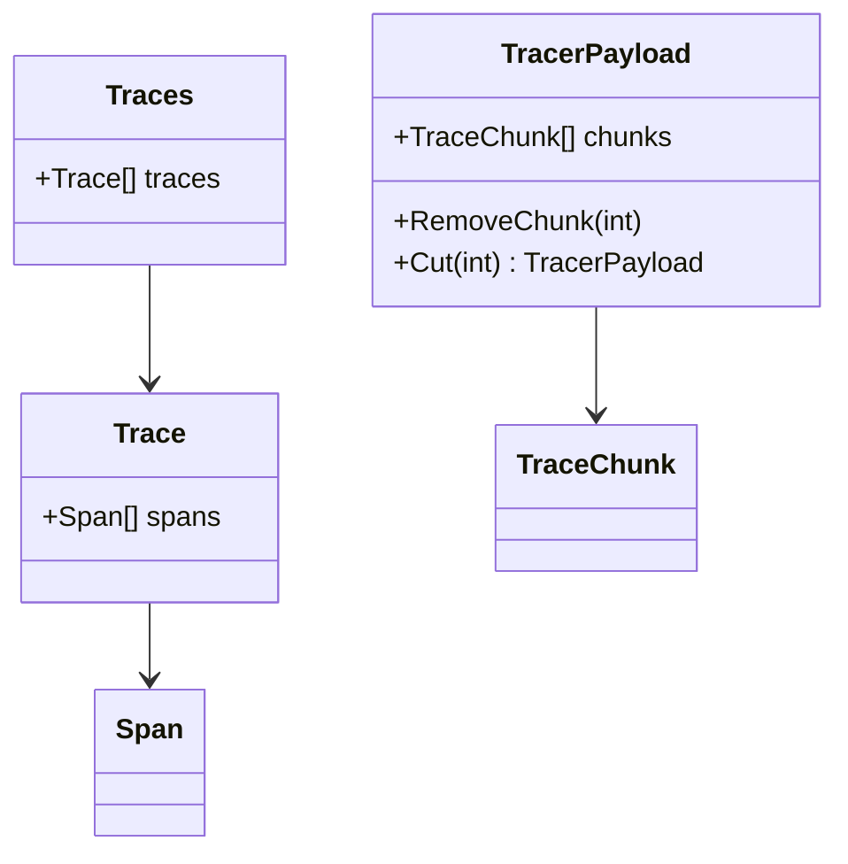

# Introduction to Trace in Proto

Trace refers to a collection of spans that share the same trace ID. Each span represents a unit of work or a specific operation within a trace. Traces are used to track the flow of requests through various services and components, providing a detailed view of the execution path and performance characteristics.

<SwmSnippet path="/pkg/proto/pbgo/trace/trace.go" line="12">

---

## Trace Type Definition

The <SwmToken path="pkg/proto/pbgo/trace/trace.go" pos="12:2:2" line-data="// Trace is a collection of spans with the same trace ID">`Trace`</SwmToken> type is defined as a slice of pointers to <SwmToken path="pkg/proto/pbgo/trace/trace.go" pos="13:7:7" line-data="type Trace []*Span">`Span`</SwmToken> objects, indicating that a trace is essentially a list of spans.

```go
// Trace is a collection of spans with the same trace ID
type Trace []*Span
```

---

</SwmSnippet>

<SwmSnippet path="/pkg/proto/pbgo/trace/trace.go" line="15">

---

## Traces Type Definition

The <SwmToken path="pkg/proto/pbgo/trace/trace.go" pos="15:2:2" line-data="// Traces is a list of traces. This model matters as this is what we unpack from msgp.">`Traces`</SwmToken> type is a slice of <SwmToken path="pkg/proto/pbgo/trace/trace.go" pos="16:6:6" line-data="type Traces []Trace">`Trace`</SwmToken> objects, representing a list of traces. This structure is important for unpacking data from the message pack format.

```go
// Traces is a list of traces. This model matters as this is what we unpack from msgp.
type Traces []Trace
```

---

</SwmSnippet>

<SwmSnippet path="/pkg/proto/pbgo/trace/tracer_payload.pb.go" line="23">

---

## <SwmToken path="pkg/proto/pbgo/trace/tracer_payload.pb.go" pos="23:2:2" line-data="// TraceChunk represents a list of spans with the same trace ID. In other words, a chunk of a trace.">`TraceChunk`</SwmToken>

The <SwmToken path="pkg/proto/pbgo/trace/tracer_payload.pb.go" pos="23:2:2" line-data="// TraceChunk represents a list of spans with the same trace ID. In other words, a chunk of a trace.">`TraceChunk`</SwmToken> type represents a list of spans with the same trace ID. It includes fields like priority, origin, spans, tags, and <SwmToken path="pkg/proto/pbgo/trace/tracer_payload.pb.go" pos="41:3:3" line-data="	// droppedTrace specifies whether the trace was dropped by samplers or not.">`droppedTrace`</SwmToken>.

```go
// TraceChunk represents a list of spans with the same trace ID. In other words, a chunk of a trace.
type TraceChunk struct {
	state         protoimpl.MessageState
	sizeCache     protoimpl.SizeCache
	unknownFields protoimpl.UnknownFields

	// priority specifies sampling priority of the trace.
	// @gotags: json:"priority" msg:"priority"
	Priority int32 `protobuf:"varint,1,opt,name=priority,proto3" json:"priority" msg:"priority"`
	// origin specifies origin product ("lambda", "rum", etc.) of the trace.
	// @gotags: json:"origin" msg:"origin"
	Origin string `protobuf:"bytes,2,opt,name=origin,proto3" json:"origin" msg:"origin"`
	// spans specifies list of containing spans.
	// @gotags: json:"spans" msg:"spans"
	Spans []*Span `protobuf:"bytes,3,rep,name=spans,proto3" json:"spans" msg:"spans"`
	// tags specifies tags common in all `spans`.
	// @gotags: json:"tags" msg:"tags"
	Tags map[string]string `protobuf:"bytes,4,rep,name=tags,proto3" json:"tags" protobuf_key:"bytes,1,opt,name=key,proto3" protobuf_val:"bytes,2,opt,name=value,proto3" msg:"tags"`
	// droppedTrace specifies whether the trace was dropped by samplers or not.
	// @gotags: json:"dropped_trace" msg:"dropped_trace"
	DroppedTrace bool `protobuf:"varint,5,opt,name=droppedTrace,proto3" json:"dropped_trace" msg:"dropped_trace"`
```

---

</SwmSnippet>

<SwmSnippet path="/pkg/proto/pbgo/trace/tracer_payload.pb.go" line="113">

---

## <SwmToken path="pkg/proto/pbgo/trace/tracer_payload.pb.go" pos="113:2:2" line-data="// TracerPayload represents a payload the trace agent receives from tracers.">`TracerPayload`</SwmToken>

The <SwmToken path="pkg/proto/pbgo/trace/tracer_payload.pb.go" pos="113:2:2" line-data="// TracerPayload represents a payload the trace agent receives from tracers.">`TracerPayload`</SwmToken> type represents a payload the trace agent receives from tracers. It includes fields like <SwmToken path="pkg/proto/pbgo/trace/tracer_payload.pb.go" pos="119:3:3" line-data="	// containerID specifies the ID of the container where the tracer is running on.">`containerID`</SwmToken>, <SwmToken path="pkg/proto/pbgo/trace/tracer_payload.pb.go" pos="122:3:3" line-data="	// languageName specifies language of the tracer.">`languageName`</SwmToken>, <SwmToken path="pkg/proto/pbgo/trace/tracer_payload.pb.go" pos="125:3:3" line-data="	// languageVersion specifies language version of the tracer.">`languageVersion`</SwmToken>, <SwmToken path="pkg/proto/pbgo/trace/tracer_payload.pb.go" pos="128:3:3" line-data="	// tracerVersion specifies version of the tracer.">`tracerVersion`</SwmToken>, <SwmToken path="pkg/proto/pbgo/trace/tracer_payload.pb.go" pos="131:3:3" line-data="	// runtimeID specifies V4 UUID representation of a tracer session.">`runtimeID`</SwmToken>, chunks, tags, env, hostname, and <SwmToken path="pkg/proto/pbgo/trace/trace.go" pos="44:1:1" line-data="		AppVersion:      p.GetAppVersion(),">`AppVersion`</SwmToken>.

```go
// TracerPayload represents a payload the trace agent receives from tracers.
type TracerPayload struct {
	state         protoimpl.MessageState
	sizeCache     protoimpl.SizeCache
	unknownFields protoimpl.UnknownFields

	// containerID specifies the ID of the container where the tracer is running on.
	// @gotags: json:"container_id" msg:"container_id"
	ContainerID string `protobuf:"bytes,1,opt,name=containerID,proto3" json:"container_id" msg:"container_id"`
	// languageName specifies language of the tracer.
	// @gotags: json:"language_name" msg:"language_name"
	LanguageName string `protobuf:"bytes,2,opt,name=languageName,proto3" json:"language_name" msg:"language_name"`
	// languageVersion specifies language version of the tracer.
	// @gotags: json:"language_version" msg:"language_version"
	LanguageVersion string `protobuf:"bytes,3,opt,name=languageVersion,proto3" json:"language_version" msg:"language_version"`
	// tracerVersion specifies version of the tracer.
	// @gotags: json:"tracer_version" msg:"tracer_version"
	TracerVersion string `protobuf:"bytes,4,opt,name=tracerVersion,proto3" json:"tracer_version" msg:"tracer_version"`
	// runtimeID specifies V4 UUID representation of a tracer session.
	// @gotags: json:"runtime_id" msg:"runtime_id"
	RuntimeID string `protobuf:"bytes,5,opt,name=runtimeID,proto3" json:"runtime_id" msg:"runtime_id"`
```

---

</SwmSnippet>

<SwmSnippet path="/pkg/proto/pbgo/trace/trace_test.go" line="14">

---

## <SwmToken path="pkg/proto/pbgo/trace/trace_test.go" pos="15:6:6" line-data="	tp := &amp;TracerPayload{">`TracerPayload`</SwmToken> Methods

The <SwmToken path="pkg/proto/pbgo/trace/trace_test.go" pos="15:6:6" line-data="	tp := &amp;TracerPayload{">`TracerPayload`</SwmToken> type includes methods like <SwmToken path="pkg/proto/pbgo/trace/trace_test.go" pos="22:3:3" line-data="	tp.RemoveChunk(3)  // does nothing">`RemoveChunk`</SwmToken> and <SwmToken path="pkg/proto/pbgo/trace/trace.go" pos="27:2:2" line-data="// Cut cuts off a new tracer payload from the `p` with [0, i-1] chunks">`Cut`</SwmToken>, which manipulate chunks of trace data. These methods help in managing and processing trace data efficiently.

```go
func TestRemoveChunk(t *testing.T) {
	tp := &TracerPayload{
		Chunks: []*TraceChunk{
			{Origin: "chunk-0"},
			{Origin: "chunk-1"},
			{Origin: "chunk-2"},
		},
	}
	tp.RemoveChunk(3)  // does nothing
	tp.RemoveChunk(-1) // does nothing
	tp.RemoveChunk(2)
	tp.RemoveChunk(0)
	assert.Len(t, tp.Chunks, 1)
	assert.Equal(t, tp.Chunks[0].Origin, "chunk-1")
}
```

---

</SwmSnippet>

<SwmSnippet path="/pkg/proto/pbgo/trace/trace.go" line="27">

---

## Cut Method

The <SwmToken path="pkg/proto/pbgo/trace/trace.go" pos="27:2:2" line-data="// Cut cuts off a new tracer payload from the `p` with [0, i-1] chunks">`Cut`</SwmToken> method is used to cut off a new tracer payload from the original payload with specified chunks. It helps in managing and processing trace data efficiently.

```go
// Cut cuts off a new tracer payload from the `p` with [0, i-1] chunks
// and keeps [i, n-1] chunks in the original payload `p`.
func (p *TracerPayload) Cut(i int) *TracerPayload {
	if i < 0 {
		i = 0
	}
	if i > len(p.Chunks) {
		i = len(p.Chunks)
	}
	newPayload := TracerPayload{
		ContainerID:     p.GetContainerID(),
		LanguageName:    p.GetLanguageName(),
		LanguageVersion: p.GetLanguageVersion(),
		TracerVersion:   p.GetTracerVersion(),
		RuntimeID:       p.GetRuntimeID(),
		Env:             p.GetEnv(),
		Hostname:        p.GetHostname(),
		AppVersion:      p.GetAppVersion(),
		Tags:            p.GetTags(),
	}
```

---

</SwmSnippet>

&nbsp;

*This is an auto-generated document by Swimm AI 🌊 and has not yet been verified by a human*

<SwmMeta version="3.0.0" repo-id="Z2l0aHViJTNBJTNBZGF0YWRvZy1hZ2VudCUzQSUzQVN3aW1tLURlbW8=" repo-name="datadog-agent"><sup>Powered by [Swimm](/)</sup></SwmMeta>
