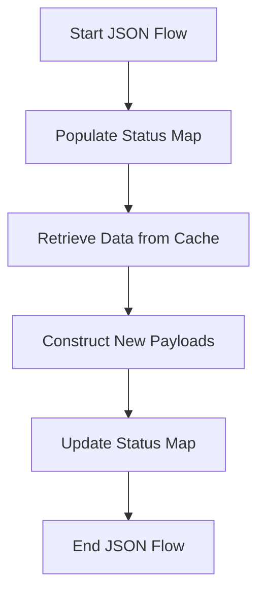

This document will cover the JSON Flow Overview, which includes:

1. Populating the Status Map
2. Retrieving Data from Cache
3. Constructing New Payloads.

Technical document: <SwmLink doc-title="JSON Flow Overview">[JSON Flow Overview](/.swm/json-flow-overview.doqsw8io.sw.md)</SwmLink>

# [Populating the Status Map](https://app.swimm.io/repos/Z2l0aHViJTNBJTNBZGF0YWRvZy1hZ2VudCUzQSUzQVN3aW1tLURlbW8=/docs/doqsw8io#json)

The JSON flow begins by populating the status map. This involves gathering various pieces of metadata, such as hostname statistics and host tags, and adding them to the status map. This ensures that the status map contains all the necessary information about the host.

# [Retrieving Data from Cache](https://app.swimm.io/repos/Z2l0aHViJTNBJTNBZGF0YWRvZy1hZ2VudCUzQSUzQVN3aW1tLURlbW8=/docs/doqsw8io#getfromcache)

The next step in the JSON flow is to retrieve data from the cache. If the required data is found in the cache, it is used to update the status map. This step helps in reducing the time and resources needed to gather metadata by reusing previously collected data.

# [Constructing New Payloads](https://app.swimm.io/repos/Z2l0aHViJTNBJTNBZGF0YWRvZy1hZ2VudCUzQSUzQVN3aW1tLURlbW8=/docs/doqsw8io#getpayload)

If the required data is not found in the cache, a new payload is constructed. This involves collecting various pieces of data such as hostname, system stats, host tags, and other metadata. The new payload is then cached for future use and used to update the status map. This ensures that the status map is always up-to-date with the latest metadata.

&nbsp;

*This is an auto-generated document by Swimm AI 🌊 and has not yet been verified by a human*

<SwmMeta version="3.0.0" repo-id="Z2l0aHViJTNBJTNBZGF0YWRvZy1hZ2VudCUzQSUzQVN3aW1tLURlbW8=" repo-name="datadog-agent">Powered by [Swimm](/)</SwmMeta>
