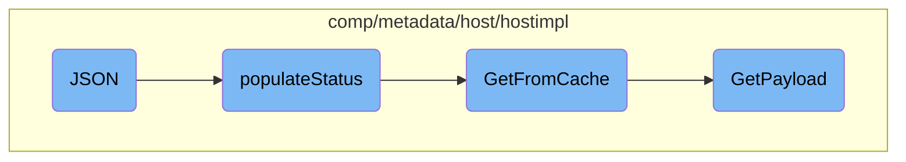

This document explains the JSON flow, which is responsible for populating the status map with various pieces of metadata. The flow involves several steps, including calling functions to gather metadata, retrieving data from the cache, and constructing new payloads when necessary.

The JSON flow starts by calling a function to populate the status map. This function gathers different pieces of metadata, such as hostname statistics and host tags, and adds them to the status map. If the required data is not found in the cache, a new payload is generated. This ensures that the status map is always up-to-date with the latest metadata.

# Flow drill down



<SwmSnippet path="/comp/metadata/host/hostimpl/status.go" line="73">

---

## JSON

The <SwmToken path="comp/metadata/host/hostimpl/status.go" pos="73:2:2" line-data="// JSON populates the status map">`JSON`</SwmToken> function is responsible for populating the status map by calling the <SwmToken path="comp/metadata/host/hostimpl/status.go" pos="75:3:3" line-data="	p.populateStatus(stats)">`populateStatus`</SwmToken> function. This is the entry point for the JSON flow.

```go
// JSON populates the status map
func (p StatusProvider) JSON(_ bool, stats map[string]interface{}) error {
	p.populateStatus(stats)

	return nil
}
```

---

</SwmSnippet>

<SwmSnippet path="/comp/metadata/host/hostimpl/status.go" line="48">

---

## <SwmToken path="comp/metadata/host/hostimpl/status.go" pos="48:8:8" line-data="func (p StatusProvider) populateStatus(stats map[string]interface{}) {">`populateStatus`</SwmToken>

The <SwmToken path="comp/metadata/host/hostimpl/status.go" pos="48:8:8" line-data="func (p StatusProvider) populateStatus(stats map[string]interface{}) {">`populateStatus`</SwmToken> function gathers various pieces of metadata and adds them to the status map. It retrieves hostname statistics, metadata from the cache, host tags, and host information, and then adds these to the <SwmToken path="comp/metadata/host/hostimpl/status.go" pos="48:10:10" line-data="func (p StatusProvider) populateStatus(stats map[string]interface{}) {">`stats`</SwmToken> map.

```go
func (p StatusProvider) populateStatus(stats map[string]interface{}) {
	hostnameStatsJSON := []byte(expvar.Get("hostname").String())
	hostnameStats := make(map[string]interface{})
	json.Unmarshal(hostnameStatsJSON, &hostnameStats) //nolint:errcheck
	stats["hostnameStats"] = hostnameStats

	payload := utils.GetFromCache(context.TODO(), p.Config)
	metadataStats := make(map[string]interface{})
	payloadBytes, _ := json.Marshal(payload)

	json.Unmarshal(payloadBytes, &metadataStats) //nolint:errcheck

	stats["metadata"] = metadataStats

	hostTags := make([]string, 0, len(payload.HostTags.System)+len(payload.HostTags.GoogleCloudPlatform))
	hostTags = append(hostTags, payload.HostTags.System...)
	hostTags = append(hostTags, payload.HostTags.GoogleCloudPlatform...)
	stats["hostTags"] = hostTags
	hostinfo := utils.GetInformation()
	hostinfoMap := make(map[string]interface{})
	hostinfoBytes, _ := json.Marshal(hostinfo)
```

---

</SwmSnippet>

<SwmSnippet path="/comp/metadata/host/hostimpl/utils/host.go" line="201">

---

## <SwmToken path="comp/metadata/host/hostimpl/utils/host.go" pos="201:2:2" line-data="// GetFromCache returns the payload from the cache if it exists, otherwise it creates it.">`GetFromCache`</SwmToken>

The <SwmToken path="comp/metadata/host/hostimpl/utils/host.go" pos="201:2:2" line-data="// GetFromCache returns the payload from the cache if it exists, otherwise it creates it.">`GetFromCache`</SwmToken> function attempts to retrieve the payload from the cache. If the payload is not found in the cache, it calls the <SwmToken path="comp/metadata/host/hostimpl/utils/host.go" pos="206:3:3" line-data="		return GetPayload(ctx, conf)">`GetPayload`</SwmToken> function to generate a new payload.

```go
// GetFromCache returns the payload from the cache if it exists, otherwise it creates it.
// The metadata reporting should always grab it fresh. Any other uses, e.g. status, should use this
func GetFromCache(ctx context.Context, conf config.Reader) *Payload {
	data, found := cache.Cache.Get(hostCacheKey)
	if !found {
		return GetPayload(ctx, conf)
	}
	return data.(*Payload)
}
```

---

</SwmSnippet>

<SwmSnippet path="/comp/metadata/host/hostimpl/utils/host.go" line="169">

---

## <SwmToken path="comp/metadata/host/hostimpl/utils/host.go" pos="169:2:2" line-data="// GetPayload builds a metadata payload every time is called.">`GetPayload`</SwmToken>

The <SwmToken path="comp/metadata/host/hostimpl/utils/host.go" pos="169:2:2" line-data="// GetPayload builds a metadata payload every time is called.">`GetPayload`</SwmToken> function constructs a new metadata payload. It collects various pieces of data such as hostname, system stats, host tags, and other metadata, and then caches this payload for future use.

```go
// GetPayload builds a metadata payload every time is called.
// Some data is collected only once, some is cached, some is collected at every call.
func GetPayload(ctx context.Context, conf config.Reader) *Payload {
	hostnameData, err := hostname.GetWithProvider(ctx)
	if err != nil {
		log.Errorf("Error grabbing hostname for status: %v", err)
		hostnameData = hostname.Data{Hostname: "unknown", Provider: "unknown"}
	}

	meta := GetMeta(ctx, conf)
	meta.Hostname = hostnameData.Hostname

	p := &Payload{
		Os:            osName,
		AgentFlavor:   flavor.GetFlavor(),
		PythonVersion: python.GetPythonInfo(),
		SystemStats:   getSystemStats(),
		Meta:          meta,
		HostTags:      hosttags.Get(ctx, false, conf),
		ContainerMeta: containerMetadata.Get(1 * time.Second),
		NetworkMeta:   getNetworkMeta(ctx),
```

---

</SwmSnippet>

&nbsp;

*This is an auto-generated document by Swimm AI 🌊 and has not yet been verified by a human*

<SwmMeta version="3.0.0" repo-id="Z2l0aHViJTNBJTNBZGF0YWRvZy1hZ2VudCUzQSUzQVN3aW1tLURlbW8=" repo-name="datadog-agent"><sup>Powered by [Swimm](/)</sup></SwmMeta>
