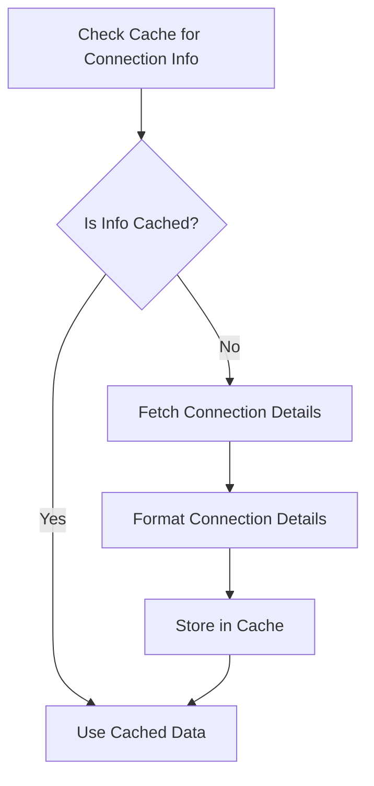

This document will cover the Kubelet Connection Information Flow, which includes:

1. Checking the cache for existing connection information
2. Fetching and formatting connection details if not cached
3. Storing the connection information in the cache for future use.

Technical document: <SwmLink doc-title="Kubelet Connection Information Flow">[Kubelet Connection Information Flow](/.swm/kubelet-connection-information-flow.f8xox322.sw.md)</SwmLink>

# [Checking the Cache for Existing Connection Information](https://app.swimm.io/repos/Z2l0aHViJTNBJTNBZGF0YWRvZy1hZ2VudCUzQSUzQVN3aW1tLURlbW8=/docs/f8xox322#getkubeletconnectioninfo)

The process begins by checking if the kubelet connection information is already available in the cache. This step is crucial for performance optimization as it avoids redundant network calls. If the information is found in the cache, it is used directly, ensuring quick access to the required data.

# [Fetching and Formatting Connection Details if Not Cached](https://app.swimm.io/repos/Z2l0aHViJTNBJTNBZGF0YWRvZy1hZ2VudCUzQSUzQVN3aW1tLURlbW8=/docs/f8xox322#getkubeletconnectioninfo)

If the connection information is not found in the cache, the system proceeds to fetch the connection details. This involves making a network call to retrieve the necessary data. Once fetched, the connection details are converted into a specific format that is suitable for further processing. This formatted data ensures consistency and ease of use in subsequent steps.

# [Storing the Connection Information in the Cache for Future Use](https://app.swimm.io/repos/Z2l0aHViJTNBJTNBZGF0YWRvZy1hZ2VudCUzQSUzQVN3aW1tLURlbW8=/docs/f8xox322#getkubeletconnectioninfo)

After formatting the connection details, the information is stored in the cache. This step is essential for improving the efficiency of future requests. By caching the data, the system can quickly retrieve the connection information without needing to fetch and format it again, thereby reducing latency and improving overall performance.

&nbsp;

*This is an auto-generated document by Swimm AI 🌊 and has not yet been verified by a human*

<SwmMeta version="3.0.0" repo-id="Z2l0aHViJTNBJTNBZGF0YWRvZy1hZ2VudCUzQSUzQVN3aW1tLURlbW8=" repo-name="datadog-agent">Powered by [Swimm](/)</SwmMeta>
