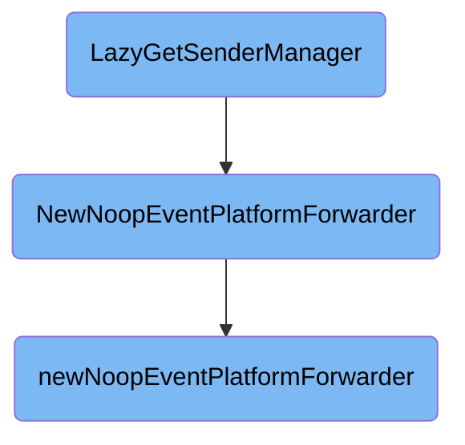

This document explains the purpose and functionality of the <SwmToken path="comp/aggregator/diagnosesendermanager/diagnosesendermanagerimpl/sendermanager.go" pos="51:2:2" line-data="// LazyGetSenderManager gets an instance of SenderManager lazily.">`LazyGetSenderManager`</SwmToken> function. It details how the function initializes and retrieves an instance of <SwmToken path="comp/aggregator/diagnosesendermanager/diagnosesendermanagerimpl/sendermanager.go" pos="51:12:12" line-data="// LazyGetSenderManager gets an instance of SenderManager lazily.">`SenderManager`</SwmToken> lazily, ensuring that various components are set up correctly before returning the instance.

The <SwmToken path="comp/aggregator/diagnosesendermanager/diagnosesendermanagerimpl/sendermanager.go" pos="51:2:2" line-data="// LazyGetSenderManager gets an instance of SenderManager lazily.">`LazyGetSenderManager`</SwmToken> function is responsible for lazily initializing and retrieving a <SwmToken path="comp/aggregator/diagnosesendermanager/diagnosesendermanagerimpl/sendermanager.go" pos="51:12:12" line-data="// LazyGetSenderManager gets an instance of SenderManager lazily.">`SenderManager`</SwmToken> instance. First, it checks if the <SwmToken path="comp/aggregator/diagnosesendermanager/diagnosesendermanagerimpl/sendermanager.go" pos="51:12:12" line-data="// LazyGetSenderManager gets an instance of SenderManager lazily.">`SenderManager`</SwmToken> already exists. If it does, it returns the existing instance. If not, it initializes necessary components like the hostname, forwarder, and event platform forwarder. It also sets up the aggregator with specific options to disable certain functionalities. Once everything is set up, it saves the <SwmToken path="comp/aggregator/diagnosesendermanager/diagnosesendermanagerimpl/sendermanager.go" pos="51:12:12" line-data="// LazyGetSenderManager gets an instance of SenderManager lazily.">`SenderManager`</SwmToken> instance for future use and returns it.

# Flow drill down



<SwmSnippet path="/comp/aggregator/diagnosesendermanager/diagnosesendermanagerimpl/sendermanager.go" line="51">

---

## <SwmToken path="comp/aggregator/diagnosesendermanager/diagnosesendermanagerimpl/sendermanager.go" pos="51:2:2" line-data="// LazyGetSenderManager gets an instance of SenderManager lazily.">`LazyGetSenderManager`</SwmToken>

The <SwmToken path="comp/aggregator/diagnosesendermanager/diagnosesendermanagerimpl/sendermanager.go" pos="51:2:2" line-data="// LazyGetSenderManager gets an instance of SenderManager lazily.">`LazyGetSenderManager`</SwmToken> function is responsible for lazily initializing and retrieving an instance of <SwmToken path="comp/aggregator/diagnosesendermanager/diagnosesendermanagerimpl/sendermanager.go" pos="51:12:12" line-data="// LazyGetSenderManager gets an instance of SenderManager lazily.">`SenderManager`</SwmToken>. It first checks if the <SwmToken path="comp/aggregator/diagnosesendermanager/diagnosesendermanagerimpl/sendermanager.go" pos="51:12:12" line-data="// LazyGetSenderManager gets an instance of SenderManager lazily.">`SenderManager`</SwmToken> instance already exists. If not, it proceeds to initialize various components such as the hostname, forwarder, and event platform forwarder. The function ensures that the aggregator is initialized with specific options, including disabling the flush goroutines and starting the forwarders. Finally, it sets the initialized <SwmToken path="comp/aggregator/diagnosesendermanager/diagnosesendermanagerimpl/sendermanager.go" pos="51:12:12" line-data="// LazyGetSenderManager gets an instance of SenderManager lazily.">`SenderManager`</SwmToken> instance for future use.

```go
// LazyGetSenderManager gets an instance of SenderManager lazily.
func (sender *diagnoseSenderManager) LazyGetSenderManager() (sender.SenderManager, error) {
	senderManager, found := sender.senderManager.Get()
	if found {
		return senderManager, nil
	}

	hostnameDetected, err := sender.deps.Hostname.Get(context.TODO())
	if err != nil {
		return nil, sender.deps.Log.Errorf("Error while getting hostname, exiting: %v", err)
	}

	// Initializing the aggregator with a flush interval of 0 (to disable the flush goroutines)
	opts := aggregator.DefaultAgentDemultiplexerOptions()
	opts.FlushInterval = 0
	opts.DontStartForwarders = true

	log := sender.deps.Log
	config := sender.deps.Config
	forwarder := defaultforwarder.NewDefaultForwarder(config, log, defaultforwarder.NewOptions(config, log, nil))
	orchestratorForwarder := optional.NewOptionPtr[defaultforwarder.Forwarder](defaultforwarder.NoopForwarder{})
```

---

</SwmSnippet>

<SwmSnippet path="/comp/forwarder/eventplatform/eventplatformimpl/epforwarder.go" line="519">

---

## <SwmToken path="comp/forwarder/eventplatform/eventplatformimpl/epforwarder.go" pos="519:2:2" line-data="// NewNoopEventPlatformForwarder returns the standard event platform forwarder with sending disabled, meaning events">`NewNoopEventPlatformForwarder`</SwmToken>

The <SwmToken path="comp/forwarder/eventplatform/eventplatformimpl/epforwarder.go" pos="519:2:2" line-data="// NewNoopEventPlatformForwarder returns the standard event platform forwarder with sending disabled, meaning events">`NewNoopEventPlatformForwarder`</SwmToken> function returns a standard event platform forwarder with sending disabled. This means that events will accumulate in each pipeline channel without being forwarded to the intake. It achieves this by calling the <SwmToken path="comp/forwarder/eventplatform/eventplatformimpl/epforwarder.go" pos="519:2:2" line-data="// NewNoopEventPlatformForwarder returns the standard event platform forwarder with sending disabled, meaning events">`NewNoopEventPlatformForwarder`</SwmToken> function.

```go
// NewNoopEventPlatformForwarder returns the standard event platform forwarder with sending disabled, meaning events
// will build up in each pipeline channel without being forwarded to the intake
func NewNoopEventPlatformForwarder(hostname hostnameinterface.Component) eventplatform.Forwarder {
	return newNoopEventPlatformForwarder(hostname)
}
```

---

</SwmSnippet>

<SwmSnippet path="/comp/forwarder/eventplatform/eventplatformimpl/epforwarder.go" line="525">

---

### <SwmToken path="comp/forwarder/eventplatform/eventplatformimpl/epforwarder.go" pos="525:2:2" line-data="func newNoopEventPlatformForwarder(hostname hostnameinterface.Component) *defaultEventPlatformForwarder {">`newNoopEventPlatformForwarder`</SwmToken>

The <SwmToken path="comp/forwarder/eventplatform/eventplatformimpl/epforwarder.go" pos="525:2:2" line-data="func newNoopEventPlatformForwarder(hostname hostnameinterface.Component) *defaultEventPlatformForwarder {">`newNoopEventPlatformForwarder`</SwmToken> function creates a new instance of <SwmToken path="comp/forwarder/eventplatform/eventplatformimpl/epforwarder.go" pos="525:12:12" line-data="func newNoopEventPlatformForwarder(hostname hostnameinterface.Component) *defaultEventPlatformForwarder {">`defaultEventPlatformForwarder`</SwmToken> with the senders removed. This is done by setting the strategy of each pipeline to <SwmToken path="comp/forwarder/eventplatform/eventplatformimpl/epforwarder.go" pos="529:7:7" line-data="		p.strategy = nil">`nil`</SwmToken>, effectively disabling the forwarding of events. This function is used by <SwmToken path="comp/forwarder/eventplatform/eventplatformimpl/epforwarder.go" pos="525:2:2" line-data="func newNoopEventPlatformForwarder(hostname hostnameinterface.Component) *defaultEventPlatformForwarder {">`newNoopEventPlatformForwarder`</SwmToken> to provide a forwarder that does not send events.

```go
func newNoopEventPlatformForwarder(hostname hostnameinterface.Component) *defaultEventPlatformForwarder {
	f := newDefaultEventPlatformForwarder(pkgconfig.Datadog(), eventplatformreceiverimpl.NewReceiver(hostname).Comp)
	// remove the senders
	for _, p := range f.pipelines {
		p.strategy = nil
	}
	return f
}
```

---

</SwmSnippet>

&nbsp;

*This is an auto-generated document by Swimm AI 🌊 and has not yet been verified by a human*

<SwmMeta version="3.0.0" repo-id="Z2l0aHViJTNBJTNBZGF0YWRvZy1hZ2VudCUzQSUzQVN3aW1tLURlbW8=" repo-name="datadog-agent"><sup>Powered by [Swimm](/)</sup></SwmMeta>
