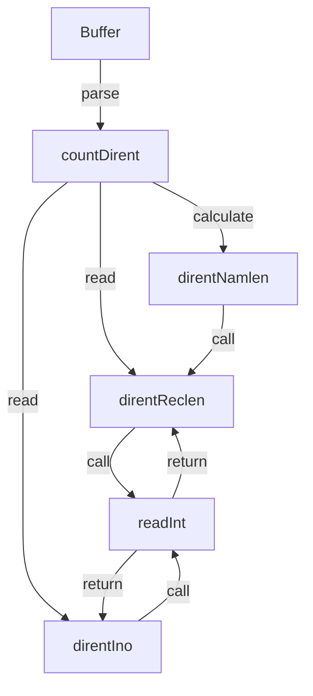

# Overview

The <SwmToken path="pkg/process/procutil/dirent_linux.go" pos="10:2:2" line-data="package procutil">`procutil`</SwmToken> package in the <SwmPath>[pkg/process/procutil/dirent_linux.go](pkg/process/procutil/dirent_linux.go)</SwmPath> file is responsible for handling directory entries on Linux systems. It imports necessary packages like <SwmToken path="pkg/process/procutil/dirent_linux.go" pos="13:2:2" line-data="	&quot;bytes&quot;">`bytes`</SwmToken>, <SwmToken path="pkg/process/procutil/dirent_linux.go" pos="14:2:2" line-data="	&quot;syscall&quot;">`syscall`</SwmToken>, <SwmToken path="pkg/process/procutil/dirent_linux.go" pos="15:2:2" line-data="	&quot;unsafe&quot;">`unsafe`</SwmToken>, and <SwmPath>[pkg/util/native/](pkg/util/native/)</SwmPath> to facilitate its operations.

<SwmSnippet path="/pkg/process/procutil/dirent_linux.go" line="10">

---

The <SwmToken path="pkg/process/procutil/dirent_linux.go" pos="10:2:2" line-data="package procutil">`procutil`</SwmToken> package imports essential packages to handle directory entries on Linux systems.

```go
package procutil

import (
	"bytes"
	"syscall"
	"unsafe"

	"github.com/DataDog/datadog-agent/pkg/util/native"
)
```

---

</SwmSnippet>

# Directory Entry Variables

The <SwmToken path="pkg/process/procutil/dirent_linux.go" pos="21:1:1" line-data="	dotBytes       = []byte(&quot;.&quot;)">`dotBytes`</SwmToken> and <SwmToken path="pkg/process/procutil/dirent_linux.go" pos="22:1:1" line-data="	doubleDotBytes = []byte(&quot;..&quot;)">`doubleDotBytes`</SwmToken> variables are defined to represent the `.` and <SwmToken path="pkg/process/procutil/dirent_linux.go" pos="22:10:10" line-data="	doubleDotBytes = []byte(&quot;..&quot;)">`..`</SwmToken> directory entries, which are commonly used to refer to the current and parent directories, respectively.

<SwmSnippet path="/pkg/process/procutil/dirent_linux.go" line="20">

---

The <SwmToken path="pkg/process/procutil/dirent_linux.go" pos="21:1:1" line-data="	dotBytes       = []byte(&quot;.&quot;)">`dotBytes`</SwmToken> and <SwmToken path="pkg/process/procutil/dirent_linux.go" pos="22:1:1" line-data="	doubleDotBytes = []byte(&quot;..&quot;)">`doubleDotBytes`</SwmToken> variables represent the `.` and <SwmToken path="pkg/process/procutil/dirent_linux.go" pos="22:10:10" line-data="	doubleDotBytes = []byte(&quot;..&quot;)">`..`</SwmToken> directory entries.

```go
var (
	dotBytes       = []byte(".")
	doubleDotBytes = []byte("..")
)
```

---

</SwmSnippet>

# Parsing Directory Entries

The function <SwmToken path="pkg/process/procutil/dirent_linux.go" pos="26:2:2" line-data="func countDirent(buf []byte) (consumed int, count int) {">`countDirent`</SwmToken> parses directory entries in a buffer and returns the number of valid entries. It skips over the `.` and <SwmToken path="pkg/process/procutil/dirent_linux.go" pos="22:10:10" line-data="	doubleDotBytes = []byte(&quot;..&quot;)">`..`</SwmToken> entries and counts the rest.

<SwmSnippet path="/pkg/process/procutil/dirent_linux.go" line="26">

---

The <SwmToken path="pkg/process/procutil/dirent_linux.go" pos="26:2:2" line-data="func countDirent(buf []byte) (consumed int, count int) {">`countDirent`</SwmToken> function parses directory entries in a buffer and returns the number of valid entries.

```go
func countDirent(buf []byte) (consumed int, count int) {
	origlen := len(buf)
	count = 0
	for len(buf) > 0 {
		reclen, ok := direntReclen(buf)
		if !ok || reclen > uint64(len(buf)) {
			return origlen, count
		}

		rec := buf[:reclen]
		buf = buf[reclen:]

		ino, ok := direntIno(rec)
		if !ok {
			break
		}
		if ino == 0 { // File absent in directory.
			continue
		}
		const namoff = uint64(unsafe.Offsetof(syscall.Dirent{}.Name))
```

---

</SwmSnippet>

# Helper Functions

Several helper functions are used within <SwmToken path="pkg/process/procutil/dirent_linux.go" pos="26:2:2" line-data="func countDirent(buf []byte) (consumed int, count int) {">`countDirent`</SwmToken> to extract information from directory entries.

## <SwmToken path="pkg/process/procutil/dirent_linux.go" pos="30:8:8" line-data="		reclen, ok := direntReclen(buf)">`direntReclen`</SwmToken>

The <SwmToken path="pkg/process/procutil/dirent_linux.go" pos="30:8:8" line-data="		reclen, ok := direntReclen(buf)">`direntReclen`</SwmToken> function reads the record length of a directory entry from the buffer using the <SwmToken path="pkg/process/procutil/dirent_linux.go" pos="69:3:3" line-data="	return readInt(buf, unsafe.Offsetof(syscall.Dirent{}.Reclen), unsafe.Sizeof(syscall.Dirent{}.Reclen))">`readInt`</SwmToken> function.

<SwmSnippet path="/pkg/process/procutil/dirent_linux.go" line="68">

---

The <SwmToken path="pkg/process/procutil/dirent_linux.go" pos="68:2:2" line-data="func direntReclen(buf []byte) (uint64, bool) {">`direntReclen`</SwmToken> function reads the record length of a directory entry.

```go
func direntReclen(buf []byte) (uint64, bool) {
	return readInt(buf, unsafe.Offsetof(syscall.Dirent{}.Reclen), unsafe.Sizeof(syscall.Dirent{}.Reclen))
}
```

---

</SwmSnippet>

## <SwmToken path="pkg/process/procutil/dirent_linux.go" pos="38:8:8" line-data="		ino, ok := direntIno(rec)">`direntIno`</SwmToken>

The <SwmToken path="pkg/process/procutil/dirent_linux.go" pos="38:8:8" line-data="		ino, ok := direntIno(rec)">`direntIno`</SwmToken> function reads the inode number of a directory entry from the buffer using the <SwmToken path="pkg/process/procutil/dirent_linux.go" pos="69:3:3" line-data="	return readInt(buf, unsafe.Offsetof(syscall.Dirent{}.Reclen), unsafe.Sizeof(syscall.Dirent{}.Reclen))">`readInt`</SwmToken> function.

<SwmSnippet path="/pkg/process/procutil/dirent_linux.go" line="72">

---

The <SwmToken path="pkg/process/procutil/dirent_linux.go" pos="72:2:2" line-data="func direntIno(buf []byte) (uint64, bool) {">`direntIno`</SwmToken> function reads the inode number of a directory entry.

```go
func direntIno(buf []byte) (uint64, bool) {
	return readInt(buf, unsafe.Offsetof(syscall.Dirent{}.Ino), unsafe.Sizeof(syscall.Dirent{}.Ino))
}
```

---

</SwmSnippet>

## <SwmToken path="pkg/process/procutil/dirent_linux.go" pos="76:2:2" line-data="func direntNamlen(buf []byte) (uint64, bool) {">`direntNamlen`</SwmToken>

The <SwmToken path="pkg/process/procutil/dirent_linux.go" pos="76:2:2" line-data="func direntNamlen(buf []byte) (uint64, bool) {">`direntNamlen`</SwmToken> function calculates the length of the name of a directory entry by subtracting the offset of the name field from the record length.

<SwmSnippet path="/pkg/process/procutil/dirent_linux.go" line="76">

---

The <SwmToken path="pkg/process/procutil/dirent_linux.go" pos="76:2:2" line-data="func direntNamlen(buf []byte) (uint64, bool) {">`direntNamlen`</SwmToken> function calculates the length of the name field in a directory entry.

```go
func direntNamlen(buf []byte) (uint64, bool) {
	reclen, ok := direntReclen(buf)
	if !ok {
		return 0, false
	}
	return reclen - uint64(unsafe.Offsetof(syscall.Dirent{}.Name)), true
}
```

---

</SwmSnippet>

## <SwmToken path="pkg/process/procutil/dirent_linux.go" pos="69:3:3" line-data="	return readInt(buf, unsafe.Offsetof(syscall.Dirent{}.Reclen), unsafe.Sizeof(syscall.Dirent{}.Reclen))">`readInt`</SwmToken>

The <SwmToken path="pkg/process/procutil/dirent_linux.go" pos="69:3:3" line-data="	return readInt(buf, unsafe.Offsetof(syscall.Dirent{}.Reclen), unsafe.Sizeof(syscall.Dirent{}.Reclen))">`readInt`</SwmToken> function reads an unsigned integer of a specified size from the buffer at a given offset. It supports sizes of 1, 2, 4, and 8 bytes.

<SwmSnippet path="/pkg/process/procutil/dirent_linux.go" line="84">

---

The <SwmToken path="pkg/process/procutil/dirent_linux.go" pos="84:2:2" line-data="// readInt returns the size-bytes unsigned integer in native byte order at offset off.">`readInt`</SwmToken> function reads an unsigned integer from a byte slice at a specified offset and size.

```go
// readInt returns the size-bytes unsigned integer in native byte order at offset off.
func readInt(b []byte, off, size uintptr) (u uint64, ok bool) {
	if len(b) < int(off+size) {
		return 0, false
	}

	switch size {
	case 1:
		return uint64(b[off]), true
	case 2:
		return uint64(native.Endian.Uint16(b[off:])), true
	case 4:
		return uint64(native.Endian.Uint32(b[off:])), true
	case 8:
		return native.Endian.Uint64(b[off:]), true
	default:
		panic("syscall: readInt with unsupported size")
	}
}
```

---

</SwmSnippet>

&nbsp;

*This is an auto-generated document by Swimm AI 🌊 and has not yet been verified by a human*

<SwmMeta version="3.0.0" repo-id="Z2l0aHViJTNBJTNBZGF0YWRvZy1hZ2VudCUzQSUzQVN3aW1tLURlbW8=" repo-name="datadog-agent"><sup>Powered by [Swimm](/)</sup></SwmMeta>
