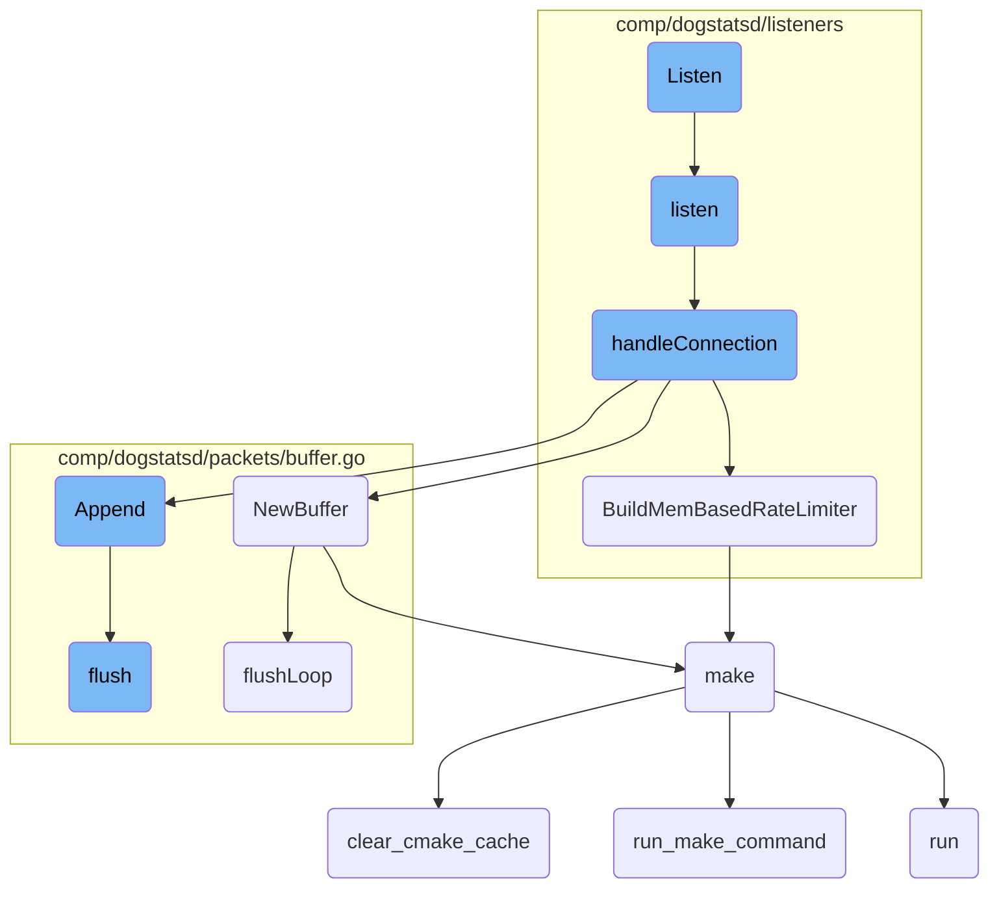
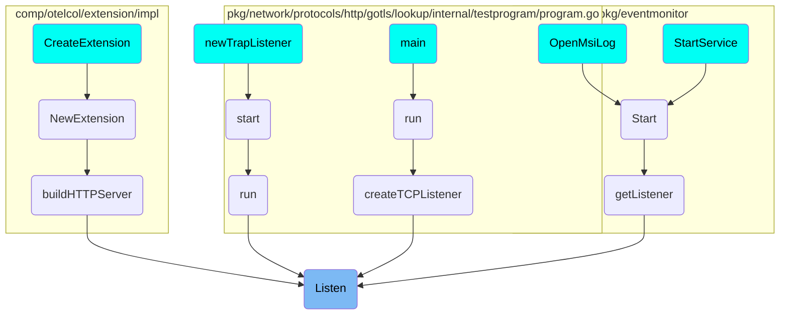

This document explains the 'Listen' functionality, which is crucial for initiating the intake loop for the <SwmToken path="comp/dogstatsd/listeners/uds_stream.go" pos="67:6:6" line-data="func (l *UDSStreamListener) Listen() {">`UDSStreamListener`</SwmToken>. It describes how 'Listen' operates, including starting the connection tracker and handling incoming connections.

The 'Listen' functionality starts by initiating the intake loop for the <SwmToken path="comp/dogstatsd/listeners/uds_stream.go" pos="67:6:6" line-data="func (l *UDSStreamListener) Listen() {">`UDSStreamListener`</SwmToken>. This process runs in its own separate thread. Once started, it begins to accept incoming Unix connections. For each connection, a new thread is created to handle it. This ensures that multiple connections can be managed simultaneously without blocking the main process. The connection tracker is also started to keep track of all active connections.

# Flow drill down



<SwmSnippet path="/comp/dogstatsd/listeners/uds_stream.go" line="66">

---

## Listen

The <SwmToken path="comp/dogstatsd/listeners/uds_stream.go" pos="66:2:2" line-data="// Listen runs the intake loop. Should be called in its own goroutine">`Listen`</SwmToken> function initiates the intake loop for the <SwmToken path="comp/dogstatsd/listeners/uds_stream.go" pos="67:6:6" line-data="func (l *UDSStreamListener) Listen() {">`UDSStreamListener`</SwmToken>. It runs in its own goroutine and calls the <SwmToken path="comp/dogstatsd/listeners/uds_stream.go" pos="66:2:2" line-data="// Listen runs the intake loop. Should be called in its own goroutine">`Listen`</SwmToken> function to start accepting connections.

```go
// Listen runs the intake loop. Should be called in its own goroutine
func (l *UDSStreamListener) Listen() {
	l.listenWg.Add(1)
	go func() {
		defer l.listenWg.Done()
		l.listen()
	}()
}
```

---

</SwmSnippet>

<SwmSnippet path="/comp/dogstatsd/listeners/uds_stream.go" line="75">

---

## listen

The <SwmToken path="comp/dogstatsd/listeners/uds_stream.go" pos="75:9:9" line-data="func (l *UDSStreamListener) listen() {">`listen`</SwmToken> function starts the connection tracker and enters a loop to accept incoming Unix connections. For each accepted connection, it spawns a new goroutine to handle the connection using the <SwmToken path="comp/dogstatsd/listeners/uds_stream.go" pos="89:7:7" line-data="			_ = l.handleConnection(conn, func(c *net.UnixConn) error {">`handleConnection`</SwmToken> function.

```go
func (l *UDSStreamListener) listen() {

	l.connTracker.Start()
	log.Infof("dogstatsd-uds-stream: starting to listen on %s", l.conn.Addr())
	for {
		conn, err := l.conn.AcceptUnix()
		if err != nil {
			if !strings.HasSuffix(err.Error(), " use of closed network connection") {
				log.Errorf("dogstatsd-uds: error accepting connection: %v", err)
			}
			break
		}
		go func() {
			l.connTracker.Track(conn)
			_ = l.handleConnection(conn, func(c *net.UnixConn) error {
				l.connTracker.Close(c)
				return nil
			})
			if err != nil {
				log.Errorf("dogstatsd-uds-stream: error handling connection: %v", err)
			}
```

---

</SwmSnippet>

# Where is this flow used?

This flow is used multiple times in the codebase as represented in the following diagram:

(Note - these are only some of the entry points of this flow)



&nbsp;

*This is an auto-generated document by Swimm AI 🌊 and has not yet been verified by a human*

<SwmMeta version="3.0.0" repo-id="Z2l0aHViJTNBJTNBZGF0YWRvZy1hZ2VudCUzQSUzQVN3aW1tLURlbW8=" repo-name="datadog-agent"><sup>Powered by [Swimm](/)</sup></SwmMeta>
