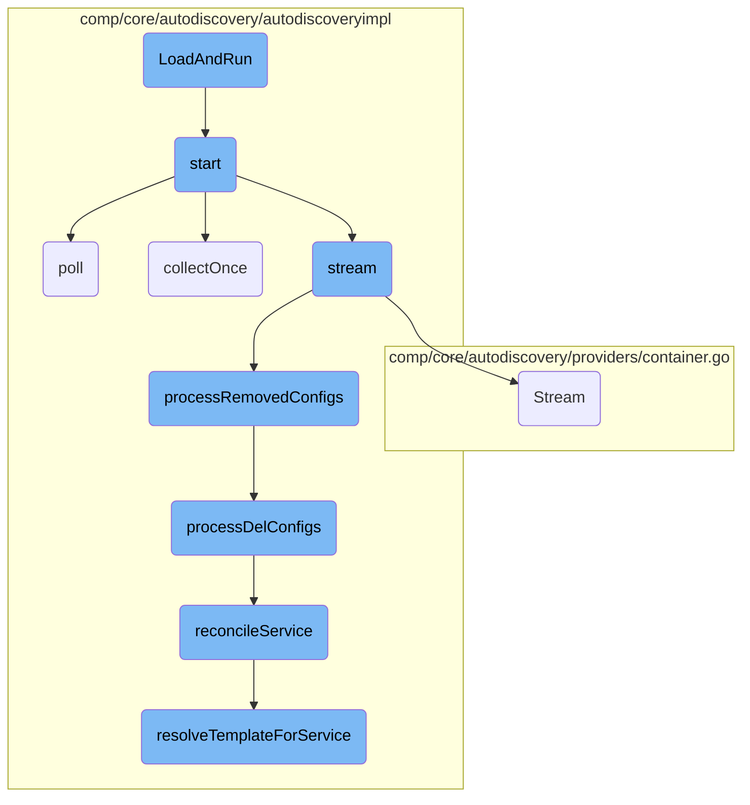
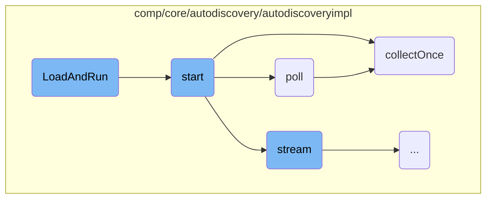
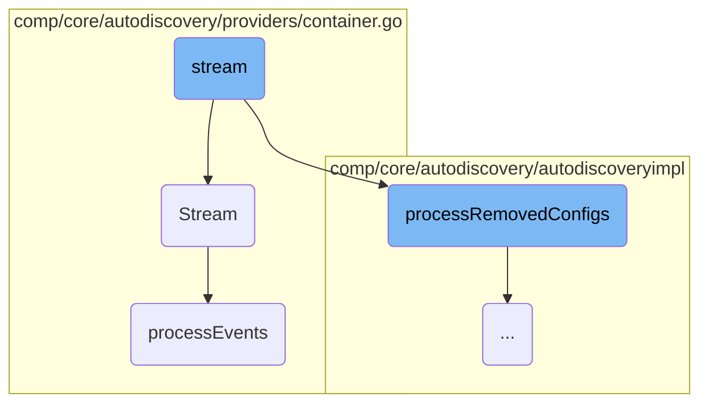
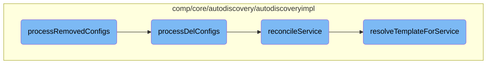

This document explains the <SwmToken path="comp/core/autodiscovery/autodiscoveryimpl/autoconfig.go" pos="401:2:2" line-data="// LoadAndRun loads all of the integration configs it can find">`LoadAndRun`</SwmToken> process, which is responsible for initializing and managing configuration providers. It covers the steps involved in loading integration configurations, starting configuration pollers, and handling both streaming and collecting configurations.

The <SwmToken path="comp/core/autodiscovery/autodiscoveryimpl/autoconfig.go" pos="401:2:2" line-data="// LoadAndRun loads all of the integration configs it can find">`LoadAndRun`</SwmToken> process begins by loading all available integration configurations and scheduling them. It ensures that providers that don't need polling are queried at least once. The process involves starting configuration pollers, which can either stream or collect configurations. For streaming providers, it sets up a continuous stream to listen for changes. For collecting providers, it retrieves configurations once and then periodically polls for updates. The process also includes handling errors from file-based configuration providers and managing removed configurations to keep the system up-to-date.

Here is a high level diagram of the flow, showing only the most important functions:



# Flow drill down

First, we'll zoom into this section of the flow:



<SwmSnippet path="/comp/core/autodiscovery/autodiscoveryimpl/autoconfig.go" line="401">

---

## <SwmToken path="comp/core/autodiscovery/autodiscoveryimpl/autoconfig.go" pos="401:2:2" line-data="// LoadAndRun loads all of the integration configs it can find">`LoadAndRun`</SwmToken> Initialization

The <SwmToken path="comp/core/autodiscovery/autodiscoveryimpl/autoconfig.go" pos="401:2:2" line-data="// LoadAndRun loads all of the integration configs it can find">`LoadAndRun`</SwmToken> function initializes the configuration by loading all available integration configs and scheduling them. It ensures that providers that do not require polling are queried at least once. This function iterates over all config pollers, starts them, and logs their status. Additionally, it handles errors from file-based config providers.

```go
// LoadAndRun loads all of the integration configs it can find
// and schedules them. Should always be run once so providers
// that don't need polling will be queried at least once
func (ac *AutoConfig) LoadAndRun(ctx context.Context) {
	for _, cp := range ac.getConfigPollers() {
		cp.start(ctx, ac)
		if cp.canPoll {
			log.Infof("Started config provider %q, polled every %s", cp.provider.String(), cp.pollInterval.String())
		} else {
			log.Infof("Started config provider %q", cp.provider.String())
		}

		// TODO: this probably belongs somewhere inside the file config
		// provider itself, but since it already lived in AD it's been
		// moved here for the moment.
		if fileConfPd, ok := cp.provider.(*providers.FileConfigProvider); ok {
			// Grab any errors that occurred when reading the YAML file
			for name, e := range fileConfPd.Errors {
				errorStats.setConfigError(name, e)
			}
		}
```

---

</SwmSnippet>

<SwmSnippet path="/comp/core/autodiscovery/autodiscoveryimpl/config_poller.go" line="58">

---

## Starting Configuration Polling

The <SwmToken path="comp/core/autodiscovery/autodiscoveryimpl/config_poller.go" pos="58:2:2" line-data="// start starts polling the provider descriptor. It blocks until the provider">`start`</SwmToken> function begins the polling process for the configuration provider. It differentiates between streaming and collecting config providers, initiating the appropriate method for each. For streaming providers, it starts a goroutine to handle streaming. For collecting providers, it calls <SwmToken path="comp/core/autodiscovery/autodiscoveryimpl/config_poller.go" pos="70:3:3" line-data="		cp.collectOnce(ctx, provider, ac)">`collectOnce`</SwmToken> and, if polling is enabled, starts the <SwmToken path="comp/core/autodiscovery/autodiscoveryimpl/config_poller.go" pos="76:5:5" line-data="		go cp.poll(provider, ac)">`poll`</SwmToken> function in a goroutine.

```go
// start starts polling the provider descriptor. It blocks until the provider
// returns all the known configs.
func (cp *configPoller) start(ctx context.Context, ac *AutoConfig) {
	switch provider := cp.provider.(type) {
	case providers.StreamingConfigProvider:
		cp.stopChan = make(chan struct{})

		ch := make(chan struct{})
		go cp.stream(ch, provider, ac)
		<-ch

	case providers.CollectingConfigProvider:
		cp.collectOnce(ctx, provider, ac)

		if !cp.canPoll {
			return
		}

		go cp.poll(provider, ac)
	default:
		panic(fmt.Sprintf("provider %q does not implement StreamingConfigProvider nor CollectingConfigProvider", provider.String()))
```

---

</SwmSnippet>

<SwmSnippet path="/comp/core/autodiscovery/autodiscoveryimpl/config_poller.go" line="126">

---

### Polling Configuration

The <SwmToken path="comp/core/autodiscovery/autodiscoveryimpl/config_poller.go" pos="126:2:2" line-data="// poll polls config of the corresponding config provider">`poll`</SwmToken> function continuously polls the configuration provider at specified intervals. It checks if the provider's configurations are up-to-date and, if not, calls <SwmToken path="comp/core/autodiscovery/autodiscoveryimpl/config_poller.go" pos="70:3:3" line-data="		cp.collectOnce(ctx, provider, ac)">`collectOnce`</SwmToken> to retrieve new configurations. The function also handles health checks and can stop polling based on signals received on the <SwmToken path="comp/core/autodiscovery/autodiscoveryimpl/config_poller.go" pos="139:6:6" line-data="		case &lt;-cp.stopChan:">`stopChan`</SwmToken> channel.

```go
// poll polls config of the corresponding config provider
func (cp *configPoller) poll(provider providers.CollectingConfigProvider, ac *AutoConfig) {
	ctx, cancel := context.WithCancel(context.Background())
	ticker := time.NewTicker(cp.pollInterval)
	healthHandle := health.RegisterLiveness(fmt.Sprintf("ad-config-provider-%s", cp.provider.String()))

	cp.isRunning = true

	for {
		select {
		case healthDeadline := <-healthHandle.C:
			cancel()
			ctx, cancel = context.WithDeadline(context.Background(), healthDeadline)
		case <-cp.stopChan:
			err := healthHandle.Deregister()
			if err != nil {
				log.Errorf("error de-registering health check: %s", err)
			}

			cancel()
			ticker.Stop()
```

---

</SwmSnippet>

<SwmSnippet path="/comp/core/autodiscovery/autodiscoveryimpl/config_poller.go" line="165">

---

### Collecting Configurations Once

The <SwmToken path="comp/core/autodiscovery/autodiscoveryimpl/config_poller.go" pos="165:9:9" line-data="func (cp *configPoller) collectOnce(ctx context.Context, provider providers.CollectingConfigProvider, ac *AutoConfig) {">`collectOnce`</SwmToken> function retrieves new and removed configurations from the provider. It logs the number of new and removed configurations and processes them accordingly. Removed configurations are processed first to handle potential configuration hash conflicts. New configurations are then processed, with special handling for JMX metric files, and any changes are applied.

```go
func (cp *configPoller) collectOnce(ctx context.Context, provider providers.CollectingConfigProvider, ac *AutoConfig) {
	// retrieve the list of newly added configurations as well
	// as removed configurations
	newConfigs, removedConfigs := cp.collect(ctx, provider)
	if len(newConfigs) > 0 || len(removedConfigs) > 0 {
		log.Infof("%v provider: collected %d new configurations, removed %d", cp.provider, len(newConfigs), len(removedConfigs))
	} else {
		log.Debugf("%v provider: no configuration change", cp.provider)
	}

	// Process removed configs first to handle the case where a
	// container churn would result in the same configuration hash.
	ac.processRemovedConfigs(removedConfigs)

	for _, config := range newConfigs {
		if _, ok := cp.provider.(*providers.FileConfigProvider); ok {
			// JMX checks can have 2 YAML files: one containing the
			// metrics to collect, one containing the instance
			// configuration. If the file provider finds any of
			// these metric YAMLs, we store them in a map for
			// future access
```

---

</SwmSnippet>

Now, lets zoom into this section of the flow:



<SwmSnippet path="/comp/core/autodiscovery/autodiscoveryimpl/config_poller.go" line="82">

---

## Streaming Configurations

The <SwmToken path="comp/core/autodiscovery/autodiscoveryimpl/config_poller.go" pos="82:2:2" line-data="// stream streams config from the corresponding config provider">`stream`</SwmToken> function is responsible for streaming configurations from the corresponding config provider. It sets up a context with cancellation, registers a health check, and listens for changes from the provider. When changes are detected, it processes removed configurations and applies new ones.

```go
// stream streams config from the corresponding config provider
func (cp *configPoller) stream(ch chan struct{}, provider providers.StreamingConfigProvider, ac *AutoConfig) {
	var ranOnce bool
	ctx, cancel := context.WithCancel(context.Background())
	changesCh := provider.Stream(ctx)
	healthHandle := health.RegisterLiveness(fmt.Sprintf("ad-config-provider-%s", cp.provider.String()))

	cp.isRunning = true

	for {
		select {
		case <-healthHandle.C:

		case <-cp.stopChan:
			err := healthHandle.Deregister()
			if err != nil {
				log.Errorf("error de-registering health check: %s", err)
			}

			cancel()

```

---

</SwmSnippet>

<SwmSnippet path="/comp/core/autodiscovery/providers/container.go" line="51">

---

## Listening to Workload Metadata

The <SwmToken path="comp/core/autodiscovery/providers/container.go" pos="51:2:2" line-data="// Stream starts listening to workloadmeta to generate configs as they come">`Stream`</SwmToken> function starts listening to workload metadata to generate configurations as they come. It subscribes to workload metadata events and processes them in real-time, ensuring that configurations are generated before any associated services.

```go
// Stream starts listening to workloadmeta to generate configs as they come
// instead of relying on a periodic call to Collect.
func (k *ContainerConfigProvider) Stream(ctx context.Context) <-chan integration.ConfigChanges {
	const name = "ad-kubecontainerprovider"

	// outCh must be unbuffered. processing of workloadmeta events must not
	// proceed until the config is processed by autodiscovery, as configs
	// need to be generated before any associated services.
	outCh := make(chan integration.ConfigChanges)

	filter := workloadmeta.NewFilterBuilder().
		AddKind(workloadmeta.KindContainer).
		AddKind(workloadmeta.KindKubernetesPod).
		Build()
	inCh := k.workloadmetaStore.Subscribe(name, workloadmeta.ConfigProviderPriority, filter)

	go func() {
		for {
			select {
			case <-ctx.Done():
				k.workloadmetaStore.Unsubscribe(inCh)
```

---

</SwmSnippet>

<SwmSnippet path="/comp/core/autodiscovery/providers/container.go" line="90">

---

### Processing Events

The <SwmToken path="comp/core/autodiscovery/providers/container.go" pos="90:9:9" line-data="func (k *ContainerConfigProvider) processEvents(evBundle workloadmeta.EventBundle) integration.ConfigChanges {">`processEvents`</SwmToken> function handles the events received from the workload metadata store. It locks the configuration cache, processes each event to generate or remove configurations, updates the cache, and returns the changes. This ensures that the system's configuration is always up-to-date with the latest metadata.

```go
func (k *ContainerConfigProvider) processEvents(evBundle workloadmeta.EventBundle) integration.ConfigChanges {
	k.mu.Lock()
	defer k.mu.Unlock()

	changes := integration.ConfigChanges{}

	for _, event := range evBundle.Events {
		entityName := buildEntityName(event.Entity)

		switch event.Type {
		case workloadmeta.EventTypeSet:
			configs, err := k.generateConfig(event.Entity)

			if err != nil {
				k.configErrors[entityName] = err
			} else {
				delete(k.configErrors, entityName)
			}

			configCache, ok := k.configCache[entityName]
			if !ok {
```

---

</SwmSnippet>

Now, lets zoom into this section of the flow:



<SwmSnippet path="/comp/core/autodiscovery/autodiscoveryimpl/autoconfig.go" line="580">

---

## Handling Removed Configurations

The <SwmToken path="comp/core/autodiscovery/autodiscoveryimpl/config_poller.go" pos="177:3:3" line-data="	ac.processRemovedConfigs(removedConfigs)">`processRemovedConfigs`</SwmToken> function initiates the handling of removed configurations by calling <SwmToken path="comp/core/autodiscovery/autodiscoveryimpl/autoconfig.go" pos="580:9:9" line-data="	changes := ac.cfgMgr.processDelConfigs(configs)">`processDelConfigs`</SwmToken> to determine the changes needed. It then applies these changes and deletes any mappings of check <SwmToken path="tasks/gitlab_helpers.py" pos="90:10:10" line-data="def print_gitlab_object(get_object, ctx, ids, repo=&#39;DataDog/datadog-agent&#39;, jq: str | None = None, jq_colors=True):">`ids`</SwmToken> with secrets.

```go
	changes := ac.cfgMgr.processDelConfigs(configs)
	ac.applyChanges(changes)
	ac.deleteMappingsOfCheckIDsWithSecrets(changes.Unschedule)
```

---

</SwmSnippet>

<SwmSnippet path="/comp/core/autodiscovery/autodiscoveryimpl/configmgr.go" line="238">

---

## Processing Deleted Configurations

The <SwmToken path="comp/core/autodiscovery/autodiscoveryimpl/configmgr.go" pos="238:9:9" line-data="func (cm *reconcilingConfigManager) processDelConfigs(configs []integration.Config) integration.ConfigChanges {">`processDelConfigs`</SwmToken> function locks the configuration manager and iterates over the provided configurations. It checks if each configuration is tracked by autodiscovery and skips those that are not.

```go
func (cm *reconcilingConfigManager) processDelConfigs(configs []integration.Config) integration.ConfigChanges {
	cm.m.Lock()
	defer cm.m.Unlock()

	var allChanges integration.ConfigChanges
	for _, config := range configs {
		digest := config.Digest()
		if _, found := cm.activeConfigs[digest]; !found {
			log.Debug("Config %v is not tracked by autodiscovery", config.Name)
			continue
		}
```

---

</SwmSnippet>

<SwmSnippet path="/comp/core/autodiscovery/autodiscoveryimpl/configmgr.go" line="253">

---

For tracked configurations, it updates the active configurations and services, and removes the configuration from the templates by AD ID. It then gathers matching services for further processing.

```go
		delete(cm.activeConfigs, digest)

		var changes integration.ConfigChanges
		if config.IsTemplate() {
			//  2. update templatesByADID or servicesByADID to match
			matchingServices := map[string]struct{}{}
			for _, adID := range config.ADIdentifiers {
				cm.templatesByADID.remove(adID, digest)
				for _, svcID := range cm.servicesByADID.get(adID) {
					matchingServices[svcID] = struct{}{}
				}
			}
```

---

</SwmSnippet>

<SwmSnippet path="/comp/core/autodiscovery/autodiscoveryimpl/configmgr.go" line="267">

---

The function updates service resolutions and generates changes by calling <SwmToken path="comp/core/autodiscovery/autodiscoveryimpl/configmgr.go" pos="268:7:7" line-data="				changes.Merge(cm.reconcileService(svcID))">`reconcileService`</SwmToken> for each matching service.

```go
			for svcID := range matchingServices {
				changes.Merge(cm.reconcileService(svcID))
			}
		} else {
```

---

</SwmSnippet>

<SwmSnippet path="/comp/core/autodiscovery/autodiscoveryimpl/configmgr.go" line="295">

---

## Reconciling Services

The <SwmToken path="comp/core/autodiscovery/autodiscoveryimpl/configmgr.go" pos="295:2:2" line-data="// reconcileService calculates the current set of resolved templates for the">`reconcileService`</SwmToken> function calculates the current set of resolved templates for a given service and updates the service resolutions. It returns the changes that need to be applied.

```go
// reconcileService calculates the current set of resolved templates for the
// given service and calculates the difference from what is currently recorded
// in cm.serviceResolutions.  It updates cm.serviceResolutions and returns the
// changes.
```

---

</SwmSnippet>

<SwmSnippet path="/comp/core/autodiscovery/autodiscoveryimpl/configmgr.go" line="335">

---

It compares existing resolutions with expected ones, unscheduling configurations that are no longer needed.

```go
	for templateDigest, resolvedDigest := range existingResolutions {
		if _, found = expectedResolutions[templateDigest]; !found {
			changes.UnscheduleConfig(cm.scheduledConfigs[resolvedDigest])
			delete(existingResolutions, templateDigest)
		}
```

---

</SwmSnippet>

<SwmSnippet path="/comp/core/autodiscovery/autodiscoveryimpl/configmgr.go" line="343">

---

For new expected resolutions, it resolves the template for the service using <SwmToken path="comp/core/autodiscovery/autodiscoveryimpl/configmgr.go" pos="346:10:10" line-data="			resolved, ok := cm.resolveTemplateForService(config, svc)">`resolveTemplateForService`</SwmToken> and schedules the configuration.

```go
		if _, found := existingResolutions[digest]; !found {
			// at this point, there was at least one expected resolution, so
			// svc must not be nil.
			resolved, ok := cm.resolveTemplateForService(config, svc)
			if !ok {
				continue
			}
			changes.ScheduleConfig(resolved)
			existingResolutions[digest] = resolved.Digest()
		}
```

---

</SwmSnippet>

<SwmSnippet path="/comp/core/autodiscovery/autodiscoveryimpl/configmgr.go" line="364">

---

## Resolving Templates for Services

The <SwmToken path="comp/core/autodiscovery/autodiscoveryimpl/configmgr.go" pos="364:2:2" line-data="// resolveTemplateForService resolves a template config for the given service,">`resolveTemplateForService`</SwmToken> function resolves a template configuration for a given service. It updates error statistics and returns the resolved configuration if successful.

```go
// resolveTemplateForService resolves a template config for the given service,
// updating errorStats in the process.  If the resolution fails, this method
// returns false.
func (cm *reconcilingConfigManager) resolveTemplateForService(tpl integration.Config, svc listeners.Service) (integration.Config, bool) {
	config, err := configresolver.Resolve(tpl, svc)
	if err != nil {
```

---

</SwmSnippet>

<SwmSnippet path="/comp/core/autodiscovery/autodiscoveryimpl/configmgr.go" line="374">

---

If the resolution involves decrypting secrets, it handles any errors that occur during decryption and updates the error statistics accordingly.

```go
	resolvedConfig, err := decryptConfig(config, cm.secretResolver)
	if err != nil {
		msg := fmt.Sprintf("error decrypting secrets in config %s for service %s: %v", config.Name, svc.GetServiceID(), err)
		errorStats.setResolveWarning(tpl.Name, msg)
		return config, false
	}
```

---

</SwmSnippet>

&nbsp;

*This is an auto-generated document by Swimm AI 🌊 and has not yet been verified by a human*

<SwmMeta version="3.0.0" repo-id="Z2l0aHViJTNBJTNBZGF0YWRvZy1hZ2VudCUzQSUzQVN3aW1tLURlbW8=" repo-name="datadog-agent"><sup>Powered by [Swimm](/)</sup></SwmMeta>
