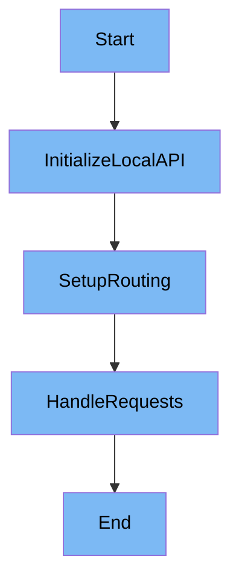

This document will cover the LocalAPI Initialization and Routing feature, which includes:

1. Initializing the LocalAPI
2. Setting up routing for API requests.

Technical document: <SwmLink doc-title="LocalAPI Initialization and Routing">[LocalAPI Initialization and Routing](/.swm/localapi-initialization-and-routing.sjumnsa8.sw.md)</SwmLink>

# [Initializing the LocalAPI](https://app.swimm.io/repos/Z2l0aHViJTNBJTNBZGF0YWRvZy1hZ2VudCUzQSUzQVN3aW1tLURlbW8=/docs/sjumnsa8#initialization)

The initialization process of the LocalAPI involves setting up the server handler and starting the server. This step is essential as it establishes the foundation for handling incoming API requests. The server handler is configured to manage the various endpoints that will be defined later. Once the server is running, it is ready to accept and process incoming requests.

# [Setting up routing for API requests](https://app.swimm.io/repos/Z2l0aHViJTNBJTNBZGF0YWRvZy1hZ2VudCUzQSUzQVN3aW1tLURlbW8=/docs/sjumnsa8#routing)

The routing setup involves defining the endpoints for different functionalities such as status checks, catalog updates, and experiment controls. Each endpoint is associated with a specific handler that manages the corresponding API functionality. For example, the <SwmPath>[cmd/agent/subcommands/status/](cmd/agent/subcommands/status/)</SwmPath> endpoint is used for status checks, while the `/catalog` endpoint handles catalog updates. This routing configuration ensures that incoming requests are directed to the appropriate handlers, enabling the LocalAPI to provide the necessary services.

# [Creating a New Router](https://app.swimm.io/repos/Z2l0aHViJTNBJTNBZGF0YWRvZy1hZ2VudCUzQSUzQVN3aW1tLURlbW8=/docs/sjumnsa8#creating-a-new-router)

The creation of a new router instance involves specifying a namespace and organizing the API endpoints efficiently under a specific path prefix. This helps in managing the API endpoints in a structured manner, making it easier to handle requests and maintain the codebase. The new router instance is used to handle requests under the defined namespace, ensuring that the endpoints are properly organized and accessible.

&nbsp;

*This is an auto-generated document by Swimm AI 🌊 and has not yet been verified by a human*

<SwmMeta version="3.0.0" repo-id="Z2l0aHViJTNBJTNBZGF0YWRvZy1hZ2VudCUzQSUzQVN3aW1tLURlbW8=" repo-name="datadog-agent">Powered by [Swimm](/)</SwmMeta>
