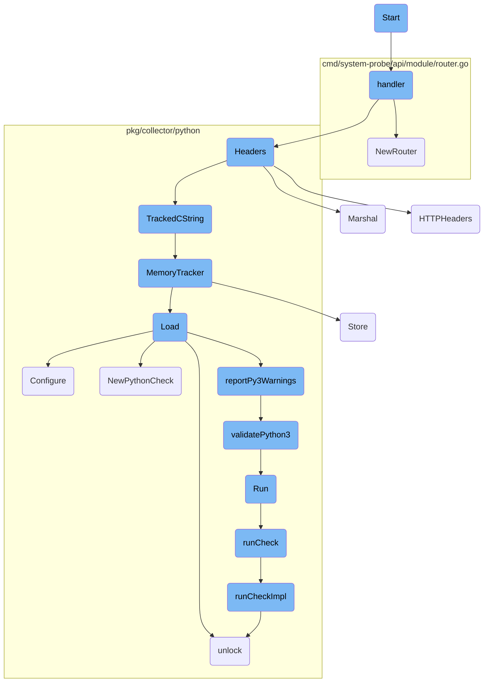
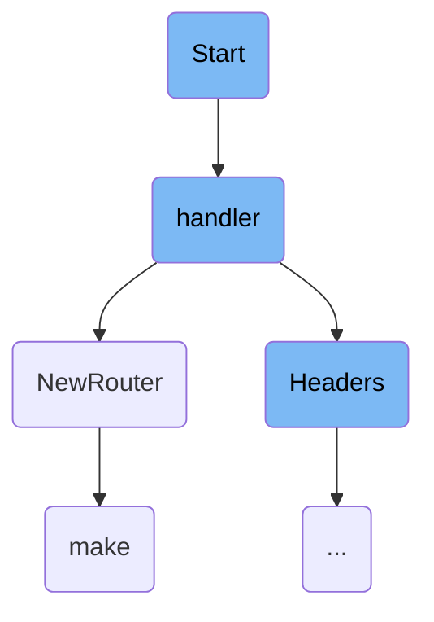
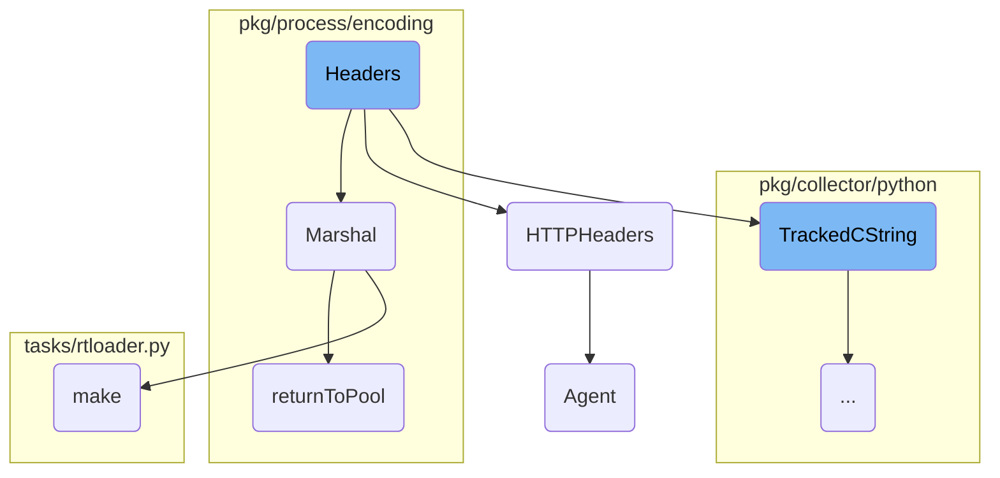
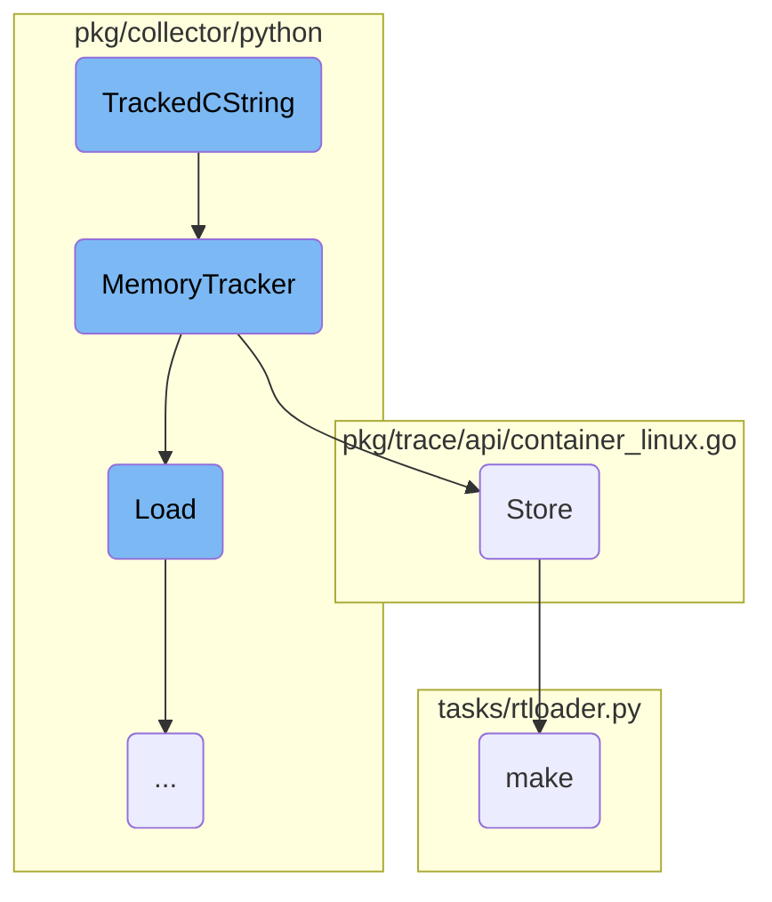
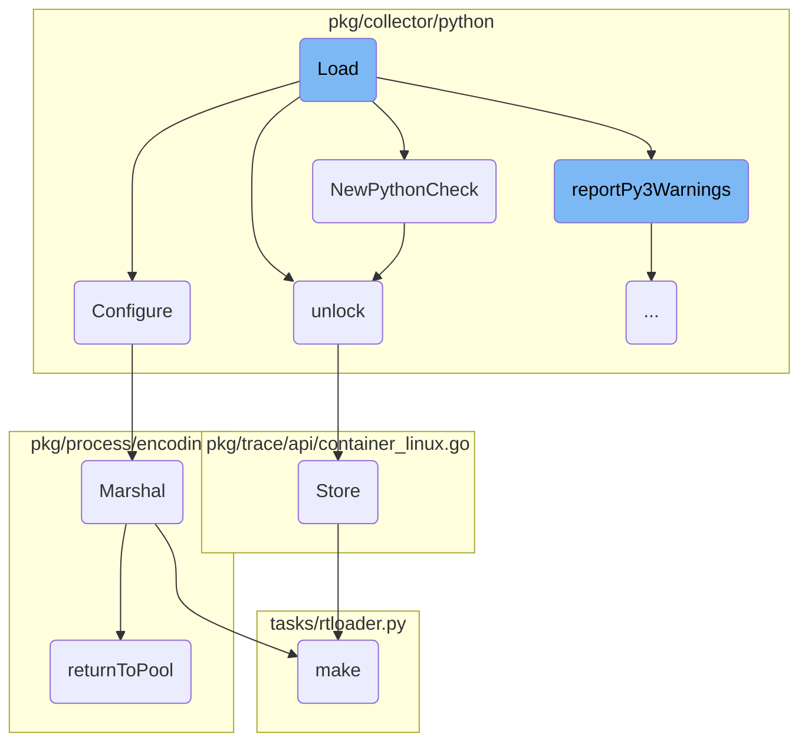
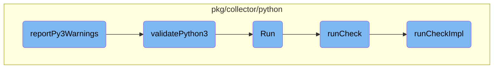

This document explains the initialization process of the <SwmToken path="pkg/fleet/daemon/local_api.go" pos="87:8:8" line-data="// Start starts the LocalAPI.">`LocalAPI`</SwmToken> and how it sets up routing for handling various API requests. The initialization involves starting the server and setting up the server handler, while the routing defines endpoints for different functionalities.

The process starts with initializing the <SwmToken path="pkg/fleet/daemon/local_api.go" pos="87:8:8" line-data="// Start starts the LocalAPI.">`LocalAPI`</SwmToken>, which involves setting up the server handler and starting the server. Once the server is running, the routing is configured to handle different API requests. This includes defining endpoints for status checks, catalog updates, and experiment controls. The flow ensures that the server is ready to handle incoming requests and route them to the appropriate handlers.

Here is a high level diagram of the flow, showing only the most important functions:



# Flow drill down

First, we'll zoom into this section of the flow:



<SwmSnippet path="/pkg/fleet/daemon/local_api.go" line="87">

---

## Initialization

The <SwmToken path="pkg/fleet/daemon/local_api.go" pos="87:2:2" line-data="// Start starts the LocalAPI.">`Start`</SwmToken> function initializes the <SwmToken path="pkg/fleet/daemon/local_api.go" pos="87:8:8" line-data="// Start starts the LocalAPI.">`LocalAPI`</SwmToken> by setting up the server handler and starting the server. This is crucial as it sets the foundation for handling incoming API requests.

```go
// Start starts the LocalAPI.
func (l *localAPIImpl) Start(_ context.Context) error {
	l.server.Handler = l.handler()
	go func() {
		err := l.server.Serve(l.listener)
		if err != nil {
			log.Infof("Local API server stopped: %v", err)
		}
	}()
	return nil
}
```

---

</SwmSnippet>

<SwmSnippet path="/pkg/fleet/daemon/local_api.go" line="104">

---

## Routing

The <SwmToken path="pkg/fleet/daemon/local_api.go" pos="104:9:9" line-data="func (l *localAPIImpl) handler() http.Handler {">`handler`</SwmToken> function sets up the routing for the <SwmToken path="pkg/fleet/daemon/local_api.go" pos="87:8:8" line-data="// Start starts the LocalAPI.">`LocalAPI`</SwmToken>. It uses the <SwmToken path="pkg/fleet/daemon/local_api.go" pos="105:5:5" line-data="	r := mux.NewRouter().Headers(&quot;Content-Type&quot;, &quot;application/json&quot;).Subrouter()">`mux`</SwmToken> package to define various endpoints and their corresponding handlers, which manage different API functionalities like status checks, catalog updates, and experiment controls.

```go
func (l *localAPIImpl) handler() http.Handler {
	r := mux.NewRouter().Headers("Content-Type", "application/json").Subrouter()
	r.HandleFunc("/status", l.status).Methods(http.MethodGet)
	r.HandleFunc("/catalog", l.setCatalog).Methods(http.MethodPost)
	r.HandleFunc("/{package}/experiment/start", l.startExperiment).Methods(http.MethodPost)
	r.HandleFunc("/{package}/experiment/stop", l.stopExperiment).Methods(http.MethodPost)
	r.HandleFunc("/{package}/experiment/promote", l.promoteExperiment).Methods(http.MethodPost)
	r.HandleFunc("/{package}/install", l.install).Methods(http.MethodPost)
	return r
}
```

---

</SwmSnippet>

<SwmSnippet path="/cmd/system-probe/api/module/router.go" line="26">

---

### Creating a New Router

The <SwmToken path="cmd/system-probe/api/module/router.go" pos="26:2:2" line-data="// NewRouter returns a new Router">`NewRouter`</SwmToken> function creates a new router instance with a specified namespace. This router is used to handle requests under a specific path prefix, organizing the API endpoints efficiently.

```go
// NewRouter returns a new Router
func NewRouter(namespace string, parent *mux.Router) *Router {
	return &Router{
		handlerByRoute: make(map[string]func(http.ResponseWriter, *http.Request)),
		router:         parent.PathPrefix("/" + namespace).Subrouter(),
		labels:         pprof.Labels("module", namespace),
	}
}
```

---

</SwmSnippet>

<SwmSnippet path="/tasks/rtloader.py" line="60">

---

### Building the Runtime Loader

The <SwmToken path="tasks/rtloader.py" pos="60:2:2" line-data="def make(ctx, install_prefix=None, python_runtimes=&#39;3&#39;, cmake_options=&#39;&#39;):">`make`</SwmToken> function in <SwmPath>[tasks/rtloader.py](tasks/rtloader.py)</SwmPath> is responsible for building the runtime loader. It configures the build settings, handles different Python runtime versions, and executes the build process. This step is essential for preparing the runtime environment needed by the agent.

```python
def make(ctx, install_prefix=None, python_runtimes='3', cmake_options=''):
    dev_path = get_dev_path()

    if cmake_options.find("-G") == -1:
        cmake_options += " -G \"Unix Makefiles\""

    cmake_args = cmake_options + f" -DBUILD_DEMO:BOOL=OFF -DCMAKE_INSTALL_PREFIX:PATH={install_prefix or dev_path}"

    python_runtimes = python_runtimes.split(',')

    settings = {
        "DISABLE_PYTHON2:BOOL": "OFF",
        "DISABLE_PYTHON3:BOOL": "OFF",
    }
    if '2' not in python_runtimes:
        settings["DISABLE_PYTHON2:BOOL"] = "ON"
    if '3' not in python_runtimes:
        settings["DISABLE_PYTHON3:BOOL"] = "ON"

    rtloader_build_path = get_rtloader_build_path()

```

---

</SwmSnippet>

Now, lets zoom into this section of the flow:



<SwmSnippet path="/pkg/collector/python/datadog_agent.go" line="78">

---

## Headers

The <SwmToken path="pkg/collector/python/datadog_agent.go" pos="78:2:2" line-data="// Headers returns a basic set of HTTP headers that can be used by clients in Python checks.">`Headers`</SwmToken> function generates a basic set of HTTP headers for use by clients in Python checks. It calls the <SwmToken path="pkg/collector/python/datadog_agent.go" pos="82:7:7" line-data="	h := util.HTTPHeaders()">`HTTPHeaders`</SwmToken> function to get the headers, marshals them into YAML format, and assigns the result to <SwmToken path="pkg/collector/python/datadog_agent.go" pos="81:4:4" line-data="func Headers(yamlPayload **C.char) {">`yamlPayload`</SwmToken>.

```go
// Headers returns a basic set of HTTP headers that can be used by clients in Python checks.
//
//export Headers
func Headers(yamlPayload **C.char) {
	h := util.HTTPHeaders()

	data, err := yaml.Marshal(h)
	if err != nil {
		log.Errorf("datadog_agent: could not Marshal headers: %s", err)
		*yamlPayload = nil
		return
	}
	// yamlPayload will be free by rtloader when it's done with it
	*yamlPayload = TrackedCString(string(data))
}
```

---

</SwmSnippet>

<SwmSnippet path="/pkg/util/common.go" line="133">

---

### <SwmToken path="pkg/util/common.go" pos="133:2:2" line-data="// HTTPHeaders returns a http headers including various basic information (User-Agent, Content-Type...).">`HTTPHeaders`</SwmToken>

The <SwmToken path="pkg/util/common.go" pos="133:2:2" line-data="// HTTPHeaders returns a http headers including various basic information (User-Agent, Content-Type...).">`HTTPHeaders`</SwmToken> function returns a map of HTTP headers containing basic information such as <SwmToken path="pkg/util/common.go" pos="133:21:23" line-data="// HTTPHeaders returns a http headers including various basic information (User-Agent, Content-Type...).">`User-Agent`</SwmToken> and <SwmToken path="pkg/util/common.go" pos="133:26:28" line-data="// HTTPHeaders returns a http headers including various basic information (User-Agent, Content-Type...).">`Content-Type`</SwmToken>. This function is used by <SwmToken path="pkg/util/common.go" pos="133:10:10" line-data="// HTTPHeaders returns a http headers including various basic information (User-Agent, Content-Type...).">`headers`</SwmToken> to generate the headers.

```go
// HTTPHeaders returns a http headers including various basic information (User-Agent, Content-Type...).
func HTTPHeaders() map[string]string {
	av, _ := version.Agent()
	return map[string]string{
		"User-Agent":   fmt.Sprintf("Datadog Agent/%s", av.GetNumber()),
		"Content-Type": "application/x-www-form-urlencoded",
		"Accept":       "text/html, */*",
	}
}
```

---

</SwmSnippet>

<SwmSnippet path="/pkg/collector/python/datadog_agent.go" line="91">

---

### <SwmToken path="pkg/collector/python/datadog_agent.go" pos="91:6:6" line-data="	*yamlPayload = TrackedCString(string(data))">`TrackedCString`</SwmToken>

The <SwmToken path="pkg/collector/python/datadog_agent.go" pos="91:6:6" line-data="	*yamlPayload = TrackedCString(string(data))">`TrackedCString`</SwmToken> function is used to convert the marshaled YAML data into a C string that can be managed by the runtime loader.

```go
	*yamlPayload = TrackedCString(string(data))
```

---

</SwmSnippet>

Now, lets zoom into this section of the flow:



<SwmSnippet path="/pkg/collector/python/memory.go" line="117">

---

## <SwmToken path="pkg/collector/python/memory.go" pos="117:2:2" line-data="func TrackedCString(str string) *C.char {">`TrackedCString`</SwmToken>

The <SwmToken path="pkg/collector/python/memory.go" pos="117:2:2" line-data="func TrackedCString(str string) *C.char {">`TrackedCString`</SwmToken> function converts a Go string to a C string and optionally tracks its memory allocation if memory tracking is enabled. This is crucial for monitoring memory usage and ensuring efficient memory management.

```go
func TrackedCString(str string) *C.char {
	cstr := C.CString(str)

	// TODO(memory-tracking): track the origin of the string (for example check name)
	if config.Datadog().GetBool("memtrack_enabled") {
		MemoryTracker(unsafe.Pointer(cstr), C.size_t(len(str)+1), C.DATADOG_AGENT_RTLOADER_ALLOCATION)
	}

	return cstr
}
```

---

</SwmSnippet>

<SwmSnippet path="/pkg/collector/python/memory.go" line="72">

---

## <SwmToken path="pkg/collector/python/memory.go" pos="72:2:2" line-data="func MemoryTracker(ptr unsafe.Pointer, sz C.size_t, op C.rtloader_mem_ops_t) {">`MemoryTracker`</SwmToken>

The <SwmToken path="pkg/collector/python/memory.go" pos="72:2:2" line-data="func MemoryTracker(ptr unsafe.Pointer, sz C.size_t, op C.rtloader_mem_ops_t) {">`MemoryTracker`</SwmToken> function is responsible for tracking memory allocations and deallocations. It logs memory operations and updates various metrics to keep track of memory usage, which helps in identifying memory leaks and optimizing memory usage.

```go
func MemoryTracker(ptr unsafe.Pointer, sz C.size_t, op C.rtloader_mem_ops_t) {
	// run sync for reliability reasons

	// This check looks redundant since the log level is also checked in pkg/util/log,
	// but from profiling, even passing these vars through as arguments allocates to the heap.
	// This is an optimization to avoid even evaluating the `Tracef` call if the trace log
	// level is not enabled.
	if log.ShouldLog(seelog.TraceLvl) {
		log.Tracef("Memory Tracker - ptr: %v, sz: %v, op: %v", ptr, sz, op)
	}
	switch op {
	case C.DATADOG_AGENT_RTLOADER_ALLOCATION:
		pointerCache.Store(ptr, sz)
		allocations.Add(1)
		tlmAllocations.Inc()
		allocatedBytes.Add(int64(sz))
		tlmAllocatedBytes.Add(float64(sz))
		inuseBytes.Add(int64(sz))
		tlmInuseBytes.Set(float64(inuseBytes.Value()))

	case C.DATADOG_AGENT_RTLOADER_FREE:
```

---

</SwmSnippet>

<SwmSnippet path="/pkg/trace/api/container_linux.go" line="347">

---

## Store

The <SwmToken path="pkg/trace/api/container_linux.go" pos="347:9:9" line-data="func (c *Cache) Store(currentTime time.Time, key string, value interface{}, err error) {">`Store`</SwmToken> function sets data in a cache and clears the cache if a specified interval has passed. This helps in managing cached data efficiently and ensures that stale data is periodically removed.

```go
func (c *Cache) Store(currentTime time.Time, key string, value interface{}, err error) {
	c.cacheLock.Lock()
	defer c.cacheLock.Unlock()

	if currentTime.Sub(c.gcTimestamp) > c.gcInterval {
		c.cache = make(map[string]cacheEntry, len(c.cache))
		c.gcTimestamp = currentTime
	}

	c.cache[key] = cacheEntry{value: value, timestamp: currentTime, err: err}
}
```

---

</SwmSnippet>

Now, lets zoom into this section of the flow:



<SwmSnippet path="/pkg/collector/python/loader.go" line="110">

---

## Loading Python Checks

The <SwmToken path="pkg/collector/python/loader.go" pos="110:2:2" line-data="// Load tries to import a Python module with the same name found in config.Name, searches for">`Load`</SwmToken> function is responsible for importing a Python module specified in the configuration, searching for subclasses of the <SwmToken path="pkg/collector/python/loader.go" pos="111:8:8" line-data="// subclasses of the AgentCheck class and returns the corresponding Check">`AgentCheck`</SwmToken> class, and returning the corresponding check. It handles <SwmToken path="pkg/collector/python/loader.go" pos="127:3:5" line-data="	// Platform-specific preparation">`Platform-specific`</SwmToken> preparations, checks for module versions, and ensures Python 3 compatibility. The function also configures the check using the <SwmToken path="pkg/collector/python/check.go" pos="236:2:2" line-data="// Configure the Python check from YAML data">`Configure`</SwmToken> method.

```go
// Load tries to import a Python module with the same name found in config.Name, searches for
// subclasses of the AgentCheck class and returns the corresponding Check
func (cl *PythonCheckLoader) Load(senderManager sender.SenderManager, config integration.Config, instance integration.Data) (check.Check, error) {
	if rtloader == nil {
		return nil, fmt.Errorf("python is not initialized")
	}
	moduleName := config.Name
	// FastDigest is used as check id calculation does not account for tags order
	configDigest := config.FastDigest()

	// Lock the GIL
	glock, err := newStickyLock()
	if err != nil {
		return nil, err
	}
	defer glock.unlock()

	// Platform-specific preparation
	if !agentConfig.Datadog().GetBool("win_skip_com_init") {
		log.Debugf("Performing platform loading prep")
		err = platformLoaderPrep()
```

---

</SwmSnippet>

<SwmSnippet path="/pkg/collector/python/check.go" line="236">

---

## Configuring Python Checks

The <SwmToken path="pkg/collector/python/check.go" pos="236:2:2" line-data="// Configure the Python check from YAML data">`Configure`</SwmToken> function sets up the Python check from YAML data. It generates a check ID, sets service options, and handles collection intervals and hostname configurations. The function also interacts with the Python runtime to instantiate the check and finalize its configuration.

```go
// Configure the Python check from YAML data
//
//nolint:revive // TODO(AML) Fix revive linter
func (c *PythonCheck) Configure(senderManager sender.SenderManager, integrationConfigDigest uint64, data integration.Data, initConfig integration.Data, source string) error {
	// Generate check ID
	c.id = checkid.BuildID(c.String(), integrationConfigDigest, data, initConfig)

	commonGlobalOptions := integration.CommonGlobalConfig{}
	if err := yaml.Unmarshal(initConfig, &commonGlobalOptions); err != nil {
		log.Errorf("invalid init_config section for check %s: %s", string(c.id), err)
		return err
	}

	// Set service for this check
	if len(commonGlobalOptions.Service) > 0 {
		s, err := c.senderManager.GetSender(c.id)
		if err != nil {
			log.Errorf("failed to retrieve a sender for check %s: %s", string(c.id), err)
		} else {
			s.SetCheckService(commonGlobalOptions.Service)
		}
```

---

</SwmSnippet>

<SwmSnippet path="/pkg/collector/python/check.go" line="68">

---

## Creating a New Python Check

The <SwmToken path="pkg/collector/python/check.go" pos="68:2:2" line-data="// NewPythonCheck conveniently creates a PythonCheck instance">`NewPythonCheck`</SwmToken> function creates a new instance of <SwmToken path="pkg/collector/python/check.go" pos="68:10:10" line-data="// NewPythonCheck conveniently creates a PythonCheck instance">`PythonCheck`</SwmToken>. It locks and unlocks the Global Interpreter Lock (GIL), increments the reference count for the Python class, and sets up the check's properties, including telemetry and interval settings.

```go
// NewPythonCheck conveniently creates a PythonCheck instance
func NewPythonCheck(senderManager sender.SenderManager, name string, class *C.rtloader_pyobject_t) (*PythonCheck, error) {
	glock, err := newStickyLock()
	if err != nil {
		return nil, err
	}

	C.rtloader_incref(rtloader, class) // own the ref
	glock.unlock()

	pyCheck := &PythonCheck{
		senderManager: senderManager,
		ModuleName:    name,
		class:         class,
		interval:      defaults.DefaultCheckInterval,
		lastWarnings:  []error{},
		telemetry:     utils.IsCheckTelemetryEnabled(name, config.Datadog()),
	}
	runtime.SetFinalizer(pyCheck, pythonCheckFinalizer)

	return pyCheck, nil
```

---

</SwmSnippet>

<SwmSnippet path="/pkg/collector/python/helpers.go" line="109">

---

## Unlocking the GIL

The <SwmToken path="pkg/collector/python/helpers.go" pos="109:2:2" line-data="// unlock deregisters the current thread from the interpreter, unlocks the GIL">`unlock`</SwmToken> function deregisters the current thread from the Python interpreter, unlocks the GIL, and detaches the goroutine from the current thread. This ensures that the GIL is properly managed and prevents deadlocks.

```go
// unlock deregisters the current thread from the interpreter, unlocks the GIL
// and detaches the goroutine from the current thread.
// Thread safe ; noop when called on an already-unlocked stickylock.
func (sl *stickyLock) unlock() {
	sl.locked.Store(false)

	pyDestroyLock.RLock()
	if rtloader != nil {
		C.release_gil(rtloader, sl.gstate)
	}
	pyDestroyLock.RUnlock()

	runtime.UnlockOSThread()
}
```

---

</SwmSnippet>

Now, lets zoom into this section of the flow:



<SwmSnippet path="/pkg/collector/python/loader.go" line="262">

---

## <SwmToken path="pkg/collector/python/loader.go" pos="262:2:2" line-data="// reportPy3Warnings runs the a7 linter and exports the result in both expvar">`reportPy3Warnings`</SwmToken>

The function <SwmToken path="pkg/collector/python/loader.go" pos="262:2:2" line-data="// reportPy3Warnings runs the a7 linter and exports the result in both expvar">`reportPy3Warnings`</SwmToken> is responsible for running the <SwmToken path="pkg/collector/python/loader.go" pos="262:8:8" line-data="// reportPy3Warnings runs the a7 linter and exports the result in both expvar">`a7`</SwmToken> linter and exporting the results. It first checks if the check has already been linted to avoid redundant operations. If the check has not been linted, it proceeds to run the linter. If the Python version is 3, it sets the status and metric value accordingly. Otherwise, it locks the linter to avoid CPU and memory spikes, runs <SwmToken path="pkg/collector/python/py3_checker.go" pos="35:2:2" line-data="// validatePython3 checks that a check can run on python 3.">`validatePython3`</SwmToken>, and processes any warnings. Finally, it adds a series to the aggregator to be sent on every flush.

```go
// reportPy3Warnings runs the a7 linter and exports the result in both expvar
// and the aggregator (as extra series)
func reportPy3Warnings(checkName string, checkFilePath string) {
	// check if the check has already been linted
	py3LintedLock.Lock()
	_, found := py3Linted[checkName]
	if found {
		py3LintedLock.Unlock()
		return
	}
	py3Linted[checkName] = struct{}{}
	py3LintedLock.Unlock()

	status := a7TagUnknown
	metricValue := 0.0
	if checkFilePath != "" {
		// __file__ return the .pyc file path
		if strings.HasSuffix(checkFilePath, ".pyc") {
			checkFilePath = checkFilePath[:len(checkFilePath)-1]
		}

```

---

</SwmSnippet>

<SwmSnippet path="/pkg/collector/python/py3_checker.go" line="35">

---

## <SwmToken path="pkg/collector/python/py3_checker.go" pos="35:2:2" line-data="// validatePython3 checks that a check can run on python 3.">`validatePython3`</SwmToken>

The function <SwmToken path="pkg/collector/python/py3_checker.go" pos="35:2:2" line-data="// validatePython3 checks that a check can run on python 3.">`validatePython3`</SwmToken> checks if a module can run on Python 3 by executing the pylint tool with specific parameters. It captures the output and parses any warnings. If there are warnings, they are formatted and returned; otherwise, an empty list is returned.

```go
// validatePython3 checks that a check can run on python 3.
//
//nolint:revive // TODO(AML) Fix revive linter
func validatePython3(moduleName string, modulePath string) ([]string, error) {
	ctx, cancel := context.WithTimeout(context.Background(), linterTimeout)
	defer cancel()

	cmd := exec.CommandContext(ctx, pythonBinPath, "-m", "pylint", "-f", "json", "--py3k", "-d", "W1618", "--persistent", "no", "--exit-zero", modulePath)

	stdout := bytes.Buffer{}
	stderr := bytes.Buffer{}
	cmd.Stdout = &stdout
	cmd.Stderr = &stderr

	if err := cmd.Run(); err != nil {
		return nil, fmt.Errorf("error running the linter on (%s): %s", err, stderr.String())
	}

	res := []string{}
	if stdout.Len() == 0 {
		// No warning
```

---

</SwmSnippet>

<SwmSnippet path="/pkg/collector/python/check.go" line="138">

---

## Run

The <SwmToken path="pkg/collector/python/check.go" pos="138:2:2" line-data="// Run a Python check">`Run`</SwmToken> method of <SwmToken path="pkg/collector/python/check.go" pos="139:6:6" line-data="func (c *PythonCheck) Run() error {">`PythonCheck`</SwmToken> initiates the execution of a Python check by calling <SwmToken path="pkg/collector/python/check.go" pos="140:5:5" line-data="	return c.runCheck(true)">`runCheck`</SwmToken> with the <SwmToken path="pkg/collector/python/check.go" pos="91:11:11" line-data="func (c *PythonCheck) runCheckImpl(commitMetrics bool) error {">`commitMetrics`</SwmToken> flag set to true.

```go
// Run a Python check
func (c *PythonCheck) Run() error {
	return c.runCheck(true)
}
```

---

</SwmSnippet>

<SwmSnippet path="/pkg/collector/python/check.go" line="128">

---

## <SwmToken path="pkg/collector/python/check.go" pos="128:9:9" line-data="func (c *PythonCheck) runCheck(commitMetrics bool) error {">`runCheck`</SwmToken>

The <SwmToken path="pkg/collector/python/check.go" pos="128:9:9" line-data="func (c *PythonCheck) runCheck(commitMetrics bool) error {">`runCheck`</SwmToken> method sets up a context and uses <SwmToken path="pkg/collector/python/check.go" pos="132:1:1" line-data="	pprof.Do(ctx, pprof.Labels(&quot;check_id&quot;, idStr), func(ctx context.Context) {">`pprof`</SwmToken> to label the check execution. It then calls <SwmToken path="pkg/collector/python/check.go" pos="133:7:7" line-data="		err = c.runCheckImpl(commitMetrics)">`runCheckImpl`</SwmToken> to perform the actual check execution.

```go
func (c *PythonCheck) runCheck(commitMetrics bool) error {
	ctx := context.Background()
	var err error
	idStr := string(c.id)
	pprof.Do(ctx, pprof.Labels("check_id", idStr), func(ctx context.Context) {
		err = c.runCheckImpl(commitMetrics)
	})
	return err
}
```

---

</SwmSnippet>

<SwmSnippet path="/pkg/collector/python/check.go" line="91">

---

## <SwmToken path="pkg/collector/python/check.go" pos="91:9:9" line-data="func (c *PythonCheck) runCheckImpl(commitMetrics bool) error {">`runCheckImpl`</SwmToken>

The <SwmToken path="pkg/collector/python/check.go" pos="91:9:9" line-data="func (c *PythonCheck) runCheckImpl(commitMetrics bool) error {">`runCheckImpl`</SwmToken> method locks the Global Interpreter Lock (GIL) and runs the Python check. It handles errors, commits metrics if required, and retrieves any warnings generated during the check execution.

```go
func (c *PythonCheck) runCheckImpl(commitMetrics bool) error {
	// Lock the GIL and release it at the end of the run
	gstate, err := newStickyLock()
	if err != nil {
		return err
	}
	defer gstate.unlock()

	log.Debugf("Running python check %s (version: '%s', id: '%s')", c.ModuleName, c.version, c.id)

	cResult := C.run_check(rtloader, c.instance)
	if cResult == nil {
		if err := getRtLoaderError(); err != nil {
			return err
		}
		return fmt.Errorf("An error occurred while running python check %s", c.ModuleName)
	}
	defer C.rtloader_free(rtloader, unsafe.Pointer(cResult))

	if commitMetrics {
		s, err := c.senderManager.GetSender(c.ID())
```

---

</SwmSnippet>

&nbsp;

*This is an auto-generated document by Swimm AI 🌊 and has not yet been verified by a human*

<SwmMeta version="3.0.0" repo-id="Z2l0aHViJTNBJTNBZGF0YWRvZy1hZ2VudCUzQSUzQVN3aW1tLURlbW8=" repo-name="datadog-agent"><sup>Powered by [Swimm](/)</sup></SwmMeta>
