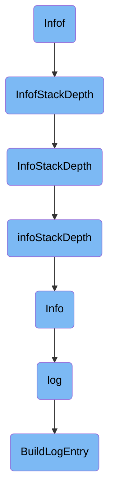

This document explains the flow of logging an info message using the <SwmToken path="cmd/serverless-init/log.go" pos="37:2:2" line-data="// Infof implements Logger.">`Infof`</SwmToken> function. The process involves several steps, starting from the <SwmToken path="cmd/serverless-init/log.go" pos="37:2:2" line-data="// Infof implements Logger.">`Infof`</SwmToken> function and passing through various intermediate functions to finally log the message.

The flow starts with the <SwmToken path="cmd/serverless-init/log.go" pos="37:2:2" line-data="// Infof implements Logger.">`Infof`</SwmToken> function, which is responsible for logging an info message with a specific format. It then calls <SwmToken path="cmd/serverless-init/log.go" pos="39:3:3" line-data="	log.InfofStackDepth(stackDepth, format, params...)">`InfofStackDepth`</SwmToken>, which logs the message considering the current stack depth. This function, in turn, calls <SwmToken path="pkg/util/log/log.go" pos="526:9:9" line-data="func (sw *loggerPointer) infoStackDepth(s string, depth int) {">`infoStackDepth`</SwmToken> to handle the logging process with an additional stack depth. The <SwmToken path="pkg/util/log/log.go" pos="526:9:9" line-data="func (sw *loggerPointer) infoStackDepth(s string, depth int) {">`infoStackDepth`</SwmToken> method adjusts the stack depth and scrubs the message before logging it. Finally, the <SwmToken path="cmd/serverless-init/log.go" pos="39:1:1" line-data="	log.InfofStackDepth(stackDepth, format, params...)">`log`</SwmToken> function checks if logging is set up and builds the log entry using <SwmToken path="pkg/util/log/log.go" pos="293:5:5" line-data="		s := BuildLogEntry(v...)">`BuildLogEntry`</SwmToken>.

# Flow drill down



<SwmSnippet path="/cmd/serverless-init/log.go" line="37">

---

## Infof

The <SwmToken path="cmd/serverless-init/log.go" pos="37:2:2" line-data="// Infof implements Logger.">`Infof`</SwmToken> function is the entry point for logging an info message with a specific format. It delegates the logging task to <SwmToken path="cmd/serverless-init/log.go" pos="39:3:3" line-data="	log.InfofStackDepth(stackDepth, format, params...)">`InfofStackDepth`</SwmToken> by passing the stack depth, format, and parameters.

```go
// Infof implements Logger.
func (corelogger) Infof(format string, params ...interface{}) {
	log.InfofStackDepth(stackDepth, format, params...)
}
```

---

</SwmSnippet>

<SwmSnippet path="/pkg/util/log/log.go" line="834">

---

## <SwmToken path="pkg/util/log/log.go" pos="834:2:2" line-data="// InfofStackDepth logs with format at the info level and the current stack depth plus the given depth">`InfofStackDepth`</SwmToken>

The <SwmToken path="pkg/util/log/log.go" pos="834:2:2" line-data="// InfofStackDepth logs with format at the info level and the current stack depth plus the given depth">`InfofStackDepth`</SwmToken> function logs a formatted message at the info level, considering the current stack depth plus an additional depth. It first checks the current log level and formats the message. It then calls the <SwmToken path="pkg/util/log/log.go" pos="841:1:1" line-data="	log(seelog.InfoLvl, func() { InfoStackDepth(depth, msg) }, func(s string) {">`log`</SwmToken> function with the appropriate parameters.

```go
// InfofStackDepth logs with format at the info level and the current stack depth plus the given depth
func InfofStackDepth(depth int, format string, params ...interface{}) {
	currentLevel, _ := GetLogLevel()
	if currentLevel > seelog.InfoLvl {
		return
	}
	msg := fmt.Sprintf(format, params...)
	log(seelog.InfoLvl, func() { InfoStackDepth(depth, msg) }, func(s string) {
		logger.infoStackDepth(s, depth)
	}, msg)
}
```

---

</SwmSnippet>

<SwmSnippet path="/pkg/util/log/log.go" line="972">

---

## <SwmToken path="pkg/util/log/log.go" pos="972:2:2" line-data="// InfoStackDepth logs at the info level and the current stack depth plus the additional given one">`InfoStackDepth`</SwmToken>

The <SwmToken path="pkg/util/log/log.go" pos="972:2:2" line-data="// InfoStackDepth logs at the info level and the current stack depth plus the additional given one">`InfoStackDepth`</SwmToken> function logs a message at the info level with an additional stack depth. It uses the <SwmToken path="pkg/util/log/log.go" pos="974:1:1" line-data="	log(seelog.InfoLvl, func() { InfoStackDepth(depth, v...) }, func(s string) {">`log`</SwmToken> function to handle the logging process.

```go
// InfoStackDepth logs at the info level and the current stack depth plus the additional given one
func InfoStackDepth(depth int, v ...interface{}) {
	log(seelog.InfoLvl, func() { InfoStackDepth(depth, v...) }, func(s string) {
		logger.infoStackDepth(s, depth)
	}, v...)
}
```

---

</SwmSnippet>

<SwmSnippet path="/pkg/util/log/log.go" line="525">

---

### <SwmToken path="pkg/util/log/log.go" pos="526:9:9" line-data="func (sw *loggerPointer) infoStackDepth(s string, depth int) {">`infoStackDepth`</SwmToken>

The <SwmToken path="pkg/util/log/log.go" pos="526:9:9" line-data="func (sw *loggerPointer) infoStackDepth(s string, depth int) {">`infoStackDepth`</SwmToken> method logs the message at the info level, adjusting the stack depth as needed. It scrubs the message and sets the additional stack depth before logging the message.

```go
// info logs at the info level and the current stack depth plus the additional given one, called with sw.l held
func (sw *loggerPointer) infoStackDepth(s string, depth int) {
	l := sw.Load()
	scrubbed := l.scrub(s)
	l.inner.SetAdditionalStackDepth(defaultStackDepth + depth) //nolint:errcheck
	l.inner.Info(scrubbed)
	l.inner.SetAdditionalStackDepth(defaultStackDepth) //nolint:errcheck

	for _, l := range l.extra {
		l.Info(scrubbed) //nolint:errcheck
	}
}
```

---

</SwmSnippet>

<SwmSnippet path="/pkg/util/log/log.go" line="824">

---

## Info

The <SwmToken path="pkg/util/log/log.go" pos="824:2:2" line-data="// Info logs at the info level">`Info`</SwmToken> function logs a message at the info level. It uses the <SwmToken path="pkg/util/log/log.go" pos="826:1:1" line-data="	log(seelog.InfoLvl, func() { Info(v...) }, logger.info, v...)">`log`</SwmToken> function to handle the logging process.

```go
// Info logs at the info level
func Info(v ...interface{}) {
	log(seelog.InfoLvl, func() { Info(v...) }, logger.info, v...)
}
```

---

</SwmSnippet>

<SwmSnippet path="/pkg/util/log/log.go" line="273">

---

## log

The <SwmToken path="pkg/util/log/log.go" pos="274:2:2" line-data="*	log functions">`log`</SwmToken> function is a generic logging function that handles the actual logging process. It checks if logging is set up and whether the message should be logged at the given level. It then builds the log entry and calls the appropriate logging function.

```go
/*
*	log functions
 */

// log logs a message at the given level, using either bufferFunc (if logging is not yet set up) or
// scrubAndLogFunc, and treating the variadic args as the message.
func log(logLevel seelog.LogLevel, bufferFunc func(), scrubAndLogFunc func(string), v ...interface{}) {
	l := logger.Load()

	if l == nil {
		addLogToBuffer(bufferFunc)
		return
	}

	l.l.Lock()
	defer l.l.Unlock()

	if l.inner == nil {
		addLogToBuffer(bufferFunc)
	} else if l.shouldLog(logLevel) {
		s := BuildLogEntry(v...)
```

---

</SwmSnippet>

<SwmSnippet path="/pkg/util/log/log.go" line="694">

---

## <SwmToken path="pkg/util/log/log.go" pos="694:2:2" line-data="// BuildLogEntry concatenates all inputs with spaces">`BuildLogEntry`</SwmToken>

The <SwmToken path="pkg/util/log/log.go" pos="694:2:2" line-data="// BuildLogEntry concatenates all inputs with spaces">`BuildLogEntry`</SwmToken> function concatenates all input parameters into a single string with spaces. This formatted string is then used as the log message.

```go
// BuildLogEntry concatenates all inputs with spaces
func BuildLogEntry(v ...interface{}) string {
	var fmtBuffer bytes.Buffer

	for i := 0; i < len(v)-1; i++ {
		fmtBuffer.WriteString("%v ")
	}
	fmtBuffer.WriteString("%v")

	return fmt.Sprintf(fmtBuffer.String(), v...)
}
```

---

</SwmSnippet>

&nbsp;

*This is an auto-generated document by Swimm AI 🌊 and has not yet been verified by a human*

<SwmMeta version="3.0.0" repo-id="Z2l0aHViJTNBJTNBZGF0YWRvZy1hZ2VudCUzQSUzQVN3aW1tLURlbW8=" repo-name="datadog-agent"><sup>Powered by [Swimm](/)</sup></SwmMeta>
