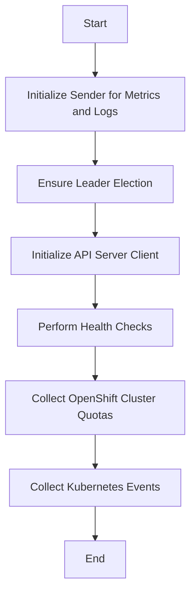

This document will cover the main execution flow of the Kubernetes API Server check, which includes:

1. Initializing the sender for metrics and logs
2. Ensuring leader election
3. Initializing the API server client
4. Performing health checks
5. Collecting OpenShift cluster quotas
6. Collecting Kubernetes events.

Technical document: <SwmLink doc-title="Overview of the Run Function">[Overview of the Run Function](/.swm/overview-of-the-run-function.rmelntd8.sw.md)</SwmLink>

# [Initializing the sender for metrics and logs](https://app.swimm.io/repos/Z2l0aHViJTNBJTNBZGF0YWRvZy1hZ2VudCUzQSUzQVN3aW1tLURlbW8=/docs/rmelntd8#run)

The process begins by initializing a sender that will handle the metrics and logs. This sender is responsible for collecting and sending data to the Datadog platform. If there is an error in obtaining the sender, the process stops, and an error is logged.

# [Ensuring leader election](https://app.swimm.io/repos/Z2l0aHViJTNBJTNBZGF0YWRvZy1hZ2VudCUzQSUzQVN3aW1tLURlbW8=/docs/rmelntd8#run)

Leader election is a mechanism to ensure that only one instance of the check is running at any given time. This is crucial in a clustered environment to avoid duplicate data collection. If leader election is not enabled, the check will not proceed. If the current instance is not the leader, it will also skip the check.

# [Initializing the API server client](https://app.swimm.io/repos/Z2l0aHViJTNBJTNBZGF0YWRvZy1hZ2VudCUzQSUzQVN3aW1tLURlbW8=/docs/rmelntd8#run)

If the API server client has not been initialized, this step will set it up. The API server client is essential for interacting with the Kubernetes API server to collect various metrics and logs.

# [Performing health checks](https://app.swimm.io/repos/Z2l0aHViJTNBJTNBZGF0YWRvZy1hZ2VudCUzQSUzQVN3aW1tLURlbW8=/docs/rmelntd8#controlplanehealthcheck)

A control plane health check is performed to ensure that the Kubernetes API server is ready and functioning correctly. If the API server is ready, an 'ok' status is sent; otherwise, a 'critical' status is sent along with an error message if available.

# [Collecting OpenShift cluster quotas](https://app.swimm.io/repos/Z2l0aHViJTNBJTNBZGF0YWRvZy1hZ2VudCUzQSUzQVN3aW1tLURlbW8=/docs/rmelntd8#retrieveoshiftclusterquotas)

If OpenShift is detected, the function will collect cluster resource quotas. This involves determining the appropriate API endpoint based on the OpenShift version and retrieving the quota objects. These quotas are essential for understanding resource allocation and usage within the OpenShift cluster.

# [Collecting Kubernetes events](https://app.swimm.io/repos/Z2l0aHViJTNBJTNBZGF0YWRvZy1hZ2VudCUzQSUzQVN3aW1tLURlbW8=/docs/rmelntd8#eventcollectioncheck)

If configured, the function will collect events from the Kubernetes API server. This involves retrieving a token from the ConfigMap, setting up parameters for event collection, and fetching the events. The collected events are then transformed and sent to the Datadog platform for monitoring and analysis.

&nbsp;

*This is an auto-generated document by Swimm AI 🌊 and has not yet been verified by a human*

<SwmMeta version="3.0.0" repo-id="Z2l0aHViJTNBJTNBZGF0YWRvZy1hZ2VudCUzQSUzQVN3aW1tLURlbW8=" repo-name="datadog-agent">Powered by [Swimm](/)</SwmMeta>
