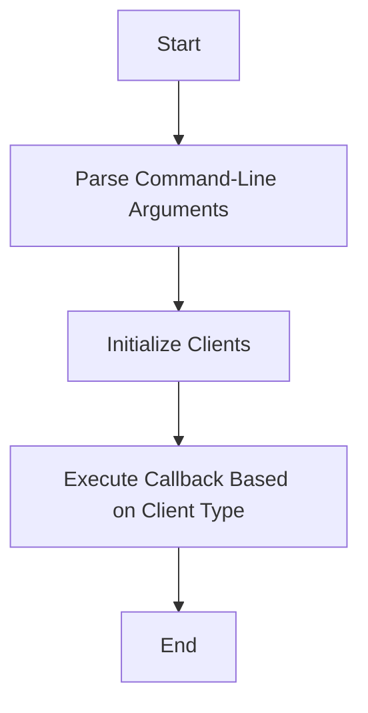

This document will cover the main method flow in the JavaClientSimulator, which includes:

1. Parsing command-line arguments
2. Initializing clients
3. Executing the appropriate callback based on the client type.

Technical document: <SwmLink doc-title="Main Method Flow in JavaClientSimulator">[Main Method Flow in JavaClientSimulator](/.swm/main-method-flow-in-javaclientsimulator.k6cxqa6v.sw.md)</SwmLink>

# [Parsing Command-Line Arguments](https://app.swimm.io/repos/Z2l0aHViJTNBJTNBZGF0YWRvZy1hZ2VudCUzQSUzQVN3aW1tLURlbW8=/docs/k6cxqa6v#parsing-command-line-arguments)

The main method begins by defining and adding required options for the command-line arguments. It checks if any arguments are provided and prints help if none are found. This ensures that users provide necessary inputs such as client type, URL, iterations, and timeout. This step is crucial for setting up the environment for the simulator to run correctly.

# [Initializing Clients](https://app.swimm.io/repos/Z2l0aHViJTNBJTNBZGF0YWRvZy1hZ2VudCUzQSUzQVN3aW1tLURlbW8=/docs/k6cxqa6v#init)

The initialization step sets up the HTTP clients by configuring SSL contexts to trust all certificates and setting up hostname verifiers. This ensures that the clients can make secure HTTP requests without running into SSL certificate issues. The clients initialized include Apache HttpClient, Java HttpClient, and OkHttpClient, each configured to trust all certificates and ignore host validation.

# [Executing the Callback Based on Client Type](https://app.swimm.io/repos/Z2l0aHViJTNBJTNBZGF0YWRvZy1hZ2VudCUzQSUzQVN3aW1tLURlbW8=/docs/k6cxqa6v#executecallback)

The method then parses the command-line arguments and retrieves the values for client type, URL, iterations, and timeout. It finally calls ClientManager to execute the appropriate handler based on the client type. This involves initializing the client, selecting the appropriate HTTP client, and running the callback logic. Depending on the client type, it sets up a callback function that executes the corresponding client method (e.g., HttpApacheClient, OkHttpClient, HTTPClient, or HttpsURLConnection). This step ensures that the correct client is used to make HTTP requests, providing flexibility and extensibility to the simulator.

&nbsp;

*This is an auto-generated document by Swimm AI 🌊 and has not yet been verified by a human*

<SwmMeta version="3.0.0" repo-id="Z2l0aHViJTNBJTNBZGF0YWRvZy1hZ2VudCUzQSUzQVN3aW1tLURlbW8=" repo-name="datadog-agent">Powered by [Swimm](/)</SwmMeta>
