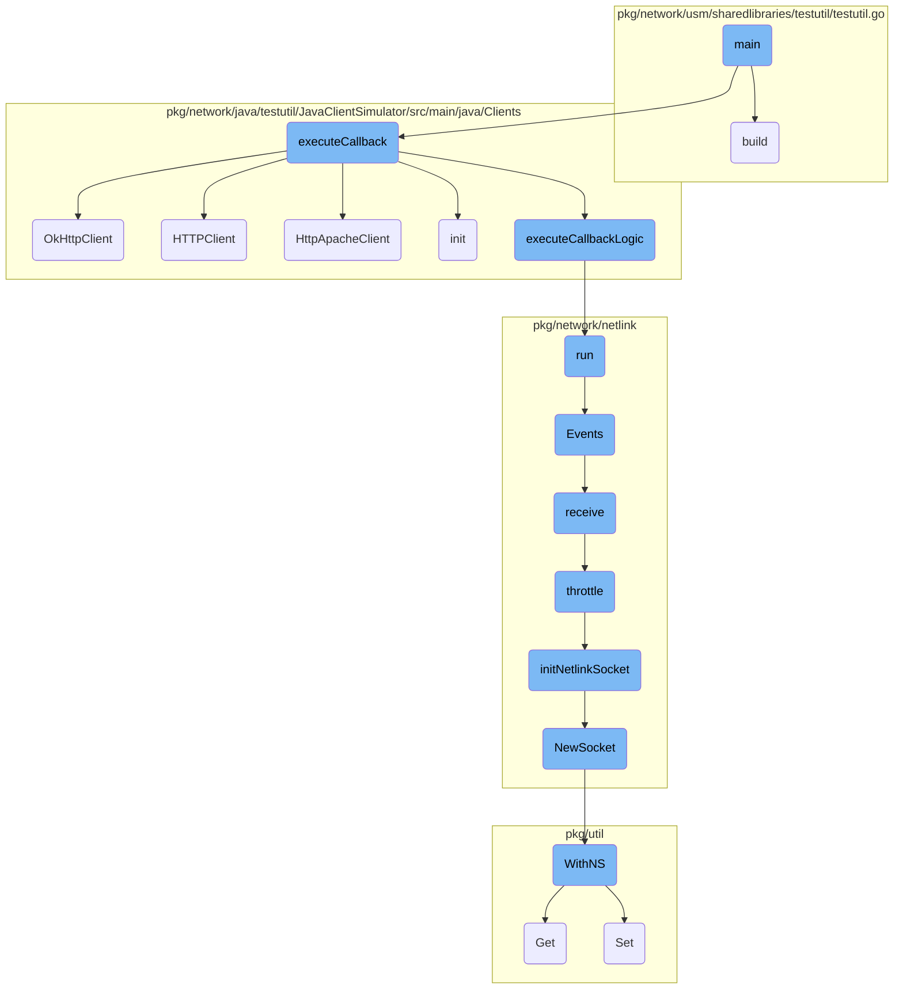
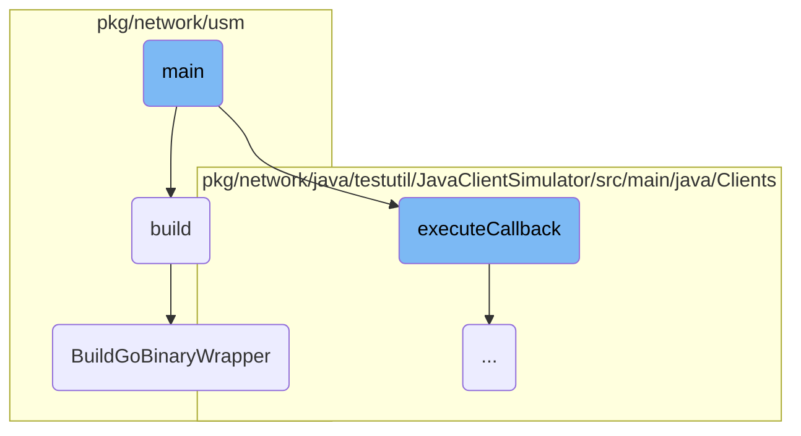
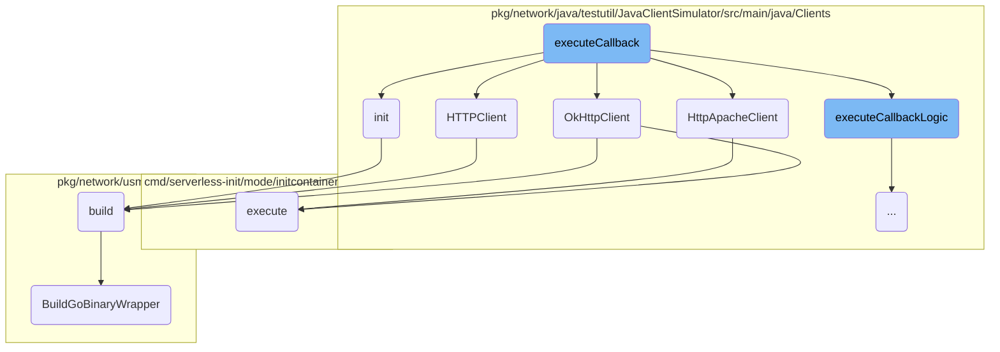
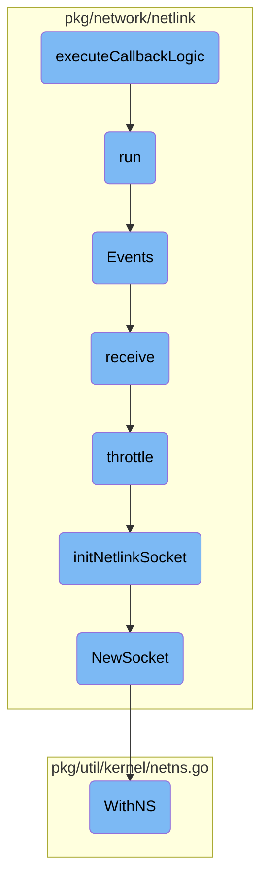

This document explains the flow of the main method in the JavaClientSimulator. The main method is responsible for parsing <SwmToken path="pkg/network/java/testutil/JavaClientSimulator/src/main/java/Clients/Main.java" pos="44:5:7" line-data="        // Parse command-line arguments">`command-line`</SwmToken> arguments, initializing clients, and executing the appropriate callback based on the client type.

The main method starts by defining and adding required options for the <SwmToken path="pkg/network/java/testutil/JavaClientSimulator/src/main/java/Clients/Main.java" pos="44:5:7" line-data="        // Parse command-line arguments">`command-line`</SwmToken> arguments. It checks if any arguments are provided and prints help if none are found. Then, it parses the <SwmToken path="pkg/network/java/testutil/JavaClientSimulator/src/main/java/Clients/Main.java" pos="44:5:7" line-data="        // Parse command-line arguments">`command-line`</SwmToken> arguments and retrieves the values for client type, URL, iterations, and timeout. Finally, it calls the <SwmToken path="pkg/network/java/testutil/JavaClientSimulator/src/main/java/Clients/Main.java" pos="63:1:1" line-data="            ClientManager.executeCallback(clientTypeArg, iterationsValue, interval, url);">`ClientManager`</SwmToken> to execute the appropriate handler based on the client type, which involves initializing the client, selecting the appropriate HTTP client, and running the callback logic.

Here is a high level diagram of the flow, showing only the most important functions:



# Flow drill down

First, we'll zoom into this section of the flow:



<SwmSnippet path="/pkg/network/java/testutil/JavaClientSimulator/src/main/java/Clients/Main.java" line="17">

---

## Parsing <SwmToken path="pkg/network/java/testutil/JavaClientSimulator/src/main/java/Clients/Main.java" pos="44:5:7" line-data="        // Parse command-line arguments">`command-line`</SwmToken> Arguments

The <SwmToken path="pkg/network/java/testutil/JavaClientSimulator/src/main/java/Clients/Main.java" pos="17:7:7" line-data="    public static void main(String[] args) throws Exception {">`main`</SwmToken> method starts by defining and adding required options for the <SwmToken path="pkg/network/java/testutil/JavaClientSimulator/src/main/java/Clients/Main.java" pos="44:5:7" line-data="        // Parse command-line arguments">`command-line`</SwmToken> arguments. It checks if any arguments are provided and prints help if none are found.

```java
    public static void main(String[] args) throws Exception {
        Options options = new Options();
        options.addRequiredOption("c", "client", true,
                "Client type: apache ; okhttp ; urlconnection ; httpclient");
        options.addRequiredOption("u", "url", true, "Target URL");
        Option iterationOption = Option.builder("i")
                .longOpt("iterations")
                .hasArg()
                .desc("Number of iterations. The default is infinitely")
                .required(false)
                .build();
        iterationOption.setType(Number.class);
        options.addOption(iterationOption);

        Option timeoutOption = Option.builder("t")
                .longOpt("timeout")
                .hasArg()
                .desc("Timeout between each call in ms. Default is 1 second, use 0 to send the requests without a timeout")
                .required(false)
                .build();
        timeoutOption.setType(Number.class);
```

---

</SwmSnippet>

<SwmSnippet path="/pkg/network/java/testutil/JavaClientSimulator/src/main/java/Clients/Main.java" line="44">

---

## Executing the Callback

The method then parses the <SwmToken path="pkg/network/java/testutil/JavaClientSimulator/src/main/java/Clients/Main.java" pos="44:5:7" line-data="        // Parse command-line arguments">`command-line`</SwmToken> arguments and retrieves the values for client type, URL, iterations, and timeout. It finally calls <SwmToken path="pkg/network/java/testutil/JavaClientSimulator/src/main/java/Clients/Main.java" pos="63:1:3" line-data="            ClientManager.executeCallback(clientTypeArg, iterationsValue, interval, url);">`ClientManager.executeCallback`</SwmToken> with these values to execute the appropriate handler based on the client type.

```java
        // Parse command-line arguments
        CommandLineParser parser = new DefaultParser();
        try {
            CommandLine cmd = parser.parse(options, args);

            // Get arguments
            String clientTypeArg = cmd.getOptionValue("c");
            String url = cmd.getOptionValue("u");
            int iterationsValue = -1;
            if (cmd.hasOption("i")) {
                iterationsValue = ((Number)cmd.getParsedOptionValue("i")).intValue();
            }

            int interval = DEFAULT_TIMEOUT;
            if (cmd.hasOption("t")) {
                interval = ((Number)cmd.getParsedOptionValue("t")).intValue();
            }

            // Execute the appropriate handler based on client type
            ClientManager.executeCallback(clientTypeArg, iterationsValue, interval, url);
        } catch (ParseException e) {
```

---

</SwmSnippet>

<SwmSnippet path="/pkg/network/usm/sharedlibraries/testutil/testutil.go" line="59">

---

## Building the Go Binary

The <SwmToken path="pkg/network/usm/sharedlibraries/testutil/testutil.go" pos="59:2:2" line-data="// build only gets executed when running tests locally">`build`</SwmToken> function is responsible for building the Go binary when running tests locally. It locks the mutex, retrieves the current directory, and calls <SwmToken path="pkg/network/usm/sharedlibraries/testutil/testutil.go" pos="66:10:10" line-data="	serverBin, err := usmtestutil.BuildGoBinaryWrapper(curDir, &quot;fmapper&quot;)">`BuildGoBinaryWrapper`</SwmToken> to build the binary.

```go
// build only gets executed when running tests locally
func build(t *testing.T) string {
	mux.Lock()
	defer mux.Unlock()

	curDir, err := testutil.CurDir()
	require.NoError(t, err)
	serverBin, err := usmtestutil.BuildGoBinaryWrapper(curDir, "fmapper")
	require.NoError(t, err)
	return serverBin
}
```

---

</SwmSnippet>

<SwmSnippet path="/pkg/network/usm/testutil/generic_testutil_builder.go" line="16">

---

### Building the Go Binary Wrapper

The <SwmToken path="pkg/network/usm/testutil/generic_testutil_builder.go" pos="16:2:2" line-data="// BuildGoBinaryWrapper builds a Go binary and returns the path to it.">`BuildGoBinaryWrapper`</SwmToken> function constructs the path to the Go binary and checks if it is already built. If not, it compiles the binary using the <SwmToken path="pkg/network/usm/testutil/generic_testutil_builder.go" pos="16:8:8" line-data="// BuildGoBinaryWrapper builds a Go binary and returns the path to it.">`Go`</SwmToken>` `<SwmToken path="pkg/network/usm/testutil/generic_testutil_builder.go" pos="29:15:15" line-data="	c := exec.Command(&quot;go&quot;, &quot;build&quot;, &quot;-buildvcs=false&quot;, &quot;-a&quot;, &quot;-tags=test&quot;, &quot;-ldflags=-extldflags &#39;-static&#39;&quot;, &quot;-o&quot;, cachedServerBinaryPath, serverSrcDir)">`build`</SwmToken> command and returns the path to the compiled binary.

```go
// BuildGoBinaryWrapper builds a Go binary and returns the path to it.
// If the binary is already built (meanly in the CI), it returns the
// path to the binary.
func BuildGoBinaryWrapper(curDir, binaryDir string) (string, error) {
	serverSrcDir := path.Join(curDir, binaryDir)
	cachedServerBinaryPath := path.Join(serverSrcDir, binaryDir)

	// If there is a compiled binary already, skip the compilation.
	// Meant for the CI.
	if _, err := os.Stat(cachedServerBinaryPath); err == nil {
		return cachedServerBinaryPath, nil
	}

	c := exec.Command("go", "build", "-buildvcs=false", "-a", "-tags=test", "-ldflags=-extldflags '-static'", "-o", cachedServerBinaryPath, serverSrcDir)
	out, err := c.CombinedOutput()
	if err != nil {
		return "", fmt.Errorf("could not build unix transparent proxy server test binary: %s\noutput: %s", err, string(out))
	}

	return cachedServerBinaryPath, nil
}
```

---

</SwmSnippet>

Now, lets zoom into this section of the flow:



<SwmSnippet path="/pkg/network/java/testutil/JavaClientSimulator/src/main/java/Clients/ClientManager.java" line="26">

---

## <SwmToken path="pkg/network/java/testutil/JavaClientSimulator/src/main/java/Clients/ClientManager.java" pos="26:7:7" line-data="    public static void executeCallback(String clientTypeArg, int iterations, long sleepInterval, String url) throws InterruptedException, NoSuchAlgorithmException, KeyStoreException, KeyManagementException, IOException {">`executeCallback`</SwmToken>

The <SwmToken path="pkg/network/java/testutil/JavaClientSimulator/src/main/java/Clients/ClientManager.java" pos="26:7:7" line-data="    public static void executeCallback(String clientTypeArg, int iterations, long sleepInterval, String url) throws InterruptedException, NoSuchAlgorithmException, KeyStoreException, KeyManagementException, IOException {">`executeCallback`</SwmToken> method is responsible for initializing the client, selecting the appropriate HTTP client based on the <SwmToken path="pkg/network/java/testutil/JavaClientSimulator/src/main/java/Clients/ClientManager.java" pos="26:11:11" line-data="    public static void executeCallback(String clientTypeArg, int iterations, long sleepInterval, String url) throws InterruptedException, NoSuchAlgorithmException, KeyStoreException, KeyManagementException, IOException {">`clientTypeArg`</SwmToken>, and executing the callback logic. It first initializes the clients by calling <SwmToken path="pkg/network/java/testutil/JavaClientSimulator/src/main/java/Clients/ClientManager.java" pos="30:1:5" line-data="        clients.init();">`clients.init()`</SwmToken>, then determines the client type using <SwmToken path="pkg/network/java/testutil/JavaClientSimulator/src/main/java/Clients/ClientManager.java" pos="28:7:10" line-data="        ClientType clientType = getClientType(clientTypeArg);">`getClientType(clientTypeArg)`</SwmToken>. Depending on the client type, it sets up a callback function that executes the corresponding client method (e.g., <SwmToken path="pkg/network/java/testutil/JavaClientSimulator/src/main/java/Clients/ClientManager.java" pos="45:3:3" line-data="                        clients.HttpApacheClient(url);">`HttpApacheClient`</SwmToken>, <SwmToken path="pkg/network/java/testutil/JavaClientSimulator/src/main/java/Clients/JavaClients.java" pos="81:1:1" line-data="        okHttpClient = new OkHttpClient.Builder()">`okHttpClient`</SwmToken>, <SwmToken path="pkg/network/java/testutil/JavaClientSimulator/src/main/java/Clients/Main.java" pos="20:19:19" line-data="                &quot;Client type: apache ; okhttp ; urlconnection ; httpclient&quot;);">`httpclient`</SwmToken>, or <SwmToken path="pkg/network/java/testutil/JavaClientSimulator/src/main/java/Clients/JavaClients.java" pos="66:4:4" line-data="        //configure HttpsURLConnection to trust all certificates and ignore host validation">`HttpsURLConnection`</SwmToken>). Finally, it calls <SwmToken path="pkg/network/java/testutil/JavaClientSimulator/src/main/java/Clients/ClientManager.java" pos="85:7:7" line-data="    private static void executeCallbackLogic(int iterations, long sleepInterval, Runnable callback) throws InterruptedException {">`executeCallbackLogic`</SwmToken> to run the callback for the specified number of iterations with the given sleep interval.

```java
    public static void executeCallback(String clientTypeArg, int iterations, long sleepInterval, String url) throws InterruptedException, NoSuchAlgorithmException, KeyStoreException, KeyManagementException, IOException {

        ClientType clientType = getClientType(clientTypeArg);
        JavaClients clients = new JavaClients();
        clients.init();

        System.out.println("Executing handler for " + clientType);
        System.out.println("URL: " + url);
        System.out.println("Iterations: " + iterations);
        System.out.println("Interval: " + sleepInterval);

        Runnable callback;

        // Execute handler based on client type
        switch (clientType) {
            case apache:

                callback = () -> {
                    try {
                        clients.HttpApacheClient(url);
                    } catch (IOException e) {
```

---

</SwmSnippet>

<SwmSnippet path="/pkg/network/java/testutil/JavaClientSimulator/src/main/java/Clients/JavaClients.java" line="96">

---

### <SwmToken path="pkg/network/java/testutil/JavaClientSimulator/src/main/java/Clients/JavaClients.java" pos="96:5:5" line-data="    public void OkHttpClient(String url) throws IOException {">`OkHttpClient`</SwmToken>

The <SwmToken path="pkg/network/java/testutil/JavaClientSimulator/src/main/java/Clients/JavaClients.java" pos="96:5:5" line-data="    public void OkHttpClient(String url) throws IOException {">`OkHttpClient`</SwmToken> method constructs and executes an HTTP request using the <SwmToken path="pkg/network/java/testutil/JavaClientSimulator/src/main/java/Clients/Main.java" pos="20:11:11" line-data="                &quot;Client type: apache ; okhttp ; urlconnection ; httpclient&quot;);">`okhttp`</SwmToken> library. It builds a request with the provided URL, executes the call, and prints the response.

```java
    public void OkHttpClient(String url) throws IOException {
        Request request = new Request.Builder()
                .url(URL_SCHEME+url)
                .build();
        Call call = okHttpClient.newCall(request);
        Response response = call.execute();
        System.out.println("Response: " + response);
    }
```

---

</SwmSnippet>

<SwmSnippet path="/pkg/network/java/testutil/JavaClientSimulator/src/main/java/Clients/JavaClients.java" line="122">

---

### <SwmToken path="pkg/network/java/testutil/JavaClientSimulator/src/main/java/Clients/JavaClients.java" pos="122:5:5" line-data="    public void HTTPClient(String url) throws IOException {">`HTTPClient`</SwmToken>

The <SwmToken path="pkg/network/java/testutil/JavaClientSimulator/src/main/java/Clients/JavaClients.java" pos="122:5:5" line-data="    public void HTTPClient(String url) throws IOException {">`HTTPClient`</SwmToken> method constructs and executes an HTTP request using the Java <SwmToken path="pkg/network/java/testutil/JavaClientSimulator/src/main/java/Clients/JavaClients.java" pos="122:5:5" line-data="    public void HTTPClient(String url) throws IOException {">`HTTPClient`</SwmToken> library. It builds a request with the provided URL, sets the HTTP version to 1.1, sends the request, and prints the response.

```java
    public void HTTPClient(String url) throws IOException {
        try {
            HttpRequest request = HttpRequest.newBuilder()
                    .uri(URI.create(URL_SCHEME+url))
                    //by default HttpCLient is using http 2.0
                    .version(HttpClient.Version.HTTP_1_1)
                    .build();
            HttpResponse<String> response = httpClient.send(request, HttpResponse.BodyHandlers.ofString());
            System.out.println("Response " + response.toString());
        } catch (IOException | InterruptedException e) {
            e.printStackTrace();
        }
    }
```

---

</SwmSnippet>

<SwmSnippet path="/pkg/network/java/testutil/JavaClientSimulator/src/main/java/Clients/JavaClients.java" line="105">

---

### <SwmToken path="pkg/network/java/testutil/JavaClientSimulator/src/main/java/Clients/JavaClients.java" pos="105:5:5" line-data="    public void HttpApacheClient(String url) throws IOException {">`HttpApacheClient`</SwmToken>

The <SwmToken path="pkg/network/java/testutil/JavaClientSimulator/src/main/java/Clients/JavaClients.java" pos="105:5:5" line-data="    public void HttpApacheClient(String url) throws IOException {">`HttpApacheClient`</SwmToken> method constructs and executes an HTTP request using the Apache <SwmToken path="pkg/network/java/testutil/JavaClientSimulator/src/main/java/Clients/Main.java" pos="20:19:19" line-data="                &quot;Client type: apache ; okhttp ; urlconnection ; httpclient&quot;);">`httpclient`</SwmToken> library. It builds a request with the provided URL, executes the call, and prints the response. It also ensures the connection is released after the request is completed.

```java
    public void HttpApacheClient(String url) throws IOException {
        HttpGet request = new HttpGet("https://"+url);
        try {
            CloseableHttpResponse response = apacheClient.execute(request);
            System.out.println("Response: " + response);
        } catch (IOException e) {
            e.printStackTrace();
        }
        finally {
            // TODO: in the future we should support re-using the same connection for apache client,
            // currently we are hitting the internal connection pool limit of the apacheclient,
            // since we create a new request object for the same route, which in turn tries to use a new connection
            // (the default connection limit of the apacheclient for the same route is 2
            request.releaseConnection();
        }
    }
```

---

</SwmSnippet>

<SwmSnippet path="/pkg/network/java/testutil/JavaClientSimulator/src/main/java/Clients/JavaClients.java" line="61">

---

### init

The <SwmToken path="pkg/network/java/testutil/JavaClientSimulator/src/main/java/Clients/JavaClients.java" pos="61:5:5" line-data="    public void init() throws NoSuchAlgorithmException, KeyManagementException, KeyStoreException {">`init`</SwmToken> method initializes the HTTP clients by setting up SSL contexts to trust all certificates and configuring hostname verifiers. It creates instances of Apache <SwmToken path="pkg/network/java/testutil/JavaClientSimulator/src/main/java/Clients/JavaClients.java" pos="78:1:1" line-data="        httpClient = HttpClient.newBuilder().sslContext(sslContext).build();">`httpClient`</SwmToken>, Java <SwmToken path="pkg/network/java/testutil/JavaClientSimulator/src/main/java/Clients/JavaClients.java" pos="78:1:1" line-data="        httpClient = HttpClient.newBuilder().sslContext(sslContext).build();">`httpClient`</SwmToken>, and <SwmToken path="pkg/network/java/testutil/JavaClientSimulator/src/main/java/Clients/JavaClients.java" pos="81:1:1" line-data="        okHttpClient = new OkHttpClient.Builder()">`okHttpClient`</SwmToken> with the necessary configurations.

```java
    public void init() throws NoSuchAlgorithmException, KeyManagementException, KeyStoreException {
        // Create a custom SSLContext to trust all certificates
        SSLContext sslContext = SSLContext.getInstance("TLS");
        sslContext.init(null, trustAllCerts, new java.security.SecureRandom());

        //configure HttpsURLConnection to trust all certificates and ignore host validation
        //URLConnection client will be recreated for each request
        HttpsURLConnection.setDefaultSSLSocketFactory(sslContext.getSocketFactory());
        HttpsURLConnection.setDefaultHostnameVerifier(NoopHostnameVerifier.INSTANCE);

        //create apache client once and configure it to trust all certificates and ignore host validation
        apacheClient = HttpClients.custom()
                .setSSLContext(sslContext)
                .setSSLHostnameVerifier(NoopHostnameVerifier.INSTANCE)
                .build();

        //create http client once and configure it to trust all certificates and ignore host validation
        httpClient = HttpClient.newBuilder().sslContext(sslContext).build();

        //create okhttp client once and configure it to trust all certificates and ignore host validation
        okHttpClient = new OkHttpClient.Builder()
```

---

</SwmSnippet>

<SwmSnippet path="/cmd/serverless-init/mode/initcontainer_mode.go" line="41">

---

### execute

The <SwmToken path="cmd/serverless-init/mode/initcontainer_mode.go" pos="41:2:2" line-data="func execute(logConfig *serverlessLog.Config, args []string) error {">`execute`</SwmToken> function in Go is responsible for running a command with the provided arguments. It sets up the command, redirects its output to the appropriate writers, starts the command, and waits for it to complete. It also handles signal forwarding to ensure proper termination.

```go
func execute(logConfig *serverlessLog.Config, args []string) error {
	commandName, commandArgs := buildCommandParam(args)

	// Add our tracer settings
	fs := afero.NewOsFs()
	autoInstrumentTracer(fs)

	cmd := exec.Command(commandName, commandArgs...)

	cmd.Stdout = io.Writer(os.Stdout)
	cmd.Stderr = io.Writer(os.Stderr)

	if logConfig.IsEnabled {
		cmd.Stdout = io.MultiWriter(os.Stdout, serverlessLog.NewChannelWriter(logConfig.Channel, false))
		cmd.Stderr = io.MultiWriter(os.Stderr, serverlessLog.NewChannelWriter(logConfig.Channel, true))
	}

	err := cmd.Start()
	if err != nil {
		return err
	}
```

---

</SwmSnippet>

Now, lets zoom into this section of the flow:



<SwmSnippet path="/pkg/network/java/testutil/JavaClientSimulator/src/main/java/Clients/ClientManager.java" line="85">

---

## <SwmToken path="pkg/network/java/testutil/JavaClientSimulator/src/main/java/Clients/ClientManager.java" pos="85:7:7" line-data="    private static void executeCallbackLogic(int iterations, long sleepInterval, Runnable callback) throws InterruptedException {">`executeCallbackLogic`</SwmToken>

The <SwmToken path="pkg/network/java/testutil/JavaClientSimulator/src/main/java/Clients/ClientManager.java" pos="85:7:7" line-data="    private static void executeCallbackLogic(int iterations, long sleepInterval, Runnable callback) throws InterruptedException {">`executeCallbackLogic`</SwmToken> method is designed to repeatedly execute a given callback function. It can run either for a fixed number of iterations or indefinitely, depending on the value of the <SwmToken path="pkg/network/java/testutil/JavaClientSimulator/src/main/java/Clients/ClientManager.java" pos="85:11:11" line-data="    private static void executeCallbackLogic(int iterations, long sleepInterval, Runnable callback) throws InterruptedException {">`iterations`</SwmToken> parameter. If <SwmToken path="pkg/network/java/testutil/JavaClientSimulator/src/main/java/Clients/ClientManager.java" pos="85:11:11" line-data="    private static void executeCallbackLogic(int iterations, long sleepInterval, Runnable callback) throws InterruptedException {">`iterations`</SwmToken> is set to -1, the method enters an infinite loop, continuously executing the callback and optionally sleeping for a specified interval between executions. If <SwmToken path="pkg/network/java/testutil/JavaClientSimulator/src/main/java/Clients/ClientManager.java" pos="85:11:11" line-data="    private static void executeCallbackLogic(int iterations, long sleepInterval, Runnable callback) throws InterruptedException {">`iterations`</SwmToken> is a positive integer, the method runs the callback that many times, again with an optional sleep interval between executions. This method is useful for simulating client behavior in tests, where you might want to repeatedly invoke certain actions to observe their effects.

```java
    private static void executeCallbackLogic(int iterations, long sleepInterval, Runnable callback) throws InterruptedException {
        if (iterations == -1) {
            // Infinite loop
            while (true) {
                callback.run();
                if (sleepInterval > 0)
                {
                    Thread.sleep(sleepInterval);
                }
            }
        } else {
            // Fixed number of iterations
            for (int i = 0; i < iterations; i++) {
                callback.run();
                if (sleepInterval > 0)
                {
                    Thread.sleep(sleepInterval);
                }
            }
        }
    }
```

---

</SwmSnippet>

&nbsp;

*This is an auto-generated document by Swimm AI 🌊 and has not yet been verified by a human*

<SwmMeta version="3.0.0" repo-id="Z2l0aHViJTNBJTNBZGF0YWRvZy1hZ2VudCUzQSUzQVN3aW1tLURlbW8=" repo-name="datadog-agent"><sup>Powered by [Swimm](/)</sup></SwmMeta>
