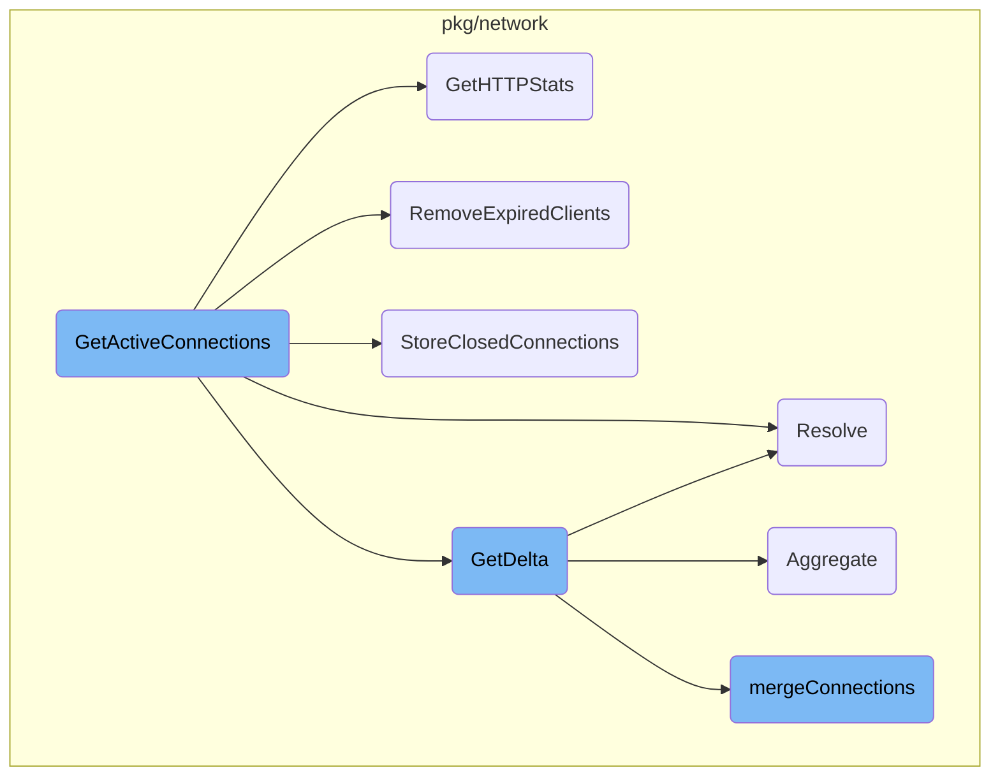
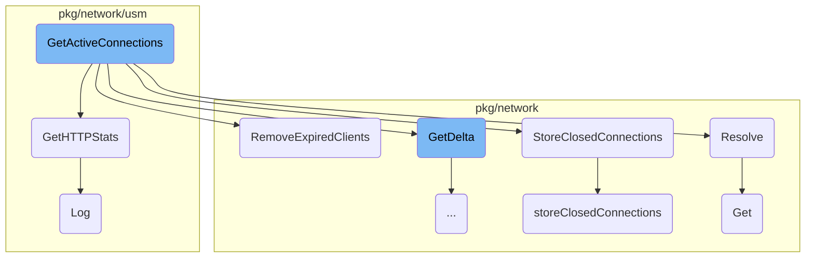
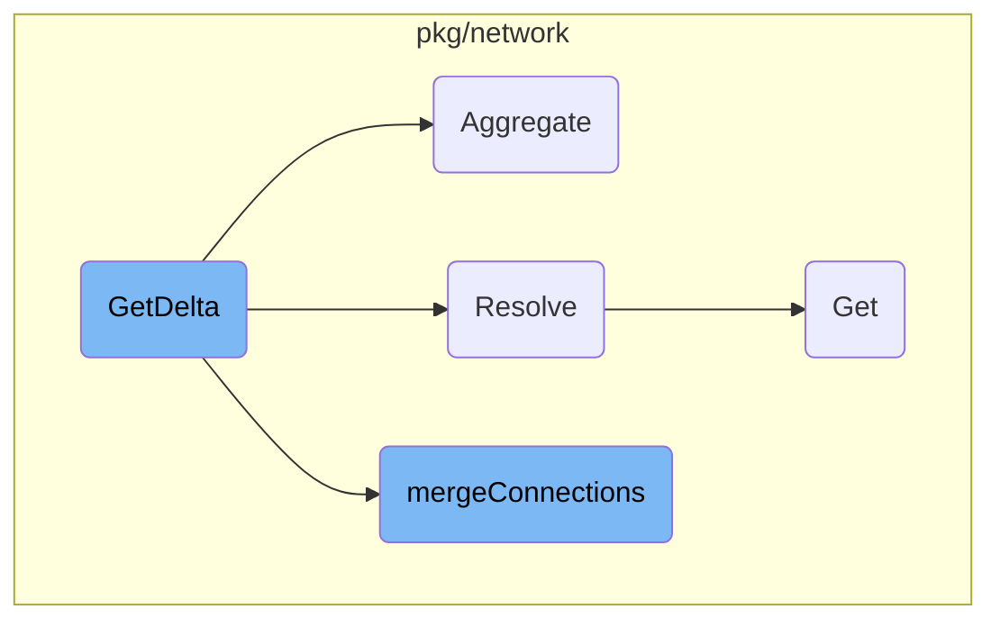

This document provides an overview of how active connections are managed and retrieved. It outlines the steps involved in locking the connection state, retrieving connection statistics, removing expired clients, storing closed connections, calculating connection deltas, resolving DNS information, and returning the active connections.

The process starts by locking the connection state to ensure no other operations interfere. Then, it retrieves statistics for both open and closed connections. Expired clients are removed to keep the data relevant. Closed connections are stored for future reference. The next step is to calculate the difference between the current and previous connection states. DNS information is resolved to provide meaningful names for the connections. Finally, the active connections are returned, giving a snapshot of the current network activity.

Here is a high level diagram of the flow, showing only the most important functions:



# Flow drill down

First, we'll zoom into this section of the flow:



<SwmSnippet path="/pkg/network/tracer/tracer_windows.go" line="173">

---

## <SwmToken path="pkg/network/tracer/tracer_windows.go" pos="173:2:2" line-data="// GetActiveConnections returns all active connections">`GetActiveConnections`</SwmToken>

The <SwmToken path="pkg/network/tracer/tracer_windows.go" pos="173:2:2" line-data="// GetActiveConnections returns all active connections">`GetActiveConnections`</SwmToken> function is responsible for retrieving all active connections. It locks the connection state, retrieves open and closed connection stats from the driver, removes expired clients, stores closed connections, calculates the delta of connections, resolves DNS information, and finally returns the active connections.

```go
// GetActiveConnections returns all active connections
func (t *Tracer) GetActiveConnections(clientID string) (*network.Connections, error) {
	t.connLock.Lock()
	defer t.connLock.Unlock()

	defer func() {
		t.closedBuffer.Reset()
	}()

	buffer := network.ClientPool.Get(clientID)
	_, err := t.driverInterface.GetOpenConnectionStats(buffer.ConnectionBuffer, func(c *network.ConnectionStats) bool {
		return !t.shouldSkipConnection(c)
	})
	if err != nil {
		return nil, fmt.Errorf("error retrieving open connections from driver: %w", err)
	}
	_, err = t.driverInterface.GetClosedConnectionStats(t.closedBuffer, func(c *network.ConnectionStats) bool {
		return !t.shouldSkipConnection(c)
	})
	if err != nil {
		return nil, fmt.Errorf("error retrieving closed connections from driver: %w", err)
```

---

</SwmSnippet>

<SwmSnippet path="/pkg/network/usm/monitor_windows.go" line="112">

---

### <SwmToken path="pkg/network/usm/monitor_windows.go" pos="112:2:2" line-data="// GetHTTPStats returns a map of HTTP stats stored in the following format:">`GetHTTPStats`</SwmToken>

The <SwmToken path="pkg/network/usm/monitor_windows.go" pos="112:2:2" line-data="// GetHTTPStats returns a map of HTTP stats stored in the following format:">`GetHTTPStats`</SwmToken> function reads all pending transactions, locks the state, retrieves and resets all HTTP stats, logs telemetry data, and returns the HTTP stats in a map format.

```go
// GetHTTPStats returns a map of HTTP stats stored in the following format:
// [source, dest tuple, request path] -> RequestStats object
func (m *WindowsMonitor) GetHTTPStats() map[protocols.ProtocolType]interface{} {
	// dbtodo  This is now going to cause any pending transactions
	// to be read and then stuffed into the channel.  Which then I think
	// creates a race condition that there still could be some mid-
	// process when we come back
	m.di.ReadAllPendingTransactions()

	m.mux.Lock()
	defer m.mux.Unlock()

	stats := m.statkeeper.GetAndResetAllStats()
	//removeDuplicates(stats)

	m.telemetry.Log()

	ret := make(map[protocols.ProtocolType]interface{})
	ret[protocols.HTTP] = stats

	return ret
```

---

</SwmSnippet>

<SwmSnippet path="/pkg/network/state.go" line="980">

---

### <SwmToken path="pkg/network/state.go" pos="980:9:9" line-data="func (ns *networkState) RemoveExpiredClients(now time.Time) {">`RemoveExpiredClients`</SwmToken>

The <SwmToken path="pkg/network/state.go" pos="980:9:9" line-data="func (ns *networkState) RemoveExpiredClients(now time.Time) {">`RemoveExpiredClients`</SwmToken> function iterates over all clients and removes those that have expired based on the current time. It locks the state during this operation to ensure thread safety.

```go
func (ns *networkState) RemoveExpiredClients(now time.Time) {
	ns.Lock()
	defer ns.Unlock()

	for id, c := range ns.clients {
		if c.lastFetch.Add(ns.clientExpiry).Before(now) {
			log.Debugf("expiring client: %s, had %d stats and %d closed connections", id, len(c.stats), len(c.closed.conns))
			delete(ns.clients, id)
			ClientPool.RemoveExpiredClient(id)
		}
	}
}
```

---

</SwmSnippet>

<SwmSnippet path="/pkg/network/resolver.go" line="30">

---

### Resolve

The <SwmToken path="pkg/network/resolver.go" pos="30:2:2" line-data="// Resolve binds container IDs to the Raddr of connections">`Resolve`</SwmToken> function binds container <SwmToken path="pkg/network/resolver.go" pos="30:8:8" line-data="// Resolve binds container IDs to the Raddr of connections">`IDs`</SwmToken> to the remote addresses of connections. It first indexes connections by their local addresses and then resolves the remote addresses using this index. Only local connections are resolved.

```go
// Resolve binds container IDs to the Raddr of connections
//
// An attempt is made to resolve as many local containers as possible.
//
// First, we go over all connections that have a container ID
// populated for their laddr, indexing them by (laddr, raddr, proto, netns).
// An additional entry is also inserted for a non-loopback laddr with netns = 0
// as well. Translated laddr and raddr are used throughout. Incoming
// connection dest ports (the ephemeral side) are also zero-ed before
// inserting into the index.
//
// Second, we go over the connections again, this time resolving
// the raddr container id using the lookup table we built previously.
// Translated addresses are used throughout. This time outgoing connection
// source ports are zero-ed when doing a lookup (since we zero-ed out
// the incoming dest ports in the index).
//
// Only connections that are local are resolved, i.e., for
// which `IntraHost` is set to true.
func (r LocalResolver) Resolve(conns slice.Chain[ConnectionStats]) {
	if !r.processEventsEnabled {
```

---

</SwmSnippet>

<SwmSnippet path="/pkg/network/state.go" line="603">

---

### <SwmToken path="pkg/network/state.go" pos="603:2:2" line-data="// StoreClosedConnections wraps the unexported method while locking state">`StoreClosedConnections`</SwmToken>

The <SwmToken path="pkg/network/state.go" pos="603:2:2" line-data="// StoreClosedConnections wraps the unexported method while locking state">`StoreClosedConnections`</SwmToken> function locks the state and then calls the unexported <SwmToken path="pkg/network/state.go" pos="603:2:2" line-data="// StoreClosedConnections wraps the unexported method while locking state">`StoreClosedConnections`</SwmToken> method to store the given closed connections for every client.

```go
// StoreClosedConnections wraps the unexported method while locking state
func (ns *networkState) StoreClosedConnections(closed []ConnectionStats) {
	ns.Lock()
	defer ns.Unlock()

	ns.storeClosedConnections(closed)
}
```

---

</SwmSnippet>

<SwmSnippet path="/pkg/network/state.go" line="611">

---

### <SwmToken path="pkg/network/state.go" pos="612:9:9" line-data="func (ns *networkState) storeClosedConnections(conns []ConnectionStats) {">`storeClosedConnections`</SwmToken>

The <SwmToken path="pkg/network/state.go" pos="612:9:9" line-data="func (ns *networkState) storeClosedConnections(conns []ConnectionStats) {">`storeClosedConnections`</SwmToken> function iterates over all clients and stores the given closed connections. It handles merging connection stats and replacing or inserting connections as needed.

```go
// storeClosedConnection stores the given connection for every client
func (ns *networkState) storeClosedConnections(conns []ConnectionStats) {
	for _, client := range ns.clients {
		for _, c := range conns {
			if i, ok := client.closed.byCookie[c.Cookie]; ok {
				if ns.mergeConnectionStats(&client.closed.conns[i], &c) {
					stateTelemetry.statsCookieCollisions.Inc()
					client.closed.replaceAt(i, c)
				}
				continue
			}
			client.closed.insert(c, ns.maxClosedConns)
		}
	}
}
```

---

</SwmSnippet>

<SwmSnippet path="/pkg/network/route_cache.go" line="138">

---

### Get

The <SwmToken path="pkg/network/route_cache.go" pos="138:9:9" line-data="func (c *routeCache) Get(source, dest util.Address, netns uint32) (Route, bool) {">`Get`</SwmToken> function retrieves a route from the cache based on the source and destination addresses and network namespace. If the route is not found or has expired, it queries the router and updates the cache.

```go
func (c *routeCache) Get(source, dest util.Address, netns uint32) (Route, bool) {
	c.mu.Lock()
	defer func() {
		routeCacheTelemetry.size.Set(float64(c.cache.Len()))
		c.mu.Unlock()
	}()

	routeCacheTelemetry.lookups.Inc()
	k := newRouteKey(source, dest, netns)
	if entry, ok := c.cache.Get(k); ok {
		if time.Now().Unix() < entry.(*routeTTL).eta {
			return entry.(*routeTTL).entry, !entry.(*routeTTL).empty
		}

		routeCacheTelemetry.expires.Inc()
		c.cache.Remove(k)
	} else {
		routeCacheTelemetry.misses.Inc()
	}

	r, ok := c.router.Route(source, dest, netns)
```

---

</SwmSnippet>

<SwmSnippet path="/pkg/network/usm/utils/file_registry.go" line="237">

---

### Log

The <SwmToken path="pkg/network/usm/utils/file_registry.go" pos="237:2:2" line-data="// Log state of `FileRegistry`">`Log`</SwmToken> function logs a summary of the <SwmToken path="pkg/network/usm/utils/file_registry.go" pos="237:9:9" line-data="// Log state of `FileRegistry`">`FileRegistry`</SwmToken> state, including the program name and metric group summary.

```go
// Log state of `FileRegistry`
func (r *FileRegistry) Log() {
	log.Debugf("file_registry summary: program=%s %s", r.telemetry.programName, r.telemetry.metricGroup.Summary())
}
```

---

</SwmSnippet>

Now, lets zoom into this section of the flow:



<SwmSnippet path="/pkg/network/state.go" line="368">

---

## <SwmToken path="pkg/network/state.go" pos="368:2:2" line-data="// GetDelta returns the connections for the given client">`GetDelta`</SwmToken>

The <SwmToken path="pkg/network/state.go" pos="368:2:2" line-data="// GetDelta returns the connections for the given client">`GetDelta`</SwmToken> function is responsible for returning the connections for a given client. It first updates the latest known time and retrieves the client information. It then updates all connections with relevant <SwmToken path="pkg/network/state.go" pos="387:13:17" line-data="	// Update all connections with relevant up-to-date stats for client">`up-to-date`</SwmToken> stats for the client by calling <SwmToken path="pkg/network/state.go" pos="388:10:10" line-data="	active, closed := ns.mergeConnections(id, active)">`mergeConnections`</SwmToken>. The function also handles DNS stats, aggregates connection data, and stores various protocol-specific stats before returning a <SwmToken path="pkg/network/state.go" pos="377:2:2" line-data=") Delta {">`Delta`</SwmToken> object containing the updated connection information.

```go
// GetDelta returns the connections for the given client
// If the client is not registered yet, we register it and return the connections we have in the global state
// Otherwise we return both the connections with last stats and the closed connections for this client
func (ns *networkState) GetDelta(
	id string,
	latestTime uint64,
	active []ConnectionStats,
	dnsStats dns.StatsByKeyByNameByType,
	usmStats map[protocols.ProtocolType]interface{},
) Delta {
	ns.Lock()
	defer ns.Unlock()

	// Update the latest known time
	ns.latestTimeEpoch = latestTime

	client := ns.getClient(id)
	defer client.Reset()

	// Update all connections with relevant up-to-date stats for client
	active, closed := ns.mergeConnections(id, active)
```

---

</SwmSnippet>

<SwmSnippet path="/pkg/network/state.go" line="1350">

---

### Aggregating Connections

The <SwmToken path="pkg/network/state.go" pos="1350:2:2" line-data="// Aggregate aggregates a connection. The connection is only">`Aggregate`</SwmToken> function within <SwmToken path="pkg/network/state.go" pos="368:2:2" line-data="// GetDelta returns the connections for the given client">`GetDelta`</SwmToken> is used to aggregate connection data. It checks if a connection can be aggregated based on various conditions such as IP translation and protocol stack. If the connection can be aggregated, it merges the connection stats; otherwise, it adds the connection to the collection.

```go
// Aggregate aggregates a connection. The connection is only
// aggregated if:
// - it is not in the collection
// - it is in the collection and:
//   - the ip translation is nil OR
//   - the other connection's ip translation is nil OR
//   - the other connection's ip translation is not nil AND the nat info is the same
//   - the protocol stack is all unknown OR
//   - the other connection's protocol stack is unknown
//   - the other connection's protocol stack is not unknown AND equal
func (a *connectionAggregator) Aggregate(c *ConnectionStats) bool {
	key, sportRolledUp, dportRolledUp := a.key(c)

	// get dns stats for connection
	c.DNSStats = a.dns(c)

	aggrConns, ok := a.conns[key]
	if !ok {
		a.conns[key] = []*aggregateConnection{
			{
				ConnectionStats: c,
```

---

</SwmSnippet>

<SwmSnippet path="/pkg/network/state.go" line="872">

---

### Merging Connections

The <SwmToken path="pkg/network/state.go" pos="872:2:2" line-data="// mergeConnections return the connections and takes care of updating their last stat counters">`mergeConnections`</SwmToken> function is called within <SwmToken path="pkg/network/state.go" pos="368:2:2" line-data="// GetDelta returns the connections for the given client">`GetDelta`</SwmToken> to update the last stat counters of connections. It indexes active connections by cookie, merges connections with the same cookie, and filters closed connections. It also updates the connection stats for both active and closed connections, ensuring that only relevant stats are kept.

```go
// mergeConnections return the connections and takes care of updating their last stat counters
func (ns *networkState) mergeConnections(id string, active []ConnectionStats) (_, closed []ConnectionStats) {
	now := time.Now()

	client := ns.clients[id]
	client.lastFetch = now

	// index active connection by cookie, merging
	// connections with the same cookie
	active, activeByCookie := ns.mergeByCookie(active)

	// filter closed connections, keeping those that have changed or have not
	// been aggregated into another connection
	closed = filterConnections(client.closed.conns, func(closedConn *ConnectionStats) bool {
		cookie := closedConn.Cookie
		if activeConn := activeByCookie[cookie]; activeConn != nil {
			if ns.mergeConnectionStats(closedConn, activeConn) {
				stateTelemetry.statsCookieCollisions.Inc()
				// remove any previous stats since we
				// can't distinguish between the two sets of stats
				delete(client.stats, cookie)
```

---

</SwmSnippet>

&nbsp;

*This is an auto-generated document by Swimm AI 🌊 and has not yet been verified by a human*

<SwmMeta version="3.0.0" repo-id="Z2l0aHViJTNBJTNBZGF0YWRvZy1hZ2VudCUzQSUzQVN3aW1tLURlbW8=" repo-name="datadog-agent"><sup>Powered by [Swimm](/)</sup></SwmMeta>
