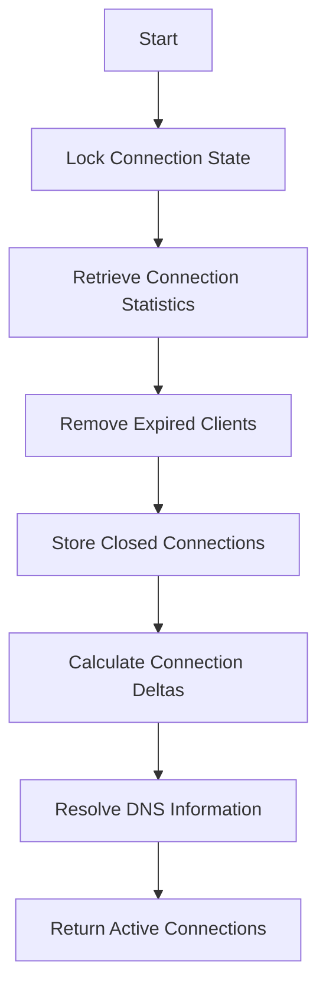

This document will cover the process of managing active connections, which includes:

1. Locking the connection state
2. Retrieving connection statistics
3. Removing expired clients
4. Storing closed connections
5. Calculating connection deltas
6. Resolving DNS information
7. Returning active connections.

Technical document: <SwmLink doc-title="Managing Active Connections">[Managing Active Connections](/.swm/managing-active-connections.6sdhn5kp.sw.md)</SwmLink>

# [Locking the Connection State](https://app.swimm.io/repos/Z2l0aHViJTNBJTNBZGF0YWRvZy1hZ2VudCUzQSUzQVN3aW1tLURlbW8=/docs/6sdhn5kp#locking-the-connection-state)

The first step in managing active connections is to lock the connection state. This ensures that no other operations can interfere with the process of retrieving and updating connection information. By locking the state, we maintain data integrity and prevent race conditions, which could lead to inaccurate or incomplete connection data.

# [Retrieving Connection Statistics](https://app.swimm.io/repos/Z2l0aHViJTNBJTNBZGF0YWRvZy1hZ2VudCUzQSUzQVN3aW1tLURlbW8=/docs/6sdhn5kp#retrieving-connection-statistics)

Next, we retrieve statistics for both open and closed connections. This involves gathering data on all active connections and any connections that have recently closed. This step is crucial for providing a comprehensive view of the network activity, allowing us to monitor both ongoing and completed connections.

# [Removing Expired Clients](https://app.swimm.io/repos/Z2l0aHViJTNBJTNBZGF0YWRvZy1hZ2VudCUzQSUzQVN3aW1tLURlbW8=/docs/6sdhn5kp#removing-expired-clients)

To keep the connection data relevant, we remove expired clients. A client is considered expired if it has not fetched data within a certain timeframe. By removing these clients, we ensure that our data set remains current and manageable, which helps in maintaining the performance and accuracy of the connection management system.

# [Storing Closed Connections](https://app.swimm.io/repos/Z2l0aHViJTNBJTNBZGF0YWRvZy1hZ2VudCUzQSUzQVN3aW1tLURlbW8=/docs/6sdhn5kp#storing-closed-connections)

Closed connections are stored for future reference. This step involves saving the details of connections that have been terminated. Storing closed connections allows us to analyze past network activity and identify patterns or issues that may need to be addressed.

# [Calculating Connection Deltas](https://app.swimm.io/repos/Z2l0aHViJTNBJTNBZGF0YWRvZy1hZ2VudCUzQSUzQVN3aW1tLURlbW8=/docs/6sdhn5kp#calculating-connection-deltas)

We calculate the difference between the current and previous connection states, known as the connection delta. This step helps in identifying new connections, closed connections, and any changes in the state of existing connections. By calculating deltas, we can efficiently track the evolution of network activity over time.

# [Resolving DNS Information](https://app.swimm.io/repos/Z2l0aHViJTNBJTNBZGF0YWRvZy1hZ2VudCUzQSUzQVN3aW1tLURlbW8=/docs/6sdhn5kp#resolving-dns-information)

DNS information is resolved to provide meaningful names for the connections. This involves translating IP addresses into human-readable domain names, which makes it easier to understand and analyze the connection data. Resolving DNS information enhances the usability of the connection data by providing context and clarity.

# [Returning Active Connections](https://app.swimm.io/repos/Z2l0aHViJTNBJTNBZGF0YWRvZy1hZ2VudCUzQSUzQVN3aW1tLURlbW8=/docs/6sdhn5kp#returning-active-connections)

Finally, the active connections are returned, giving a snapshot of the current network activity. This step provides the end user with a detailed view of all ongoing connections, including relevant statistics and resolved DNS information. By returning active connections, we enable real-time monitoring and analysis of network activity.

&nbsp;

*This is an auto-generated document by Swimm AI 🌊 and has not yet been verified by a human*

<SwmMeta version="3.0.0" repo-id="Z2l0aHViJTNBJTNBZGF0YWRvZy1hZ2VudCUzQSUzQVN3aW1tLURlbW8=" repo-name="datadog-agent">Powered by [Swimm](/)</SwmMeta>
