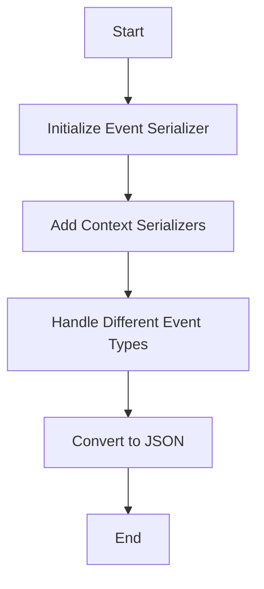

This document will cover the process of marshaling an event, which includes:

1. Initializing the Event Serializer
2. Adding Context Serializers
3. Handling Different Event Types.

Technical document: <SwmLink doc-title="Marshaling an Event">[Marshaling an Event](/.swm/marshaling-an-event.adzi6ja7.sw.md)</SwmLink>

# [Initializing the Event Serializer](https://app.swimm.io/repos/Z2l0aHViJTNBJTNBZGF0YWRvZy1hZ2VudCUzQSUzQVN3aW1tLURlbW8=/docs/adzi6ja7#neweventserializer)

The process begins by initializing an Event Serializer. This is done to prepare the event data for conversion into a format that can be easily transmitted and understood by other systems. The Event Serializer is responsible for gathering all the necessary information about the event, including its type and relevant context.

# [Adding Context Serializers](https://app.swimm.io/repos/Z2l0aHViJTNBJTNBZGF0YWRvZy1hZ2VudCUzQSUzQVN3aW1tLURlbW8=/docs/adzi6ja7#neweventserializer)

Once the Event Serializer is initialized, various context serializers are added based on the attributes of the event. These context serializers include:

- **BaseEventSerializer**: Provides basic information about the event.
- **UserContextSerializer**: Adds user-related information.
- **DDContextSerializer**: Adds Datadog-specific context.
- **NetworkContextSerializer**: Added if the event is network-related.
- **SecurityProfileContextSerializer**: Added if the event has a security profile context.
- **ContainerContextSerializer**: Added if the event is related to a container.
- **CGroupContextSerializer**: Added if the event has a CGroup context.

These serializers ensure that all relevant information is included, making the event data comprehensive and useful for analysis.

# [Handling Different Event Types](https://app.swimm.io/repos/Z2l0aHViJTNBJTNBZGF0YWRvZy1hZ2VudCUzQSUzQVN3aW1tLURlbW8=/docs/adzi6ja7#the-function-then-handles-various-event-types)

The next step involves handling different types of events. Each event type has specific attributes and context that need to be serialized. For example:

- **FileChmodEventType**: Includes information about file permissions changes.
- **FileChownEventType**: Includes information about file ownership changes.
- **FileLinkEventType**: Includes information about file linking operations.

For each event type, the corresponding serializers are set up to capture all necessary details. This ensures that the event data is accurately represented and can be effectively used for monitoring and analysis.

# [Converting to JSON](https://app.swimm.io/repos/Z2l0aHViJTNBJTNBZGF0YWRvZy1hZ2VudCUzQSUzQVN3aW1tLURlbW8=/docs/adzi6ja7#marshalevent)

After all the necessary context serializers are added and the event type is handled, the Event Serializer is converted into JSON format. This conversion is crucial because JSON is a widely-used format for data interchange, making it easier to transmit the event data to other systems and platforms for further processing and analysis.

&nbsp;

*This is an auto-generated document by Swimm AI 🌊 and has not yet been verified by a human*

<SwmMeta version="3.0.0" repo-id="Z2l0aHViJTNBJTNBZGF0YWRvZy1hZ2VudCUzQSUzQVN3aW1tLURlbW8=" repo-name="datadog-agent">Powered by [Swimm](/)</SwmMeta>
