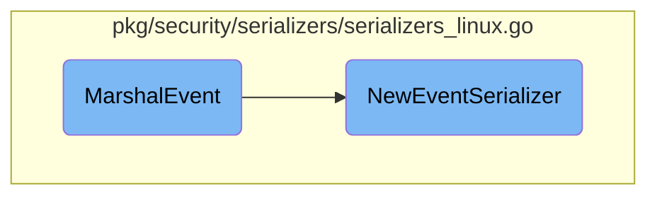

In this document, we will explain the process of marshaling an event. The process involves creating an <SwmToken path="pkg/security/serializers/serializers_linux.go" pos="1131:21:21" line-data="func NewEventSerializer(event *model.Event, opts *eval.Opts) *EventSerializer {">`EventSerializer`</SwmToken> and converting it into JSON format.

The flow starts with the <SwmToken path="pkg/security/serializers/serializers_linux.go" pos="1120:2:2" line-data="func MarshalEvent(event *model.Event, opts *eval.Opts) ([]byte, error) {">`MarshalEvent`</SwmToken> function, which creates an <SwmToken path="pkg/security/serializers/serializers_linux.go" pos="1131:21:21" line-data="func NewEventSerializer(event *model.Event, opts *eval.Opts) *EventSerializer {">`EventSerializer`</SwmToken> using the <SwmToken path="pkg/security/serializers/serializers_linux.go" pos="1121:5:5" line-data="	s := NewEventSerializer(event, opts)">`NewEventSerializer`</SwmToken> function. This serializer is then converted into JSON format. The <SwmToken path="pkg/security/serializers/serializers_linux.go" pos="1121:5:5" line-data="	s := NewEventSerializer(event, opts)">`NewEventSerializer`</SwmToken> function initializes various context serializers based on the event type, such as <SwmToken path="pkg/security/serializers/serializers_linux.go" pos="1133:1:1" line-data="		BaseEventSerializer:   NewBaseEventSerializer(event, opts),">`BaseEventSerializer`</SwmToken>, <SwmToken path="pkg/security/serializers/serializers_linux.go" pos="1134:1:1" line-data="		UserContextSerializer: newUserContextSerializer(event),">`UserContextSerializer`</SwmToken>, and others. Depending on the event's attributes, additional serializers like <SwmToken path="pkg/security/serializers/serializers_linux.go" pos="1140:3:3" line-data="		s.NetworkContextSerializer = newNetworkContextSerializer(event)">`NetworkContextSerializer`</SwmToken>, <SwmToken path="pkg/security/serializers/serializers_linux.go" pos="1144:3:3" line-data="		s.SecurityProfileContextSerializer = newSecurityProfileContextSerializer(event, &amp;event.SecurityProfileContext)">`SecurityProfileContextSerializer`</SwmToken>, <SwmToken path="pkg/security/serializers/serializers_linux.go" pos="1148:3:3" line-data="		s.ContainerContextSerializer = &amp;ContainerContextSerializer{">`ContainerContextSerializer`</SwmToken>, and <SwmToken path="pkg/security/serializers/serializers_linux.go" pos="1156:3:3" line-data="		s.CGroupContextSerializer = &amp;CGroupContextSerializer{">`CGroupContextSerializer`</SwmToken> are added. Finally, the function handles different event types and sets up the corresponding serializers for each type.

# Flow drill down



<SwmSnippet path="/pkg/security/serializers/serializers_linux.go" line="1120">

---

## <SwmToken path="pkg/security/serializers/serializers_linux.go" pos="1120:2:2" line-data="func MarshalEvent(event *model.Event, opts *eval.Opts) ([]byte, error) {">`MarshalEvent`</SwmToken>

The <SwmToken path="pkg/security/serializers/serializers_linux.go" pos="1120:2:2" line-data="func MarshalEvent(event *model.Event, opts *eval.Opts) ([]byte, error) {">`MarshalEvent`</SwmToken> function is responsible for marshaling an event. It creates an <SwmToken path="pkg/security/serializers/serializers_linux.go" pos="1131:21:21" line-data="func NewEventSerializer(event *model.Event, opts *eval.Opts) *EventSerializer {">`EventSerializer`</SwmToken> using the <SwmToken path="pkg/security/serializers/serializers_linux.go" pos="1121:5:5" line-data="	s := NewEventSerializer(event, opts)">`NewEventSerializer`</SwmToken> function and then marshals it into JSON format using <SwmToken path="pkg/security/serializers/serializers_linux.go" pos="1122:3:5" line-data="	return utils.MarshalEasyJSON(s)">`utils.MarshalEasyJSON`</SwmToken>.

```go
func MarshalEvent(event *model.Event, opts *eval.Opts) ([]byte, error) {
	s := NewEventSerializer(event, opts)
	return utils.MarshalEasyJSON(s)
}
```

---

</SwmSnippet>

<SwmSnippet path="/pkg/security/serializers/serializers_linux.go" line="1131">

---

## <SwmToken path="pkg/security/serializers/serializers_linux.go" pos="1131:2:2" line-data="func NewEventSerializer(event *model.Event, opts *eval.Opts) *EventSerializer {">`NewEventSerializer`</SwmToken>

The <SwmToken path="pkg/security/serializers/serializers_linux.go" pos="1131:2:2" line-data="func NewEventSerializer(event *model.Event, opts *eval.Opts) *EventSerializer {">`NewEventSerializer`</SwmToken> function initializes a new <SwmToken path="pkg/security/serializers/serializers_linux.go" pos="1131:21:21" line-data="func NewEventSerializer(event *model.Event, opts *eval.Opts) *EventSerializer {">`EventSerializer`</SwmToken> object. It sets up various context serializers such as <SwmToken path="pkg/security/serializers/serializers_linux.go" pos="1133:1:1" line-data="		BaseEventSerializer:   NewBaseEventSerializer(event, opts),">`BaseEventSerializer`</SwmToken>, <SwmToken path="pkg/security/serializers/serializers_linux.go" pos="1134:1:1" line-data="		UserContextSerializer: newUserContextSerializer(event),">`UserContextSerializer`</SwmToken>, and <SwmToken path="pkg/security/serializers/serializers_linux.go" pos="1135:1:1" line-data="		DDContextSerializer:   newDDContextSerializer(event),">`DDContextSerializer`</SwmToken> based on the event type.

```go
func NewEventSerializer(event *model.Event, opts *eval.Opts) *EventSerializer {
	s := &EventSerializer{
		BaseEventSerializer:   NewBaseEventSerializer(event, opts),
		UserContextSerializer: newUserContextSerializer(event),
		DDContextSerializer:   newDDContextSerializer(event),
	}
	s.Async = event.FieldHandlers.ResolveAsync(event)
```

---

</SwmSnippet>

<SwmSnippet path="/pkg/security/serializers/serializers_linux.go" line="1139">

---

If the event category is <SwmToken path="pkg/security/serializers/serializers_linux.go" pos="1139:11:11" line-data="	if s.Category == model.NetworkCategory {">`NetworkCategory`</SwmToken>, it adds a <SwmToken path="pkg/security/serializers/serializers_linux.go" pos="1140:3:3" line-data="		s.NetworkContextSerializer = newNetworkContextSerializer(event)">`NetworkContextSerializer`</SwmToken> to the <SwmToken path="pkg/security/serializers/serializers_linux.go" pos="1131:21:21" line-data="func NewEventSerializer(event *model.Event, opts *eval.Opts) *EventSerializer {">`EventSerializer`</SwmToken>.

```go
	if s.Category == model.NetworkCategory {
		s.NetworkContextSerializer = newNetworkContextSerializer(event)
	}
```

---

</SwmSnippet>

<SwmSnippet path="/pkg/security/serializers/serializers_linux.go" line="1143">

---

If the event has a <SwmToken path="pkg/security/serializers/serializers_linux.go" pos="1143:5:5" line-data="	if event.SecurityProfileContext.Name != &quot;&quot; {">`SecurityProfileContext`</SwmToken>, it adds a <SwmToken path="pkg/security/serializers/serializers_linux.go" pos="1144:3:3" line-data="		s.SecurityProfileContextSerializer = newSecurityProfileContextSerializer(event, &amp;event.SecurityProfileContext)">`SecurityProfileContextSerializer`</SwmToken> to the <SwmToken path="pkg/security/serializers/serializers_linux.go" pos="1131:21:21" line-data="func NewEventSerializer(event *model.Event, opts *eval.Opts) *EventSerializer {">`EventSerializer`</SwmToken>.

```go
	if event.SecurityProfileContext.Name != "" {
		s.SecurityProfileContextSerializer = newSecurityProfileContextSerializer(event, &event.SecurityProfileContext)
	}
```

---

</SwmSnippet>

<SwmSnippet path="/pkg/security/serializers/serializers_linux.go" line="1147">

---

If the event has a container context, it adds a <SwmToken path="pkg/security/serializers/serializers_linux.go" pos="1148:3:3" line-data="		s.ContainerContextSerializer = &amp;ContainerContextSerializer{">`ContainerContextSerializer`</SwmToken> to the <SwmToken path="pkg/security/serializers/serializers_linux.go" pos="1131:21:21" line-data="func NewEventSerializer(event *model.Event, opts *eval.Opts) *EventSerializer {">`EventSerializer`</SwmToken>.

```go
	if ctx, exists := event.FieldHandlers.ResolveContainerContext(event); exists {
		s.ContainerContextSerializer = &ContainerContextSerializer{
			ID:        string(ctx.ContainerID),
			CreatedAt: utils.NewEasyjsonTimeIfNotZero(time.Unix(0, int64(ctx.CreatedAt))),
			Variables: newVariablesContext(event, opts, "container."),
		}
	}
```

---

</SwmSnippet>

<SwmSnippet path="/pkg/security/serializers/serializers_linux.go" line="1155">

---

If the event has a CGroup context, it adds a <SwmToken path="pkg/security/serializers/serializers_linux.go" pos="1156:3:3" line-data="		s.CGroupContextSerializer = &amp;CGroupContextSerializer{">`CGroupContextSerializer`</SwmToken> to the <SwmToken path="pkg/security/serializers/serializers_linux.go" pos="1131:21:21" line-data="func NewEventSerializer(event *model.Event, opts *eval.Opts) *EventSerializer {">`EventSerializer`</SwmToken>.

```go
	if cgroupID := event.FieldHandlers.ResolveCGroupID(event, &event.CGroupContext); cgroupID != "" {
		s.CGroupContextSerializer = &CGroupContextSerializer{
			ID: string(event.CGroupContext.CGroupID),
		}
	}
```

---

</SwmSnippet>

<SwmSnippet path="/pkg/security/serializers/serializers_linux.go" line="1163">

---

The function then handles various event types such as <SwmToken path="pkg/security/serializers/serializers_linux.go" pos="1164:5:5" line-data="	case model.FileChmodEventType:">`FileChmodEventType`</SwmToken>, <SwmToken path="pkg/security/serializers/serializers_linux.go" pos="1175:5:5" line-data="	case model.FileChownEventType:">`FileChownEventType`</SwmToken>, <SwmToken path="pkg/security/serializers/serializers_linux.go" pos="556:5:5" line-data="	case model.FileLinkEventType, model.FileRenameEventType:">`FileLinkEventType`</SwmToken>, etc., and sets up the corresponding serializers for each event type.

```go
	switch eventType {
	case model.FileChmodEventType:
		s.FileEventSerializer = &FileEventSerializer{
			FileSerializer: *newFileSerializer(&event.Chmod.File, event),
			Destination: &FileSerializer{
				Mode: &event.Chmod.Mode,
			},
		}
		s.EventContextSerializer.Outcome = serializeOutcome(event.Chmod.Retval)
		s.SyscallContextSerializer = newSyscallContextSerializer(&event.Chmod.SyscallContext, event, func(ctx *SyscallContextSerializer, args *SyscallArgsSerializer) {
			ctx.Chmod = args
		})
	case model.FileChownEventType:
		s.FileEventSerializer = &FileEventSerializer{
			FileSerializer: *newFileSerializer(&event.Chown.File, event),
			Destination: &FileSerializer{
				UID: event.Chown.UID,
				GID: event.Chown.GID,
			},
		}
		s.EventContextSerializer.Outcome = serializeOutcome(event.Chown.Retval)
```

---

</SwmSnippet>

&nbsp;

*This is an auto-generated document by Swimm AI 🌊 and has not yet been verified by a human*

<SwmMeta version="3.0.0" repo-id="Z2l0aHViJTNBJTNBZGF0YWRvZy1hZ2VudCUzQSUzQVN3aW1tLURlbW8=" repo-name="datadog-agent"><sup>Powered by [Swimm](/)</sup></SwmMeta>
