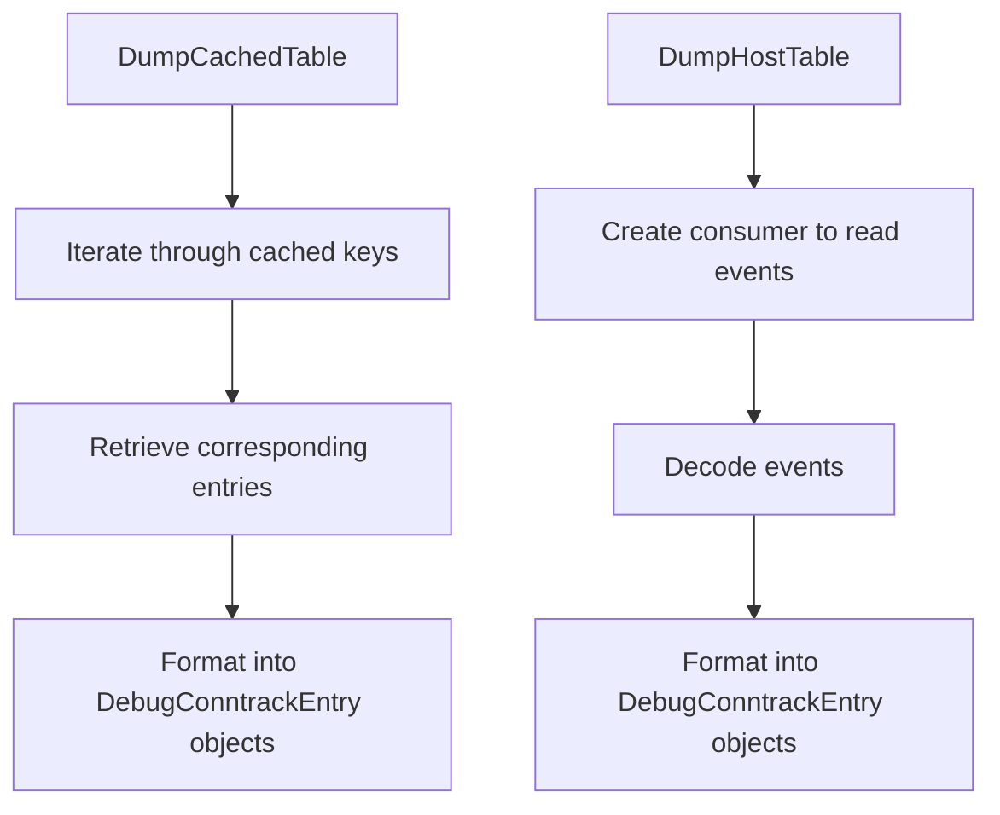

# Overview

Netlink is a communication protocol between the kernel and user-space processes in Linux. It is used for transferring information such as network configuration, routing tables, and interface statistics. In the <SwmToken path="pkg/network/netlink/consumer.go" pos="23:10:12" line-data="	telemetryComp &quot;github.com/DataDog/datadog-agent/comp/core/telemetry&quot;">`datadog-agent`</SwmToken>, the netlink package is utilized to handle network-related events and data. This includes monitoring new connection events, decoding messages received from the kernel, and managing network namespaces.

# Netlink Package Structure

The netlink package includes various files such as <SwmPath>[pkg/logs/message/message.go](pkg/logs/message/message.go)</SwmPath>, <SwmPath>[pkg/network/encoding/encoding.go](pkg/network/encoding/encoding.go)</SwmPath>, <SwmPath>[pkg/logs/launchers/container/tailerfactory/socket.go](pkg/logs/launchers/container/tailerfactory/socket.go)</SwmPath>, and <SwmPath>[pkg/network/netlink/consumer.go](pkg/network/netlink/consumer.go)</SwmPath>, each responsible for different aspects of netlink communication. For example, <SwmPath>[pkg/logs/message/message.go](pkg/logs/message/message.go)</SwmPath> deals with the structure of netlink messages, while <SwmPath>[pkg/logs/launchers/container/tailerfactory/socket.go](pkg/logs/launchers/container/tailerfactory/socket.go)</SwmPath> handles the socket communication.

<SwmSnippet path="/pkg/network/netlink/consumer.go" line="95">

---

## Event Struct

The <SwmToken path="pkg/network/netlink/consumer.go" pos="95:2:2" line-data="// Event encapsulates the result of a single netlink.Con.Receive() call">`Event`</SwmToken> struct in <SwmPath>[pkg/network/netlink/consumer.go](pkg/network/netlink/consumer.go)</SwmPath> encapsulates the result of a netlink receive call, containing messages and network namespace information. This struct is crucial for processing and decoding the data received from the kernel.

```go
// Event encapsulates the result of a single netlink.Con.Receive() call
type Event struct {
	msgs   []netlink.Message
	netns  uint32
	buffer *[]byte
	pool   *ddsync.TypedPool[[]byte]
}

// Messages returned from the socket read
func (e *Event) Messages() []netlink.Message {
	return e.msgs
}

// Done must be called after decoding events so the underlying buffers can be reclaimed.
func (e *Event) Done() {
	if e.buffer != nil {
		e.pool.Put(e.buffer)
	}
}
```

---

</SwmSnippet>

# Main Functions

There are several main functions in this folder. Some of them are <SwmToken path="pkg/network/netlink/consumer.go" pos="341:2:2" line-data="// LoadNfConntrackKernelModule requests a dummy connection tuple from netlink conntrack which is discarded but has">`LoadNfConntrackKernelModule`</SwmToken>, <SwmToken path="pkg/network/netlink/consumer.go" pos="95:20:20" line-data="// Event encapsulates the result of a single netlink.Con.Receive() call">`Receive`</SwmToken>, <SwmToken path="pkg/network/netlink/consumer.go" pos="344:8:8" line-data="	sock, err := NewSocket(ns)">`NewSocket`</SwmToken>, `ParseNetlinkMessage`, and <SwmToken path="pkg/network/netlink/conntrack_debug.go" pos="39:2:2" line-data="// DumpCachedTable dumps the cached conntrack NAT entries grouped by network namespace">`DumpCachedTable`</SwmToken>. We will dive a little into <SwmToken path="pkg/network/netlink/consumer.go" pos="341:2:2" line-data="// LoadNfConntrackKernelModule requests a dummy connection tuple from netlink conntrack which is discarded but has">`LoadNfConntrackKernelModule`</SwmToken> and <SwmToken path="pkg/network/netlink/consumer.go" pos="95:20:20" line-data="// Event encapsulates the result of a single netlink.Con.Receive() call">`Receive`</SwmToken>.

<SwmSnippet path="/pkg/network/netlink/consumer.go" line="341">

---

## <SwmToken path="pkg/network/netlink/consumer.go" pos="341:2:2" line-data="// LoadNfConntrackKernelModule requests a dummy connection tuple from netlink conntrack which is discarded but has">`LoadNfConntrackKernelModule`</SwmToken>

The <SwmToken path="pkg/network/netlink/consumer.go" pos="341:2:2" line-data="// LoadNfConntrackKernelModule requests a dummy connection tuple from netlink conntrack which is discarded but has">`LoadNfConntrackKernelModule`</SwmToken> function requests a dummy connection tuple from netlink conntrack, which is discarded but has the side effect of loading the <SwmToken path="pkg/network/netlink/consumer.go" pos="342:14:14" line-data="// the side effect of loading the nf_conntrack_netlink module">`nf_conntrack_netlink`</SwmToken> module. This function is crucial for ensuring that the necessary kernel module is loaded for netlink operations.

```go
// LoadNfConntrackKernelModule requests a dummy connection tuple from netlink conntrack which is discarded but has
// the side effect of loading the nf_conntrack_netlink module
func LoadNfConntrackKernelModule(ns netns.NsHandle) error {
	sock, err := NewSocket(ns)
	if err != nil {
		ino, errIno := kernel.GetInoForNs(ns)
		if errIno != nil {
			return fmt.Errorf("failed to create new socket for net ns %d and failed to get inode: %v,  %w", int(ns), errIno, err)
		}
		return fmt.Errorf("could not open netlink socket for net ns %d and ino %d: %w", int(ns), ino, err)
	}
	defer sock.Close()

	conn := netlink.NewConn(sock, sock.pid)
	defer func() {
		_ = conn.Close()
	}()

	// Create a dummy request to netlink for a tuple with 0 values except for the first element which specifies IPv4.
	// The values are irrelevant, the objective is to trigger a netlink call that forces loading of the module.
	dummyTupleData := []byte{0x2, 0, 0, 0, 0, 0, 0}
```

---

</SwmSnippet>

<SwmSnippet path="/pkg/network/netlink/consumer.go" line="528">

---

## receive

The <SwmToken path="pkg/network/netlink/consumer.go" pos="528:2:2" line-data="// receive netlink messages and flushes them to the Event channel.">`receive`</SwmToken> function reads netlink messages and flushes them to the Event channel. It operates in two contexts: during <SwmToken path="pkg/network/netlink/consumer.go" pos="531:6:8" line-data="// - During system-probe startup, when we&#39;re loading all entries from the Conntrack table.">`system-probe`</SwmToken> startup to load all entries from the Conntrack table and while streaming new connection events from the netlink socket. This function is essential for processing incoming netlink messages and handling errors such as ENOBUF.

```go
// receive netlink messages and flushes them to the Event channel.
// This method gets called in two different contexts:
//
// - During system-probe startup, when we're loading all entries from the Conntrack table.
// In this case c.streaming attribute is false, and once we detect the end of the multi-part
// message we stop calling socket.Receive() and close the output channel to signal upstream
// consumers we're done.
//
// - When we're streaming new connection events from the netlink socket. In this case, `c.streaming`
// attribute is true, and only when we detect an EOF we close the output channel.
// It's also worth noting that in the event of an ENOBUF error, we'll re-create a new netlink socket,
// and attach a BPF sampler to it, to lower the the read throughput and save CPU.
func (c *Consumer) receive(output chan Event, ns uint32) {
	c.recvLoopRunning.Store(true)
	defer func() {
		c.recvLoopRunning.Store(false)
	}()

ReadLoop:
	for {
		buffer := c.pool.Get()
```

---

</SwmSnippet>

# Netlink Endpoints

Netlink endpoints are used to interact with the netlink protocol. Two important functions for dumping tables are <SwmToken path="pkg/network/netlink/conntrack_debug.go" pos="39:2:2" line-data="// DumpCachedTable dumps the cached conntrack NAT entries grouped by network namespace">`DumpCachedTable`</SwmToken> and <SwmToken path="pkg/network/netlink/conntrack_debug.go" pos="88:2:2" line-data="// DumpHostTable dumps the host conntrack NAT entries grouped by network namespace">`DumpHostTable`</SwmToken>.

<SwmSnippet path="/pkg/network/netlink/conntrack_debug.go" line="39">

---

## <SwmToken path="pkg/network/netlink/conntrack_debug.go" pos="39:2:2" line-data="// DumpCachedTable dumps the cached conntrack NAT entries grouped by network namespace">`DumpCachedTable`</SwmToken>

The <SwmToken path="pkg/network/netlink/conntrack_debug.go" pos="39:2:2" line-data="// DumpCachedTable dumps the cached conntrack NAT entries grouped by network namespace">`DumpCachedTable`</SwmToken> function is used to dump the cached conntrack NAT entries grouped by network namespace. It iterates through the cached keys, retrieves the corresponding entries, and formats them into a map of <SwmToken path="pkg/network/netlink/conntrack_debug.go" pos="40:25:25" line-data="func (ctr *realConntracker) DumpCachedTable(ctx context.Context) (map[uint32][]DebugConntrackEntry, error) {">`DebugConntrackEntry`</SwmToken> objects.

```go
// DumpCachedTable dumps the cached conntrack NAT entries grouped by network namespace
func (ctr *realConntracker) DumpCachedTable(ctx context.Context) (map[uint32][]DebugConntrackEntry, error) {
	table := make(map[uint32][]DebugConntrackEntry)
	keys := ctr.cache.cache.Keys()
	if len(keys) == 0 {
		return table, nil
	}

	// netlink conntracker does not store netns values
	ns := uint32(0)
	table[ns] = []DebugConntrackEntry{}

	for _, ck := range keys {
		if ctx.Err() != nil {
			return nil, ctx.Err()
		}

		te, ok := ctr.cache.cache.Peek(ck)
		if !ok {
			continue
		}
```

---

</SwmSnippet>

<SwmSnippet path="/pkg/network/netlink/conntrack_debug.go" line="88">

---

## <SwmToken path="pkg/network/netlink/conntrack_debug.go" pos="88:2:2" line-data="// DumpHostTable dumps the host conntrack NAT entries grouped by network namespace">`DumpHostTable`</SwmToken>

The <SwmToken path="pkg/network/netlink/conntrack_debug.go" pos="88:2:2" line-data="// DumpHostTable dumps the host conntrack NAT entries grouped by network namespace">`DumpHostTable`</SwmToken> function is used to dump the host conntrack NAT entries grouped by network namespace. It creates a consumer to read events from the kernel, decodes these events, and formats them into a map of <SwmToken path="pkg/network/netlink/conntrack_debug.go" pos="89:33:33" line-data="func DumpHostTable(ctx context.Context, cfg *config.Config, telemetryComp telemetry.Component) (map[uint32][]DebugConntrackEntry, error) {">`DebugConntrackEntry`</SwmToken> objects.

```go
// DumpHostTable dumps the host conntrack NAT entries grouped by network namespace
func DumpHostTable(ctx context.Context, cfg *config.Config, telemetryComp telemetry.Component) (map[uint32][]DebugConntrackEntry, error) {
	consumer, err := NewConsumer(cfg, telemetryComp)
	if err != nil {
		return nil, err
	}

	decoder := NewDecoder()
	defer consumer.Stop()

	table := make(map[uint32][]DebugConntrackEntry)

	for _, family := range []uint8{unix.AF_INET, unix.AF_INET6} {
		events, err := consumer.DumpTable(family)
		if err != nil {
			return nil, err
		}

		fstr := "v4"
		if family == unix.AF_INET6 {
			fstr = "v6"
```

---

</SwmSnippet>

&nbsp;

*This is an auto-generated document by Swimm AI 🌊 and has not yet been verified by a human*

<SwmMeta version="3.0.0" repo-id="Z2l0aHViJTNBJTNBZGF0YWRvZy1hZ2VudCUzQSUzQVN3aW1tLURlbW8=" repo-name="datadog-agent"><sup>Powered by [Swimm](/)</sup></SwmMeta>
