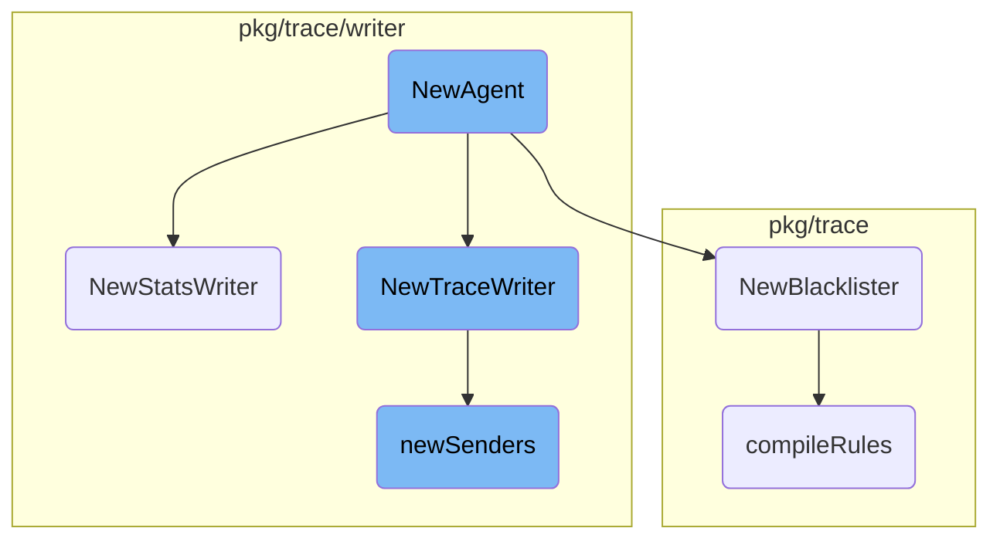

This document explains the initialization process of the <SwmToken path="pkg/trace/agent/agent.go" pos="132:2:2" line-data="// NewAgent returns a new Agent object, ready to be started. It takes a context">`NewAgent`</SwmToken> component. It covers the setup of various sub-components such as <SwmToken path="pkg/trace/agent/agent.go" pos="143:1:1" line-data="	statsWriter := writer.NewStatsWriter(conf, telemetryCollector, statsd, timing)">`statsWriter`</SwmToken>, Blacklister, and <SwmToken path="pkg/trace/writer/trace.go" pos="87:10:10" line-data="// NewTraceWriter returns a new TraceWriter. It is created for the given agent configuration and">`TraceWriter`</SwmToken>, which are essential for the agent to function correctly.

The <SwmToken path="pkg/trace/agent/agent.go" pos="132:2:2" line-data="// NewAgent returns a new Agent object, ready to be started. It takes a context">`NewAgent`</SwmToken> component is initialized by setting up several sub-components. First, the <SwmToken path="pkg/trace/agent/agent.go" pos="143:1:1" line-data="	statsWriter := writer.NewStatsWriter(conf, telemetryCollector, statsd, timing)">`statsWriter`</SwmToken> is created to handle statistics data. Next, the Blacklister is set up to filter out unwanted data based on predefined rules. Finally, the <SwmToken path="pkg/trace/writer/trace.go" pos="87:10:10" line-data="// NewTraceWriter returns a new TraceWriter. It is created for the given agent configuration and">`TraceWriter`</SwmToken> is initialized to handle trace data and send it to the appropriate endpoints. These sub-components work together to ensure that the agent can collect, process, and send data efficiently.

# Flow drill down



<SwmSnippet path="/pkg/trace/agent/agent.go" line="132">

---

## <SwmToken path="pkg/trace/agent/agent.go" pos="132:2:2" line-data="// NewAgent returns a new Agent object, ready to be started. It takes a context">`NewAgent`</SwmToken> Initialization

The <SwmToken path="pkg/trace/agent/agent.go" pos="132:2:2" line-data="// NewAgent returns a new Agent object, ready to be started. It takes a context">`NewAgent`</SwmToken> function initializes a new Agent object. It sets up various components such as the <SwmToken path="pkg/trace/agent/agent.go" pos="143:1:1" line-data="	statsWriter := writer.NewStatsWriter(conf, telemetryCollector, statsd, timing)">`statsWriter`</SwmToken>, <SwmToken path="pkg/trace/agent/agent.go" pos="147:1:1" line-data="		Blacklister:           filters.NewBlacklister(conf.Ignore[&quot;resource&quot;]),">`Blacklister`</SwmToken>, and <SwmToken path="pkg/trace/writer/trace.go" pos="87:10:10" line-data="// NewTraceWriter returns a new TraceWriter. It is created for the given agent configuration and">`TraceWriter`</SwmToken>. This function is crucial as it prepares the agent to start collecting and processing data.

```go
// NewAgent returns a new Agent object, ready to be started. It takes a context
// which may be cancelled in order to gracefully stop the agent.
func NewAgent(ctx context.Context, conf *config.AgentConfig, telemetryCollector telemetry.TelemetryCollector, statsd statsd.ClientInterface, comp compression.Component) *Agent {
	dynConf := sampler.NewDynamicConfig()
	log.Infof("Starting Agent with processor trace buffer of size %d", conf.TraceBuffer)
	in := make(chan *api.Payload, conf.TraceBuffer)
	oconf := conf.Obfuscation.Export(conf)
	if oconf.Statsd == nil {
		oconf.Statsd = statsd
	}
	timing := timing.New(statsd)
	statsWriter := writer.NewStatsWriter(conf, telemetryCollector, statsd, timing)
	agnt := &Agent{
		Concentrator:          stats.NewConcentrator(conf, statsWriter, time.Now(), statsd),
		ClientStatsAggregator: stats.NewClientStatsAggregator(conf, statsWriter, statsd),
		Blacklister:           filters.NewBlacklister(conf.Ignore["resource"]),
		Replacer:              filters.NewReplacer(conf.ReplaceTags),
		PrioritySampler:       sampler.NewPrioritySampler(conf, dynConf, statsd),
		ErrorsSampler:         sampler.NewErrorsSampler(conf, statsd),
		RareSampler:           sampler.NewRareSampler(conf, statsd),
		NoPrioritySampler:     sampler.NewNoPrioritySampler(conf, statsd),
```

---

</SwmSnippet>

<SwmSnippet path="/pkg/trace/writer/stats.go" line="62">

---

## <SwmToken path="pkg/trace/writer/stats.go" pos="62:2:2" line-data="// NewStatsWriter returns a new DatadogStatsWriter. It must be started using Run.">`NewStatsWriter`</SwmToken>

The <SwmToken path="pkg/trace/writer/stats.go" pos="62:2:2" line-data="// NewStatsWriter returns a new DatadogStatsWriter. It must be started using Run.">`NewStatsWriter`</SwmToken> function creates a new instance of <SwmToken path="pkg/trace/writer/stats.go" pos="62:10:10" line-data="// NewStatsWriter returns a new DatadogStatsWriter. It must be started using Run.">`DatadogStatsWriter`</SwmToken>. This writer is responsible for handling the statistics data and must be started using the <SwmToken path="pkg/trace/writer/stats.go" pos="62:23:23" line-data="// NewStatsWriter returns a new DatadogStatsWriter. It must be started using Run.">`Run`</SwmToken> method. It also initializes the senders that will be used to send data.

```go
// NewStatsWriter returns a new DatadogStatsWriter. It must be started using Run.
func NewStatsWriter(
	cfg *config.AgentConfig,
	telemetryCollector telemetry.TelemetryCollector,
	statsd statsd.ClientInterface,
	timing timing.Reporter,
) *DatadogStatsWriter {
	sw := &DatadogStatsWriter{
		stats:     &info.StatsWriterInfo{},
		stop:      make(chan struct{}),
		flushChan: make(chan chan struct{}),
		syncMode:  cfg.SynchronousFlushing,
		easylog:   log.NewThrottled(5, 10*time.Second), // no more than 5 messages every 10 seconds
		conf:      cfg,
		statsd:    statsd,
		timing:    timing,
	}
	climit := cfg.StatsWriter.ConnectionLimit
	if climit == 0 {
		climit = 5
	}
```

---

</SwmSnippet>

<SwmSnippet path="/pkg/trace/filters/blacklister.go" line="42">

---

## <SwmToken path="pkg/trace/filters/blacklister.go" pos="42:2:2" line-data="// NewBlacklister creates a new Blacklister based on the given list of">`NewBlacklister`</SwmToken>

The <SwmToken path="pkg/trace/filters/blacklister.go" pos="42:2:2" line-data="// NewBlacklister creates a new Blacklister based on the given list of">`NewBlacklister`</SwmToken> function creates a new Blacklister based on a list of regular expressions. This component is used to filter out unwanted data based on predefined rules.

```go
// NewBlacklister creates a new Blacklister based on the given list of
// regular expressions.
func NewBlacklister(exprs []string) *Blacklister {
	return &Blacklister{list: compileRules(exprs)}
}
```

---

</SwmSnippet>

<SwmSnippet path="/pkg/trace/writer/trace.go" line="87">

---

## <SwmToken path="pkg/trace/writer/trace.go" pos="87:2:2" line-data="// NewTraceWriter returns a new TraceWriter. It is created for the given agent configuration and">`NewTraceWriter`</SwmToken>

The <SwmToken path="pkg/trace/writer/trace.go" pos="87:2:2" line-data="// NewTraceWriter returns a new TraceWriter. It is created for the given agent configuration and">`NewTraceWriter`</SwmToken> function initializes a new <SwmToken path="pkg/trace/writer/trace.go" pos="87:10:10" line-data="// NewTraceWriter returns a new TraceWriter. It is created for the given agent configuration and">`TraceWriter`</SwmToken>. This writer is responsible for handling trace data and sending it to the appropriate endpoints. It also sets up the senders and starts the necessary goroutines for flushing and reporting data.

```go
// NewTraceWriter returns a new TraceWriter. It is created for the given agent configuration and
// will accept incoming spans via the in channel.
func NewTraceWriter(
	cfg *config.AgentConfig,
	prioritySampler samplerTPSReader,
	errorsSampler samplerTPSReader,
	rareSampler samplerEnabledReader,
	telemetryCollector telemetry.TelemetryCollector,
	statsd statsd.ClientInterface,
	timing timing.Reporter,
	compressor compression.Component) *TraceWriter {
	tw := &TraceWriter{
		prioritySampler:    prioritySampler,
		errorsSampler:      errorsSampler,
		rareSampler:        rareSampler,
		hostname:           cfg.Hostname,
		env:                cfg.DefaultEnv,
		stats:              &info.TraceWriterInfo{},
		stop:               make(chan struct{}),
		flushChan:          make(chan chan struct{}),
		syncMode:           cfg.SynchronousFlushing,
```

---

</SwmSnippet>

<SwmSnippet path="/pkg/trace/writer/sender.go" line="32">

---

### <SwmToken path="pkg/trace/writer/sender.go" pos="32:2:2" line-data="// newSenders returns a list of senders based on the given agent configuration, using climit">`newSenders`</SwmToken>

The <SwmToken path="pkg/trace/writer/sender.go" pos="32:2:2" line-data="// newSenders returns a list of senders based on the given agent configuration, using climit">`newSenders`</SwmToken> function returns a list of senders based on the agent configuration. These senders are responsible for sending data to the configured endpoints. The function ensures that the configuration is valid and initializes each sender with the appropriate settings.

```go
// newSenders returns a list of senders based on the given agent configuration, using climit
// as the maximum number of concurrent outgoing connections, writing to path.
func newSenders(cfg *config.AgentConfig, r eventRecorder, path string, climit, qsize int, telemetryCollector telemetry.TelemetryCollector, statsd statsd.ClientInterface) []*sender {
	if e := cfg.Endpoints; len(e) == 0 || e[0].Host == "" || e[0].APIKey == "" {
		panic(errors.New("config was not properly validated"))
	}
	// spread out the the maximum connection limit (climit) between senders
	maxConns := math.Max(1, float64(climit/len(cfg.Endpoints)))
	senders := make([]*sender, len(cfg.Endpoints))
	for i, endpoint := range cfg.Endpoints {
		url, err := url.Parse(endpoint.Host + path)
		if err != nil {
			telemetryCollector.SendStartupError(telemetry.InvalidIntakeEndpoint, err)
			log.Criticalf("Invalid host endpoint: %q", endpoint.Host)
			os.Exit(1)
		}
		senders[i] = newSender(&senderConfig{
			client:     cfg.NewHTTPClient(),
			maxConns:   int(maxConns),
			maxQueued:  qsize,
			maxRetries: cfg.MaxSenderRetries,
```

---

</SwmSnippet>

<SwmSnippet path="/pkg/trace/filters/blacklister.go" line="48">

---

### <SwmToken path="pkg/trace/filters/blacklister.go" pos="48:2:2" line-data="// compileRules compiles as many rules as possible from the list of expressions.">`compileRules`</SwmToken>

The <SwmToken path="pkg/trace/filters/blacklister.go" pos="48:2:2" line-data="// compileRules compiles as many rules as possible from the list of expressions.">`compileRules`</SwmToken> function compiles a list of regular expressions into a list of <SwmToken path="pkg/trace/filters/blacklister.go" pos="49:14:16" line-data="func compileRules(exprs []string) []*regexp.Regexp {">`regexp.Regexp`</SwmToken> objects. This is used by the Blacklister to filter out data based on the compiled rules.

```go
// compileRules compiles as many rules as possible from the list of expressions.
func compileRules(exprs []string) []*regexp.Regexp {
	list := make([]*regexp.Regexp, 0, len(exprs))
	for _, entry := range exprs {
		rule, err := regexp.Compile(entry)
		if err != nil {
			log.Errorf("Invalid resource filter: %s: %s", entry, err)
			continue
		}
		list = append(list, rule)
	}
	return list
}
```

---

</SwmSnippet>

&nbsp;

*This is an auto-generated document by Swimm AI 🌊 and has not yet been verified by a human*

<SwmMeta version="3.0.0" repo-id="Z2l0aHViJTNBJTNBZGF0YWRvZy1hZ2VudCUzQSUzQVN3aW1tLURlbW8=" repo-name="datadog-agent"><sup>Powered by [Swimm](/)</sup></SwmMeta>
