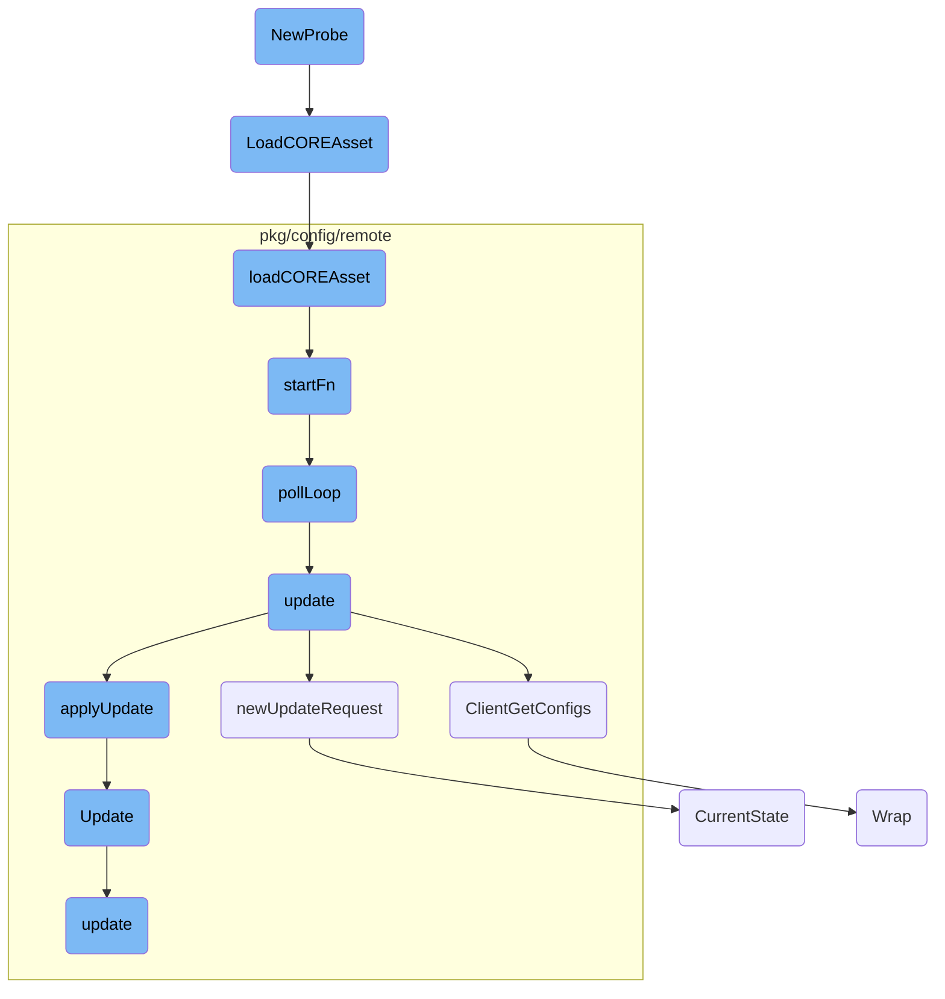

This document explains the initialization and flow of the <SwmToken path="pkg/collector/corechecks/ebpf/probe/ebpfcheck/probe.go" pos="65:2:2" line-data="// NewProbe creates a [Probe]">`NewProbe`</SwmToken> function. The <SwmToken path="pkg/collector/corechecks/ebpf/probe/ebpfcheck/probe.go" pos="65:2:2" line-data="// NewProbe creates a [Probe]">`NewProbe`</SwmToken> function is responsible for setting up a new <SwmToken path="pkg/collector/corechecks/ebpf/probe/ebpfcheck/probe.go" pos="76:6:6" line-data="	filename := &quot;ebpf.o&quot;">`ebpf`</SwmToken> probe, ensuring kernel compatibility, loading the appropriate <SwmToken path="pkg/collector/corechecks/ebpf/probe/ebpfcheck/probe.go" pos="76:6:6" line-data="	filename := &quot;ebpf.o&quot;">`ebpf`</SwmToken> object file, and initializing various probe settings.

The flow starts with the <SwmToken path="pkg/collector/corechecks/ebpf/probe/ebpfcheck/probe.go" pos="65:2:2" line-data="// NewProbe creates a [Probe]">`NewProbe`</SwmToken> function, which checks if the kernel version is compatible. If it is, it loads the appropriate <SwmToken path="pkg/collector/corechecks/ebpf/probe/ebpfcheck/probe.go" pos="76:6:6" line-data="	filename := &quot;ebpf.o&quot;">`ebpf`</SwmToken> object file based on the debug configuration. The function then loads the <SwmToken path="pkg/ebpf/co_re.go" pos="34:19:21" line-data="// LoadCOREAsset attempts to find kernel BTF, reads the CO-RE object file, and then calls the callback function with the">`CO-RE`</SwmToken> asset and initializes the probe settings. This involves enabling kernel <SwmToken path="pkg/collector/corechecks/ebpf/probe/ebpfcheck/probe.go" pos="76:6:6" line-data="	filename := &quot;ebpf.o&quot;">`ebpf`</SwmToken> stats and setting buffer size limits. The process ensures that the <SwmToken path="pkg/collector/corechecks/ebpf/probe/ebpfcheck/probe.go" pos="76:6:6" line-data="	filename := &quot;ebpf.o&quot;">`ebpf`</SwmToken> program is correctly loaded and ready for telemetry recording.

# Flow drill down



<SwmSnippet path="/pkg/collector/corechecks/ebpf/probe/ebpfcheck/probe.go" line="65">

---

## <SwmToken path="pkg/collector/corechecks/ebpf/probe/ebpfcheck/probe.go" pos="65:2:2" line-data="// NewProbe creates a [Probe]">`NewProbe`</SwmToken> Initialization

The <SwmToken path="pkg/collector/corechecks/ebpf/probe/ebpfcheck/probe.go" pos="65:2:2" line-data="// NewProbe creates a [Probe]">`NewProbe`</SwmToken> function initializes a new <SwmToken path="pkg/collector/corechecks/ebpf/probe/ebpfcheck/probe.go" pos="76:6:6" line-data="	filename := &quot;ebpf.o&quot;">`ebpf`</SwmToken> probe. It first checks the kernel version to ensure compatibility. Depending on the debug configuration, it selects the appropriate <SwmToken path="pkg/collector/corechecks/ebpf/probe/ebpfcheck/probe.go" pos="76:6:6" line-data="	filename := &quot;ebpf.o&quot;">`ebpf`</SwmToken> object file. The function then loads the <SwmToken path="pkg/ebpf/co_re.go" pos="34:19:21" line-data="// LoadCOREAsset attempts to find kernel BTF, reads the CO-RE object file, and then calls the callback function with the">`CO-RE`</SwmToken> asset using <SwmToken path="pkg/collector/corechecks/ebpf/probe/ebpfcheck/probe.go" pos="80:7:7" line-data="	err = ddebpf.LoadCOREAsset(filename, func(buf bytecode.AssetReader, opts manager.Options) error {">`LoadCOREAsset`</SwmToken> and initializes various probe settings, such as enabling kernel <SwmToken path="pkg/collector/corechecks/ebpf/probe/ebpfcheck/probe.go" pos="76:6:6" line-data="	filename := &quot;ebpf.o&quot;">`ebpf`</SwmToken> stats and setting buffer size limits.

```go
// NewProbe creates a [Probe]
func NewProbe(cfg *ddebpf.Config) (*Probe, error) {
	kv, err := kernel.HostVersion()
	if err != nil {
		return nil, fmt.Errorf("kernel version: %s", err)
	}
	if kv < minimumKernelVersion {
		return nil, fmt.Errorf("minimum kernel version %s not met, read %s", minimumKernelVersion, kv)
	}

	var probe *Probe
	filename := "ebpf.o"
	if cfg.BPFDebug {
		filename = "ebpf-debug.o"
	}
	err = ddebpf.LoadCOREAsset(filename, func(buf bytecode.AssetReader, opts manager.Options) error {
		var err error
		probe, err = startEBPFCheck(buf, opts)
		return err
	})
	if err != nil {
```

---

</SwmSnippet>

<SwmSnippet path="/pkg/ebpf/co_re.go" line="34">

---

## <SwmToken path="pkg/ebpf/co_re.go" pos="34:2:2" line-data="// LoadCOREAsset attempts to find kernel BTF, reads the CO-RE object file, and then calls the callback function with the">`LoadCOREAsset`</SwmToken> Function

The <SwmToken path="pkg/ebpf/co_re.go" pos="34:2:2" line-data="// LoadCOREAsset attempts to find kernel BTF, reads the CO-RE object file, and then calls the callback function with the">`LoadCOREAsset`</SwmToken> function is responsible for finding the kernel BTF, reading the <SwmToken path="pkg/ebpf/co_re.go" pos="34:19:21" line-data="// LoadCOREAsset attempts to find kernel BTF, reads the CO-RE object file, and then calls the callback function with the">`CO-RE`</SwmToken> object file, and calling the provided callback function with the asset and BTF options <SwmToken path="pkg/ebpf/co_re.go" pos="35:10:12" line-data="// asset and BTF options pre-filled. You should attempt to load the CO-RE program in the startFn func for telemetry to">`pre-filled`</SwmToken>. This function ensures that the <SwmToken path="pkg/ebpf/co_re.go" pos="34:19:21" line-data="// LoadCOREAsset attempts to find kernel BTF, reads the CO-RE object file, and then calls the callback function with the">`CO-RE`</SwmToken> program is loaded correctly for telemetry recording.

```go
// LoadCOREAsset attempts to find kernel BTF, reads the CO-RE object file, and then calls the callback function with the
// asset and BTF options pre-filled. You should attempt to load the CO-RE program in the startFn func for telemetry to
// be correctly recorded.
func LoadCOREAsset(filename string, startFn func(bytecode.AssetReader, manager.Options) error) error {
	loader, err := coreLoader(NewConfig())
	if err != nil {
		return err
	}
	return loader.loadCOREAsset(filename, startFn)
}
```

---

</SwmSnippet>

<SwmSnippet path="/pkg/ebpf/co_re.go" line="45">

---

### <SwmToken path="pkg/ebpf/co_re.go" pos="45:9:9" line-data="func (c *coreAssetLoader) loadCOREAsset(filename string, startFn func(bytecode.AssetReader, manager.Options) error) error {">`loadCOREAsset`</SwmToken> Method

The <SwmToken path="pkg/ebpf/co_re.go" pos="45:9:9" line-data="func (c *coreAssetLoader) loadCOREAsset(filename string, startFn func(bytecode.AssetReader, manager.Options) error) error {">`loadCOREAsset`</SwmToken> method of the <SwmToken path="pkg/ebpf/co_re.go" pos="45:6:6" line-data="func (c *coreAssetLoader) loadCOREAsset(filename string, startFn func(bytecode.AssetReader, manager.Options) error) error {">`coreAssetLoader`</SwmToken> struct handles the actual loading of the <SwmToken path="pkg/ebpf/co_re.go" pos="34:19:21" line-data="// LoadCOREAsset attempts to find kernel BTF, reads the CO-RE object file, and then calls the callback function with the">`CO-RE`</SwmToken> asset. It reads the BTF data and the <SwmToken path="pkg/ebpf/co_re.go" pos="34:19:21" line-data="// LoadCOREAsset attempts to find kernel BTF, reads the CO-RE object file, and then calls the callback function with the">`CO-RE`</SwmToken> object file, sets up the necessary options, and calls the provided <SwmToken path="pkg/ebpf/co_re.go" pos="45:16:16" line-data="func (c *coreAssetLoader) loadCOREAsset(filename string, startFn func(bytecode.AssetReader, manager.Options) error) error {">`startFn`</SwmToken> callback function to load the <SwmToken path="pkg/collector/corechecks/ebpf/probe/ebpfcheck/probe.go" pos="76:6:6" line-data="	filename := &quot;ebpf.o&quot;">`ebpf`</SwmToken> program.

```go
func (c *coreAssetLoader) loadCOREAsset(filename string, startFn func(bytecode.AssetReader, manager.Options) error) error {
	var result ebpftelemetry.COREResult
	base := strings.TrimSuffix(filename, path.Ext(filename))
	defer func() {
		c.reportTelemetry(base, result)
	}()

	ret, result, err := c.btfLoader.Get()
	if err != nil {
		return fmt.Errorf("BTF load: %w", err)
	}
	if ret == nil {
		return fmt.Errorf("no BTF data")
	}

	buf, err := bytecode.GetReader(c.coreDir, filename)
	if err != nil {
		result = ebpftelemetry.AssetReadError
		return fmt.Errorf("error reading %s: %s", filename, err)
	}
	defer buf.Close()
```

---

</SwmSnippet>

<SwmSnippet path="/pkg/config/remote/client/client.go" line="364">

---

## Starting the Poll Loop

The <SwmToken path="pkg/config/remote/client/client.go" pos="364:9:9" line-data="func (c *Client) startFn() {">`startFn`</SwmToken> method starts the polling loop by calling the <SwmToken path="pkg/config/remote/client/client.go" pos="365:5:5" line-data="	go c.pollLoop()">`pollLoop`</SwmToken> method in a separate goroutine. This ensures that the client continuously polls for updates without blocking the main execution flow.

```go
func (c *Client) startFn() {
	go c.pollLoop()
}
```

---

</SwmSnippet>

<SwmSnippet path="/pkg/config/remote/client/client.go" line="368">

---

### Poll Loop Execution

The <SwmToken path="pkg/config/remote/client/client.go" pos="368:2:2" line-data="// pollLoop is the main polling loop of the client.">`pollLoop`</SwmToken> method is the main polling loop of the client. It first attempts to update the configuration state. If the initial update fails, it retries at regular intervals, adjusting the polling interval based on the success of previous attempts. The loop continues until the context is done or the remote configuration is disabled.

```go
// pollLoop is the main polling loop of the client.
//
// pollLoop should never be called manually and only be called via the client's `sync.Once`
// structure in startFn.
func (c *Client) pollLoop() {
	successfulFirstRun := false
	// First run
	err := c.update()
	if err != nil {
		if status.Code(err) == codes.Unimplemented {
			// Remote Configuration is disabled as the server isn't initialized
			//
			// As this is not a transient error (that would be codes.Unavailable),
			// stop the client: it shouldn't keep contacting a server that doesn't
			// exist.
			log.Debugf("remote configuration isn't enabled, disabling client")
			return
		}

		// As some clients may start before the core-agent server is up, we log the first error
		// as an Info log as the race is expected. If the error persists, we log with error logs
```

---

</SwmSnippet>

<SwmSnippet path="/pkg/config/remote/client/client.go" line="439">

---

## Updating Configuration

The <SwmToken path="pkg/config/remote/client/client.go" pos="439:2:2" line-data="// update requests a config updates from the agent via the secure grpc channel and">`update`</SwmToken> method requests configuration updates from the agent via a secure <SwmToken path="pkg/config/remote/client/client.go" pos="439:24:24" line-data="// update requests a config updates from the agent via the secure grpc channel and">`grpc`</SwmToken> channel. It then applies the updates and informs any registered listeners of any state changes. This method ensures that the client's configuration is always up-to-date.

```go
// update requests a config updates from the agent via the secure grpc channel and
// applies that update, informing any registered listeners of any config state changes
// that occurred.
func (c *Client) update() error {
	req, err := c.newUpdateRequest()
	if err != nil {
		return err
	}

	response, err := c.configFetcher.ClientGetConfigs(c.ctx, req)
	if err != nil {
		return err
	}

	changedProducts, err := c.applyUpdate(response)
	if err != nil {
		return err
	}
	// We don't want to force the products to reload config if nothing changed
	// in the latest update.
	if len(changedProducts) == 0 {
```

---

</SwmSnippet>

<SwmSnippet path="/pkg/config/remote/client/client.go" line="144">

---

### Fetching Configurations

The <SwmToken path="pkg/config/remote/client/client.go" pos="144:2:2" line-data="// ClientGetConfigs implements the ConfigFetcher interface for agentGRPCConfigFetcher">`ClientGetConfigs`</SwmToken> method implements the <SwmToken path="pkg/config/remote/client/client.go" pos="144:8:8" line-data="// ClientGetConfigs implements the ConfigFetcher interface for agentGRPCConfigFetcher">`ConfigFetcher`</SwmToken> interface. It fetches the configurations from the core service via <SwmToken path="pkg/config/remote/client/client.go" pos="146:17:17" line-data="	// When communicating with the core service via grpc, the auth token is handled">`grpc`</SwmToken>, handling the authentication token for each request to ensure secure communication.

```go
// ClientGetConfigs implements the ConfigFetcher interface for agentGRPCConfigFetcher
func (g *agentGRPCConfigFetcher) ClientGetConfigs(ctx context.Context, request *pbgo.ClientGetConfigsRequest) (*pbgo.ClientGetConfigsResponse, error) {
	// When communicating with the core service via grpc, the auth token is handled
	// by the core-agent, which runs independently. It's not guaranteed it starts before us,
	// or that if it restarts that the auth token remains the same. Thus we need to do this every request.
	token, err := g.authTokenFetcher()
	if err != nil {
		return nil, errors.Wrap(err, "could not acquire agent auth token")
	}

	md := metadata.MD{
		"authorization": []string{fmt.Sprintf("Bearer %s", token)},
	}

	ctx = metadata.NewOutgoingContext(ctx, md)

	return g.fetchConfigs(ctx, request)
}
```

---

</SwmSnippet>

<SwmSnippet path="/pkg/config/remote/client/client.go" line="501">

---

### Creating Update Request

The <SwmToken path="pkg/config/remote/client/client.go" pos="503:9:9" line-data="func (c *Client) newUpdateRequest() (*pbgo.ClientGetConfigsRequest, error) {">`newUpdateRequest`</SwmToken> method builds a new request for the agent based on the current state of the remote configuration repository. It gathers the necessary state information and prepares the request payload.

```go
// newUpdateRequests builds a new request for the agent based on the current state of the
// remote config repository.
func (c *Client) newUpdateRequest() (*pbgo.ClientGetConfigsRequest, error) {
	state, err := c.state.CurrentState()
	if err != nil {
		return nil, err
	}

	pbCachedFiles := make([]*pbgo.TargetFileMeta, 0, len(state.CachedFiles))
	for _, f := range state.CachedFiles {
		pbHashes := make([]*pbgo.TargetFileHash, 0, len(f.Hashes))
		for alg, hash := range f.Hashes {
			pbHashes = append(pbHashes, &pbgo.TargetFileHash{
				Algorithm: alg,
				Hash:      hex.EncodeToString(hash),
			})
		}
		pbCachedFiles = append(pbCachedFiles, &pbgo.TargetFileMeta{
			Path:   f.Path,
			Length: int64(f.Length),
			Hashes: pbHashes,
```

---

</SwmSnippet>

<SwmSnippet path="/pkg/config/remote/client/client.go" line="485">

---

### Applying Updates

The <SwmToken path="pkg/config/remote/client/client.go" pos="485:9:9" line-data="func (c *Client) applyUpdate(pbUpdate *pbgo.ClientGetConfigsResponse) ([]string, error) {">`applyUpdate`</SwmToken> method processes the update response from the agent. It updates the state with the new configuration data and returns a list of changed products.

```go
func (c *Client) applyUpdate(pbUpdate *pbgo.ClientGetConfigsResponse) ([]string, error) {
	fileMap := make(map[string][]byte, len(pbUpdate.TargetFiles))
	for _, f := range pbUpdate.TargetFiles {
		fileMap[f.Path] = f.Raw
	}

	update := state.Update{
		TUFRoots:      pbUpdate.Roots,
		TUFTargets:    pbUpdate.Targets,
		TargetFiles:   fileMap,
		ClientConfigs: pbUpdate.ClientConfigs,
	}

	return c.state.Update(update)
}
```

---

</SwmSnippet>

<SwmSnippet path="/pkg/config/remote/uptane/client.go" line="115">

---

## Final Update

The <SwmToken path="pkg/config/remote/uptane/client.go" pos="115:2:2" line-data="// Update updates the uptane client and rollbacks in case of error">`Update`</SwmToken> method in the Uptane client updates the client's state and handles rollbacks in case of errors. It ensures that the client's configuration is consistent and up-to-date.

```go
// Update updates the uptane client and rollbacks in case of error
func (c *Client) Update(response *pbgo.LatestConfigsResponse) error {
	c.Lock()
	defer c.Unlock()
	c.cachedVerify = false

	// in case the commit is successful it is a no-op.
	// the defer is present to be sure a transaction is never left behind.
	defer c.transactionalStore.rollback()

	err := c.update(response)
	if err != nil {
		c.configRemoteStore = newRemoteStoreConfig(c.targetStore)
		c.directorRemoteStore = newRemoteStoreDirector(c.targetStore)
		c.configTUFClient = client.NewClient(c.configLocalStore, c.configRemoteStore)
		c.directorTUFClient = client.NewClient(c.directorLocalStore, c.directorRemoteStore)
		return err
	}
	return c.transactionalStore.commit()
}
```

---

</SwmSnippet>

<SwmSnippet path="/pkg/remoteconfig/state/repository.go" line="326">

---

### Retrieving Current State

The <SwmToken path="pkg/remoteconfig/state/repository.go" pos="326:2:2" line-data="// CurrentState returns all of the information needed to">`CurrentState`</SwmToken> method returns all the information needed to make an update for new configurations. It gathers the current state of configurations and cached files, along with version information.

```go
// CurrentState returns all of the information needed to
// make an update for new configurations.
func (r *Repository) CurrentState() (RepositoryState, error) {
	var configs []ConfigState
	var cached []CachedFile

	for path, metadata := range r.metadata {
		configs = append(configs, configStateFromMetadata(metadata))
		cached = append(cached, cachedFileFromMetadata(path, metadata))
	}

	var latestRootVersion int64
	if r.tufVerificationEnabled {
		root, err := r.tufRootsClient.latestRoot()
		if err != nil {
			return RepositoryState{}, err
		}
		latestRootVersion = root.Version
	} else {
		latestRootVersion = r.latestRootVersion
	}
```

---

</SwmSnippet>

<SwmSnippet path="/pkg/security/ptracer/cws.go" line="193">

---

## Wrapping Executables

The <SwmToken path="pkg/security/ptracer/cws.go" pos="193:2:2" line-data="// Wrap the executable">`Wrap`</SwmToken> function wraps an executable with the necessary security measures. It sets up the environment, registers syscall handlers, and starts the tracer to monitor the executable's behavior.

```go
// Wrap the executable
func Wrap(args []string, envs []string, probeAddr string, opts Opts) error {
	logger := Logger{opts.Verbose, opts.Debug}

	if len(args) == 0 {
		return fmt.Errorf("an executable is required")
	}
	entry, err := checkEntryPoint(args[0])
	if err != nil {
		return err
	}

	mode := "seccomp"
	if opts.SeccompDisabled {
		mode = "standard"
	}

	logger.Logf("Run %s %v [%s] using `%s` mode", entry, args, os.Getenv("DD_CONTAINER_ID"), mode)

	if path := os.Getenv(EnvPasswdPathOverride); path != "" {
		passwdPath = path
```

---

</SwmSnippet>

<SwmSnippet path="/pkg/config/remote/uptane/client.go" line="136">

---

### Uptane Client Update

The <SwmToken path="pkg/config/remote/uptane/client.go" pos="136:2:2" line-data="// update updates the uptane client">`update`</SwmToken> method in the Uptane client updates the client's repositories and verifies the new configuration. It ensures that the client's state is consistent with the latest updates.

```go
// update updates the uptane client
func (c *Client) update(response *pbgo.LatestConfigsResponse) error {
	err := c.updateRepos(response)
	if err != nil {
		return err
	}
	err = c.pruneTargetFiles()
	if err != nil {
		return err
	}
	return c.verify()
}
```

---

</SwmSnippet>

&nbsp;

*This is an auto-generated document by Swimm AI 🌊 and has not yet been verified by a human*

<SwmMeta version="3.0.0" repo-id="Z2l0aHViJTNBJTNBZGF0YWRvZy1hZ2VudCUzQSUzQVN3aW1tLURlbW8=" repo-name="datadog-agent"><sup>Powered by [Swimm](/)</sup></SwmMeta>
