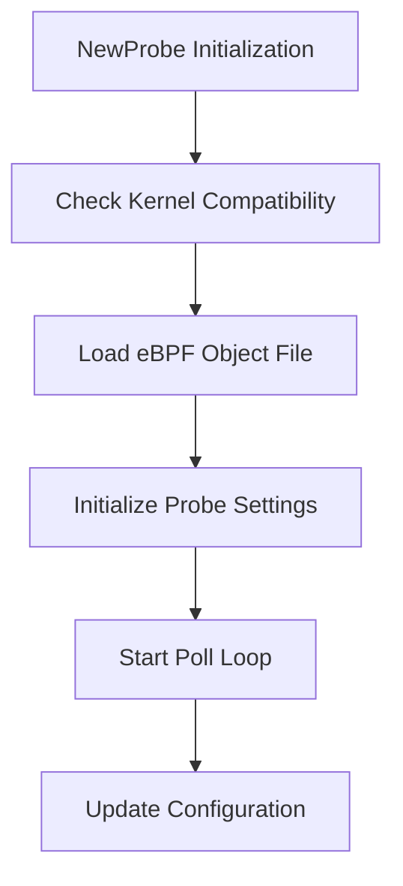

This document will cover the NewProbe Initialization Flow, which includes:

1. Checking Kernel Compatibility
2. Loading the eBPF Object File
3. Initializing Probe Settings
4. Starting the Poll Loop
5. Updating Configuration

Technical document: <SwmLink doc-title="NewProbe Initialization Flow">[NewProbe Initialization Flow](/.swm/newprobe-initialization-flow.4zt307vl.sw.md)</SwmLink>

# [Checking Kernel Compatibility](https://app.swimm.io/repos/Z2l0aHViJTNBJTNBZGF0YWRvZy1hZ2VudCUzQSUzQVN3aW1tLURlbW8=/docs/4zt307vl#newprobe-initialization)

The first step in the NewProbe initialization flow is to check if the kernel version is compatible with the eBPF probe. This ensures that the probe can function correctly on the system. If the kernel version is not compatible, the initialization process is halted, and an error is returned. This step is crucial for maintaining system stability and ensuring that the probe can collect accurate telemetry data.

# [Loading the eBPF Object File](https://app.swimm.io/repos/Z2l0aHViJTNBJTNBZGF0YWRvZy1hZ2VudCUzQSUzQVN3aW1tLURlbW8=/docs/4zt307vl#newprobe-initialization)

Once kernel compatibility is confirmed, the appropriate eBPF object file is loaded. The selection of the object file depends on the debug configuration. If debugging is enabled, a debug-specific eBPF object file is loaded. This step ensures that the correct eBPF program is used for telemetry recording, which is essential for accurate monitoring and analysis.

# [Initializing Probe Settings](https://app.swimm.io/repos/Z2l0aHViJTNBJTNBZGF0YWRvZy1hZ2VudCUzQSUzQVN3aW1tLURlbW8=/docs/4zt307vl#newprobe-initialization)

After loading the eBPF object file, various probe settings are initialized. This includes enabling kernel eBPF stats and setting buffer size limits. These settings are crucial for the proper functioning of the eBPF program, ensuring that it can collect and report telemetry data efficiently. Proper initialization of these settings helps in optimizing the performance and accuracy of the telemetry data collected.

# [Starting the Poll Loop](https://app.swimm.io/repos/Z2l0aHViJTNBJTNBZGF0YWRvZy1hZ2VudCUzQSUzQVN3aW1tLURlbW8=/docs/4zt307vl#starting-the-poll-loop)

The poll loop is started to continuously check for updates. This is done in a separate process to ensure that the main execution flow is not blocked. The poll loop is responsible for periodically checking for configuration updates and applying them as needed. This step ensures that the system remains up-to-date with the latest configurations, which is essential for maintaining optimal performance and security.

# [Updating Configuration](https://app.swimm.io/repos/Z2l0aHViJTNBJTNBZGF0YWRvZy1hZ2VudCUzQSUzQVN3aW1tLURlbW8=/docs/4zt307vl#updating-configuration)

The update process involves requesting configuration updates from the agent via a secure communication channel. Once the updates are received, they are applied, and any registered listeners are informed of the state changes. This step ensures that the client's configuration is always current, which is vital for the accurate functioning of the eBPF probe and the overall system.

&nbsp;

*This is an auto-generated document by Swimm AI 🌊 and has not yet been verified by a human*

<SwmMeta version="3.0.0" repo-id="Z2l0aHViJTNBJTNBZGF0YWRvZy1hZ2VudCUzQSUzQVN3aW1tLURlbW8=" repo-name="datadog-agent">Powered by [Swimm](/)</SwmMeta>
