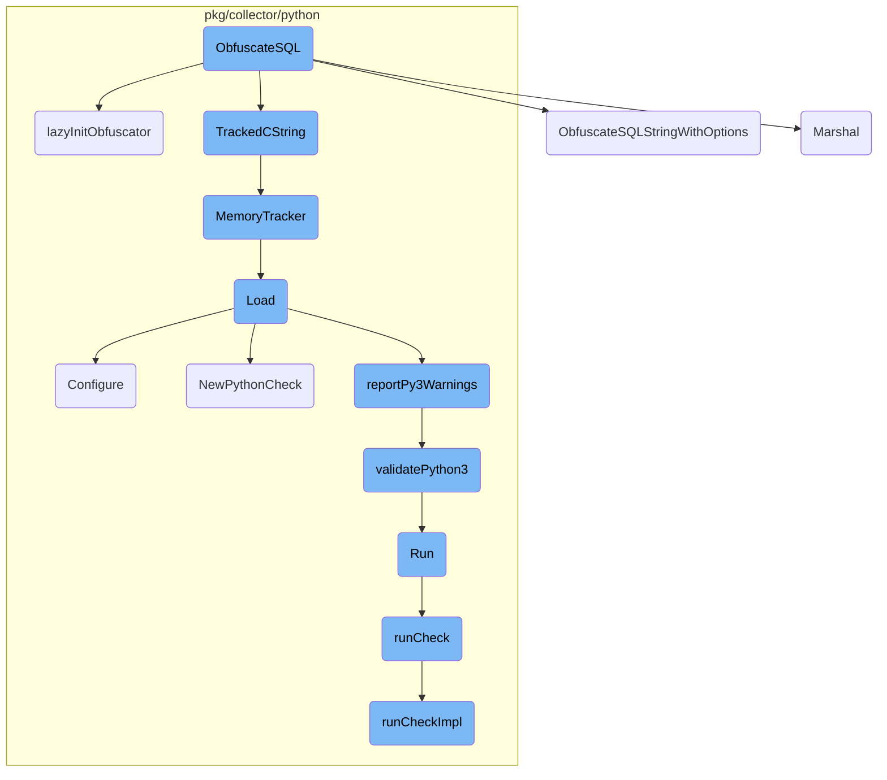
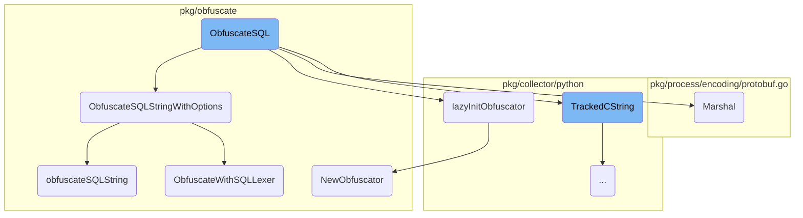
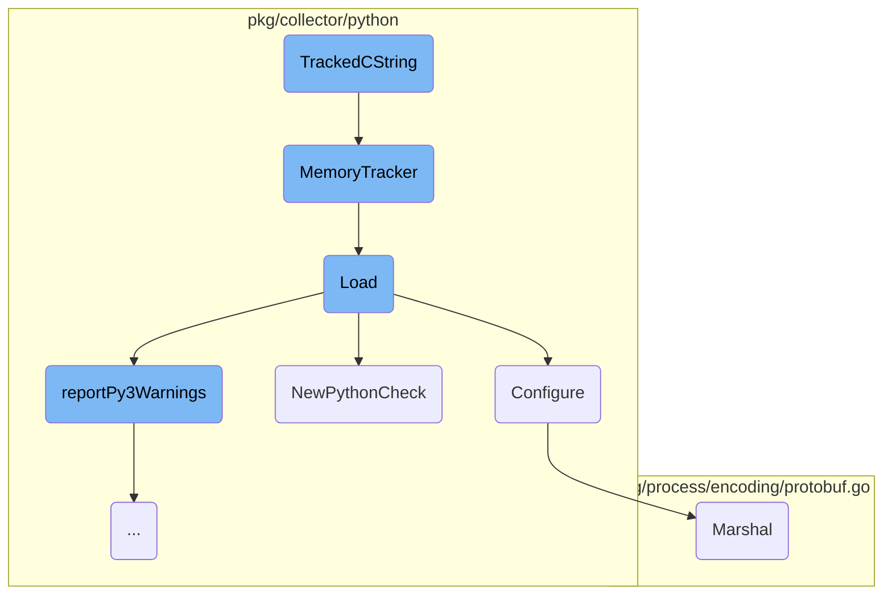
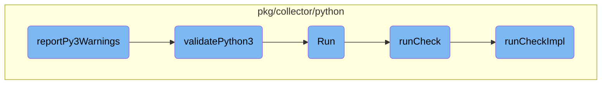

In this document, we will explain the process of obfuscating SQL queries using the <SwmToken path="pkg/collector/python/datadog_agent.go" pos="290:2:2" line-data="// ObfuscateSQL obfuscates &amp; normalizes the provided SQL query, writing the error into errResult if the operation">`ObfuscateSQL`</SwmToken> function. The process involves initializing the obfuscator, converting SQL queries to Go strings, and applying various obfuscation techniques based on provided options.

The flow starts with the <SwmToken path="pkg/collector/python/datadog_agent.go" pos="290:2:2" line-data="// ObfuscateSQL obfuscates &amp; normalizes the provided SQL query, writing the error into errResult if the operation">`ObfuscateSQL`</SwmToken> function, which takes a raw SQL query and optional configuration options. It converts these inputs to Go strings and initializes the obfuscator using the <SwmToken path="pkg/collector/python/datadog_agent.go" pos="212:2:2" line-data="// lazyInitObfuscator initializes the obfuscator the first time it is used. We can&#39;t initialize during the package init">`lazyInitObfuscator`</SwmToken> function. The obfuscator then processes the query based on the provided options, such as removing comments and redacting sensitive information. The result is an obfuscated query string that hides sensitive data while retaining the query's structure.

Here is a high level diagram of the flow, showing only the most important functions:



# Flow drill down

First, we'll zoom into this section of the flow:



<SwmSnippet path="/pkg/collector/python/datadog_agent.go" line="290">

---

## <SwmToken path="pkg/collector/python/datadog_agent.go" pos="290:2:2" line-data="// ObfuscateSQL obfuscates &amp; normalizes the provided SQL query, writing the error into errResult if the operation">`ObfuscateSQL`</SwmToken>

The <SwmToken path="pkg/collector/python/datadog_agent.go" pos="290:2:2" line-data="// ObfuscateSQL obfuscates &amp; normalizes the provided SQL query, writing the error into errResult if the operation">`ObfuscateSQL`</SwmToken> function is responsible for obfuscating and normalizing SQL queries. It takes a raw SQL query and optional configuration options, converts them to Go strings, and then uses the <SwmToken path="pkg/collector/python/datadog_agent.go" pos="306:8:8" line-data="	obfuscatedQuery, err := lazyInitObfuscator().ObfuscateSQLStringWithOptions(s, &amp;obfuscate.SQLConfig{">`lazyInitObfuscator`</SwmToken> function to initialize the obfuscator. The obfuscator then processes the query based on the provided options, and the result is returned as an obfuscated query string.

```go
// ObfuscateSQL obfuscates & normalizes the provided SQL query, writing the error into errResult if the operation
// fails. An optional configuration may be passed to change the behavior of the obfuscator.
//
//export ObfuscateSQL
func ObfuscateSQL(rawQuery, opts *C.char, errResult **C.char) *C.char {
	optStr := C.GoString(opts)
	if optStr == "" {
		// ensure we have a valid JSON string before unmarshalling
		optStr = "{}"
	}
	var sqlOpts sqlConfig
	if err := json.Unmarshal([]byte(optStr), &sqlOpts); err != nil {
		log.Errorf("Failed to unmarshal obfuscation options: %s", err.Error())
		*errResult = TrackedCString(err.Error())
	}
	s := C.GoString(rawQuery)
	obfuscatedQuery, err := lazyInitObfuscator().ObfuscateSQLStringWithOptions(s, &obfuscate.SQLConfig{
		DBMS:                          sqlOpts.DBMS,
		TableNames:                    sqlOpts.TableNames,
		CollectCommands:               sqlOpts.CollectCommands,
		CollectComments:               sqlOpts.CollectComments,
```

---

</SwmSnippet>

<SwmSnippet path="/pkg/obfuscate/sql.go" line="297">

---

## <SwmToken path="pkg/obfuscate/sql.go" pos="297:2:2" line-data="// ObfuscateSQLStringWithOptions accepts an optional SQLOptions to change the behavior of the obfuscator">`ObfuscateSQLStringWithOptions`</SwmToken>

The <SwmToken path="pkg/obfuscate/sql.go" pos="297:2:2" line-data="// ObfuscateSQLStringWithOptions accepts an optional SQLOptions to change the behavior of the obfuscator">`ObfuscateSQLStringWithOptions`</SwmToken> method allows for the obfuscation of SQL queries with specific options. It checks if an obfuscation mode is specified and uses the <SwmToken path="pkg/obfuscate/sql.go" pos="304:5:5" line-data="		return o.ObfuscateWithSQLLexer(in, opts)">`ObfuscateWithSQLLexer`</SwmToken> method if so. Otherwise, it attempts to retrieve the obfuscated query from a cache or processes it using the <SwmToken path="pkg/obfuscate/sql.go" pos="310:10:10" line-data="	oq, err := o.obfuscateSQLString(in, opts)">`obfuscateSQLString`</SwmToken> method.

```go
// ObfuscateSQLStringWithOptions accepts an optional SQLOptions to change the behavior of the obfuscator
// to quantize and obfuscate the given input SQL query string. Quantization removes some elements such as comments
// and aliases and obfuscation attempts to hide sensitive information in strings and numbers by redacting them.
func (o *Obfuscator) ObfuscateSQLStringWithOptions(in string, opts *SQLConfig) (*ObfuscatedQuery, error) {
	if opts.ObfuscationMode != "" {
		// If obfuscation mode is specified, we will use go-sqllexer pkg
		// to obfuscate (and normalize) the query.
		return o.ObfuscateWithSQLLexer(in, opts)
	}

	if v, ok := o.queryCache.Get(in); ok {
		return v.(*ObfuscatedQuery), nil
	}
	oq, err := o.obfuscateSQLString(in, opts)
	if err != nil {
		return oq, err
	}
	o.queryCache.Set(in, oq, oq.Cost())
	return oq, nil
}
```

---

</SwmSnippet>

<SwmSnippet path="/pkg/collector/python/datadog_agent.go" line="212">

---

## <SwmToken path="pkg/collector/python/datadog_agent.go" pos="212:2:2" line-data="// lazyInitObfuscator initializes the obfuscator the first time it is used. We can&#39;t initialize during the package init">`lazyInitObfuscator`</SwmToken>

The <SwmToken path="pkg/collector/python/datadog_agent.go" pos="212:2:2" line-data="// lazyInitObfuscator initializes the obfuscator the first time it is used. We can&#39;t initialize during the package init">`lazyInitObfuscator`</SwmToken> function initializes the obfuscator the first time it is used. It reads the obfuscation configuration from <SwmToken path="pkg/collector/python/datadog_agent.go" pos="213:12:14" line-data="// because the obfuscator depends on config.Datadog and it isn&#39;t guaranteed to be initialized during package init, but">`config.Datadog`</SwmToken> and creates a new obfuscator instance with the specified settings.

```go
// lazyInitObfuscator initializes the obfuscator the first time it is used. We can't initialize during the package init
// because the obfuscator depends on config.Datadog and it isn't guaranteed to be initialized during package init, but
// will definitely be initialized by the time one of the python checks runs
func lazyInitObfuscator() *obfuscate.Obfuscator {
	obfuscatorLoader.Do(func() {
		var cfg obfuscate.Config
		if err := config.Datadog().UnmarshalKey("apm_config.obfuscation", &cfg); err != nil {
			log.Errorf("Failed to unmarshal apm_config.obfuscation: %s", err.Error())
			cfg = obfuscate.Config{}
		}
		if !cfg.SQLExecPlan.Enabled {
			cfg.SQLExecPlan = defaultSQLPlanObfuscateSettings
		}
		if !cfg.SQLExecPlanNormalize.Enabled {
			cfg.SQLExecPlanNormalize = defaultSQLPlanNormalizeSettings
		}
		if !cfg.Mongo.Enabled {
			cfg.Mongo = defaultMongoObfuscateSettings
		}
		obfuscator = obfuscate.NewObfuscator(cfg)
	})
```

---

</SwmSnippet>

<SwmSnippet path="/pkg/process/encoding/protobuf.go" line="21">

---

## Marshal

The <SwmToken path="pkg/process/encoding/protobuf.go" pos="21:2:2" line-data="// Marshal serializes stats by PID into bytes">`Marshal`</SwmToken> method serializes process statistics by PID into bytes. It creates a payload with the statistics and uses the <SwmToken path="pkg/process/encoding/protobuf.go" pos="36:8:10" line-data="	buf, err := proto.Marshal(payload)">`proto.Marshal`</SwmToken> function to convert it into a byte array.

```go
// Marshal serializes stats by PID into bytes
func (protoSerializer) Marshal(stats map[int32]*procutil.StatsWithPerm) ([]byte, error) {
	payload := &model.ProcStatsWithPermByPID{
		StatsByPID: make(map[int32]*model.ProcStatsWithPerm),
	}
	for pid, s := range stats {
		stat := statPool.Get()
		stat.OpenFDCount = s.OpenFdCount
		stat.ReadCount = s.IOStat.ReadCount
		stat.WriteCount = s.IOStat.WriteCount
		stat.ReadBytes = s.IOStat.ReadBytes
		stat.WriteBytes = s.IOStat.WriteBytes
		payload.StatsByPID[pid] = stat
	}

	buf, err := proto.Marshal(payload)
	returnToPool(payload.StatsByPID)
	return buf, err
}
```

---

</SwmSnippet>

<SwmSnippet path="/pkg/obfuscate/obfuscate.go" line="264">

---

## <SwmToken path="pkg/obfuscate/obfuscate.go" pos="264:2:2" line-data="// NewObfuscator creates a new obfuscator">`NewObfuscator`</SwmToken>

The <SwmToken path="pkg/obfuscate/obfuscate.go" pos="264:2:2" line-data="// NewObfuscator creates a new obfuscator">`NewObfuscator`</SwmToken> function creates a new obfuscator instance with the provided configuration. It sets up various obfuscation settings and initializes caches and loggers.

```go
// NewObfuscator creates a new obfuscator
func NewObfuscator(cfg Config) *Obfuscator {
	if cfg.Logger == nil {
		cfg.Logger = noopLogger{}
	}
	o := Obfuscator{
		opts:              &cfg,
		queryCache:        newMeasuredCache(cacheOptions{On: cfg.SQL.Cache, Statsd: cfg.Statsd}),
		sqlLiteralEscapes: atomic.NewBool(false),
		log:               cfg.Logger,
	}
	if cfg.ES.Enabled {
		o.es = newJSONObfuscator(&cfg.ES, &o)
	}
	if cfg.OpenSearch.Enabled {
		o.openSearch = newJSONObfuscator(&cfg.OpenSearch, &o)
	}
	if cfg.Mongo.Enabled {
		o.mongo = newJSONObfuscator(&cfg.Mongo, &o)
	}
	if cfg.SQLExecPlan.Enabled {
```

---

</SwmSnippet>

<SwmSnippet path="/pkg/obfuscate/sql.go" line="318">

---

## <SwmToken path="pkg/obfuscate/sql.go" pos="318:9:9" line-data="func (o *Obfuscator) obfuscateSQLString(in string, opts *SQLConfig) (*ObfuscatedQuery, error) {">`obfuscateSQLString`</SwmToken>

The <SwmToken path="pkg/obfuscate/sql.go" pos="318:9:9" line-data="func (o *Obfuscator) obfuscateSQLString(in string, opts *SQLConfig) (*ObfuscatedQuery, error) {">`obfuscateSQLString`</SwmToken> method processes the SQL query string to obfuscate sensitive information. It uses a tokenizer to parse the query and attempts to obfuscate it, retrying with different escape settings if necessary.

```go
func (o *Obfuscator) obfuscateSQLString(in string, opts *SQLConfig) (*ObfuscatedQuery, error) {
	lesc := o.useSQLLiteralEscapes()
	tok := NewSQLTokenizer(in, lesc, opts)
	out, err := attemptObfuscation(tok)
	if err != nil && tok.SeenEscape() {
		// If the tokenizer failed, but saw an escape character in the process,
		// try again treating escapes differently
		tok = NewSQLTokenizer(in, !lesc, opts)
		if out, err2 := attemptObfuscation(tok); err2 == nil {
			// If the second attempt succeeded, change the default behavior so that
			// on the next run we get it right in the first run.
			o.setSQLLiteralEscapes(!lesc)
			return out, nil
		}
	}
	return out, err
}
```

---

</SwmSnippet>

<SwmSnippet path="/pkg/obfuscate/sql.go" line="426">

---

## <SwmToken path="pkg/obfuscate/sql.go" pos="426:2:2" line-data="// ObfuscateWithSQLLexer obfuscates the given SQL query using the go-sqllexer package.">`ObfuscateWithSQLLexer`</SwmToken>

The <SwmToken path="pkg/obfuscate/sql.go" pos="426:2:2" line-data="// ObfuscateWithSQLLexer obfuscates the given SQL query using the go-sqllexer package.">`ObfuscateWithSQLLexer`</SwmToken> method uses the <SwmToken path="pkg/obfuscate/sql.go" pos="426:18:20" line-data="// ObfuscateWithSQLLexer obfuscates the given SQL query using the go-sqllexer package.">`go-sqllexer`</SwmToken> package to obfuscate SQL queries. It supports different obfuscation modes, such as obfuscate-only, normalize-only, and obfuscate-and-normalize, and processes the query accordingly.

```go
// ObfuscateWithSQLLexer obfuscates the given SQL query using the go-sqllexer package.
// If ObfuscationMode is set to ObfuscateOnly, the query will be obfuscated without normalizing it.
func (o *Obfuscator) ObfuscateWithSQLLexer(in string, opts *SQLConfig) (*ObfuscatedQuery, error) {
	if opts.ObfuscationMode != NormalizeOnly && opts.ObfuscationMode != ObfuscateOnly && opts.ObfuscationMode != ObfuscateAndNormalize {
		return nil, fmt.Errorf("invalid obfuscation mode: %s", opts.ObfuscationMode)
	}

	var obfuscator *sqllexer.Obfuscator

	if opts.ObfuscationMode == ObfuscateOnly || opts.ObfuscationMode == ObfuscateAndNormalize {
		obfuscator = sqllexer.NewObfuscator(
			sqllexer.WithReplaceDigits(opts.ReplaceDigits),
			sqllexer.WithDollarQuotedFunc(opts.DollarQuotedFunc),
			sqllexer.WithReplacePositionalParameter(!opts.KeepPositionalParameter),
			sqllexer.WithReplaceBoolean(!opts.KeepBoolean),
			sqllexer.WithReplaceNull(!opts.KeepNull),
		)
	}

	if opts.ObfuscationMode == ObfuscateOnly {
		// Obfuscate the query without normalizing it.
```

---

</SwmSnippet>

Now, lets zoom into this section of the flow:



<SwmSnippet path="/pkg/collector/python/memory.go" line="117">

---

## <SwmToken path="pkg/collector/python/memory.go" pos="117:2:2" line-data="func TrackedCString(str string) *C.char {">`TrackedCString`</SwmToken>

The function <SwmToken path="pkg/collector/python/memory.go" pos="117:2:2" line-data="func TrackedCString(str string) *C.char {">`TrackedCString`</SwmToken> converts a Go string to a C string and optionally tracks its memory allocation if memory tracking is enabled. This is crucial for managing memory usage and preventing leaks when interfacing with C code.

```go
func TrackedCString(str string) *C.char {
	cstr := C.CString(str)

	// TODO(memory-tracking): track the origin of the string (for example check name)
	if config.Datadog().GetBool("memtrack_enabled") {
		MemoryTracker(unsafe.Pointer(cstr), C.size_t(len(str)+1), C.DATADOG_AGENT_RTLOADER_ALLOCATION)
	}

	return cstr
}
```

---

</SwmSnippet>

<SwmSnippet path="/pkg/collector/python/memory.go" line="72">

---

## <SwmToken path="pkg/collector/python/memory.go" pos="72:2:2" line-data="func MemoryTracker(ptr unsafe.Pointer, sz C.size_t, op C.rtloader_mem_ops_t) {">`MemoryTracker`</SwmToken>

The function <SwmToken path="pkg/collector/python/memory.go" pos="72:2:2" line-data="func MemoryTracker(ptr unsafe.Pointer, sz C.size_t, op C.rtloader_mem_ops_t) {">`MemoryTracker`</SwmToken> is responsible for tracking memory allocations and deallocations. It logs memory operations and updates various metrics to monitor memory usage, which helps in identifying and debugging memory-related issues.

```go
func MemoryTracker(ptr unsafe.Pointer, sz C.size_t, op C.rtloader_mem_ops_t) {
	// run sync for reliability reasons

	// This check looks redundant since the log level is also checked in pkg/util/log,
	// but from profiling, even passing these vars through as arguments allocates to the heap.
	// This is an optimization to avoid even evaluating the `Tracef` call if the trace log
	// level is not enabled.
	if log.ShouldLog(seelog.TraceLvl) {
		log.Tracef("Memory Tracker - ptr: %v, sz: %v, op: %v", ptr, sz, op)
	}
	switch op {
	case C.DATADOG_AGENT_RTLOADER_ALLOCATION:
		pointerCache.Store(ptr, sz)
		allocations.Add(1)
		tlmAllocations.Inc()
		allocatedBytes.Add(int64(sz))
		tlmAllocatedBytes.Add(float64(sz))
		inuseBytes.Add(int64(sz))
		tlmInuseBytes.Set(float64(inuseBytes.Value()))

	case C.DATADOG_AGENT_RTLOADER_FREE:
```

---

</SwmSnippet>

<SwmSnippet path="/pkg/collector/python/loader.go" line="112">

---

## Load

The <SwmToken path="pkg/collector/python/loader.go" pos="112:9:9" line-data="func (cl *PythonCheckLoader) Load(senderManager sender.SenderManager, config integration.Config, instance integration.Data) (check.Check, error) {">`Load`</SwmToken> function attempts to import a Python module, find subclasses of the <SwmToken path="rtloader/test/python/datadog_checks/base/checks/__init__.py" pos="2:2:2" line-data="class AgentCheck(object):  # noqa: UP004">`AgentCheck`</SwmToken> class, and return the corresponding check. It handles <SwmToken path="pkg/collector/python/loader.go" pos="127:3:5" line-data="	// Platform-specific preparation">`Platform-specific`</SwmToken> preparations, module loading, and version checking, ensuring that the correct Python environment and dependencies are set up.

```go
func (cl *PythonCheckLoader) Load(senderManager sender.SenderManager, config integration.Config, instance integration.Data) (check.Check, error) {
	if rtloader == nil {
		return nil, fmt.Errorf("python is not initialized")
	}
	moduleName := config.Name
	// FastDigest is used as check id calculation does not account for tags order
	configDigest := config.FastDigest()

	// Lock the GIL
	glock, err := newStickyLock()
	if err != nil {
		return nil, err
	}
	defer glock.unlock()

	// Platform-specific preparation
	if !agentConfig.Datadog().GetBool("win_skip_com_init") {
		log.Debugf("Performing platform loading prep")
		err = platformLoaderPrep()
		if err != nil {
			return nil, err
```

---

</SwmSnippet>

<SwmSnippet path="/pkg/collector/python/check.go" line="239">

---

## Configure

The <SwmToken path="pkg/collector/python/check.go" pos="239:9:9" line-data="func (c *PythonCheck) Configure(senderManager sender.SenderManager, integrationConfigDigest uint64, data integration.Data, initConfig integration.Data, source string) error {">`Configure`</SwmToken> function sets up a Python check using YAML data. It generates a check ID, sets service options, and configures memory tracking for the check's initialization and instance data. This function ensures that the check is properly initialized and ready to run.

```go
func (c *PythonCheck) Configure(senderManager sender.SenderManager, integrationConfigDigest uint64, data integration.Data, initConfig integration.Data, source string) error {
	// Generate check ID
	c.id = checkid.BuildID(c.String(), integrationConfigDigest, data, initConfig)

	commonGlobalOptions := integration.CommonGlobalConfig{}
	if err := yaml.Unmarshal(initConfig, &commonGlobalOptions); err != nil {
		log.Errorf("invalid init_config section for check %s: %s", string(c.id), err)
		return err
	}

	// Set service for this check
	if len(commonGlobalOptions.Service) > 0 {
		s, err := c.senderManager.GetSender(c.id)
		if err != nil {
			log.Errorf("failed to retrieve a sender for check %s: %s", string(c.id), err)
		} else {
			s.SetCheckService(commonGlobalOptions.Service)
		}
	}

	commonOptions := integration.CommonInstanceConfig{}
```

---

</SwmSnippet>

<SwmSnippet path="/pkg/collector/python/check.go" line="69">

---

## <SwmToken path="pkg/collector/python/check.go" pos="69:2:2" line-data="func NewPythonCheck(senderManager sender.SenderManager, name string, class *C.rtloader_pyobject_t) (*PythonCheck, error) {">`NewPythonCheck`</SwmToken>

The <SwmToken path="pkg/collector/python/check.go" pos="69:2:2" line-data="func NewPythonCheck(senderManager sender.SenderManager, name string, class *C.rtloader_pyobject_t) (*PythonCheck, error) {">`NewPythonCheck`</SwmToken> function creates a new instance of <SwmToken path="pkg/collector/python/check.go" pos="69:26:26" line-data="func NewPythonCheck(senderManager sender.SenderManager, name string, class *C.rtloader_pyobject_t) (*PythonCheck, error) {">`PythonCheck`</SwmToken>. It initializes the check with default settings and ensures that the Python class reference is properly managed. This function is essential for creating and managing Python checks within the agent.

```go
func NewPythonCheck(senderManager sender.SenderManager, name string, class *C.rtloader_pyobject_t) (*PythonCheck, error) {
	glock, err := newStickyLock()
	if err != nil {
		return nil, err
	}

	C.rtloader_incref(rtloader, class) // own the ref
	glock.unlock()

	pyCheck := &PythonCheck{
		senderManager: senderManager,
		ModuleName:    name,
		class:         class,
		interval:      defaults.DefaultCheckInterval,
		lastWarnings:  []error{},
		telemetry:     utils.IsCheckTelemetryEnabled(name, config.Datadog()),
	}
	runtime.SetFinalizer(pyCheck, pythonCheckFinalizer)

	return pyCheck, nil
}
```

---

</SwmSnippet>

Now, lets zoom into this section of the flow:



<SwmSnippet path="/pkg/collector/python/loader.go" line="262">

---

## <SwmToken path="pkg/collector/python/loader.go" pos="262:2:2" line-data="// reportPy3Warnings runs the a7 linter and exports the result in both expvar">`reportPy3Warnings`</SwmToken>

The function <SwmToken path="pkg/collector/python/loader.go" pos="262:2:2" line-data="// reportPy3Warnings runs the a7 linter and exports the result in both expvar">`reportPy3Warnings`</SwmToken> is responsible for running the <SwmToken path="pkg/collector/python/loader.go" pos="262:8:8" line-data="// reportPy3Warnings runs the a7 linter and exports the result in both expvar">`a7`</SwmToken> linter and exporting the results. It first checks if the check has already been linted to avoid redundant operations. If the check has not been linted, it proceeds to run the linter. If the Python version is 3, it sets the status to <SwmToken path="pkg/collector/python/loader.go" pos="58:1:1" line-data="	a7TagPython3   = &quot;python3&quot; // Already running on python3, linting is disabled">`a7TagPython3`</SwmToken> and the metric value to <SwmToken path="pkg/collector/python/loader.go" pos="286:5:7" line-data="			metricValue = 1.0">`1.0`</SwmToken>. Otherwise, it runs the <SwmToken path="pkg/collector/python/py3_checker.go" pos="35:2:2" line-data="// validatePython3 checks that a check can run on python 3.">`validatePython3`</SwmToken> function to perform linting, handling any warnings or errors that arise. The results are then added to the aggregator to be sent on every flush.

```go
// reportPy3Warnings runs the a7 linter and exports the result in both expvar
// and the aggregator (as extra series)
func reportPy3Warnings(checkName string, checkFilePath string) {
	// check if the check has already been linted
	py3LintedLock.Lock()
	_, found := py3Linted[checkName]
	if found {
		py3LintedLock.Unlock()
		return
	}
	py3Linted[checkName] = struct{}{}
	py3LintedLock.Unlock()

	status := a7TagUnknown
	metricValue := 0.0
	if checkFilePath != "" {
		// __file__ return the .pyc file path
		if strings.HasSuffix(checkFilePath, ".pyc") {
			checkFilePath = checkFilePath[:len(checkFilePath)-1]
		}

```

---

</SwmSnippet>

<SwmSnippet path="/pkg/collector/python/py3_checker.go" line="35">

---

## <SwmToken path="pkg/collector/python/py3_checker.go" pos="35:2:2" line-data="// validatePython3 checks that a check can run on python 3.">`validatePython3`</SwmToken>

The function <SwmToken path="pkg/collector/python/py3_checker.go" pos="35:2:2" line-data="// validatePython3 checks that a check can run on python 3.">`validatePython3`</SwmToken> checks if a module can run on Python 3 by executing the pylint tool with specific parameters. It captures the output and parses any warnings, returning them as a list of strings. This function is CPU and memory-intensive, so it is designed to run only one instance at a time to avoid resource spikes.

```go
// validatePython3 checks that a check can run on python 3.
//
//nolint:revive // TODO(AML) Fix revive linter
func validatePython3(moduleName string, modulePath string) ([]string, error) {
	ctx, cancel := context.WithTimeout(context.Background(), linterTimeout)
	defer cancel()

	cmd := exec.CommandContext(ctx, pythonBinPath, "-m", "pylint", "-f", "json", "--py3k", "-d", "W1618", "--persistent", "no", "--exit-zero", modulePath)

	stdout := bytes.Buffer{}
	stderr := bytes.Buffer{}
	cmd.Stdout = &stdout
	cmd.Stderr = &stderr

	if err := cmd.Run(); err != nil {
		return nil, fmt.Errorf("error running the linter on (%s): %s", err, stderr.String())
	}

	res := []string{}
	if stdout.Len() == 0 {
		// No warning
```

---

</SwmSnippet>

<SwmSnippet path="/pkg/collector/python/check.go" line="138">

---

## Run

The <SwmToken path="pkg/collector/python/check.go" pos="138:2:2" line-data="// Run a Python check">`Run`</SwmToken> method of the <SwmToken path="pkg/collector/python/check.go" pos="139:6:6" line-data="func (c *PythonCheck) Run() error {">`PythonCheck`</SwmToken> struct calls the <SwmToken path="pkg/collector/python/check.go" pos="140:5:5" line-data="	return c.runCheck(true)">`runCheck`</SwmToken> method with the <SwmToken path="pkg/collector/python/check.go" pos="91:11:11" line-data="func (c *PythonCheck) runCheckImpl(commitMetrics bool) error {">`commitMetrics`</SwmToken> parameter set to true. This initiates the process of running a Python check.

```go
// Run a Python check
func (c *PythonCheck) Run() error {
	return c.runCheck(true)
}
```

---

</SwmSnippet>

<SwmSnippet path="/pkg/collector/python/check.go" line="128">

---

## <SwmToken path="pkg/collector/python/check.go" pos="128:9:9" line-data="func (c *PythonCheck) runCheck(commitMetrics bool) error {">`runCheck`</SwmToken>

The <SwmToken path="pkg/collector/python/check.go" pos="128:9:9" line-data="func (c *PythonCheck) runCheck(commitMetrics bool) error {">`runCheck`</SwmToken> method sets up a context and uses the <SwmToken path="pkg/collector/python/check.go" pos="132:1:1" line-data="	pprof.Do(ctx, pprof.Labels(&quot;check_id&quot;, idStr), func(ctx context.Context) {">`pprof`</SwmToken> package to label the check execution for profiling. It then calls the <SwmToken path="pkg/collector/python/check.go" pos="133:7:7" line-data="		err = c.runCheckImpl(commitMetrics)">`runCheckImpl`</SwmToken> method to perform the actual check execution.

```go
func (c *PythonCheck) runCheck(commitMetrics bool) error {
	ctx := context.Background()
	var err error
	idStr := string(c.id)
	pprof.Do(ctx, pprof.Labels("check_id", idStr), func(ctx context.Context) {
		err = c.runCheckImpl(commitMetrics)
	})
	return err
}
```

---

</SwmSnippet>

<SwmSnippet path="/pkg/collector/python/check.go" line="91">

---

## <SwmToken path="pkg/collector/python/check.go" pos="91:9:9" line-data="func (c *PythonCheck) runCheckImpl(commitMetrics bool) error {">`runCheckImpl`</SwmToken>

The <SwmToken path="pkg/collector/python/check.go" pos="91:9:9" line-data="func (c *PythonCheck) runCheckImpl(commitMetrics bool) error {">`runCheckImpl`</SwmToken> method locks the Global Interpreter Lock (GIL) and runs the Python check using the <SwmToken path="pkg/collector/python/check.go" pos="101:9:9" line-data="	cResult := C.run_check(rtloader, c.instance)">`rtloader`</SwmToken>. It handles any errors that occur during execution and commits the metrics if required. It also captures any warnings generated during the check and adds them to the check's struct.

```go
func (c *PythonCheck) runCheckImpl(commitMetrics bool) error {
	// Lock the GIL and release it at the end of the run
	gstate, err := newStickyLock()
	if err != nil {
		return err
	}
	defer gstate.unlock()

	log.Debugf("Running python check %s (version: '%s', id: '%s')", c.ModuleName, c.version, c.id)

	cResult := C.run_check(rtloader, c.instance)
	if cResult == nil {
		if err := getRtLoaderError(); err != nil {
			return err
		}
		return fmt.Errorf("An error occurred while running python check %s", c.ModuleName)
	}
	defer C.rtloader_free(rtloader, unsafe.Pointer(cResult))

	if commitMetrics {
		s, err := c.senderManager.GetSender(c.ID())
```

---

</SwmSnippet>

&nbsp;

*This is an auto-generated document by Swimm AI 🌊 and has not yet been verified by a human*

<SwmMeta version="3.0.0" repo-id="Z2l0aHViJTNBJTNBZGF0YWRvZy1hZ2VudCUzQSUzQVN3aW1tLURlbW8=" repo-name="datadog-agent"><sup>Powered by [Swimm](/)</sup></SwmMeta>
