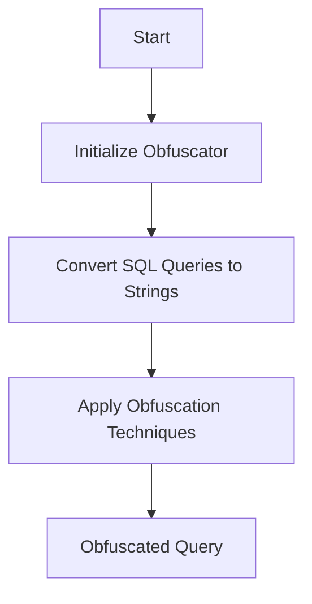

This document will cover the process of obfuscating SQL queries, which includes:

1. Initializing the obfuscator
2. Converting SQL queries to strings
3. Applying obfuscation techniques.

Technical document: <SwmLink doc-title="Obfuscating SQL Queries">[Obfuscating SQL Queries](/.swm/obfuscating-sql-queries.925otsjk.sw.md)</SwmLink>

# [Initializing the obfuscator](https://app.swimm.io/repos/Z2l0aHViJTNBJTNBZGF0YWRvZy1hZ2VudCUzQSUzQVN3aW1tLURlbW8=/docs/925otsjk#lazyinitobfuscator)

The obfuscator is initialized the first time it is used. This is done to ensure that the obfuscator is set up with the correct configuration settings from the Datadog configuration file. This step is crucial because it ensures that the obfuscator has all the necessary settings to properly obfuscate SQL queries. The initialization process reads the obfuscation configuration and creates a new obfuscator instance with the specified settings.

# [Converting SQL queries to strings](https://app.swimm.io/repos/Z2l0aHViJTNBJTNBZGF0YWRvZy1hZ2VudCUzQSUzQVN3aW1tLURlbW8=/docs/925otsjk#obfuscatesql)

The raw SQL query and optional configuration options are converted to strings. This step is necessary because the obfuscator works with string representations of SQL queries. The conversion process ensures that the SQL query is in a format that the obfuscator can process. If the configuration options are not provided, default settings are used.

# [Applying obfuscation techniques](https://app.swimm.io/repos/Z2l0aHViJTNBJTNBZGF0YWRvZy1hZ2VudCUzQSUzQVN3aW1tLURlbW8=/docs/925otsjk#obfuscatesqlstringwithoptions)

Various obfuscation techniques are applied to the SQL query based on the provided options. These techniques include removing comments, redacting sensitive information, and normalizing the query. The goal is to hide sensitive data while retaining the structure of the query. The obfuscator processes the query and returns an obfuscated query string. This step ensures that sensitive information in SQL queries is protected, which is important for maintaining data privacy and security.

&nbsp;

*This is an auto-generated document by Swimm AI 🌊 and has not yet been verified by a human*

<SwmMeta version="3.0.0" repo-id="Z2l0aHViJTNBJTNBZGF0YWRvZy1hZ2VudCUzQSUzQVN3aW1tLURlbW8=" repo-name="datadog-agent">Powered by [Swimm](/)</SwmMeta>
