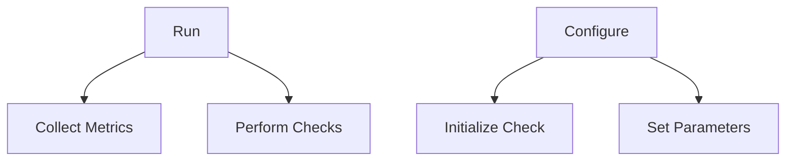

# Oracle Package Overview

The Oracle package provides core checks for Oracle databases. It includes functionalities such as connection handling, custom queries, and metrics collection.

<SwmSnippet path="/pkg/collector/corechecks/oracle/oracle.go" line="78">

---

# Check Type

The <SwmToken path="pkg/collector/corechecks/oracle/oracle.go" pos="79:2:2" line-data="type Check struct {">`Check`</SwmToken> type holds configuration and state information for performing checks on Oracle databases. It includes fields for database connections, custom queries, metrics, and other relevant data.

```go
//nolint:revive // TODO(DBM) Fix revive linter
type Check struct {
	core.CheckBase
	config                                  *config.CheckConfig
	db                                      *sqlx.DB
	dbCustomQueries                         *sqlx.DB
	connection                              *go_ora.Connection
	dbmEnabled                              bool
	agentVersion                            string
	agentHostname                           string
	checkInterval                           float64
	tags                                    []string
	tagsWithoutDbRole                       []string
	configTags                              []string
	tagsString                              string
	cdbName                                 string
	statementMetricsMonotonicCountsPrevious map[StatementMetricsKeyDB]StatementMetricsMonotonicCountDB
	dbHostname                              string
	dbVersion                               string
	driver                                  string
	metricLastRun                           time.Time
```

---

</SwmSnippet>

<SwmSnippet path="/pkg/collector/corechecks/oracle/oracle.go" line="120">

---

# <SwmToken path="pkg/collector/corechecks/oracle/oracle.go" pos="120:2:2" line-data="type vDatabase struct {">`vDatabase`</SwmToken> Type

The <SwmToken path="pkg/collector/corechecks/oracle/oracle.go" pos="120:2:2" line-data="type vDatabase struct {">`vDatabase`</SwmToken> type represents database-specific information retrieved during checks, such as the database name, role, and open mode.

```go
type vDatabase struct {
	Name         string `db:"NAME"`
	Cdb          string `db:"CDB"`
	DatabaseRole string `db:"DATABASE_ROLE"`
	OpenMode     string `db:"OPEN_MODE"`
}
```

---

</SwmSnippet>

# Main Functions

Several main functions handle the core operations within the Oracle package. We will delve into <SwmToken path="pkg/collector/corechecks/oracle/oracle.go" pos="127:2:2" line-data="func handleServiceCheck(c *Check, err error) {">`handleServiceCheck`</SwmToken> and <SwmToken path="pkg/collector/corechecks/oracle/activity.go" pos="138:9:9" line-data="func (c *Check) getSQLRow(SQLID sql.NullString, forceMatchingSignature *string, SQLPlanHashValue *uint64, SQLExecStart sql.NullString) (OracleSQLRow, error) {">`getSQLRow`</SwmToken>.

<SwmSnippet path="/pkg/collector/corechecks/oracle/oracle.go" line="127">

---

## <SwmToken path="pkg/collector/corechecks/oracle/oracle.go" pos="127:2:2" line-data="func handleServiceCheck(c *Check, err error) {">`handleServiceCheck`</SwmToken>

The <SwmToken path="pkg/collector/corechecks/oracle/oracle.go" pos="127:2:2" line-data="func handleServiceCheck(c *Check, err error) {">`handleServiceCheck`</SwmToken> function handles the service check results for Oracle database connections. It retrieves a sender, logs errors if any, and sends the service check status to Datadog.

```go
func handleServiceCheck(c *Check, err error) {
	sender, errSender := c.GetSender()
	if errSender != nil {
		log.Errorf("%s failed to get sender for service check %s", c.logPrompt, err)
	}

	message := ""
	var status servicecheck.ServiceCheckStatus
	if err == nil {
		status = servicecheck.ServiceCheckOK
	} else {
		status = servicecheck.ServiceCheckCritical
		log.Errorf("%s failed to connect: %s", c.logPrompt, err)
	}
	sender.ServiceCheck("oracle.can_connect", status, "", c.tags, message)
	sender.Commit()
}
```

---

</SwmSnippet>

<SwmSnippet path="/pkg/collector/corechecks/oracle/activity.go" line="138">

---

## <SwmToken path="pkg/collector/corechecks/oracle/activity.go" pos="138:9:9" line-data="func (c *Check) getSQLRow(SQLID sql.NullString, forceMatchingSignature *string, SQLPlanHashValue *uint64, SQLExecStart sql.NullString) (OracleSQLRow, error) {">`getSQLRow`</SwmToken>

The <SwmToken path="pkg/collector/corechecks/oracle/activity.go" pos="138:9:9" line-data="func (c *Check) getSQLRow(SQLID sql.NullString, forceMatchingSignature *string, SQLPlanHashValue *uint64, SQLExecStart sql.NullString) (OracleSQLRow, error) {">`getSQLRow`</SwmToken> function converts SQL types to Go native types. It processes SQLID and other parameters to return an <SwmToken path="pkg/collector/corechecks/oracle/activity.go" pos="138:38:38" line-data="func (c *Check) getSQLRow(SQLID sql.NullString, forceMatchingSignature *string, SQLPlanHashValue *uint64, SQLExecStart sql.NullString) (OracleSQLRow, error) {">`OracleSQLRow`</SwmToken> struct.

```go
func (c *Check) getSQLRow(SQLID sql.NullString, forceMatchingSignature *string, SQLPlanHashValue *uint64, SQLExecStart sql.NullString) (OracleSQLRow, error) {
	SQLRow := OracleSQLRow{}
	if SQLID.Valid {
		SQLRow.SQLID = SQLID.String
	} else {
		SQLRow.SQLID = ""
		return SQLRow, nil
	}
```

---

</SwmSnippet>

# Oracle Endpoints

The Oracle package includes several endpoints that manage the execution and configuration of checks.

<SwmSnippet path="/pkg/collector/corechecks/oracle/oracle.go" line="154">

---

## Run

The <SwmToken path="pkg/collector/corechecks/oracle/oracle.go" pos="154:2:2" line-data="// Run executes the check.">`Run`</SwmToken> function executes the Oracle check. It handles the main logic for collecting metrics and performing checks on the Oracle database.

```go
// Run executes the check.
func (c *Check) Run() error {
	var allErrors error
	if c.db == nil {
		db, err := c.Connect()
		if err != nil {
			handleServiceCheck(c, err)
			c.Teardown()
			return err
		}
		if db == nil {
			c.Teardown()
			handleServiceCheck(c, fmt.Errorf("empty connection"))
			return fmt.Errorf("%s empty connection", c.logPrompt)
		}
		c.db = db
	}

	metricIntervalExpired := checkIntervalExpired(&c.metricLastRun, c.config.MetricCollectionInterval)

	if !c.initialized {
```

---

</SwmSnippet>

<SwmSnippet path="/pkg/collector/corechecks/oracle/oracle.go" line="362">

---

## Configure

The <SwmToken path="pkg/collector/corechecks/oracle/oracle.go" pos="362:2:2" line-data="// Configure configures the Oracle check.">`Configure`</SwmToken> function sets up the Oracle check with the necessary configuration. It initializes the check with parameters such as sender manager, integration config, raw instance data, and source.

```go
// Configure configures the Oracle check.
func (c *Check) Configure(senderManager sender.SenderManager, integrationConfigDigest uint64, rawInstance integration.Data, rawInitConfig integration.Data, source string) error {
	var err error
	c.config, err = config.NewCheckConfig(rawInstance, rawInitConfig)
	if err != nil {
		return fmt.Errorf("failed to build check config: %w", err)
	}

	// Must be called before c.CommonConfigure because this integration supports multiple instances
	c.BuildID(integrationConfigDigest, rawInstance, rawInitConfig)

	if err := c.CommonConfigure(senderManager, rawInitConfig, rawInstance, source); err != nil {
		return fmt.Errorf("common configure failed: %s", err)
	}

	c.dbmEnabled = false
	if c.config.DBM {
		c.dbmEnabled = true
	}

	agentVersion, _ := version.Agent()
```

---

</SwmSnippet>

&nbsp;

*This is an auto-generated document by Swimm AI 🌊 and has not yet been verified by a human*

<SwmMeta version="3.0.0" repo-id="Z2l0aHViJTNBJTNBZGF0YWRvZy1hZ2VudCUzQSUzQVN3aW1tLURlbW8=" repo-name="datadog-agent"><sup>Powered by [Swimm](/)</sup></SwmMeta>
