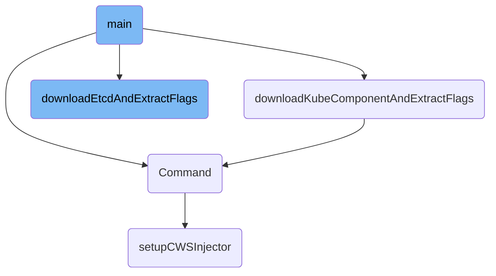

This document explains the orchestration process handled by the main function. It covers the steps involved in setting up the environment, downloading necessary components, and extracting configuration flags.

The process starts by checking the current working directory and validating the provided path. It then determines the system architecture and prints a preamble. The function iterates over Kubernetes components and versions, downloading and extracting flags for each. It also handles etcd versions similarly. Finally, it checks for known flags, sorts them, and prints the component code.

# Flow drill down



<SwmSnippet path="/pkg/compliance/tools/k8s_types_generator/main.go" line="210">

---

## Main Function

The <SwmToken path="pkg/compliance/tools/k8s_types_generator/main.go" pos="210:2:2" line-data="func main() {">`main`</SwmToken> function is responsible for orchestrating the entire process. It first checks the current working directory and validates the provided <SwmToken path="pkg/compliance/tools/k8s_types_generator/main.go" pos="213:9:9" line-data="		fmt.Println(&quot;generator &lt;bindir&gt;&quot;)">`bindir`</SwmToken> path. It then determines the system architecture and prints a preamble. The function iterates over the Kubernetes components and versions, calling <SwmToken path="pkg/compliance/tools/k8s_types_generator/main.go" pos="597:2:2" line-data="func downloadKubeComponentAndExtractFlags(componentName, componentVersion string) *komponent {">`downloadKubeComponentAndExtractFlags`</SwmToken> to download and extract flags for each component. It also handles etcd versions similarly by calling <SwmToken path="pkg/compliance/tools/k8s_types_generator/main.go" pos="526:2:2" line-data="func downloadEtcdAndExtractFlags(componentVersion string) *komponent {">`downloadEtcdAndExtractFlags`</SwmToken>. Finally, it checks for known flags and sorts them before printing the component code.

```go
func main() {
	dir, _ := os.Getwd()
	if len(os.Args) < 2 {
		fmt.Println("generator <bindir>")
		log.Fatal("missing bindir path")
	}
	bindir = filepath.Join(dir, os.Args[1])
	if info, err := os.Stat(bindir); err != nil || !info.IsDir() {
		log.Fatalf("bindir path %s is not a directory", bindir)
	}
	uname, _ := exec.Command("uname", "-m").Output()
	switch string(bytes.TrimSuffix(uname, []byte("\n"))) {
	case "x86_64":
		arch = "amd64"
	case "aarch64":
		arch = "arm64"
	default:
		log.Fatalf("could not resolve arch=%s", uname)
	}

	fmt.Print(preamble)
```

---

</SwmSnippet>

<SwmSnippet path="/pkg/compliance/tools/k8s_types_generator/main.go" line="597">

---

## Downloading Kubernetes Components

The <SwmToken path="pkg/compliance/tools/k8s_types_generator/main.go" pos="597:2:2" line-data="func downloadKubeComponentAndExtractFlags(componentName, componentVersion string) *komponent {">`downloadKubeComponentAndExtractFlags`</SwmToken> function downloads a specified Kubernetes component and extracts its flags. It constructs the download URL based on the component name and version, downloads the binary if it doesn't exist, and changes its permissions. The function then executes the binary with the <SwmToken path="pkg/compliance/tools/k8s_types_generator/main.go" pos="613:13:14" line-data="	cmd := exec.Command(componentBin, &quot;-h&quot;)">`-h`</SwmToken> flag to get the help output, which is scanned to extract configuration flags.

```go
func downloadKubeComponentAndExtractFlags(componentName, componentVersion string) *komponent {
	componentBin := path.Join(bindir, fmt.Sprintf("%s-%s", componentName, componentVersion))
	componentURL := fmt.Sprintf("https://dl.k8s.io/%s/bin/linux/%s/%s",
		componentVersion, arch, componentName)
	if _, err := os.Stat(componentBin); os.IsNotExist(err) {
		fmt.Fprintf(os.Stderr, "downloading %s into %s...", componentURL, componentBin)
		if err := download(componentURL, componentBin); err != nil {
			log.Fatal(err)
		}
		fmt.Fprintf(os.Stderr, "ok\n")
	}

	if err := os.Chmod(componentBin, 0770); err != nil {
		log.Fatal(err)
	}

	cmd := exec.Command(componentBin, "-h")
	out, err := cmd.Output()
	if err != nil {
		log.Fatal(err)
	}
```

---

</SwmSnippet>

<SwmSnippet path="/pkg/compliance/tools/k8s_types_generator/main.go" line="526">

---

## Downloading etcd Components

The <SwmToken path="pkg/compliance/tools/k8s_types_generator/main.go" pos="526:2:2" line-data="func downloadEtcdAndExtractFlags(componentVersion string) *komponent {">`downloadEtcdAndExtractFlags`</SwmToken> function is similar to <SwmToken path="pkg/compliance/tools/k8s_types_generator/main.go" pos="597:2:2" line-data="func downloadKubeComponentAndExtractFlags(componentName, componentVersion string) *komponent {">`downloadKubeComponentAndExtractFlags`</SwmToken> but is specific to etcd components. It constructs the download URL, downloads the tarball, and extracts the etcd binary. The function then changes the binary's permissions and executes it with the <SwmToken path="pkg/compliance/tools/k8s_types_generator/main.go" pos="613:13:14" line-data="	cmd := exec.Command(componentBin, &quot;-h&quot;)">`-h`</SwmToken> flag to get the help output, which is scanned to extract configuration flags.

```go
func downloadEtcdAndExtractFlags(componentVersion string) *komponent {
	const componentName = "etcd"
	componentBin := path.Join(bindir, fmt.Sprintf("%s-%s", componentName, componentVersion))
	componentTar := path.Join(bindir, fmt.Sprintf("%s-%s.tar.gz", componentName, componentVersion))
	componentURL := fmt.Sprintf("https://github.com/etcd-io/etcd/releases/download/%s/etcd-%s-linux-%s.tar.gz",
		componentVersion, componentVersion, arch)
	if _, err := os.Stat(componentBin); os.IsNotExist(err) {
		fmt.Fprintf(os.Stderr, "downloading %s into %s...", componentURL, componentBin)
		if err := download(componentURL, componentTar); err != nil {
			log.Fatal(err)
		}
		t, err := os.Open(componentTar)
		if err != nil {
			log.Fatal(err)
		}
		defer t.Close()
		g, err := gzip.NewReader(t)
		if err != nil {
			log.Fatal(err)
		}
		r := tar.NewReader(g)
```

---

</SwmSnippet>

<SwmSnippet path="/cmd/cws-instrumentation/subcommands/setupcmd/setup.go" line="26">

---

## Command Setup

The <SwmToken path="cmd/cws-instrumentation/subcommands/setupcmd/setup.go" pos="26:2:2" line-data="// Command returns the commands for the setup subcommand">`Command`</SwmToken> function sets up the command for the <SwmToken path="cmd/cws-instrumentation/subcommands/setupcmd/setup.go" pos="26:14:14" line-data="// Command returns the commands for the setup subcommand">`setup`</SwmToken> subcommand. It initializes the command with a description and a required flag for the CWS volume mount path. The function returns a list of commands, including the setup command, which runs the <SwmToken path="cmd/cws-instrumentation/subcommands/setupcmd/setup.go" pos="34:3:3" line-data="			return setupCWSInjector(&amp;params)">`setupCWSInjector`</SwmToken> function.

```go
// Command returns the commands for the setup subcommand
func Command() []*cobra.Command {
	var params setupCliParams

	setupCmd := &cobra.Command{
		Use:   "setup",
		Short: "Copies the cws-instrumentation binary to the CWS volume mount",
		RunE: func(cmd *cobra.Command, args []string) error {
			return setupCWSInjector(&params)
		},
	}

	setupCmd.Flags().StringVar(&params.cwsVolumeMount, flags.CWSVolumeMount, "", "Path to the CWS volume mount")
	_ = setupCmd.MarkFlagRequired(flags.CWSVolumeMount)

	return []*cobra.Command{setupCmd}
}
```

---

</SwmSnippet>

<SwmSnippet path="/cmd/cws-instrumentation/subcommands/setupcmd/setup.go" line="44">

---

## Setting Up CWS Injector

The <SwmToken path="cmd/cws-instrumentation/subcommands/setupcmd/setup.go" pos="44:2:2" line-data="// setupCWSInjector copies the cws-instrumentation binary to the provided target directory">`setupCWSInjector`</SwmToken> function copies the <SwmToken path="cmd/cws-instrumentation/subcommands/setupcmd/setup.go" pos="44:8:10" line-data="// setupCWSInjector copies the cws-instrumentation binary to the provided target directory">`cws-instrumentation`</SwmToken> binary to the specified target directory. It first checks if the target directory exists and is valid. It then resolves the path to the current binary and opens it for reading. The function creates the target file in the destination directory and copies the binary content to it. Finally, it sets the execution permissions on the copied binary.

```go
// setupCWSInjector copies the cws-instrumentation binary to the provided target directory
func setupCWSInjector(params *setupCliParams) error {
	// check if the target directory exists
	targetFileInfo, err := os.Stat(params.cwsVolumeMount)
	if err != nil {
		return fmt.Errorf("couldn't stat target directory: %w", err)
	}
	if !targetFileInfo.IsDir() {
		return fmt.Errorf("\"%s\" must be a directory: %s isn't a valid directory", flags.CWSVolumeMount, params.cwsVolumeMount)
	}

	// fetch the path to the current binary file
	path, err := os.Readlink("/proc/self/exe")
	if err != nil {
		return fmt.Errorf("couldn't resolve the path to the current binary: %w", err)
	}

	// copy the binary to the destination directory
	source, err := os.Open(path)
	if err != nil {
		return fmt.Errorf("couldn't open cws-instrumentation's binary file: %w", err)
```

---

</SwmSnippet>

&nbsp;

*This is an auto-generated document by Swimm AI 🌊 and has not yet been verified by a human*

<SwmMeta version="3.0.0" repo-id="Z2l0aHViJTNBJTNBZGF0YWRvZy1hZ2VudCUzQSUzQVN3aW1tLURlbW8=" repo-name="datadog-agent"><sup>Powered by [Swimm](/)</sup></SwmMeta>
