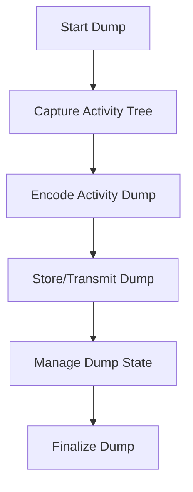

# What is Activity Dump

An Activity Dump captures and stores the activity tree of a workload based on a provided list of tags. This activity tree includes various events and processes that occur within the workload.

<SwmSnippet path="/pkg/security/security_profile/dump/activity_dump.go" line="66">

---

# <SwmToken path="pkg/security/security_profile/dump/activity_dump.go" pos="66:2:2" line-data="// ActivityDump holds the activity tree for the workload defined by the provided list of tags. The encoding described by">`ActivityDump`</SwmToken> Structure

The <SwmToken path="pkg/security/security_profile/dump/activity_dump.go" pos="66:2:2" line-data="// ActivityDump holds the activity tree for the workload defined by the provided list of tags. The encoding described by">`ActivityDump`</SwmToken> structure holds the activity tree for the workload defined by the provided list of tags. It includes various attributes used by the intake and metadata for the dump. The encoding described by the <SwmToken path="pkg/security/security_profile/dump/activity_dump.go" pos="67:5:5" line-data="// the `msg` annotation is used to generate the activity dump file while the encoding described by the `json` annotation">`msg`</SwmToken> annotation is used to generate the activity dump file while the encoding described by the <SwmToken path="pkg/security/security_profile/dump/activity_dump.go" pos="67:39:39" line-data="// the `msg` annotation is used to generate the activity dump file while the encoding described by the `json` annotation">`json`</SwmToken> annotation is used to generate the activity dump metadata sent to the event platform.

```go
// ActivityDump holds the activity tree for the workload defined by the provided list of tags. The encoding described by
// the `msg` annotation is used to generate the activity dump file while the encoding described by the `json` annotation
// is used to generate the activity dump metadata sent to the event platform.
// easyjson:json
type ActivityDump struct {
	sync.Mutex
	state    ActivityDumpStatus
	adm      *ActivityDumpManager
	selector *cgroupModel.WorkloadSelector

	countedByLimiter bool

	// standard attributes used by the intake
	Host    string   `json:"host,omitempty"`
	Service string   `json:"service,omitempty"`
	Source  string   `json:"ddsource,omitempty"`
	Tags    []string `json:"-"`
	DDTags  string   `json:"ddtags,omitempty"`

	ActivityTree    *activity_tree.ActivityTree                      `json:"-"`
	StorageRequests map[config.StorageFormat][]config.StorageRequest `json:"-"`
```

---

</SwmSnippet>

# <SwmToken path="pkg/security/security_profile/dump/activity_dump.go" pos="73:4:4" line-data="	adm      *ActivityDumpManager">`ActivityDumpManager`</SwmToken>

The <SwmToken path="pkg/security/security_profile/dump/activity_dump.go" pos="73:4:4" line-data="	adm      *ActivityDumpManager">`ActivityDumpManager`</SwmToken> is responsible for managing these dumps. It handles the creation, storage, and cleanup of activity dumps, ensuring that the dumps are properly maintained and utilized.

# Encoding Formats

The <SwmToken path="pkg/security/security_profile/dump/activity_dump.go" pos="66:2:2" line-data="// ActivityDump holds the activity tree for the workload defined by the provided list of tags. The encoding described by">`ActivityDump`</SwmToken> can be encoded into different formats, including Protobuf and JSON, to facilitate various use cases such as storage and transmission.

# Managing Dump State

The <SwmToken path="pkg/security/security_profile/dump/activity_dump.go" pos="66:2:2" line-data="// ActivityDump holds the activity tree for the workload defined by the provided list of tags. The encoding described by">`ActivityDump`</SwmToken> includes methods for managing its state, such as enabling, pausing, and finalizing the dump, which control the flow of events from kernel space to user space.

<SwmSnippet path="/pkg/security/security_profile/dump/local_storage.go" line="69">

---

# <SwmToken path="pkg/security/security_profile/dump/local_storage.go" pos="69:2:2" line-data="// NewActivityDumpLocalStorage creates a new ActivityDumpLocalStorage instance">`NewActivityDumpLocalStorage`</SwmToken> Function

The <SwmToken path="pkg/security/security_profile/dump/local_storage.go" pos="69:2:2" line-data="// NewActivityDumpLocalStorage creates a new ActivityDumpLocalStorage instance">`NewActivityDumpLocalStorage`</SwmToken> function creates a new <SwmToken path="pkg/security/security_profile/dump/local_storage.go" pos="69:10:10" line-data="// NewActivityDumpLocalStorage creates a new ActivityDumpLocalStorage instance">`ActivityDumpLocalStorage`</SwmToken> instance. It initializes the local dumps and handles the cleanup of old dumps.

```go
// NewActivityDumpLocalStorage creates a new ActivityDumpLocalStorage instance
func NewActivityDumpLocalStorage(cfg *config.Config, m *ActivityDumpManager) (ActivityDumpStorage, error) {
	adls := &ActivityDumpLocalStorage{
		deletedCount: atomic.NewUint64(0),
	}

	var err error
	adls.localDumps, err = simplelru.NewLRU(cfg.RuntimeSecurity.ActivityDumpLocalStorageMaxDumpsCount, func(name string, files *[]string) {
		if len(*files) == 0 {
			return
		}

		// notify the security profile directory provider that we're about to delete a profile
		if m.securityProfileManager != nil {
			m.securityProfileManager.OnLocalStorageCleanup(*files)
		}

		// remove everything
		for _, f := range *files {
			_ = os.Remove(f)
		}
```

---

</SwmSnippet>

<SwmSnippet path="/pkg/security/security_profile/dump/manager.go" line="375">

---

# <SwmToken path="pkg/security/security_profile/dump/manager.go" pos="375:2:2" line-data="// insertActivityDump inserts an activity dump in the list of activity dumps handled by the manager">`insertActivityDump`</SwmToken> Method

The <SwmToken path="pkg/security/security_profile/dump/manager.go" pos="375:2:2" line-data="// insertActivityDump inserts an activity dump in the list of activity dumps handled by the manager">`insertActivityDump`</SwmToken> method inserts an activity dump into the list of activity dumps handled by the manager. It performs sanity checks, enables the dump, and starts collecting events from kernel space.

```go
// insertActivityDump inserts an activity dump in the list of activity dumps handled by the manager
func (adm *ActivityDumpManager) insertActivityDump(newDump *ActivityDump) error {
	// sanity checks
	if len(newDump.Metadata.ContainerID) > 0 {
		// check if the provided container ID is new
		for _, ad := range adm.activeDumps {
			if ad.Metadata.ContainerID == newDump.Metadata.ContainerID {
				// an activity dump is already active for this container ID, ignore
				return nil
			}
		}
	}

	// enable the new dump to start collecting events from kernel space
	if err := newDump.enable(); err != nil {
		return fmt.Errorf("couldn't insert new dump: %w", err)
	}

	// loop through the process cache entry tree and push traced pids if necessary
	pces := adm.newProcessCacheEntrySearcher(newDump)
	adm.resolvers.ProcessResolver.Walk(pces.SearchTracedProcessCacheEntry)
```

---

</SwmSnippet>

<SwmSnippet path="/pkg/security/security_profile/dump/storage_manager.go" line="98">

---

# Persist Method

The <SwmToken path="pkg/security/security_profile/dump/storage_manager.go" pos="98:2:2" line-data="// Persist saves the provided dump to the requested storages">`Persist`</SwmToken> method saves the provided dump to the requested storages. It encodes the dump in the requested format and persists it.

```go
// Persist saves the provided dump to the requested storages
func (manager *ActivityDumpStorageManager) Persist(ad *ActivityDump) error {

	for format := range ad.StorageRequests {
		// set serialization format metadata
		ad.Serialization = format.String()

		// encode the dump as the request format
		data, err := ad.Encode(format)
		if err != nil {
			seclog.Errorf("couldn't persist activity dump [%s]: %v", ad.GetSelectorStr(), err)
			continue
		}

		if err = manager.PersistRaw(ad.StorageRequests[format], ad, data); err != nil {
			seclog.Errorf("couldn't persist activity dump [%s] in [%s]: %v", ad.GetSelectorStr(), format, err)
			continue
		}

	}
	return nil
```

---

</SwmSnippet>

&nbsp;

*This is an auto-generated document by Swimm AI 🌊 and has not yet been verified by a human*

<SwmMeta version="3.0.0" repo-id="Z2l0aHViJTNBJTNBZGF0YWRvZy1hZ2VudCUzQSUzQVN3aW1tLURlbW8=" repo-name="datadog-agent"><sup>Powered by [Swimm](/)</sup></SwmMeta>
