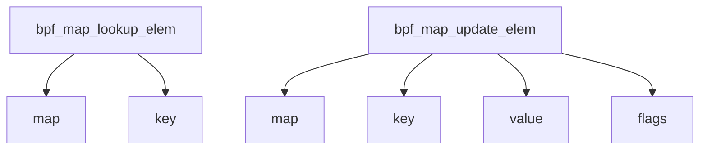

# Overview of C in <SwmToken path="pkg/ebpf/c/bpf_metadata.h" pos="2:28:28" line-data=" * This header file should be included in all .c files that contain eBPF programs. Build artifacts">`eBPF`</SwmToken>

C is used extensively in the <SwmToken path="pkg/ebpf/c/bpf_metadata.h" pos="2:28:28" line-data=" * This header file should be included in all .c files that contain eBPF programs. Build artifacts">`eBPF`</SwmToken> directory to define and implement various <SwmToken path="pkg/ebpf/c/bpf_metadata.h" pos="2:28:28" line-data=" * This header file should be included in all .c files that contain eBPF programs. Build artifacts">`eBPF`</SwmToken> programs and helpers. This document provides an overview of the key files and their roles in the <SwmToken path="pkg/ebpf/c/bpf_metadata.h" pos="2:28:28" line-data=" * This header file should be included in all .c files that contain eBPF programs. Build artifacts">`eBPF`</SwmToken> implementation.

<SwmSnippet path="/pkg/ebpf/c/compiler.h" line="1">

---

## Compiler Macros

The <SwmPath>[pkg/ebpf/c/compiler.h](pkg/ebpf/c/compiler.h)</SwmPath> file includes macros and definitions to assist with compiling <SwmToken path="pkg/ebpf/c/bpf_metadata.h" pos="2:28:28" line-data=" * This header file should be included in all .c files that contain eBPF programs. Build artifacts">`eBPF`</SwmToken> programs. It contains macros such as <SwmToken path="pkg/ebpf/c/compiler.h" pos="7:3:3" line-data="#ifndef __maybe_unused">`__maybe_unused`</SwmToken>, <SwmToken path="pkg/ebpf/c/compiler.h" pos="11:3:3" line-data="#ifndef __nobuiltin">`__nobuiltin`</SwmToken>, and <SwmToken path="pkg/ebpf/c/compiler.h" pos="19:3:3" line-data="#ifndef __throw_build_bug">`__throw_build_bug`</SwmToken> to handle various compilation scenarios.

```c
/* SPDX-License-Identifier: (GPL-2.0-only OR BSD-2-Clause) */
/* Copyright Authors of Cilium */

#ifndef __BPF_COMPILER_H_
#define __BPF_COMPILER_H_

#ifndef __maybe_unused
# define __maybe_unused		__attribute__((__unused__))
#endif
```

---

</SwmSnippet>

<SwmSnippet path="/pkg/ebpf/c/ktypes.h" line="1">

---

## Kernel Type Definitions

The <SwmPath>[pkg/ebpf/c/ktypes.h](pkg/ebpf/c/ktypes.h)</SwmPath> file includes type definitions and kernel version checks to ensure compatibility with different kernel versions. This is crucial for maintaining compatibility across various kernel versions.

```c
#ifndef __KTYPES_H__
#define __KTYPES_H__

#ifdef COMPILE_CORE
#include "vmlinux.h"
#else
#include <linux/types.h>
#include <linux/version.h>
#endif
```

---

</SwmSnippet>

<SwmSnippet path="/pkg/ebpf/c/kconfig.h" line="1">

---

## Kernel Configuration Headers

The <SwmPath>[pkg/ebpf/c/kconfig.h](pkg/ebpf/c/kconfig.h)</SwmPath> file includes kernel configuration headers and handles specific compiler configurations to avoid compilation errors. This ensures that the <SwmToken path="pkg/ebpf/c/bpf_metadata.h" pos="2:28:28" line-data=" * This header file should be included in all .c files that contain eBPF programs. Build artifacts">`eBPF`</SwmToken> programs compile correctly under different kernel configurations.

```c
#ifndef __KCONFIG_H
#define __KCONFIG_H

#include <linux/kconfig.h>
// include asm/compiler.h to fix `error: expected string literal in 'asm'` compilation error coming from mte-kasan.h
// this was fixed in https://github.com/torvalds/linux/commit/b859ebedd1e730bbda69142fca87af4e712649a1
#ifdef CONFIG_HAVE_ARCH_COMPILER_H
#include <asm/compiler.h>
#endif
```

---

</SwmSnippet>

<SwmSnippet path="/pkg/ebpf/c/vmlinux.h" line="1">

---

## Architecture-Specific Headers

The <SwmPath>[pkg/ebpf/c/vmlinux.h](pkg/ebpf/c/vmlinux.h)</SwmPath> file includes architecture-specific headers to ensure the correct definitions are used based on the target architecture. This is important for the portability of <SwmToken path="pkg/ebpf/c/bpf_metadata.h" pos="2:28:28" line-data=" * This header file should be included in all .c files that contain eBPF programs. Build artifacts">`eBPF`</SwmToken> programs across different architectures.

```c
#if defined(__TARGET_ARCH_arm64)
#include "vmlinux_5_15_0_arm.h"
#else
#include "vmlinux_5_15_0.h"
#endif
```

---

</SwmSnippet>

<SwmSnippet path="/pkg/ebpf/c/ksyms_iter.c" line="1">

---

## Iterating Over Kernel Symbols

The <SwmPath>[pkg/ebpf/c/ksyms_iter.c](pkg/ebpf/c/ksyms_iter.c)</SwmPath> file implements an <SwmToken path="pkg/ebpf/c/bpf_metadata.h" pos="2:28:28" line-data=" * This header file should be included in all .c files that contain eBPF programs. Build artifacts">`eBPF`</SwmToken> program to iterate over kernel symbols and print their details. This is useful for debugging and understanding the kernel's state.

```c
// SPDX-License-Identifier: GPL-2.0
/* Copyright (c) 2020 Facebook */

#include "ktypes.h"
#include "bpf_helpers.h"
#include "bpf_metadata.h"
static volatile unsigned long last_sym_value = 0;

static __always_inline char to_lower(char c)
{
```

---

</SwmSnippet>

<SwmSnippet path="/pkg/ebpf/c/bpf_helpers.h" line="1">

---

## Helper Macros and Functions

The <SwmPath>[pkg/ebpf/c/bpf_helpers.h](pkg/ebpf/c/bpf_helpers.h)</SwmPath> file defines various helper macros and functions used in <SwmToken path="pkg/ebpf/c/bpf_metadata.h" pos="2:28:28" line-data=" * This header file should be included in all .c files that contain eBPF programs. Build artifacts">`eBPF`</SwmToken> programs, such as <SwmToken path="pkg/ebpf/c/ksyms_iter.c" pos="32:0:0" line-data="SEC(&quot;iter/ksym&quot;)">`SEC`</SwmToken>, <SwmToken path="pkg/ebpf/c/ksyms_iter.c" pos="9:2:2" line-data="static __always_inline char to_lower(char c)">`__always_inline`</SwmToken>, and <SwmToken path="pkg/ebpf/c/ksyms_iter.c" pos="44:1:1" line-data="		BPF_SEQ_PRINTF(seq, &quot;0x%x\n&quot;, iter-&gt;value - last_sym_value);">`BPF_SEQ_PRINTF`</SwmToken>. These helpers simplify the development of <SwmToken path="pkg/ebpf/c/bpf_metadata.h" pos="2:28:28" line-data=" * This header file should be included in all .c files that contain eBPF programs. Build artifacts">`eBPF`</SwmToken> programs.

```c
/* SPDX-License-Identifier: (LGPL-2.1 OR BSD-2-Clause) */
#ifndef __BPF_HELPERS__
#define __BPF_HELPERS__

#include "ktypes.h"

#ifndef COMPILE_CORE
#include <uapi/linux/bpf.h>
#endif
```

---

</SwmSnippet>

<SwmSnippet path="/pkg/ebpf/c/bpf_metadata.h" line="1">

---

## Metadata Inclusion

The <SwmPath>[pkg/ebpf/c/bpf_metadata.h](pkg/ebpf/c/bpf_metadata.h)</SwmPath> file ensures that metadata about the architecture is included in the <SwmToken path="pkg/ebpf/c/bpf_metadata.h" pos="2:28:28" line-data=" * This header file should be included in all .c files that contain eBPF programs. Build artifacts">`eBPF`</SwmToken> programs. This metadata is crucial for the correct functioning of <SwmToken path="pkg/ebpf/c/bpf_metadata.h" pos="2:28:28" line-data=" * This header file should be included in all .c files that contain eBPF programs. Build artifacts">`eBPF`</SwmToken> programs on different architectures.

```c
/**
 * This header file should be included in all .c files that contain eBPF programs. Build artifacts
 * will be checked by the invoke tasks (validate_object_file_metadata function) to ensure that the
 * metadata is present.
 */

#ifndef __BPF_METADATA_H__
#define __BPF_METADATA_H__

#if defined(__x86_64__) || defined(__TARGET_ARCH_x86)
```

---

</SwmSnippet>

<SwmSnippet path="/pkg/ebpf/c/bpf_bypass.h" line="1">

---

## Bypassable <SwmToken path="pkg/ebpf/c/bpf_metadata.h" pos="2:28:28" line-data=" * This header file should be included in all .c files that contain eBPF programs. Build artifacts">`eBPF`</SwmToken> Programs

The <SwmPath>[pkg/ebpf/c/bpf_bypass.h](pkg/ebpf/c/bpf_bypass.h)</SwmPath> file provides macros to create bypassable <SwmToken path="pkg/ebpf/c/bpf_metadata.h" pos="2:28:28" line-data=" * This header file should be included in all .c files that contain eBPF programs. Build artifacts">`eBPF`</SwmToken> programs, allowing certain programs to be bypassed based on runtime conditions. This adds flexibility to the <SwmToken path="pkg/ebpf/c/bpf_metadata.h" pos="2:28:28" line-data=" * This header file should be included in all .c files that contain eBPF programs. Build artifacts">`eBPF`</SwmToken> programs.

```c
#ifndef __BPF_BYPASS_H__
#define __BPF_BYPASS_H__

#include "compiler.h"
#include "map-defs.h"

// default to size 1 so it doesn't accidentally break programs that aren't using it
BPF_ARRAY_MAP(program_bypassed, u32, 1)

// instruct clang that r0-r5 are clobbered, because we are going to make a helper call
```

---

</SwmSnippet>

<SwmSnippet path="/pkg/ebpf/c/asm_goto_workaround.h" line="1">

---

## Compiler Workarounds

The <SwmPath>[pkg/ebpf/c/asm_goto_workaround.h](pkg/ebpf/c/asm_goto_workaround.h)</SwmPath> file includes workarounds for specific compiler issues related to the use of <SwmToken path="pkg/ebpf/c/kconfig.h" pos="5:4:4" line-data="// include asm/compiler.h to fix `error: expected string literal in &#39;asm&#39;` compilation error coming from mte-kasan.h">`asm`</SwmToken> statements. These workarounds ensure that the <SwmToken path="pkg/ebpf/c/bpf_metadata.h" pos="2:28:28" line-data=" * This header file should be included in all .c files that contain eBPF programs. Build artifacts">`eBPF`</SwmToken> programs compile correctly even with compiler quirks.

```c
#ifndef __ASM_GOTO_WORKAROUND_H
#define __ASM_GOTO_WORKAROUND_H

/*
 * This will bring in asm_volatile_goto and asm_inline macro definitions
 * if enabled by compiler and config options.
 */
#include <linux/types.h>

#ifdef asm_volatile_goto
```

---

</SwmSnippet>

<SwmSnippet path="/pkg/ebpf/c/map-defs.h" line="1">

---

## <SwmToken path="pkg/ebpf/c/bpf_metadata.h" pos="2:28:28" line-data=" * This header file should be included in all .c files that contain eBPF programs. Build artifacts">`eBPF`</SwmToken> Map Definitions

The <SwmPath>[pkg/ebpf/c/map-defs.h](pkg/ebpf/c/map-defs.h)</SwmPath> file defines macros for creating various types of <SwmToken path="pkg/ebpf/c/bpf_metadata.h" pos="2:28:28" line-data=" * This header file should be included in all .c files that contain eBPF programs. Build artifacts">`eBPF`</SwmToken> maps, such as hash maps, array maps, and perf event arrays. These maps are essential for storing and retrieving data in <SwmToken path="pkg/ebpf/c/bpf_metadata.h" pos="2:28:28" line-data=" * This header file should be included in all .c files that contain eBPF programs. Build artifacts">`eBPF`</SwmToken> programs.

```c
#ifndef _MAP_DEFS_H_
#define _MAP_DEFS_H_

#include "bpf_helpers.h"

#define BPF_MAP(_name, _type, _key_type, _value_type, _max_entries, _pin, _map_flags) \
    struct {                                                                         \
        __uint(type, _type);                                                         \
        __uint(max_entries, _max_entries);                                           \
        __uint(pinning, _pin);                                                       \
```

---

</SwmSnippet>

## <SwmToken path="pkg/ebpf/c/bpf_metadata.h" pos="2:28:28" line-data=" * This header file should be included in all .c files that contain eBPF programs. Build artifacts">`eBPF`</SwmToken> Helper Functions

<SwmToken path="pkg/ebpf/c/bpf_metadata.h" pos="2:28:28" line-data=" * This header file should be included in all .c files that contain eBPF programs. Build artifacts">`eBPF`</SwmToken> helper functions are essential for interacting with BPF maps and other kernel structures. Two key helper functions are <SwmToken path="pkg/ebpf/c/bpf_helper_defs.h" pos="55:7:7" line-data="static void *(*bpf_map_lookup_elem)(void *map, const void *key) = (void *) 1;">`bpf_map_lookup_elem`</SwmToken> and <SwmToken path="pkg/ebpf/c/bpf_helper_defs.h" pos="83:6:6" line-data="static int (*bpf_map_update_elem)(void *map, const void *key, const void *value, __u64 flags) = (void *) 2;">`bpf_map_update_elem`</SwmToken>.

<SwmSnippet path="/pkg/ebpf/c/bpf_helper_defs.h" line="55">

---

### <SwmToken path="pkg/ebpf/c/bpf_helper_defs.h" pos="55:7:7" line-data="static void *(*bpf_map_lookup_elem)(void *map, const void *key) = (void *) 1;">`bpf_map_lookup_elem`</SwmToken>

The <SwmToken path="pkg/ebpf/c/bpf_helper_defs.h" pos="55:7:7" line-data="static void *(*bpf_map_lookup_elem)(void *map, const void *key) = (void *) 1;">`bpf_map_lookup_elem`</SwmToken> function is used to look up an element in a BPF map. It takes a map and a key as arguments and returns a pointer to the value associated with the key.

```c
static void *(*bpf_map_lookup_elem)(void *map, const void *key) = (void *) 1;
```

---

</SwmSnippet>

<SwmSnippet path="/pkg/ebpf/c/bpf_helper_defs.h" line="83">

---

### <SwmToken path="pkg/ebpf/c/bpf_helper_defs.h" pos="83:6:6" line-data="static int (*bpf_map_update_elem)(void *map, const void *key, const void *value, __u64 flags) = (void *) 2;">`bpf_map_update_elem`</SwmToken>

The <SwmToken path="pkg/ebpf/c/bpf_helper_defs.h" pos="83:6:6" line-data="static int (*bpf_map_update_elem)(void *map, const void *key, const void *value, __u64 flags) = (void *) 2;">`bpf_map_update_elem`</SwmToken> function is used to update or insert an element in a BPF map. It takes a map, a key, a value, and flags as arguments and returns an integer indicating success or failure.

```c
static int (*bpf_map_update_elem)(void *map, const void *key, const void *value, __u64 flags) = (void *) 2;
```

---

</SwmSnippet>

&nbsp;

*This is an* <SwmToken path="pkg/ebpf/c/bpf_helpers.h" pos="13:8:10" line-data=" * vmlinux.h (auto-generated from BTF) or linux/types.h">`auto-generated`</SwmToken> *document by Swimm AI 🌊 and has not yet been verified by a human*

<SwmMeta version="3.0.0" repo-id="Z2l0aHViJTNBJTNBZGF0YWRvZy1hZ2VudCUzQSUzQVN3aW1tLURlbW8=" repo-name="datadog-agent"><sup>Powered by [Swimm](/)</sup></SwmMeta>
