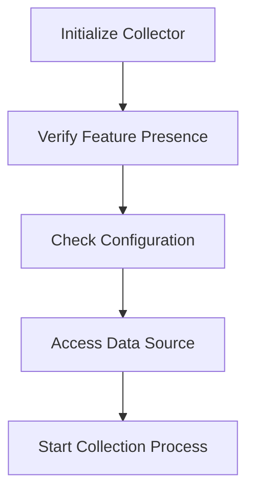

# What are Collectors in Workloadmeta

Collectors are components responsible for gathering metadata about workloads from various sources. They are essential for the Datadog Agent to monitor and analyze different environments.

# Implementation of Collectors

In the workloadmeta package, collectors are implemented to interface with specific technologies such as Docker, Kubernetes, and Podman. Each collector is designed to extract relevant metadata from its respective environment.

# The Start Method

The <SwmToken path="tasks/kernel_matrix_testing/compiler.py" pos="104:3:3" line-data="    def start(self) -&gt; None:">`start`</SwmToken> method in a collector initializes the collection process by verifying the presence of necessary features and configurations. It ensures that the collector can access the required data sources before proceeding.

<SwmSnippet path="/comp/core/workloadmeta/collectors/internal/ecs/ecs.go" line="41">

---

This snippet shows the structure of a collector in the workloadmeta package. It includes various fields such as <SwmToken path="comp/core/workloadmeta/collectors/internal/ecs/ecs.go" pos="42:1:1" line-data="	id                  string">`id`</SwmToken>, <SwmToken path="comp/core/workloadmeta/collectors/internal/ecs/ecs.go" pos="43:1:1" line-data="	store               workloadmeta.Component">`store`</SwmToken>, <SwmToken path="comp/core/workloadmeta/collectors/internal/ecs/ecs.go" pos="44:1:1" line-data="	catalog             workloadmeta.AgentType">`catalog`</SwmToken>, and configurations for task collection.

```go
type collector struct {
	id                  string
	store               workloadmeta.Component
	catalog             workloadmeta.AgentType
	metaV1              v1.Client
	metaV3or4           func(metaURI, metaVersion string) v3or4.Client
	clusterName         string
	hasResourceTags     bool
	collectResourceTags bool
	resourceTags        map[string]resourceTags
	seen                map[workloadmeta.EntityID]struct{}
	config              config.Component
	// taskCollectionEnabled is a flag to enable detailed task collection
	// if the flag is enabled, the collector will query the latest metadata endpoint, currently v4, for each task
	// that is returned from the v1/tasks endpoint
	taskCollectionEnabled bool
	taskCollectionParser  util.TaskParser
	taskCache             *cache.Cache
	taskRateRPS           int
	taskRateBurst         int
}
```

---

</SwmSnippet>

# Internal Collectors

The workloadmeta package includes a variety of internal collectors, each tailored to a specific technology or platform. These collectors are loaded and managed to provide a comprehensive view of the monitored workloads.

# Main Functions

There are several main functions in this folder. Some of them are <SwmToken path="comp/core/workloadmeta/collectors/internal/containerd/containerd.go" pos="108:2:2" line-data="// NewCollector returns a new containerd collector provider and an error">`NewCollector`</SwmToken>, <SwmToken path="comp/core/workloadmeta/collectors/internal/containerd/containerd.go" pos="344:2:2" line-data="// extractContainerFromEvent extracts a container ID from an event, and">`extractContainerFromEvent`</SwmToken>, and <SwmToken path="comp/core/workloadmeta/collectors/internal/containerd/event_builder.go" pos="26:2:2" line-data="// buildCollectorEvent generates a CollectorEvent from a containerdevents.Envelope">`buildCollectorEvent`</SwmToken>. We will dive a little into <SwmToken path="comp/core/workloadmeta/collectors/internal/containerd/containerd.go" pos="108:2:2" line-data="// NewCollector returns a new containerd collector provider and an error">`NewCollector`</SwmToken> and <SwmToken path="comp/core/workloadmeta/collectors/internal/containerd/containerd.go" pos="344:2:2" line-data="// extractContainerFromEvent extracts a container ID from an event, and">`extractContainerFromEvent`</SwmToken>.

## <SwmToken path="comp/core/workloadmeta/collectors/internal/containerd/containerd.go" pos="108:2:2" line-data="// NewCollector returns a new containerd collector provider and an error">`NewCollector`</SwmToken>

The <SwmToken path="comp/core/workloadmeta/collectors/internal/containerd/containerd.go" pos="108:2:2" line-data="// NewCollector returns a new containerd collector provider and an error">`NewCollector`</SwmToken> function initializes a new containerd collector provider. It sets up the collector with necessary configurations like <SwmToken path="comp/core/workloadmeta/collectors/internal/ecs/ecs.go" pos="42:1:1" line-data="	id                  string">`id`</SwmToken>, <SwmToken path="comp/core/workloadmeta/collectors/internal/ecs/ecs.go" pos="44:1:1" line-data="	catalog             workloadmeta.AgentType">`catalog`</SwmToken>, and <SwmToken path="comp/core/workloadmeta/collectors/internal/containerd/containerd.go" pos="115:1:1" line-data="			knownImages:    newKnownImages(),">`knownImages`</SwmToken>. This function ensures that the collector is ready to gather metadata from containerd.

<SwmSnippet path="/comp/core/workloadmeta/collectors/internal/containerd/containerd.go" line="108">

---

This snippet shows the <SwmToken path="comp/core/workloadmeta/collectors/internal/containerd/containerd.go" pos="108:2:2" line-data="// NewCollector returns a new containerd collector provider and an error">`NewCollector`</SwmToken> function which initializes a new containerd collector provider.

```go
// NewCollector returns a new containerd collector provider and an error
func NewCollector() (workloadmeta.CollectorProvider, error) {
	return workloadmeta.CollectorProvider{
		Collector: &collector{
			id:             collectorID,
			catalog:        workloadmeta.NodeAgent | workloadmeta.ProcessAgent,
			contToExitInfo: make(map[string]*exitInfo),
			knownImages:    newKnownImages(),
		},
	}, nil
}
```

---

</SwmSnippet>

## <SwmToken path="comp/core/workloadmeta/collectors/internal/containerd/containerd.go" pos="344:2:2" line-data="// extractContainerFromEvent extracts a container ID from an event, and">`extractContainerFromEvent`</SwmToken>

The <SwmToken path="comp/core/workloadmeta/collectors/internal/containerd/containerd.go" pos="344:2:2" line-data="// extractContainerFromEvent extracts a container ID from an event, and">`extractContainerFromEvent`</SwmToken> function extracts a container ID from an event and queries for a <SwmToken path="comp/core/workloadmeta/collectors/internal/containerd/containerd.go" pos="345:8:10" line-data="// queries for a containerd.Container object. The Container object will always">`containerd.Container`</SwmToken> object. It handles different event topics to retrieve the container ID and fetch the corresponding container object, ensuring that even delete events are processed correctly.

<SwmSnippet path="/comp/core/workloadmeta/collectors/internal/containerd/containerd.go" line="344">

---

This snippet shows the <SwmToken path="comp/core/workloadmeta/collectors/internal/containerd/containerd.go" pos="344:2:2" line-data="// extractContainerFromEvent extracts a container ID from an event, and">`extractContainerFromEvent`</SwmToken> function which extracts a container ID from an event and queries for a <SwmToken path="comp/core/workloadmeta/collectors/internal/containerd/containerd.go" pos="345:8:10" line-data="// queries for a containerd.Container object. The Container object will always">`containerd.Container`</SwmToken> object.

```go
// extractContainerFromEvent extracts a container ID from an event, and
// queries for a containerd.Container object. The Container object will always
// be missing in a delete event, so that's why we return a separate ID and not
// just an object.
func (c *collector) extractContainerFromEvent(ctx context.Context, containerdEvent *containerdevents.Envelope) (string, containerd.Container, error) {
	var (
		containerID string
		hasID       bool
	)

	switch containerdEvent.Topic {
	case containerCreationTopic, containerUpdateTopic, containerDeletionTopic:
		containerID, hasID = containerdEvent.Field([]string{"event", "id"})
		if !hasID {
			return "", nil, fmt.Errorf("missing ID in containerd event")
		}

	case TaskStartTopic, TaskOOMTopic, TaskPausedTopic, TaskResumedTopic, TaskExitTopic, TaskDeleteTopic:
		containerID, hasID = containerdEvent.Field([]string{"event", "container_id"})
		if !hasID {
			return "", nil, fmt.Errorf("missing ID in containerd event")
```

---

</SwmSnippet>

## <SwmToken path="comp/core/workloadmeta/collectors/internal/containerd/event_builder.go" pos="26:2:2" line-data="// buildCollectorEvent generates a CollectorEvent from a containerdevents.Envelope">`buildCollectorEvent`</SwmToken>

The <SwmToken path="comp/core/workloadmeta/collectors/internal/containerd/event_builder.go" pos="26:2:2" line-data="// buildCollectorEvent generates a CollectorEvent from a containerdevents.Envelope">`buildCollectorEvent`</SwmToken> function generates a <SwmToken path="comp/core/workloadmeta/collectors/internal/containerd/event_builder.go" pos="26:8:8" line-data="// buildCollectorEvent generates a CollectorEvent from a containerdevents.Envelope">`CollectorEvent`</SwmToken> from a containerd event. It processes various event topics like container creation, update, and deletion to create appropriate set or deletion events. This function ensures that the metadata store is updated with the latest container information.

<SwmSnippet path="/comp/core/workloadmeta/collectors/internal/containerd/event_builder.go" line="26">

---

This snippet shows the <SwmToken path="comp/core/workloadmeta/collectors/internal/containerd/event_builder.go" pos="26:2:2" line-data="// buildCollectorEvent generates a CollectorEvent from a containerdevents.Envelope">`buildCollectorEvent`</SwmToken> function which generates a <SwmToken path="comp/core/workloadmeta/collectors/internal/containerd/event_builder.go" pos="26:8:8" line-data="// buildCollectorEvent generates a CollectorEvent from a containerdevents.Envelope">`CollectorEvent`</SwmToken> from a containerd event.

```go
// buildCollectorEvent generates a CollectorEvent from a containerdevents.Envelope
func (c *collector) buildCollectorEvent(
	containerdEvent *containerdevents.Envelope,
	containerID string,
	container containerd.Container,
	store workloadmeta.Component,
) (workloadmeta.CollectorEvent, error) {
	switch containerdEvent.Topic {
	case containerCreationTopic, containerUpdateTopic:
		return createSetEvent(container, containerdEvent.Namespace, c.containerdClient, store)

	case containerDeletionTopic:
		exitInfo := c.getExitInfo(containerID)
		defer c.deleteExitInfo(containerID)

		return createDeletionEvent(containerID, exitInfo), nil

	case TaskExitTopic:
		exited := &events.TaskExit{}
		if err := proto.Unmarshal(containerdEvent.Event.GetValue(), exited); err != nil {
			return workloadmeta.CollectorEvent{}, err
```

---

</SwmSnippet>

# Collectors Endpoints

Collectors endpoints provide various functionalities to interact with the collectors. Two main endpoints are <SwmToken path="comp/core/workloadmeta/collectors/internal/remote/generic.go" pos="42:3:3" line-data="	// StreamEntities establishes the stream between the client and the remote gRPC server.">`StreamEntities`</SwmToken> and <SwmToken path="comp/core/workloadmeta/collectors/internal/remote/generic.go" pos="133:2:2" line-data="// Pull does nothing in workloadmeta collectors.">`Pull`</SwmToken>.

## <SwmToken path="comp/core/workloadmeta/collectors/internal/remote/generic.go" pos="42:3:3" line-data="	// StreamEntities establishes the stream between the client and the remote gRPC server.">`StreamEntities`</SwmToken>

The <SwmToken path="comp/core/workloadmeta/collectors/internal/remote/generic.go" pos="42:3:3" line-data="	// StreamEntities establishes the stream between the client and the remote gRPC server.">`StreamEntities`</SwmToken> function establishes a stream between the client and the remote <SwmToken path="comp/core/workloadmeta/collectors/internal/remote/generic.go" pos="42:23:23" line-data="	// StreamEntities establishes the stream between the client and the remote gRPC server.">`gRPC`</SwmToken> server. This function is part of the <SwmToken path="comp/core/workloadmeta/collectors/internal/remote/generic.go" pos="41:2:2" line-data="type GrpcClient interface {">`GrpcClient`</SwmToken> interface and is used to receive continuous updates from the server.

<SwmSnippet path="/comp/core/workloadmeta/collectors/internal/remote/generic.go" line="41">

---

This snippet shows the <SwmToken path="comp/core/workloadmeta/collectors/internal/remote/generic.go" pos="42:3:3" line-data="	// StreamEntities establishes the stream between the client and the remote gRPC server.">`StreamEntities`</SwmToken> function which establishes a stream between the client and the remote <SwmToken path="comp/core/workloadmeta/collectors/internal/remote/generic.go" pos="42:23:23" line-data="	// StreamEntities establishes the stream between the client and the remote gRPC server.">`gRPC`</SwmToken> server.

```go
type GrpcClient interface {
	// StreamEntities establishes the stream between the client and the remote gRPC server.
	StreamEntities(ctx context.Context, opts ...grpc.CallOption) (Stream, error)
```

---

</SwmSnippet>

## Pull

The <SwmToken path="comp/core/workloadmeta/collectors/internal/remote/generic.go" pos="133:2:2" line-data="// Pull does nothing in workloadmeta collectors.">`Pull`</SwmToken> function in workloadmeta collectors does nothing. It is defined to satisfy the interface requirements but is not used in the context of workloadmeta collectors.

<SwmSnippet path="/comp/core/workloadmeta/collectors/internal/remote/generic.go" line="133">

---

This snippet shows the <SwmToken path="comp/core/workloadmeta/collectors/internal/remote/generic.go" pos="133:2:2" line-data="// Pull does nothing in workloadmeta collectors.">`Pull`</SwmToken> function which does nothing in workloadmeta collectors.

```go
// Pull does nothing in workloadmeta collectors.
func (c *GenericCollector) Pull(context.Context) error {
	return nil
```

---

</SwmSnippet>

&nbsp;

*This is an auto-generated document by Swimm AI 🌊 and has not yet been verified by a human*

<SwmMeta version="3.0.0" repo-id="Z2l0aHViJTNBJTNBZGF0YWRvZy1hZ2VudCUzQSUzQVN3aW1tLURlbW8=" repo-name="datadog-agent"><sup>Powered by [Swimm](/)</sup></SwmMeta>
