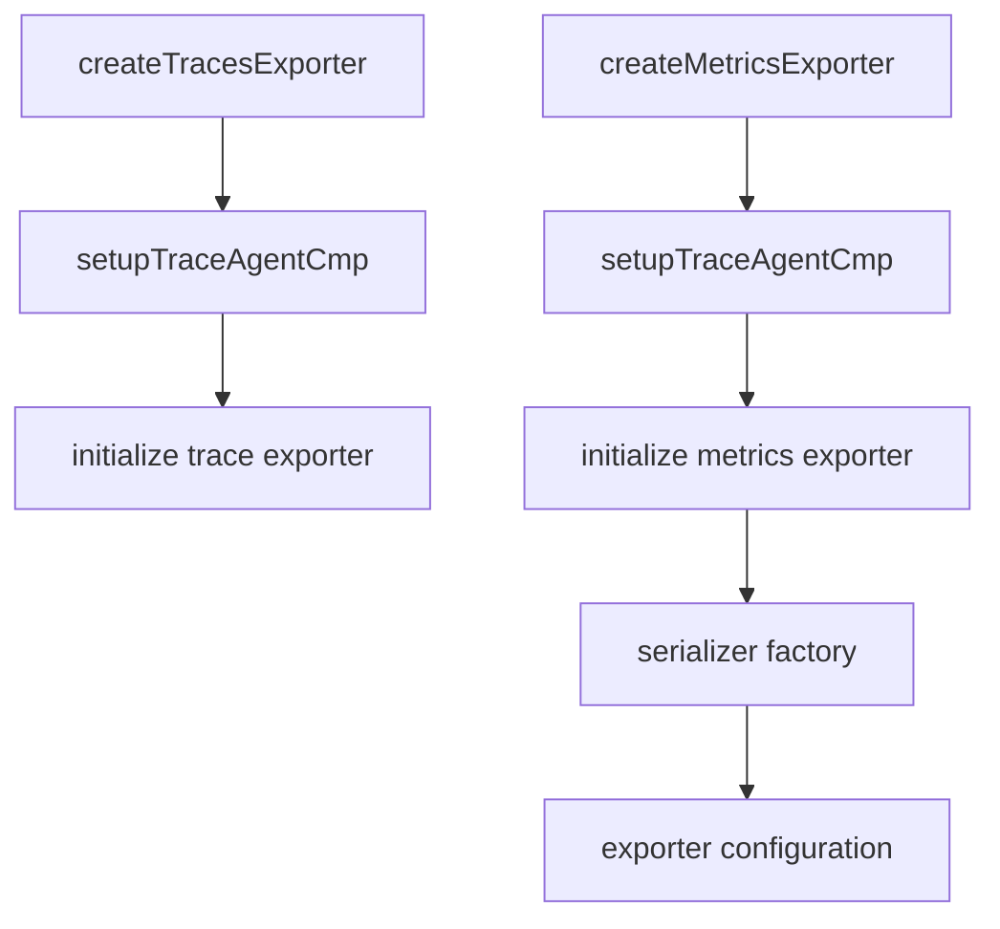

# Overview of Components in Otlp

Components encapsulate specific pieces of logic or features and provide clear and documented interfaces. They hide the complexity of their implementation from users, ensuring that the internal workings are not exposed. Components are designed to be reusable in different contexts and binaries, making them versatile and adaptable. Each component must be tested to ensure reliability and functionality. If applicable, components should expose a mock implementation to facilitate testing. Ownership of a component is assigned to a single team, which is responsible for its support and maintenance. Changes within a component that do not alter its interface should not require quality assurance from other components that use it.

## Using Components

Using components within other components is covered on the create components page. One of the core ideas behind component design is to be able to create new binaries for customers by aggregating components.

## Using Plain Data Types with Fx

As your migration to components is not finished, you might need to manually instruct Fx on how to use plain types. You will need to use `fx.Supply` for this.

<SwmSnippet path="/comp/otelcol/otlp/components/statsprocessor/agent.go" line="107">

---

The <SwmToken path="comp/otelcol/otlp/components/statsprocessor/agent.go" pos="107:2:2" line-data="// Start starts the traceagent, making it ready to ingest spans.">`Start`</SwmToken> method in <SwmToken path="comp/otelcol/otlp/components/statsprocessor/agent.go" pos="107:8:8" line-data="// Start starts the traceagent, making it ready to ingest spans.">`traceagent`</SwmToken> demonstrates how to start a set of minimal components needed to compute stats. This method shows how components are initialized and started within a binary.

```go
// Start starts the traceagent, making it ready to ingest spans.
func (p *TraceAgent) Start() {
	// we don't need to start the full agent, so we only start a set of minimal
	// components needed to compute stats:
	for _, starter := range []interface{ Start() }{
		p.Concentrator,
		p.ClientStatsAggregator,
		// we don't need the samplers' nor the processor's functionalities;
		// but they are used by the agent nevertheless, so they need to be
		// active and functioning.
		p.PrioritySampler,
		p.ErrorsSampler,
		p.NoPrioritySampler,
		p.EventProcessor,
	} {
		starter.Start()
	}
	p.goProcess()
}
```

---

</SwmSnippet>

### <SwmToken path="comp/otelcol/otlp/components/exporter/datadogexporter/factory.go" pos="195:2:2" line-data="// createTracesExporter creates a trace exporter based on this config.">`createTracesExporter`</SwmToken>

The <SwmToken path="comp/otelcol/otlp/components/exporter/datadogexporter/factory.go" pos="195:2:2" line-data="// createTracesExporter creates a trace exporter based on this config.">`createTracesExporter`</SwmToken> function is responsible for creating a trace exporter based on the provided configuration. It sets up the trace agent component and initializes the trace exporter.

<SwmSnippet path="/comp/otelcol/otlp/components/exporter/datadogexporter/factory.go" line="195">

---

The <SwmToken path="comp/otelcol/otlp/components/exporter/datadogexporter/factory.go" pos="195:2:2" line-data="// createTracesExporter creates a trace exporter based on this config.">`createTracesExporter`</SwmToken> function in <SwmPath>[comp/otelcol/otlp/components/exporter/datadogexporter/factory.go](comp/otelcol/otlp/components/exporter/datadogexporter/factory.go)</SwmPath> shows how the trace exporter is created and initialized.

```go
// createTracesExporter creates a trace exporter based on this config.
func (f *factory) createTracesExporter(
	ctx context.Context,
	set exporter.Settings,
	c component.Config,
) (exporter.Traces, error) {
	cfg := checkAndCastConfig(c, set.TelemetrySettings.Logger)

	err := f.setupTraceAgentCmp(set.TelemetrySettings)
	if err != nil {
		return nil, fmt.Errorf("failed to set up trace agent component: %w", err)
	}

	if cfg.OnlyMetadata {
		return nil, fmt.Errorf("datadog::only_metadata should not be set in OTel Agent")
	}

	tracex := newTracesExporter(ctx, set, cfg, f.traceagentcmp)

	return exporterhelper.NewTracesExporter(
		ctx,
```

---

</SwmSnippet>

### <SwmToken path="comp/otelcol/otlp/components/exporter/datadogexporter/factory.go" pos="88:7:7" line-data="		exporter.WithMetrics(f.createMetricsExporter, MetricsStability),">`createMetricsExporter`</SwmToken>

The <SwmToken path="comp/otelcol/otlp/components/exporter/datadogexporter/factory.go" pos="88:7:7" line-data="		exporter.WithMetrics(f.createMetricsExporter, MetricsStability),">`createMetricsExporter`</SwmToken> function creates a metrics exporter based on the provided configuration. It sets up the trace agent component and initializes the metrics exporter, including the serializer factory and exporter configuration.

&nbsp;

*This is an auto-generated document by Swimm AI 🌊 and has not yet been verified by a human*

<SwmMeta version="3.0.0" repo-id="Z2l0aHViJTNBJTNBZGF0YWRvZy1hZ2VudCUzQSUzQVN3aW1tLURlbW8=" repo-name="datadog-agent"><sup>Powered by [Swimm](/)</sup></SwmMeta>
