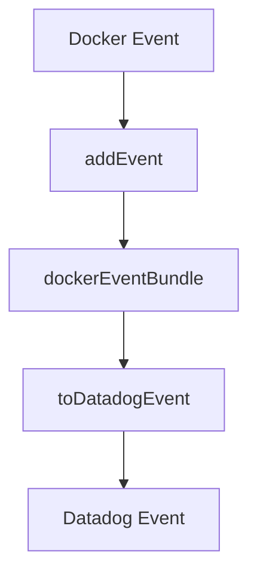

# Overview of Docker in Containers

Docker is used to build and run containerized applications. It allows developers to package applications and their dependencies into a standardized unit called a container. In the development environment, Docker is essential for building Docker images containing the Agent and running system and integration tests. This ensures that the application runs consistently across different environments.

## Building Docker Images

To build the Agent binaries, run the provided Docker command from the root of the repository.

## Running Docker Containers

To build the containerized Agent from a Core Windows base image, use the <SwmToken path="pkg/collector/corechecks/containers/docker/check.go" pos="200:20:20" line-data="func (d *DockerCheck) runDockerCustom(sender sender.Sender, du docker.Client, rawContainerList []dockerTypes.Container) error {">`docker`</SwmToken>` `<SwmToken path="tasks/libs/build/ninja.py" pos="91:3:3" line-data="    def build(">`build`</SwmToken> command with the appropriate arguments.

## Main Functions of Docker

Docker provides several main functions that are crucial for monitoring and managing containerized applications.

<SwmSnippet path="/pkg/collector/corechecks/containers/docker/check.go" line="200">

---

### <SwmToken path="pkg/collector/corechecks/containers/docker/check.go" pos="200:9:9" line-data="func (d *DockerCheck) runDockerCustom(sender sender.Sender, du docker.Client, rawContainerList []dockerTypes.Container) error {">`runDockerCustom`</SwmToken>

The <SwmToken path="pkg/collector/corechecks/containers/docker/check.go" pos="200:9:9" line-data="func (d *DockerCheck) runDockerCustom(sender sender.Sender, du docker.Client, rawContainerList []dockerTypes.Container) error {">`runDockerCustom`</SwmToken> function is responsible for collecting various Docker metrics, including container states and network metrics. It processes each container, resolves image names, and groups containers by tags.

```go
func (d *DockerCheck) runDockerCustom(sender sender.Sender, du docker.Client, rawContainerList []dockerTypes.Container) error {
	// Container metrics
	var containersRunning, containersStopped uint64
	containerGroups := map[string]*containersPerTags{}

	// Network extension preRun hook
	if d.networkProcessorExtension != nil {
		d.networkProcessorExtension.preRun()
	}

	for _, rawContainer := range rawContainerList {
		if rawContainer.State == string(workloadmeta.ContainerStatusRunning) {
			containersRunning++
		} else {
			containersStopped++
		}

		// Network extension container hook
		if d.networkProcessorExtension != nil {
			d.networkProcessorExtension.processContainer(rawContainer)
		}
```

---

</SwmSnippet>

<SwmSnippet path="/pkg/collector/corechecks/containers/docker/check.go" line="372">

---

### <SwmToken path="pkg/collector/corechecks/containers/docker/check.go" pos="372:9:9" line-data="func (d *DockerCheck) collectDiskMetrics(sender sender.Sender, du docker.Client) {">`collectDiskMetrics`</SwmToken>

The <SwmToken path="pkg/collector/corechecks/containers/docker/check.go" pos="372:9:9" line-data="func (d *DockerCheck) collectDiskMetrics(sender sender.Sender, du docker.Client) {">`collectDiskMetrics`</SwmToken> function gathers disk usage statistics from Docker. It collects metrics such as free, used, and total disk space, and calculates the percentage of disk space used.

```go
func (d *DockerCheck) collectDiskMetrics(sender sender.Sender, du docker.Client) {
	if d.instance.CollectDiskStats {
		stats, err := du.GetStorageStats(context.TODO())
		if err != nil {
			d.Warnf("Error collecting disk stats: %s", err) //nolint:errcheck
		} else {
			for _, stat := range stats {
				if stat.Name != docker.DataStorageName && stat.Name != docker.MetadataStorageName {
					log.Debugf("Ignoring unknown disk stats: %s", stat.Name)
					continue
				}
				if stat.Free != nil {
					sender.Gauge(fmt.Sprintf("docker.%s.free", stat.Name), float64(*stat.Free), "", nil)
				}
				if stat.Used != nil {
					sender.Gauge(fmt.Sprintf("docker.%s.used", stat.Name), float64(*stat.Used), "", nil)
				}
				if stat.Total != nil {
					sender.Gauge(fmt.Sprintf("docker.%s.total", stat.Name), float64(*stat.Total), "", nil)
				}
				percent := stat.GetPercentUsed()
```

---

</SwmSnippet>

<SwmSnippet path="/pkg/collector/corechecks/containers/docker/check.go" line="401">

---

### <SwmToken path="pkg/collector/corechecks/containers/docker/check.go" pos="401:9:9" line-data="func (d *DockerCheck) collectVolumeMetrics(sender sender.Sender, du docker.Client) {">`collectVolumeMetrics`</SwmToken>

The <SwmToken path="pkg/collector/corechecks/containers/docker/check.go" pos="401:9:9" line-data="func (d *DockerCheck) collectVolumeMetrics(sender sender.Sender, du docker.Client) {">`collectVolumeMetrics`</SwmToken> function collects metrics related to Docker volumes. It counts the number of attached and dangling volumes and sends these metrics for monitoring.

```go
func (d *DockerCheck) collectVolumeMetrics(sender sender.Sender, du docker.Client) {
	if d.instance.CollectVolumeCount {
		attached, dangling, err := du.CountVolumes(context.TODO())
		if err != nil {
			d.Warnf("Error collecting volume stats: %s", err) //nolint:errcheck
		} else {
			sender.Gauge("docker.volume.count", float64(attached), "", []string{"volume_state:attached"})
			sender.Gauge("docker.volume.count", float64(dangling), "", []string{"volume_state:dangling"})
		}
	}
}
```

---

</SwmSnippet>

## Docker Endpoints

Docker endpoints are used to handle events and convert them into a format suitable for Datadog.

<SwmSnippet path="/pkg/collector/corechecks/containers/docker/eventbundle.go" line="46">

---

### <SwmToken path="pkg/collector/corechecks/containers/docker/eventbundle.go" pos="46:9:9" line-data="func (b *dockerEventBundle) addEvent(ev *docker.ContainerEvent) error {">`addEvent`</SwmToken>

The <SwmToken path="pkg/collector/corechecks/containers/docker/eventbundle.go" pos="46:9:9" line-data="func (b *dockerEventBundle) addEvent(ev *docker.ContainerEvent) error {">`addEvent`</SwmToken> function adds a Docker event to the <SwmToken path="pkg/collector/corechecks/containers/docker/eventbundle.go" pos="46:6:6" line-data="func (b *dockerEventBundle) addEvent(ev *docker.ContainerEvent) error {">`dockerEventBundle`</SwmToken>. It checks if the event's image name matches the bundle's image name, updates the event list, and adjusts the alert type if necessary.

```go
func (b *dockerEventBundle) addEvent(ev *docker.ContainerEvent) error {
	if ev.ImageName != b.imageName {
		return fmt.Errorf("mismatching image name: %s != %s", ev.ImageName, b.imageName)
	}

	b.events = append(b.events, ev)
	b.countByAction[ev.Action]++

	if ev.Timestamp.After(b.maxTimestamp) {
		b.maxTimestamp = ev.Timestamp
	}

	if isAlertTypeError(ev.Action) {
		b.alertType = event.AlertTypeError
	}

	return nil
}
```

---

</SwmSnippet>

<SwmSnippet path="/pkg/collector/corechecks/containers/docker/eventbundle.go" line="65">

---

### <SwmToken path="pkg/collector/corechecks/containers/docker/eventbundle.go" pos="65:9:9" line-data="func (b *dockerEventBundle) toDatadogEvent(hostname string) (event.Event, error) {">`toDatadogEvent`</SwmToken>

The <SwmToken path="pkg/collector/corechecks/containers/docker/eventbundle.go" pos="65:9:9" line-data="func (b *dockerEventBundle) toDatadogEvent(hostname string) (event.Event, error) {">`toDatadogEvent`</SwmToken> function converts the Docker events in the <SwmToken path="pkg/collector/corechecks/containers/docker/eventbundle.go" pos="65:6:6" line-data="func (b *dockerEventBundle) toDatadogEvent(hostname string) (event.Event, error) {">`dockerEventBundle`</SwmToken> to a Datadog event format. It constructs the event title, aggregates tags, and formats the event text for submission to Datadog.

```go
func (b *dockerEventBundle) toDatadogEvent(hostname string) (event.Event, error) {
	if len(b.events) == 0 {
		return event.Event{}, errors.New("no event to export")
	}

	output := event.Event{
		Title: fmt.Sprintf("%s %s on %s",
			b.imageName,
			formatActionMap(b.countByAction),
			hostname,
		),
		Priority:       event.PriorityNormal,
		Host:           hostname,
		SourceTypeName: CheckName,
		EventType:      CheckName,
		AlertType:      b.alertType,
		Ts:             b.maxTimestamp.Unix(),
		AggregationKey: fmt.Sprintf("docker:%s", b.imageName),
	}

	seenContainers := make(map[string]bool)
```

---

</SwmSnippet>

&nbsp;

*This is an auto-generated document by Swimm AI 🌊 and has not yet been verified by a human*

<SwmMeta version="3.0.0" repo-id="Z2l0aHViJTNBJTNBZGF0YWRvZy1hZ2VudCUzQSUzQVN3aW1tLURlbW8=" repo-name="datadog-agent"><sup>Powered by [Swimm](/)</sup></SwmMeta>
