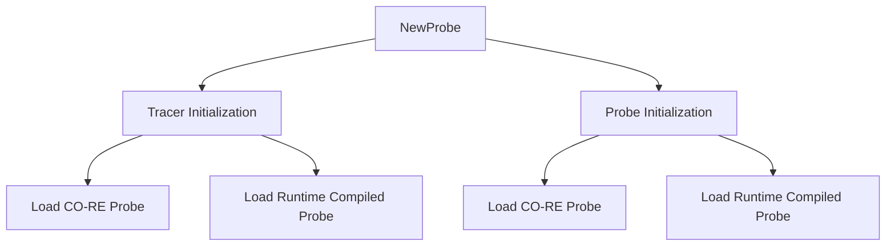

# Overview of Ebpf in Collector

This document provides an overview of the <SwmToken path="pkg/collector/corechecks/ebpf/ebpf.go" pos="32:6:6" line-data="	CheckName = &quot;ebpf&quot;">`ebpf`</SwmToken> (Extended Berkeley Packet Filter) implementation in the Datadog Agent's collector. <SwmToken path="pkg/collector/corechecks/ebpf/ebpf.go" pos="32:6:6" line-data="	CheckName = &quot;ebpf&quot;">`ebpf`</SwmToken> is a powerful technology that allows for efficient and flexible monitoring and tracing of system events. The <SwmToken path="pkg/collector/corechecks/ebpf/ebpf.go" pos="32:6:6" line-data="	CheckName = &quot;ebpf&quot;">`ebpf`</SwmToken> checks in the collector are designed to gather metrics from <SwmToken path="pkg/collector/corechecks/ebpf/ebpf.go" pos="32:6:6" line-data="	CheckName = &quot;ebpf&quot;">`ebpf`</SwmToken> maps, programs, and perf buffers.

<SwmSnippet path="/pkg/collector/corechecks/ebpf/ebpf.go" line="39">

---

## <SwmToken path="pkg/collector/corechecks/ebpf/ebpf.go" pos="39:2:2" line-data="// EBPFCheck grabs eBPF map/program/perf buffer metrics">`EBPFCheck`</SwmToken>

The <SwmToken path="pkg/collector/corechecks/ebpf/ebpf.go" pos="39:2:2" line-data="// EBPFCheck grabs eBPF map/program/perf buffer metrics">`EBPFCheck`</SwmToken> type is responsible for grabbing <SwmToken path="pkg/collector/corechecks/ebpf/ebpf.go" pos="39:6:6" line-data="// EBPFCheck grabs eBPF map/program/perf buffer metrics">`eBPF`</SwmToken> map, program, and perf buffer metrics. It includes configuration and system probe utilities.

```go
// EBPFCheck grabs eBPF map/program/perf buffer metrics
type EBPFCheck struct {
	config       *EBPFCheckConfig
	sysProbeUtil *processnet.RemoteSysProbeUtil
	core.CheckBase
}
```

---

</SwmSnippet>

<SwmSnippet path="/pkg/collector/corechecks/ebpf/ebpf.go" line="35">

---

## <SwmToken path="pkg/collector/corechecks/ebpf/ebpf.go" pos="35:2:2" line-data="// EBPFCheckConfig is the config of the EBPF check">`EBPFCheckConfig`</SwmToken>

The <SwmToken path="pkg/collector/corechecks/ebpf/ebpf.go" pos="35:2:2" line-data="// EBPFCheckConfig is the config of the EBPF check">`EBPFCheckConfig`</SwmToken> type defines the configuration for the <SwmToken path="pkg/collector/corechecks/ebpf/ebpf.go" pos="39:2:2" line-data="// EBPFCheck grabs eBPF map/program/perf buffer metrics">`EBPFCheck`</SwmToken>.

```go
// EBPFCheckConfig is the config of the EBPF check
type EBPFCheckConfig struct {
}
```

---

</SwmSnippet>

<SwmSnippet path="/pkg/collector/corechecks/ebpf/ebpf.go" line="30">

---

## <SwmToken path="pkg/collector/corechecks/ebpf/ebpf.go" pos="31:3:3" line-data="	// CheckName is the name of the check">`CheckName`</SwmToken>

The <SwmToken path="pkg/collector/corechecks/ebpf/ebpf.go" pos="31:3:3" line-data="	// CheckName is the name of the check">`CheckName`</SwmToken> constant defines the name of the <SwmToken path="pkg/collector/corechecks/ebpf/ebpf.go" pos="32:6:6" line-data="	CheckName = &quot;ebpf&quot;">`ebpf`</SwmToken> check.

```go
const (
	// CheckName is the name of the check
	CheckName = "ebpf"
)
```

---

</SwmSnippet>

<SwmSnippet path="/pkg/collector/corechecks/ebpf/ebpf.go" line="46">

---

## Factory Function

The <SwmToken path="pkg/collector/corechecks/ebpf/ebpf.go" pos="46:2:2" line-data="// Factory creates a new check factory">`Factory`</SwmToken> function creates a new check factory for the <SwmToken path="pkg/collector/corechecks/ebpf/ebpf.go" pos="39:2:2" line-data="// EBPFCheck grabs eBPF map/program/perf buffer metrics">`EBPFCheck`</SwmToken>.

```go
// Factory creates a new check factory
func Factory() optional.Option[func() check.Check] {
	return optional.NewOption(newCheck)
}
```

---

</SwmSnippet>

<SwmSnippet path="/pkg/collector/corechecks/ebpf/ebpf.go" line="51">

---

## <SwmToken path="pkg/collector/corechecks/ebpf/ebpf.go" pos="51:2:2" line-data="func newCheck() check.Check {">`newCheck`</SwmToken> Function

The <SwmToken path="pkg/collector/corechecks/ebpf/ebpf.go" pos="51:2:2" line-data="func newCheck() check.Check {">`newCheck`</SwmToken> function initializes a new instance of <SwmToken path="pkg/collector/corechecks/ebpf/ebpf.go" pos="52:4:4" line-data="	return &amp;EBPFCheck{">`EBPFCheck`</SwmToken> with its base configuration.

```go
func newCheck() check.Check {
	return &EBPFCheck{
		CheckBase: core.NewCheckBase(CheckName),
		config:    &EBPFCheckConfig{},
	}
```

---

</SwmSnippet>

<SwmSnippet path="/pkg/collector/corechecks/ebpf/ebpf.go" line="58">

---

## Parse Function

The <SwmToken path="pkg/collector/corechecks/ebpf/ebpf.go" pos="58:2:2" line-data="// Parse parses the check configuration">`Parse`</SwmToken> function in <SwmToken path="pkg/collector/corechecks/ebpf/ebpf.go" pos="59:6:6" line-data="func (c *EBPFCheckConfig) Parse(data []byte) error {">`EBPFCheckConfig`</SwmToken> parses the check configuration from a byte array.

```go
// Parse parses the check configuration
func (c *EBPFCheckConfig) Parse(data []byte) error {
	return yaml.Unmarshal(data, c)
```

---

</SwmSnippet>

## Ebpf Endpoints

The <SwmToken path="pkg/collector/corechecks/ebpf/ebpf.go" pos="32:6:6" line-data="	CheckName = &quot;ebpf&quot;">`ebpf`</SwmToken> endpoints are responsible for initializing and managing the <SwmToken path="pkg/collector/corechecks/ebpf/ebpf.go" pos="32:6:6" line-data="	CheckName = &quot;ebpf&quot;">`ebpf`</SwmToken> probes used in various checks. These include the <SwmToken path="pkg/collector/corechecks/ebpf/probe/tcpqueuelength/tcp_queue_length.go" pos="42:2:2" line-data="// NewTracer creates a [Tracer]">`NewTracer`</SwmToken> and <SwmToken path="pkg/collector/corechecks/ebpf/probe/oomkill/oom_kill.go" pos="47:2:2" line-data="// NewProbe creates a [Probe]">`NewProbe`</SwmToken> functions.

<SwmSnippet path="/pkg/collector/corechecks/ebpf/probe/tcpqueuelength/tcp_queue_length.go" line="42">

---

### <SwmToken path="pkg/collector/corechecks/ebpf/probe/tcpqueuelength/tcp_queue_length.go" pos="42:2:2" line-data="// NewTracer creates a [Tracer]">`NewTracer`</SwmToken>

The <SwmToken path="pkg/collector/corechecks/ebpf/probe/tcpqueuelength/tcp_queue_length.go" pos="42:2:2" line-data="// NewTracer creates a [Tracer]">`NewTracer`</SwmToken> function creates a new instance of the <SwmToken path="pkg/collector/corechecks/ebpf/probe/tcpqueuelength/tcp_queue_length.go" pos="42:9:9" line-data="// NewTracer creates a [Tracer]">`Tracer`</SwmToken> type, which is responsible for the <SwmToken path="pkg/collector/corechecks/ebpf/probe/tcpqueuelength/tcp_queue_length.go" pos="43:7:7" line-data="func NewTracer(cfg *ebpf.Config) (*Tracer, error) {">`ebpf`</SwmToken> side of the TCP Queue Length check. It initializes the tracer based on the provided configuration and loads the appropriate probe.

```go
// NewTracer creates a [Tracer]
func NewTracer(cfg *ebpf.Config) (*Tracer, error) {
	if cfg.EnableCORE {
		probe, err := loadTCPQueueLengthCOREProbe(cfg)
		if err != nil {
			if !cfg.AllowRuntimeCompiledFallback {
				return nil, fmt.Errorf("error loading CO-RE tcp-queue-length probe: %s. set system_probe_config.allow_runtime_compiled_fallback to true to allow fallback to runtime compilation", err)
			}
			log.Warnf("error loading CO-RE tcp-queue-length probe: %s. falling back to runtime compiled probe", err)
		} else {
			return probe, nil
		}
	}

	return loadTCPQueueLengthRuntimeCompiledProbe(cfg)
}
```

---

</SwmSnippet>

<SwmSnippet path="/pkg/collector/corechecks/ebpf/probe/oomkill/oom_kill.go" line="47">

---

### <SwmToken path="pkg/collector/corechecks/ebpf/probe/oomkill/oom_kill.go" pos="47:2:2" line-data="// NewProbe creates a [Probe]">`NewProbe`</SwmToken>

The <SwmToken path="pkg/collector/corechecks/ebpf/probe/oomkill/oom_kill.go" pos="47:2:2" line-data="// NewProbe creates a [Probe]">`NewProbe`</SwmToken> function creates a new instance of the <SwmToken path="pkg/collector/corechecks/ebpf/probe/oomkill/oom_kill.go" pos="47:9:9" line-data="// NewProbe creates a [Probe]">`Probe`</SwmToken> type, which is responsible for the <SwmToken path="pkg/collector/corechecks/ebpf/probe/oomkill/oom_kill.go" pos="48:7:7" line-data="func NewProbe(cfg *ebpf.Config) (*Probe, error) {">`ebpf`</SwmToken> side of the OOM Kill check. It initializes the probe based on the provided configuration and loads the appropriate probe.

```go
// NewProbe creates a [Probe]
func NewProbe(cfg *ebpf.Config) (*Probe, error) {
	if cfg.EnableCORE {
		probe, err := loadOOMKillCOREProbe(cfg)
		if err == nil {
			return probe, nil
		}

		if !cfg.AllowRuntimeCompiledFallback {
			return nil, fmt.Errorf("error loading CO-RE oom-kill probe: %s. set system_probe_config.allow_runtime_compiled_fallback to true to allow fallback to runtime compilation", err)
		}
		log.Warnf("error loading CO-RE oom-kill probe: %s. falling back to runtime compiled probe", err)
	}

	return loadOOMKillRuntimeCompiledProbe(cfg)
}
```

---

</SwmSnippet>

&nbsp;

*This is an auto-generated document by Swimm AI 🌊 and has not yet been verified by a human*

<SwmMeta version="3.0.0" repo-id="Z2l0aHViJTNBJTNBZGF0YWRvZy1hZ2VudCUzQSUzQVN3aW1tLURlbW8=" repo-name="datadog-agent"><sup>Powered by [Swimm](/)</sup></SwmMeta>
