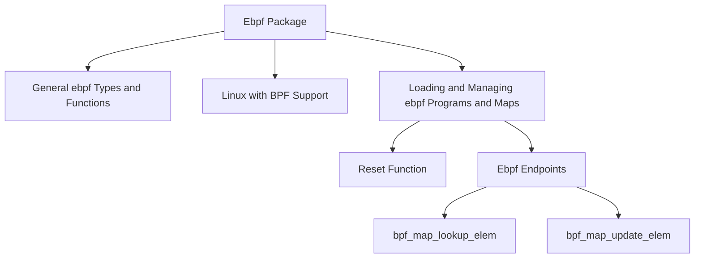

# Overview of Ebpf Package

The Ebpf package contains general <SwmToken path="pkg/ebpf/common.go" pos="6:4:4" line-data="// Package ebpf contains general eBPF related types and functions">`ebpf`</SwmToken> related types and functions. It is built specifically for Linux with BPF support, as indicated by the build tags in the files. The package includes various files such as <SwmPath>[pkg/ebpf/common.go](pkg/ebpf/common.go)</SwmPath>, <SwmPath>[cmd/process-agent/subcommands/config/config.go](cmd/process-agent/subcommands/config/config.go)</SwmPath>, <SwmPath>[comp/agent/autoexit/autoexitimpl/manager.go](comp/agent/autoexit/autoexitimpl/manager.go)</SwmPath>, <SwmPath>[pkg/ebpf/probes.go](pkg/ebpf/probes.go)</SwmPath>, <SwmPath>[comp/core/autodiscovery/listeners/types.go](comp/core/autodiscovery/listeners/types.go)</SwmPath>, and <SwmPath>[pkg/ebpf/perf.go](pkg/ebpf/perf.go)</SwmPath>.

<SwmSnippet path="/pkg/ebpf/common.go" line="6">

---

The <SwmPath>[pkg/ebpf/common.go](pkg/ebpf/common.go)</SwmPath> file in the <SwmToken path="pkg/ebpf/common.go" pos="6:4:4" line-data="// Package ebpf contains general eBPF related types and functions">`ebpf`</SwmToken> package contains general <SwmToken path="pkg/ebpf/common.go" pos="6:4:4" line-data="// Package ebpf contains general eBPF related types and functions">`ebpf`</SwmToken> related types and functions.

```go
// Package ebpf contains general eBPF related types and functions
package ebpf

import (
```

---

</SwmSnippet>

# Loading and Managing <SwmToken path="pkg/ebpf/common.go" pos="6:4:4" line-data="// Package ebpf contains general eBPF related types and functions">`ebpf`</SwmToken> Programs and Maps

The <SwmToken path="pkg/ebpf/common.go" pos="6:4:4" line-data="// Package ebpf contains general eBPF related types and functions">`ebpf`</SwmToken> package provides functionality for loading and managing <SwmToken path="pkg/ebpf/common.go" pos="6:4:4" line-data="// Package ebpf contains general eBPF related types and functions">`ebpf`</SwmToken> programs and maps. This includes various helper functions and types that facilitate the interaction with <SwmToken path="pkg/ebpf/common.go" pos="6:4:4" line-data="// Package ebpf contains general eBPF related types and functions">`ebpf`</SwmToken> components.

# Reset Function

The <SwmToken path="tasks/go.py" pos="339:2:2" line-data="def reset(ctx):">`reset`</SwmToken> function resets CO-RE and BTF loaders and manager modifiers back to an uninitialized state. This function is used in various parts of the codebase to ensure that the <SwmToken path="pkg/ebpf/common.go" pos="6:4:4" line-data="// Package ebpf contains general eBPF related types and functions">`ebpf`</SwmToken> components are properly reset.

# Ebpf Endpoints

The <SwmToken path="pkg/ebpf/common.go" pos="6:4:4" line-data="// Package ebpf contains general eBPF related types and functions">`ebpf`</SwmToken> package includes several endpoints for interacting with BPF maps. These endpoints provide functions for looking up, updating, and managing elements within BPF maps.

## <SwmToken path="pkg/ebpf/c/bpf_helper_defs.h" pos="55:7:7" line-data="static void *(*bpf_map_lookup_elem)(void *map, const void *key) = (void *) 1;">`bpf_map_lookup_elem`</SwmToken>

The <SwmToken path="pkg/ebpf/c/bpf_helper_defs.h" pos="55:7:7" line-data="static void *(*bpf_map_lookup_elem)(void *map, const void *key) = (void *) 1;">`bpf_map_lookup_elem`</SwmToken> function is used to look up an element in a specified BPF map. It takes a map and a key as arguments and returns a pointer to the value associated with the key.

<SwmSnippet path="/pkg/ebpf/c/bpf_helper_defs.h" line="55">

---

The <SwmToken path="pkg/ebpf/c/bpf_helper_defs.h" pos="55:7:7" line-data="static void *(*bpf_map_lookup_elem)(void *map, const void *key) = (void *) 1;">`bpf_map_lookup_elem`</SwmToken> function definition in the <SwmPath>[pkg/ebpf/c/bpf_helper_defs.h](pkg/ebpf/c/bpf_helper_defs.h)</SwmPath> file.

```c
static void *(*bpf_map_lookup_elem)(void *map, const void *key) = (void *) 1;
```

---

</SwmSnippet>

## <SwmToken path="pkg/ebpf/c/bpf_helper_defs.h" pos="83:6:6" line-data="static int (*bpf_map_update_elem)(void *map, const void *key, const void *value, __u64 flags) = (void *) 2;">`bpf_map_update_elem`</SwmToken>

The <SwmToken path="pkg/ebpf/c/bpf_helper_defs.h" pos="83:6:6" line-data="static int (*bpf_map_update_elem)(void *map, const void *key, const void *value, __u64 flags) = (void *) 2;">`bpf_map_update_elem`</SwmToken> function is used to update or add an element in a specified BPF map. It takes a map, a key, a value, and flags as arguments and returns an integer indicating success or failure.

<SwmSnippet path="/pkg/ebpf/c/bpf_helper_defs.h" line="83">

---

The <SwmToken path="pkg/ebpf/c/bpf_helper_defs.h" pos="83:6:6" line-data="static int (*bpf_map_update_elem)(void *map, const void *key, const void *value, __u64 flags) = (void *) 2;">`bpf_map_update_elem`</SwmToken> function definition in the <SwmPath>[pkg/ebpf/c/bpf_helper_defs.h](pkg/ebpf/c/bpf_helper_defs.h)</SwmPath> file.

```c
static int (*bpf_map_update_elem)(void *map, const void *key, const void *value, __u64 flags) = (void *) 2;
```

---

</SwmSnippet>

&nbsp;

*This is an* <SwmToken path="pkg/ebpf/c/bpf_helper_defs.h" pos="1:6:8" line-data="/* This is auto-generated file. See bpf_doc.py for details. */">`auto-generated`</SwmToken> *document by Swimm AI 🌊 and has not yet been verified by a human*

<SwmMeta version="3.0.0" repo-id="Z2l0aHViJTNBJTNBZGF0YWRvZy1hZ2VudCUzQSUzQVN3aW1tLURlbW8=" repo-name="datadog-agent"><sup>Powered by [Swimm](/)</sup></SwmMeta>
