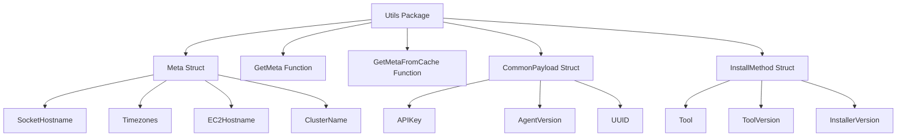

# Introduction to Host Metadata Utils

The utils package in the Datadog Agent repository is a collection of utility functions and structures designed to generate host metadata payloads. These utilities are responsible for collecting and formatting various pieces of metadata about the host, such as the hostname, timezones, and cloud provider information.

# Meta Struct

The <SwmToken path="test/integration/serverless/log_normalize.py" pos="141:1:1" line-data="                meta = span.get(&quot;meta&quot;) or {}">`meta`</SwmToken> struct within the utils package encapsulates host metadata. It includes fields like `SocketHostname`, `Timezones`, `EC2Hostname`, and `ClusterName`. This struct is essential for organizing and storing metadata in a structured format.

<SwmSnippet path="/comp/metadata/host/hostimpl/utils/host.go" line="10">

---

The utils package generates host metadata payloads ready to be sent.

```go
// Package utils generate host metadata payloads ready to be sent.
package utils

import (
```

---

</SwmSnippet>

# Retrieving Metadata

Functions like <SwmToken path="comp/metadata/host/hostimpl/utils/host.go" pos="178:5:5" line-data="	meta := GetMeta(ctx, conf)">`GetMeta`</SwmToken> and `GetMetaFromCache` are used to retrieve and cache host metadata. These functions ensure efficient access to metadata and reduce redundant data collection.

# CommonPayload Struct

The utils package also includes functionality for generating common payloads. The `CommonPayload` struct includes fields like `APIKey`, `AgentVersion`, and `UUID`. This struct is used to create standardized payloads that can be sent to the Datadog platform.

# <SwmToken path="comp/metadata/host/hostimpl/utils/host.go" pos="67:2:2" line-data="// InstallMethod is metadata about the agent&#39;s installation">`InstallMethod`</SwmToken> Struct

The <SwmToken path="comp/metadata/host/hostimpl/utils/host.go" pos="67:2:2" line-data="// InstallMethod is metadata about the agent&#39;s installation">`InstallMethod`</SwmToken> struct in the utils package includes metadata about the agent's installation, such as the tool used and its version. This information is crucial for tracking how the agent was installed and ensuring compatibility with different installation methods.

<SwmSnippet path="/comp/metadata/host/hostimpl/utils/host.go" line="67">

---

The <SwmToken path="comp/metadata/host/hostimpl/utils/host.go" pos="67:2:2" line-data="// InstallMethod is metadata about the agent&#39;s installation">`InstallMethod`</SwmToken> struct includes fields like <SwmToken path="comp/metadata/host/hostimpl/utils/host.go" pos="69:1:1" line-data="	Tool             *string `json:&quot;tool&quot;`">`Tool`</SwmToken>, <SwmToken path="comp/metadata/host/hostimpl/utils/host.go" pos="70:1:1" line-data="	ToolVersion      string  `json:&quot;tool_version&quot;`">`ToolVersion`</SwmToken>, and <SwmToken path="comp/metadata/host/hostimpl/utils/host.go" pos="71:1:1" line-data="	InstallerVersion *string `json:&quot;installer_version&quot;`">`InstallerVersion`</SwmToken>.

```go
// InstallMethod is metadata about the agent's installation
type InstallMethod struct {
	Tool             *string `json:"tool"`
	ToolVersion      string  `json:"tool_version"`
	InstallerVersion *string `json:"installer_version"`
}
```

---

</SwmSnippet>

# Internal Use

The utils package is intended for internal use and should never be imported directly. Checks should use the methods exposed by the <SwmToken path="rtloader/test/python/datadog_checks/base/checks/__init__.py" pos="2:2:2" line-data="class AgentCheck(object):  # noqa: UP004">`AgentCheck`</SwmToken> class instead.

&nbsp;

*This is an auto-generated document by Swimm AI 🌊 and has not yet been verified by a human*

<SwmMeta version="3.0.0" repo-id="Z2l0aHViJTNBJTNBZGF0YWRvZy1hZ2VudCUzQSUzQVN3aW1tLURlbW8=" repo-name="datadog-agent"><sup>Powered by [Swimm](/)</sup></SwmMeta>
