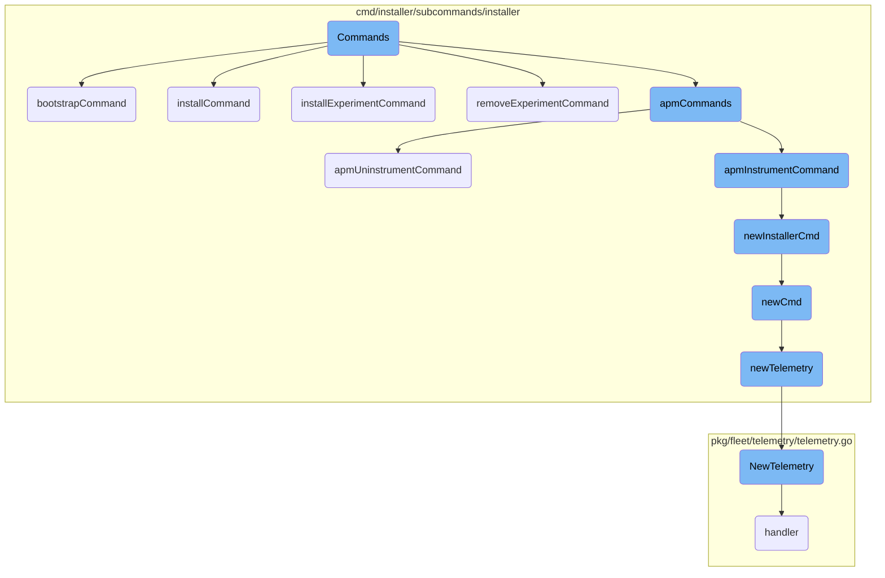
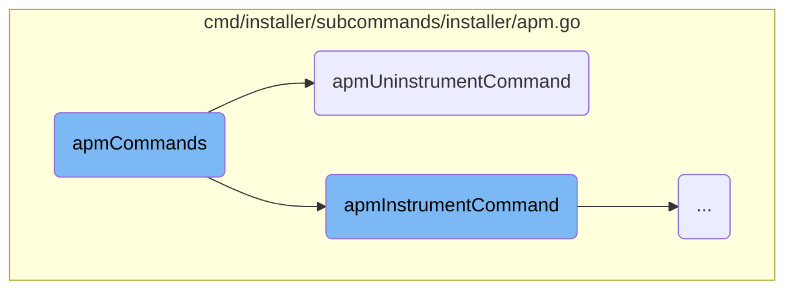
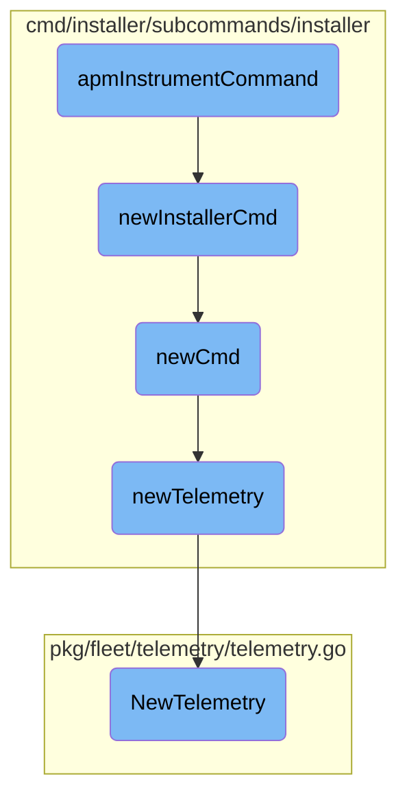

This document outlines the different commands available for managing the installation and configuration of packages. It includes commands for bootstrapping, installing, removing, and managing experimental packages, as well as commands for APM instrumentation.

The flow starts with the main <SwmToken path="cmd/installer/subcommands/installer/command.go" pos="49:2:2" line-data="// Commands returns the installer subcommands.">`Commands`</SwmToken> function, which returns a list of subcommands. Each subcommand is responsible for a specific task. For example, the <SwmToken path="cmd/installer/subcommands/installer/command.go" pos="52:1:1" line-data="		bootstrapCommand(),">`bootstrapCommand`</SwmToken> initializes the bootstrap process, while the <SwmToken path="cmd/installer/subcommands/installer/command.go" pos="53:1:1" line-data="		installCommand(),">`installCommand`</SwmToken> handles the installation of packages. There are also commands for managing experimental packages and APM instrumentation. Each command sets up its environment, initializes necessary parameters, and executes its core functionality.

Here is a high level diagram of the flow, showing only the most important functions:



# Flow drill down

First, we'll zoom into this section of the flow:

```mermaid
graph TD;
      subgraph cmdinstallersubcommandsinstaller["cmd/installer/subcommands/installer"]
0ba0323c5ddc0528bca2820e5a2d960aca34418673f7ae45c4361849aef5fdee(Commands):::mainFlowStyle --> c46dcae0a4be348d9a8c1603e0b1518f32aeaa25e8174fab23ba66ac5a7d2f29(bootstrapCommand)
end

subgraph cmdinstallersubcommandsinstaller["cmd/installer/subcommands/installer"]
0ba0323c5ddc0528bca2820e5a2d960aca34418673f7ae45c4361849aef5fdee(Commands):::mainFlowStyle --> 05d77115cc79d266f7964818fa0235f322b19ae00dd07ac6ddc70102760bedf7(installCommand)
end

subgraph cmdinstallersubcommandsinstaller["cmd/installer/subcommands/installer"]
0ba0323c5ddc0528bca2820e5a2d960aca34418673f7ae45c4361849aef5fdee(Commands):::mainFlowStyle --> 74fb96d5696de3be446e240e77dc95a73763f13aa0903284990d07c8836ac41a(installExperimentCommand)
end

subgraph cmdinstallersubcommandsinstaller["cmd/installer/subcommands/installer"]
0ba0323c5ddc0528bca2820e5a2d960aca34418673f7ae45c4361849aef5fdee(Commands):::mainFlowStyle --> 57297698bc88096e7da22ca2efbf9321b4c4688700c83d975bc7eb4598b49e07(removeExperimentCommand)
end

subgraph cmdinstallersubcommandsinstaller["cmd/installer/subcommands/installer"]
0ba0323c5ddc0528bca2820e5a2d960aca34418673f7ae45c4361849aef5fdee(Commands):::mainFlowStyle --> 8bde84a740f2001ac88105261d430a2966bda15c7cb3735513535fbdaa56aa54(apmCommands):::mainFlowStyle
end

subgraph cmdinstallersubcommandsinstaller["cmd/installer/subcommands/installer"]
8bde84a740f2001ac88105261d430a2966bda15c7cb3735513535fbdaa56aa54(apmCommands):::mainFlowStyle --> ra8tj(...)
end

subgraph pkgfleet["pkg/fleet"]
05d77115cc79d266f7964818fa0235f322b19ae00dd07ac6ddc70102760bedf7(installCommand) --> 120e4300f6db8e05745322ae37bdfd909084a3e8d9f32ad39f8e91d083621af3(Install)
end

subgraph pkgfleet["pkg/fleet"]
c46dcae0a4be348d9a8c1603e0b1518f32aeaa25e8174fab23ba66ac5a7d2f29(bootstrapCommand) --> 1741e410accba8006baad7dc0fbe8a93406285de6c808c01b2f1e028ace27983(Bootstrap)
end

subgraph cmdinstallersubcommandsinstaller["cmd/installer/subcommands/installer"]
c46dcae0a4be348d9a8c1603e0b1518f32aeaa25e8174fab23ba66ac5a7d2f29(bootstrapCommand) --> e3e26253008ec9d7a3984192b95fb2ff303f5166154469e8aeea0bb9186fc65d(newBootstraperCmd)
end


      classDef mainFlowStyle color:#000000,fill:#7CB9F4
classDef rootsStyle color:#000000,fill:#00FFF4
classDef Style1 color:#000000,fill:#00FFAA
classDef Style2 color:#000000,fill:#FFFF00
classDef Style3 color:#000000,fill:#AA7CB9
```



<SwmSnippet path="/cmd/installer/subcommands/installer/command.go" line="49">

---

## Commands Function

The <SwmToken path="cmd/installer/subcommands/installer/command.go" pos="49:2:2" line-data="// Commands returns the installer subcommands.">`Commands`</SwmToken> function returns a list of subcommands related to the installer. These subcommands include <SwmToken path="cmd/installer/subcommands/installer/command.go" pos="52:1:1" line-data="		bootstrapCommand(),">`bootstrapCommand`</SwmToken>, <SwmToken path="cmd/installer/subcommands/installer/command.go" pos="53:1:1" line-data="		installCommand(),">`installCommand`</SwmToken>, <SwmToken path="cmd/installer/subcommands/installer/command.go" pos="54:1:1" line-data="		removeCommand(),">`removeCommand`</SwmToken>, <SwmToken path="cmd/installer/subcommands/installer/command.go" pos="55:1:1" line-data="		installExperimentCommand(),">`installExperimentCommand`</SwmToken>, <SwmToken path="cmd/installer/subcommands/installer/command.go" pos="56:1:1" line-data="		removeExperimentCommand(),">`removeExperimentCommand`</SwmToken>, <SwmToken path="cmd/installer/subcommands/installer/command.go" pos="57:1:1" line-data="		promoteExperimentCommand(),">`promoteExperimentCommand`</SwmToken>, <SwmToken path="cmd/installer/subcommands/installer/command.go" pos="58:1:1" line-data="		garbageCollectCommand(),">`garbageCollectCommand`</SwmToken>, <SwmToken path="cmd/installer/subcommands/installer/command.go" pos="59:1:1" line-data="		purgeCommand(),">`purgeCommand`</SwmToken>, <SwmToken path="cmd/installer/subcommands/installer/command.go" pos="60:1:1" line-data="		isInstalledCommand(),">`isInstalledCommand`</SwmToken>, and <SwmToken path="cmd/installer/subcommands/installer/command.go" pos="61:1:1" line-data="		apmCommands(),">`apmCommands`</SwmToken>. Each subcommand is responsible for a specific task in the installation and management of packages.

```go
// Commands returns the installer subcommands.
func Commands(_ *command.GlobalParams) []*cobra.Command {
	return []*cobra.Command{
		bootstrapCommand(),
		installCommand(),
		removeCommand(),
		installExperimentCommand(),
		removeExperimentCommand(),
		promoteExperimentCommand(),
		garbageCollectCommand(),
		purgeCommand(),
		isInstalledCommand(),
		apmCommands(),
	}
}
```

---

</SwmSnippet>

<SwmSnippet path="/cmd/installer/subcommands/installer/command.go" line="201">

---

## <SwmToken path="cmd/installer/subcommands/installer/command.go" pos="201:2:2" line-data="func bootstrapCommand() *cobra.Command {">`bootstrapCommand`</SwmToken>

The <SwmToken path="cmd/installer/subcommands/installer/command.go" pos="201:2:2" line-data="func bootstrapCommand() *cobra.Command {">`bootstrapCommand`</SwmToken> function initializes the bootstrap process for the package. It sets up a command with a timeout flag and runs the <SwmToken path="cmd/installer/subcommands/installer/command.go" pos="204:5:5" line-data="		Use:     &quot;bootstrap&quot;,">`bootstrap`</SwmToken> function from the <SwmToken path="cmd/installer/subcommands/installer/command.go" pos="212:3:3" line-data="			return bootstraper.Bootstrap(ctx, b.env)">`bootstraper`</SwmToken> package. This command is essential for setting up the initial version of a package.

```go
func bootstrapCommand() *cobra.Command {
	var timeout time.Duration
	cmd := &cobra.Command{
		Use:     "bootstrap",
		Short:   "Bootstraps the package with the first version.",
		GroupID: "bootstrap",
		RunE: func(_ *cobra.Command, _ []string) (err error) {
			b := newBootstraperCmd("bootstrap")
			defer func() { b.Stop(err) }()
			ctx, cancel := context.WithTimeout(b.ctx, timeout)
			defer cancel()
			return bootstraper.Bootstrap(ctx, b.env)
		},
	}
	cmd.Flags().DurationVarP(&timeout, "timeout", "T", 3*time.Minute, "timeout to bootstrap with")
	return cmd
}
```

---

</SwmSnippet>

<SwmSnippet path="/cmd/installer/subcommands/installer/command.go" line="219">

---

## <SwmToken path="cmd/installer/subcommands/installer/command.go" pos="219:2:2" line-data="func installCommand() *cobra.Command {">`installCommand`</SwmToken>

The <SwmToken path="cmd/installer/subcommands/installer/command.go" pos="219:2:2" line-data="func installCommand() *cobra.Command {">`installCommand`</SwmToken> function handles the installation of a package from a given URL. It initializes an installer command and calls the <SwmToken path="cmd/installer/subcommands/installer/command.go" pos="222:5:5" line-data="		Use:     &quot;install &lt;url&gt;&quot;,">`install`</SwmToken> method, passing the URL and any additional installation arguments. This command is crucial for adding new packages to the system.

```go
func installCommand() *cobra.Command {
	var installArgs []string
	cmd := &cobra.Command{
		Use:     "install <url>",
		Short:   "Install a package",
		GroupID: "installer",
		Args:    cobra.ExactArgs(1),
		RunE: func(_ *cobra.Command, args []string) (err error) {
			i, err := newInstallerCmd("install")
			if err != nil {
				return err
			}
			defer func() { i.Stop(err) }()
			i.span.SetTag("params.url", args[0])
			return i.Install(i.ctx, args[0], installArgs)
		},
	}
	cmd.Flags().StringArrayVarP(&installArgs, "install_args", "A", nil, "Arguments to pass to the package")
	return cmd
}
```

---

</SwmSnippet>

<SwmSnippet path="/cmd/installer/subcommands/installer/command.go" line="278">

---

## <SwmToken path="cmd/installer/subcommands/installer/command.go" pos="278:2:2" line-data="func installExperimentCommand() *cobra.Command {">`installExperimentCommand`</SwmToken>

The <SwmToken path="cmd/installer/subcommands/installer/command.go" pos="278:2:2" line-data="func installExperimentCommand() *cobra.Command {">`installExperimentCommand`</SwmToken> function is similar to <SwmToken path="cmd/installer/subcommands/installer/command.go" pos="53:1:1" line-data="		installCommand(),">`installCommand`</SwmToken> but is specifically designed for installing experimental packages. It initializes an installer command and calls the <SwmToken path="cmd/installer/subcommands/installer/command.go" pos="291:5:5" line-data="			return i.InstallExperiment(i.ctx, args[0])">`InstallExperiment`</SwmToken> method with the provided URL.

```go
func installExperimentCommand() *cobra.Command {
	cmd := &cobra.Command{
		Use:     "install-experiment <url>",
		Short:   "Install an experiment",
		GroupID: "installer",
		Args:    cobra.ExactArgs(1),
		RunE: func(_ *cobra.Command, args []string) (err error) {
			i, err := newInstallerCmd("install_experiment")
			if err != nil {
				return err
			}
			defer func() { i.Stop(err) }()
			i.span.SetTag("params.url", args[0])
			return i.InstallExperiment(i.ctx, args[0])
		},
	}
	return cmd
}
```

---

</SwmSnippet>

<SwmSnippet path="/cmd/installer/subcommands/installer/command.go" line="297">

---

## <SwmToken path="cmd/installer/subcommands/installer/command.go" pos="297:2:2" line-data="func removeExperimentCommand() *cobra.Command {">`removeExperimentCommand`</SwmToken>

The <SwmToken path="cmd/installer/subcommands/installer/command.go" pos="297:2:2" line-data="func removeExperimentCommand() *cobra.Command {">`removeExperimentCommand`</SwmToken> function handles the removal of experimental packages. It initializes an installer command and calls the <SwmToken path="cmd/installer/subcommands/installer/command.go" pos="310:5:5" line-data="			return i.RemoveExperiment(i.ctx, args[0])">`RemoveExperiment`</SwmToken> method with the package name to be removed.

```go
func removeExperimentCommand() *cobra.Command {
	cmd := &cobra.Command{
		Use:     "remove-experiment <package>",
		Short:   "Remove an experiment",
		GroupID: "installer",
		Args:    cobra.ExactArgs(1),
		RunE: func(_ *cobra.Command, args []string) (err error) {
			i, err := newInstallerCmd("remove_experiment")
			if err != nil {
				return err
			}
			defer func() { i.Stop(err) }()
			i.span.SetTag("params.package", args[0])
			return i.RemoveExperiment(i.ctx, args[0])
		},
	}
	return cmd
}
```

---

</SwmSnippet>

<SwmSnippet path="/pkg/fleet/installer/installer.go" line="127">

---

## Install Method

The <SwmToken path="pkg/fleet/installer/installer.go" pos="127:2:2" line-data="// Install installs or updates a package.">`Install`</SwmToken> method in the <SwmToken path="pkg/fleet/installer/installer.go" pos="128:6:6" line-data="func (i *installerImpl) Install(ctx context.Context, url string, args []string) error {">`installerImpl`</SwmToken> struct is responsible for downloading, verifying, and installing a package. It checks for dependencies, ensures enough disk space, extracts package layers, and updates the database with the new package information. This method is the core of the installation process.

```go
// Install installs or updates a package.
func (i *installerImpl) Install(ctx context.Context, url string, args []string) error {
	i.m.Lock()
	defer i.m.Unlock()
	pkg, err := i.downloader.Download(ctx, url)
	if err != nil {
		return fmt.Errorf("could not download package: %w", err)
	}
	span, ok := tracer.SpanFromContext(ctx)
	if ok {
		span.SetTag(ext.ResourceName, pkg.Name)
		span.SetTag("package_version", pkg.Version)
	}

	for _, dependency := range packageDependencies[pkg.Name] {
		installed, err := i.IsInstalled(ctx, dependency)
		if err != nil {
			return fmt.Errorf("could not check if required package %s is installed: %w", dependency, err)
		}
		if !installed {
			// TODO: we should resolve the dependency version & install it instead
```

---

</SwmSnippet>

<SwmSnippet path="/pkg/fleet/bootstraper/bootstraper.go" line="24">

---

## Bootstrap Method

The <SwmToken path="pkg/fleet/bootstraper/bootstraper.go" pos="24:2:2" line-data="// Bootstrap bootstraps the installer and uses it to install the default packages.">`Bootstrap`</SwmToken> method bootstraps the installer and installs default packages. It retrieves the installer URL, installs the default packages, and handles any errors that occur during the process. This method is essential for the initial setup of the installer environment.

```go
// Bootstrap bootstraps the installer and uses it to install the default packages.
func Bootstrap(ctx context.Context, env *env.Env) error {
	version := "latest"
	if env.DefaultPackagesVersionOverride[installerPackage] != "" {
		version = env.DefaultPackagesVersionOverride[installerPackage]
	}
	installerURL := oci.PackageURL(env, installerPackage, version)
	err := bootstrap.Install(ctx, env, installerURL)
	if err != nil {
		return fmt.Errorf("failed to bootstrap the installer: %w", err)
	}

	cmd := exec.NewInstallerExec(env, exec.StableInstallerPath)
	defaultPackages, err := cmd.DefaultPackages(ctx)
	if err != nil {
		return fmt.Errorf("failed to get default packages: %w", err)
	}
	for _, url := range defaultPackages {
		err = cmd.Install(ctx, url, nil)
		if err != nil {
			fmt.Fprintf(os.Stderr, "failed to install package %s: %v\n", url, err)
```

---

</SwmSnippet>

<SwmSnippet path="/cmd/installer/subcommands/installer/command.go" line="126">

---

## <SwmToken path="cmd/installer/subcommands/installer/command.go" pos="126:2:2" line-data="func newBootstraperCmd(operation string) *bootstraperCmd {">`newBootstraperCmd`</SwmToken>

The <SwmToken path="cmd/installer/subcommands/installer/command.go" pos="126:2:2" line-data="func newBootstraperCmd(operation string) *bootstraperCmd {">`newBootstraperCmd`</SwmToken> function initializes a new bootstrap command with various environment tags. These tags are used to configure the bootstrap process and ensure that the necessary environment variables are set.

```go
func newBootstraperCmd(operation string) *bootstraperCmd {
	cmd := newCmd(operation)
	cmd.span.SetTag("env.DD_UPGRADE", os.Getenv(envUpgrade))
	cmd.span.SetTag("env.DD_APM_INSTRUMENTATION_NO_CONFIG_CHANGE", os.Getenv(envAPMInstrumentationNoConfigChange))
	cmd.span.SetTag("env.DD_SYSTEM_PROBE_ENSURE_CONFIG", os.Getenv(envSystemProbeEnsureConfig))
	cmd.span.SetTag("env.DD_RUNTIME_SECURITY_CONFIG_ENABLED", os.Getenv(envRuntimeSecurityConfigEnabled))
	cmd.span.SetTag("env.DD_COMPLIANCE_CONFIG_ENABLED", os.Getenv(envComplianceConfigEnabled))
	cmd.span.SetTag("env.DD_INSTALL_ONLY", os.Getenv(envInstallOnly))
	cmd.span.SetTag("env.DD_NO_AGENT_INSTALL", os.Getenv(envNoAgentInstall))
	cmd.span.SetTag("env.DD_APM_INSTRUMENTATION_LIBRARIES", os.Getenv(envAPMInstrumentationLibraries))
	cmd.span.SetTag("env.DD_APM_INSTRUMENTATION_LANGUAGES", os.Getenv(envAPMInstrumentationLanguages))
	cmd.span.SetTag("env.DD_APPSEC_ENABLED", os.Getenv(envAppSecEnabled))
	cmd.span.SetTag("env.DD_IAST_ENABLED", os.Getenv(envIASTEnabled))
	cmd.span.SetTag("env.DD_APM_INSTRUMENTATION_ENABLED", os.Getenv(envAPMInstrumentationEnabled))
	cmd.span.SetTag("env.DD_REPO_URL", os.Getenv(envRepoURL))
	cmd.span.SetTag("env.REPO_URL", os.Getenv(envRepoURLDeprecated))
	cmd.span.SetTag("env.DD_RPM_REPO_GPGCHECK", os.Getenv(envRPMRepoGPGCheck))
	cmd.span.SetTag("env.DD_AGENT_MAJOR_VERSION", os.Getenv(envAgentMajorVersion))
	cmd.span.SetTag("env.DD_AGENT_MINOR_VERSION", os.Getenv(envAgentMinorVersion))
	return &bootstraperCmd{
		cmd: cmd,
```

---

</SwmSnippet>

Now, lets zoom into this section of the flow:



<SwmSnippet path="/cmd/installer/subcommands/installer/apm.go" line="12">

---

## <SwmToken path="cmd/installer/subcommands/installer/apm.go" pos="12:2:2" line-data="func apmCommands() *cobra.Command {">`apmCommands`</SwmToken>

The <SwmToken path="cmd/installer/subcommands/installer/apm.go" pos="12:2:2" line-data="func apmCommands() *cobra.Command {">`apmCommands`</SwmToken> function creates a new Cobra command for interacting with the APM <SwmToken path="cmd/installer/subcommands/installer/apm.go" pos="15:13:15" line-data="		Short:   &quot;Interact with the APM auto-injector&quot;,">`auto-injector`</SwmToken>. It sets up the command with a usage description and a short description. It also groups the command under the 'apm' group and adds subcommands for instrumenting and uninstrumenting APM <SwmToken path="cmd/installer/subcommands/installer/apm.go" pos="25:9:11" line-data="		Short: &quot;Instrument APM auto-injection for a host or docker. Defaults to both.&quot;,">`auto-injection`</SwmToken>.

```go
func apmCommands() *cobra.Command {
	ctlCmd := &cobra.Command{
		Use:     "apm [command]",
		Short:   "Interact with the APM auto-injector",
		GroupID: "apm",
	}
	ctlCmd.AddCommand(apmInstrumentCommand(), apmUninstrumentCommand())
	return ctlCmd
}
```

---

</SwmSnippet>

<SwmSnippet path="/cmd/installer/subcommands/installer/apm.go" line="43">

---

## <SwmToken path="cmd/installer/subcommands/installer/apm.go" pos="43:2:2" line-data="func apmUninstrumentCommand() *cobra.Command {">`apmUninstrumentCommand`</SwmToken>

The <SwmToken path="cmd/installer/subcommands/installer/apm.go" pos="43:2:2" line-data="func apmUninstrumentCommand() *cobra.Command {">`apmUninstrumentCommand`</SwmToken> function defines a Cobra command for uninstrumenting APM <SwmToken path="cmd/installer/subcommands/installer/apm.go" pos="46:9:11" line-data="		Short: &quot;Uninstrument APM auto-injection for a host or docker. Defaults to both.&quot;,">`auto-injection`</SwmToken>. It specifies the usage and short description, and sets the maximum number of arguments to one. The command's execution logic involves creating a new installer command, handling errors, and calling the <SwmToken path="cmd/installer/subcommands/installer/apm.go" pos="58:5:5" line-data="			return i.UninstrumentAPMInjector(i.ctx, args[0])">`UninstrumentAPMInjector`</SwmToken> method with the appropriate context and arguments.

```go
func apmUninstrumentCommand() *cobra.Command {
	cmd := &cobra.Command{
		Use:   "uninstrument [all|host|docker]",
		Short: "Uninstrument APM auto-injection for a host or docker. Defaults to both.",
		Args:  cobra.MaximumNArgs(1),
		RunE: func(_ *cobra.Command, args []string) (err error) {
			i, err := newInstallerCmd("apm_uninstrument")
			if err != nil {
				return err
			}
			defer func() { i.Stop(err) }()
			if len(args) == 0 {
				args = []string{"not_set"}
			}
			i.span.SetTag("params.instrument", args[0])
			return i.UninstrumentAPMInjector(i.ctx, args[0])
		},
	}
	return cmd
}
```

---

</SwmSnippet>

Now, lets zoom into this section of the flow:



<SwmSnippet path="/cmd/installer/subcommands/installer/apm.go" line="22">

---

## APM Instrument Command

The <SwmToken path="cmd/installer/subcommands/installer/apm.go" pos="22:2:2" line-data="func apmInstrumentCommand() *cobra.Command {">`apmInstrumentCommand`</SwmToken> function sets up the APM instrumentation command. It defines the command's usage, description, and arguments. The core logic involves creating a new installer command using <SwmToken path="cmd/installer/subcommands/installer/apm.go" pos="28:8:8" line-data="			i, err := newInstallerCmd(&quot;apm_instrument&quot;)">`newInstallerCmd`</SwmToken>, setting a tag for the instrumentation parameters, and invoking the <SwmToken path="cmd/installer/subcommands/installer/apm.go" pos="37:5:5" line-data="			return i.InstrumentAPMInjector(i.ctx, args[0])">`InstrumentAPMInjector`</SwmToken> method.

```go
func apmInstrumentCommand() *cobra.Command {
	cmd := &cobra.Command{
		Use:   "instrument [all|host|docker]",
		Short: "Instrument APM auto-injection for a host or docker. Defaults to both.",
		Args:  cobra.MaximumNArgs(1),
		RunE: func(_ *cobra.Command, args []string) (err error) {
			i, err := newInstallerCmd("apm_instrument")
			if err != nil {
				return err
			}
			defer func() { i.Stop(err) }()
			if len(args) == 0 {
				args = []string{"not_set"}
			}
			i.span.SetTag("params.instrument", args[0])
			return i.InstrumentAPMInjector(i.ctx, args[0])
		},
	}
	return cmd
```

---

</SwmSnippet>

<SwmSnippet path="/cmd/installer/subcommands/installer/command.go" line="105">

---

## New Installer Command

The <SwmToken path="cmd/installer/subcommands/installer/command.go" pos="105:2:2" line-data="func newInstallerCmd(operation string) (_ *installerCmd, err error) {">`newInstallerCmd`</SwmToken> function initializes a new installer command. It calls <SwmToken path="cmd/installer/subcommands/installer/command.go" pos="106:5:5" line-data="	cmd := newCmd(operation)">`newCmd`</SwmToken> to create a base command structure and then initializes an installer instance. If any errors occur during initialization, the command is stopped and the error is returned.

```go
func newInstallerCmd(operation string) (_ *installerCmd, err error) {
	cmd := newCmd(operation)
	defer func() {
		if err != nil {
			cmd.Stop(err)
		}
	}()
	i, err := installer.NewInstaller(cmd.env)
	if err != nil {
		return nil, err
	}
	return &installerCmd{
		Installer: i,
		cmd:       cmd,
	}, nil
}
```

---

</SwmSnippet>

<SwmSnippet path="/cmd/installer/subcommands/installer/command.go" line="77">

---

## New Command

The <SwmToken path="cmd/installer/subcommands/installer/command.go" pos="77:2:2" line-data="func newCmd(operation string) *cmd {">`newCmd`</SwmToken> function creates a new command structure. It initializes the environment, telemetry, and tracing span. This setup is essential for tracking and logging the command's execution.

```go
func newCmd(operation string) *cmd {
	env := env.FromEnv()
	t := newTelemetry(env)
	span, ctx := newSpan(operation)
	setInstallerUmask(span)
	return &cmd{
		t:    t,
		ctx:  ctx,
		span: span,
		env:  env,
	}
}
```

---

</SwmSnippet>

<SwmSnippet path="/cmd/installer/subcommands/installer/command.go" line="150">

---

## New Telemetry

The <SwmToken path="cmd/installer/subcommands/installer/command.go" pos="150:2:2" line-data="func newTelemetry(env *env.Env) *telemetry.Telemetry {">`newTelemetry`</SwmToken> function initializes telemetry for the command. It checks for the presence of an API key and starts the telemetry service if the key is available. This ensures that the command's execution is monitored and logged.

```go
func newTelemetry(env *env.Env) *telemetry.Telemetry {
	if env.APIKey == "" {
		fmt.Printf("telemetry disabled: missing DD_API_KEY\n")
		return nil
	}
	t, err := telemetry.NewTelemetry(env, "datadog-installer")
	if err != nil {
		fmt.Printf("failed to initialize telemetry: %v\n", err)
		return nil
	}
	err = t.Start(context.Background())
	if err != nil {
		fmt.Printf("failed to start telemetry: %v\n", err)
		return nil
	}
	return t
}
```

---

</SwmSnippet>

<SwmSnippet path="/pkg/fleet/telemetry/telemetry.go" line="58">

---

## Telemetry Initialization

The <SwmToken path="pkg/fleet/telemetry/telemetry.go" pos="58:2:2" line-data="func NewTelemetry(env *env.Env, service string) (*Telemetry, error) {">`NewTelemetry`</SwmToken> function creates a new telemetry instance. It sets up the telemetry client, listener, and server. This function is crucial for enabling telemetry in the command, allowing for detailed monitoring and logging.

```go
func NewTelemetry(env *env.Env, service string) (*Telemetry, error) {
	endpoint := &traceconfig.Endpoint{
		Host:   fmt.Sprintf("https://%s.%s", telemetrySubdomain, strings.TrimSpace(env.Site)),
		APIKey: env.APIKey,
	}
	listener := newTelemetryListener()
	t := &Telemetry{
		telemetryClient: internaltelemetry.NewClient(http.DefaultClient, []*traceconfig.Endpoint{endpoint}, service, env.Site == "datad0g.com"),
		site:            env.Site,
		service:         service,
		listener:        listener,
		server:          &http.Server{},
		client: &http.Client{
			Transport: &http.Transport{
				Dial: listener.Dial,
			},
		},
	}
	t.server.Handler = t.handler()
	return t, nil
```

---

</SwmSnippet>

&nbsp;

*This is an auto-generated document by Swimm AI 🌊 and has not yet been verified by a human*

<SwmMeta version="3.0.0" repo-id="Z2l0aHViJTNBJTNBZGF0YWRvZy1hZ2VudCUzQSUzQVN3aW1tLURlbW8=" repo-name="datadog-agent"><sup>Powered by [Swimm](/)</sup></SwmMeta>
