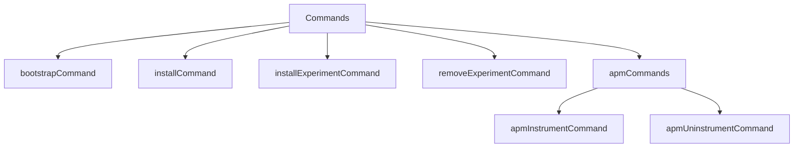

This document will cover the overview of installer commands, which includes:

1. Bootstrapping the package
2. Installing packages
3. Managing experimental packages
4. APM instrumentation.

Technical document: <SwmLink doc-title="Overview of Installer Commands">[Overview of Installer Commands](/.swm/overview-of-installer-commands.g964fcns.sw.md)</SwmLink>

# [Bootstrapping the package](https://app.swimm.io/repos/Z2l0aHViJTNBJTNBZGF0YWRvZy1hZ2VudCUzQSUzQVN3aW1tLURlbW8=/docs/g964fcns#bootstrapcommand)

The bootstrapping process initializes the package with its first version. This is essential for setting up the initial environment for the package. The command sets a timeout for the bootstrap process and ensures that the necessary environment variables are configured. This step is crucial for preparing the package for further installations and updates.

# [Installing packages](https://app.swimm.io/repos/Z2l0aHViJTNBJTNBZGF0YWRvZy1hZ2VudCUzQSUzQVN3aW1tLURlbW8=/docs/g964fcns#installcommand)

The installation command handles adding new packages to the system. It requires a URL from which the package will be downloaded. The command ensures that the package is downloaded, verified, and installed correctly. It also checks for any dependencies that the package might have and ensures that there is enough disk space for the installation. This command is vital for expanding the system's capabilities by adding new functionalities through packages.

# [Managing experimental packages](https://app.swimm.io/repos/Z2l0aHViJTNBJTNBZGF0YWRvZy1hZ2VudCUzQSUzQVN3aW1tLURlbW8=/docs/g964fcns#installexperimentcommand)

Experimental packages are handled separately from regular packages. The installExperimentCommand is used to install these packages from a given URL. This command is similar to the regular install command but is specifically designed for experimental features that are not yet stable. This allows users to test new functionalities without affecting the stability of the main system.

Removing experimental packages is managed by the removeExperimentCommand. This command ensures that any experimental package can be safely removed from the system. It requires the name of the package to be removed and handles the cleanup process to ensure that no residual files or configurations are left behind.

# [APM instrumentation](https://app.swimm.io/repos/Z2l0aHViJTNBJTNBZGF0YWRvZy1hZ2VudCUzQSUzQVN3aW1tLURlbW8=/docs/g964fcns#apmcommands)

APM (Application Performance Monitoring) instrumentation commands are used to manage the auto-injection of APM tools into the system. The apmCommands function groups these commands under a single interface. The apmInstrumentCommand is used to enable APM auto-injection for hosts or Docker environments, while the apmUninstrumentCommand disables this feature. These commands are essential for monitoring and optimizing the performance of applications running within the system.

&nbsp;

*This is an auto-generated document by Swimm AI 🌊 and has not yet been verified by a human*

<SwmMeta version="3.0.0" repo-id="Z2l0aHViJTNBJTNBZGF0YWRvZy1hZ2VudCUzQSUzQVN3aW1tLURlbW8=" repo-name="datadog-agent">Powered by [Swimm](/)</SwmMeta>
