```mermaid
classDiagram
 FlowPayload --> Endpoint
 FlowPayload : +int64 FlushTimestamp
 FlowPayload : +string FlowType
 FlowPayload : +uint64 SamplingRate
 FlowPayload : +string Direction
 FlowPayload : +uint64 Start
 FlowPayload : +uint64 End
 FlowPayload : +uint64 Bytes
 FlowPayload : +uint64 Packets
 FlowPayload : +string EtherType
 FlowPayload : +string IPProtocol
 FlowPayload : +Device Device
 FlowPayload : +Exporter Exporter
 FlowPayload : +Endpoint Source
 FlowPayload : +Endpoint Destination
 FlowPayload : +ObservationPoint Ingress
 FlowPayload : +ObservationPoint Egress
 FlowPayload : +string Host
 FlowPayload : +NextHop NextHop
 FlowPayload : +AdditionalFields additionalfields
 Endpoint : +string IP
 Endpoint : +string Port
 Endpoint : +string Mac
 Endpoint : +string Mask
 Endpoint : +string ReverseDNSHostname

%% Swimm:
%% classDiagram
%%  <SwmToken path="comp/netflow/payload/payload.go" pos="48:2:2" line-data="// FlowPayload contains network devices flows">`FlowPayload`</SwmToken> --> Endpoint
%%  <SwmToken path="comp/netflow/payload/payload.go" pos="48:2:2" line-data="// FlowPayload contains network devices flows">`FlowPayload`</SwmToken> : +int64 <SwmToken path="comp/netflow/payload/payload.go" pos="50:1:1" line-data="	FlushTimestamp   int64            `json:&quot;flush_timestamp&quot;`">`FlushTimestamp`</SwmToken>
%%  <SwmToken path="comp/netflow/payload/payload.go" pos="48:2:2" line-data="// FlowPayload contains network devices flows">`FlowPayload`</SwmToken> : +string <SwmToken path="comp/netflow/payload/payload.go" pos="51:1:1" line-data="	FlowType         string           `json:&quot;type&quot;`">`FlowType`</SwmToken>
%%  <SwmToken path="comp/netflow/payload/payload.go" pos="48:2:2" line-data="// FlowPayload contains network devices flows">`FlowPayload`</SwmToken> : +uint64 <SwmToken path="comp/netflow/payload/payload.go" pos="52:1:1" line-data="	SamplingRate     uint64           `json:&quot;sampling_rate&quot;`">`SamplingRate`</SwmToken>
%%  <SwmToken path="comp/netflow/payload/payload.go" pos="48:2:2" line-data="// FlowPayload contains network devices flows">`FlowPayload`</SwmToken> : +string Direction
%%  <SwmToken path="comp/netflow/payload/payload.go" pos="48:2:2" line-data="// FlowPayload contains network devices flows">`FlowPayload`</SwmToken> : +uint64 Start
%%  <SwmToken path="comp/netflow/payload/payload.go" pos="48:2:2" line-data="// FlowPayload contains network devices flows">`FlowPayload`</SwmToken> : +uint64 End
%%  <SwmToken path="comp/netflow/payload/payload.go" pos="48:2:2" line-data="// FlowPayload contains network devices flows">`FlowPayload`</SwmToken> : +uint64 Bytes
%%  <SwmToken path="comp/netflow/payload/payload.go" pos="48:2:2" line-data="// FlowPayload contains network devices flows">`FlowPayload`</SwmToken> : +uint64 Packets
%%  <SwmToken path="comp/netflow/payload/payload.go" pos="48:2:2" line-data="// FlowPayload contains network devices flows">`FlowPayload`</SwmToken> : +string <SwmToken path="comp/netflow/payload/payload.go" pos="58:1:1" line-data="	EtherType        string           `json:&quot;ether_type,omitempty&quot;`">`EtherType`</SwmToken>
%%  <SwmToken path="comp/netflow/payload/payload.go" pos="48:2:2" line-data="// FlowPayload contains network devices flows">`FlowPayload`</SwmToken> : +string <SwmToken path="comp/netflow/payload/payload.go" pos="59:1:1" line-data="	IPProtocol       string           `json:&quot;ip_protocol&quot;`">`IPProtocol`</SwmToken>
%%  <SwmToken path="comp/netflow/payload/payload.go" pos="48:2:2" line-data="// FlowPayload contains network devices flows">`FlowPayload`</SwmToken> : +Device Device
%%  <SwmToken path="comp/netflow/payload/payload.go" pos="48:2:2" line-data="// FlowPayload contains network devices flows">`FlowPayload`</SwmToken> : +Exporter Exporter
%%  <SwmToken path="comp/netflow/payload/payload.go" pos="48:2:2" line-data="// FlowPayload contains network devices flows">`FlowPayload`</SwmToken> : +Endpoint Source
%%  <SwmToken path="comp/netflow/payload/payload.go" pos="48:2:2" line-data="// FlowPayload contains network devices flows">`FlowPayload`</SwmToken> : +Endpoint Destination
%%  <SwmToken path="comp/netflow/payload/payload.go" pos="48:2:2" line-data="// FlowPayload contains network devices flows">`FlowPayload`</SwmToken> : +ObservationPoint Ingress
%%  <SwmToken path="comp/netflow/payload/payload.go" pos="48:2:2" line-data="// FlowPayload contains network devices flows">`FlowPayload`</SwmToken> : +ObservationPoint Egress
%%  <SwmToken path="comp/netflow/payload/payload.go" pos="48:2:2" line-data="// FlowPayload contains network devices flows">`FlowPayload`</SwmToken> : +string Host
%%  <SwmToken path="comp/netflow/payload/payload.go" pos="48:2:2" line-data="// FlowPayload contains network devices flows">`FlowPayload`</SwmToken> : +NextHop <SwmToken path="comp/netflow/payload/payload.go" pos="68:1:1" line-data="	NextHop          NextHop          `json:&quot;next_hop,omitempty&quot;`">`NextHop`</SwmToken>
%%  <SwmToken path="comp/netflow/payload/payload.go" pos="48:2:2" line-data="// FlowPayload contains network devices flows">`FlowPayload`</SwmToken> : +AdditionalFields <SwmToken path="comp/netflow/goflowlib/netflowstate/netflow.go" pos="15:18:18" line-data="	&quot;github.com/DataDog/datadog-agent/comp/netflow/goflowlib/additionalfields&quot;">`additionalfields`</SwmToken>
%%  Endpoint : +string IP
%%  Endpoint : +string Port
%%  Endpoint : +string Mac
%%  Endpoint : +string Mask
%%  Endpoint : +string <SwmToken path="comp/netflow/payload/payload.go" pos="27:1:1" line-data="	ReverseDNSHostname string `json:&quot;reverse_dns_hostname,omitempty&quot;`">`ReverseDNSHostname`</SwmToken>
```

# Overview of Netflow

Netflow is a component bundle that listens for netflow packets, processes them, and forwards relevant data to the backend. It includes several key components such as the Netflow server, state manager, and flow aggregator.

## Netflow Component Bundle

The Netflow component bundle listens for netflow packets, processes them, and forwards relevant data to the backend. This bundle is essential for monitoring and analyzing network traffic.

## Netflow State Manager

The Netflow state manager allows additional fields collection on top of the default goflow producer. This enhances the data collected from network flows, providing more detailed insights.

<SwmSnippet path="/comp/netflow/goflowlib/netflowstate/netflow.go" line="6">

---

The <SwmToken path="comp/netflow/goflowlib/netflowstate/netflow.go" pos="6:4:4" line-data="// Package netflowstate provides a Netflow state manager">`netflowstate`</SwmToken> package provides a Netflow state manager on top of the goflow default producer, allowing additional fields collection.

```go
// Package netflowstate provides a Netflow state manager
// on top of goflow default producer, to allow additional fields collection.
package netflowstate
```

---

</SwmSnippet>

## Configuring Netflow Server

The <SwmToken path="comp/netflow/server/server.go" pos="45:2:2" line-data="// newServer configures a netflow server.">`newServer`</SwmToken> function configures a Netflow server, sets up the necessary components, and starts the server if Netflow is enabled. This function is crucial for initializing the Netflow server and ensuring it operates correctly.

<SwmSnippet path="/comp/netflow/server/server.go" line="45">

---

The <SwmToken path="comp/netflow/server/server.go" pos="45:2:2" line-data="// newServer configures a netflow server.">`newServer`</SwmToken> function configures a Netflow server. It sets up the necessary components and starts the server if Netflow is enabled. This includes configuring the reverse DNS enrichment based on the configuration.

```go
// newServer configures a netflow server.
func newServer(lc fx.Lifecycle, deps dependencies) (provides, error) {
	conf := deps.Config.Get()
	sender, err := deps.Demultiplexer.GetDefaultSender()
	if err != nil {
		return provides{}, err
	}

	// Note that multiple components can share the same rdnsQuerier instance.  If any of them have
	// reverse DNS enrichment enabled then the deps.RDNSQuerier component passed here will be an
	// active instance.  However, we also need to check here whether the netflow component has
	// reverse DNS enrichment enabled to decide whether to use the passed instance or to override
	// it with a noop implementation.
	rdnsQuerier := deps.RDNSQuerier
	if conf.ReverseDNSEnrichmentEnabled {
		deps.Logger.Infof("Reverse DNS Enrichment is enabled for NDM NetFlow")
	} else {
		rdnsQuerier = rdnsquerierimplnone.NewNone().Comp
		deps.Logger.Infof("Reverse DNS Enrichment is disabled for NDM NetFlow")
	}
```

---

</SwmSnippet>

## Flow Aggregator

The Flow Aggregator aggregates and processes network flow data before sending it to the backend. This component is essential for summarizing and analyzing network traffic data.

<SwmSnippet path="/comp/netflow/flowaggregator/aggregator.go" line="80">

---

The <SwmToken path="comp/netflow/flowaggregator/aggregator.go" pos="80:2:2" line-data="// NewFlowAggregator returns a new FlowAggregator">`NewFlowAggregator`</SwmToken> function returns a new <SwmToken path="comp/netflow/flowaggregator/aggregator.go" pos="80:10:10" line-data="// NewFlowAggregator returns a new FlowAggregator">`FlowAggregator`</SwmToken>. It sets up various parameters such as flush intervals, flow context TTL, and initializes channels for processing flows.

```go
// NewFlowAggregator returns a new FlowAggregator
func NewFlowAggregator(sender sender.Sender, epForwarder eventplatform.Forwarder, config *config.NetflowConfig, hostname string, logger log.Component, rdnsQuerier rdnsquerier.Component) *FlowAggregator {
	flushInterval := time.Duration(config.AggregatorFlushInterval) * time.Second
	flowContextTTL := time.Duration(config.AggregatorFlowContextTTL) * time.Second
	rollupTrackerRefreshInterval := time.Duration(config.AggregatorRollupTrackerRefreshInterval) * time.Second
	return &FlowAggregator{
		flowIn:                       make(chan *common.Flow, config.AggregatorBufferSize),
		flowAcc:                      newFlowAccumulator(flushInterval, flowContextTTL, config.AggregatorPortRollupThreshold, config.AggregatorPortRollupDisabled, logger, rdnsQuerier),
		FlushFlowsToSendInterval:     flushFlowsToSendInterval,
		rollupTrackerRefreshInterval: rollupTrackerRefreshInterval,
		sender:                       sender,
		epForwarder:                  epForwarder,
		stopChan:                     make(chan struct{}),
		runDone:                      make(chan struct{}),
		flushLoopDone:                make(chan struct{}),
		receivedFlowCount:            atomic.NewUint64(0),
		flushedFlowCount:             atomic.NewUint64(0),
		hostname:                     hostname,
		goflowPrometheusGatherer:     prometheus.DefaultGatherer,
		TimeNowFunction:              time.Now,
		lastSequencePerExporter:      make(map[sequenceDeltaKey]uint32),
```

---

</SwmSnippet>

## Main Functions

There are several main functions in the Netflow component. These functions are responsible for listening for netflow packets, processing them, and forwarding relevant data to the backend.

### Listening for Netflow Packets

The <SwmToken path="comp/netflow/server/server.go" pos="45:2:2" line-data="// newServer configures a netflow server.">`newServer`</SwmToken> function configures a netflow server that listens for network traffic according to configured listeners and aggregates traffic data to send to the backend.

<SwmSnippet path="/comp/netflow/server/server.go" line="45">

---

The <SwmToken path="comp/netflow/server/server.go" pos="45:2:2" line-data="// newServer configures a netflow server.">`newServer`</SwmToken> function configures a netflow server. It sets up the necessary components and starts the server if Netflow is enabled. This includes configuring the reverse DNS enrichment based on the configuration.

```go
// newServer configures a netflow server.
func newServer(lc fx.Lifecycle, deps dependencies) (provides, error) {
	conf := deps.Config.Get()
	sender, err := deps.Demultiplexer.GetDefaultSender()
	if err != nil {
		return provides{}, err
	}

	// Note that multiple components can share the same rdnsQuerier instance.  If any of them have
	// reverse DNS enrichment enabled then the deps.RDNSQuerier component passed here will be an
	// active instance.  However, we also need to check here whether the netflow component has
	// reverse DNS enrichment enabled to decide whether to use the passed instance or to override
	// it with a noop implementation.
	rdnsQuerier := deps.RDNSQuerier
	if conf.ReverseDNSEnrichmentEnabled {
		deps.Logger.Infof("Reverse DNS Enrichment is enabled for NDM NetFlow")
	} else {
		rdnsQuerier = rdnsquerierimplnone.NewNone().Comp
		deps.Logger.Infof("Reverse DNS Enrichment is disabled for NDM NetFlow")
	}
```

---

</SwmSnippet>

### Processing Netflow Packets

The <SwmToken path="comp/netflow/goflowlib/netflowstate/netflow.go" pos="60:2:2" line-data="// DecodeFlow decodes a flow into common.FlowMessageWithAdditionalFields">`DecodeFlow`</SwmToken> function decodes a flow into <SwmToken path="comp/netflow/goflowlib/netflowstate/netflow.go" pos="60:12:14" line-data="// DecodeFlow decodes a flow into common.FlowMessageWithAdditionalFields">`common.FlowMessageWithAdditionalFields`</SwmToken>, processes the message, and handles any errors that occur during decoding.

<SwmSnippet path="/comp/netflow/goflowlib/netflowstate/netflow.go" line="60">

---

The <SwmToken path="comp/netflow/goflowlib/netflowstate/netflow.go" pos="60:2:2" line-data="// DecodeFlow decodes a flow into common.FlowMessageWithAdditionalFields">`DecodeFlow`</SwmToken> function decodes a flow into <SwmToken path="comp/netflow/goflowlib/netflowstate/netflow.go" pos="60:12:14" line-data="// DecodeFlow decodes a flow into common.FlowMessageWithAdditionalFields">`common.FlowMessageWithAdditionalFields`</SwmToken>. It processes the message and handles any errors that occur during decoding.

```go
// DecodeFlow decodes a flow into common.FlowMessageWithAdditionalFields
func (s *StateNetFlow) DecodeFlow(msg interface{}) error {
	pkt := msg.(utils.BaseMessage)
	buf := bytes.NewBuffer(pkt.Payload)

	key := pkt.Src.String()
	samplerAddress := pkt.Src
	if samplerAddress.To4() != nil {
		samplerAddress = samplerAddress.To4()
	}

	s.samplinglock.RLock()
	sampling, ok := s.sampling[key]
	s.samplinglock.RUnlock()
	if !ok {
		sampling = producer.CreateSamplingSystem()
		s.samplinglock.Lock()
		s.sampling[key] = sampling
		s.samplinglock.Unlock()
	}
```

---

</SwmSnippet>

## Netflow Endpoints

Netflow endpoints represent the source or destination of network flows. These endpoints are crucial for understanding the flow of data within the network.

### Endpoint

The <SwmToken path="comp/netflow/payload/payload.go" pos="21:2:2" line-data="// Endpoint contains source or destination endpoint details">`Endpoint`</SwmToken> struct contains details about a source or destination endpoint in a Netflow. It includes fields like IP address, port number, MAC address, subnet mask, and optionally, the reverse DNS hostname.

<SwmSnippet path="/comp/netflow/payload/payload.go" line="21">

---

The <SwmToken path="comp/netflow/payload/payload.go" pos="21:2:2" line-data="// Endpoint contains source or destination endpoint details">`Endpoint`</SwmToken> struct contains source or destination endpoint details. It includes fields like IP address, port number, MAC address, subnet mask, and optionally, the reverse DNS hostname.

```go
// Endpoint contains source or destination endpoint details
type Endpoint struct {
	IP                 string `json:"ip"`
	Port               string `json:"port"` // Port number can be zero/positive or `*` (ephemeral port)
	Mac                string `json:"mac"`
	Mask               string `json:"mask"`
	ReverseDNSHostname string `json:"reverse_dns_hostname,omitempty"`
}
```

---

</SwmSnippet>

### <SwmToken path="comp/netflow/payload/payload.go" pos="48:2:2" line-data="// FlowPayload contains network devices flows">`FlowPayload`</SwmToken>

The <SwmToken path="comp/netflow/payload/payload.go" pos="48:2:2" line-data="// FlowPayload contains network devices flows">`FlowPayload`</SwmToken> struct encapsulates the details of network device flows. It includes various fields such as timestamps, flow type, sampling rate, direction, byte and packet counts, protocol information, and details about the device, exporter, source, and destination endpoints.

<SwmSnippet path="/comp/netflow/payload/payload.go" line="48">

---

The <SwmToken path="comp/netflow/payload/payload.go" pos="48:2:2" line-data="// FlowPayload contains network devices flows">`FlowPayload`</SwmToken> struct contains network device flows. It includes various fields such as timestamps, flow type, sampling rate, direction, byte and packet counts, protocol information, and details about the device, exporter, source, and destination endpoints.

```go
// FlowPayload contains network devices flows
type FlowPayload struct {
	FlushTimestamp   int64            `json:"flush_timestamp"`
	FlowType         string           `json:"type"`
	SamplingRate     uint64           `json:"sampling_rate"`
	Direction        string           `json:"direction"`
	Start            uint64           `json:"start"` // in seconds
	End              uint64           `json:"end"`   // in seconds
	Bytes            uint64           `json:"bytes"`
	Packets          uint64           `json:"packets"`
	EtherType        string           `json:"ether_type,omitempty"`
	IPProtocol       string           `json:"ip_protocol"`
	Device           Device           `json:"device"`
	Exporter         Exporter         `json:"exporter"`
	Source           Endpoint         `json:"source"`
	Destination      Endpoint         `json:"destination"`
	Ingress          ObservationPoint `json:"ingress"`
	Egress           ObservationPoint `json:"egress"`
	Host             string           `json:"host"`
	TCPFlags         []string         `json:"tcp_flags,omitempty"`
	NextHop          NextHop          `json:"next_hop,omitempty"`
```

---

</SwmSnippet>

&nbsp;

*This is an auto-generated document by Swimm AI 🌊 and has not yet been verified by a human*

<SwmMeta version="3.0.0" repo-id="Z2l0aHViJTNBJTNBZGF0YWRvZy1hZ2VudCUzQSUzQVN3aW1tLURlbW8=" repo-name="datadog-agent"><sup>Powered by [Swimm](/)</sup></SwmMeta>
