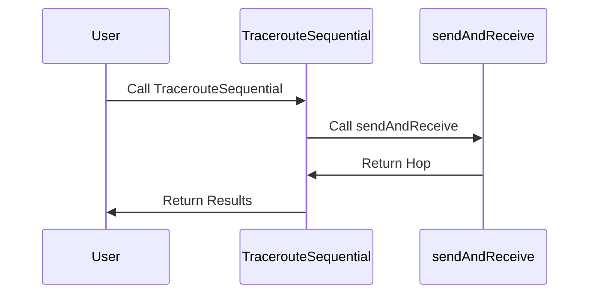

# Overview

The Networkpath component bundle in the Datadog Agent is designed to monitor network paths. It includes functionalities for tracing routes between hosts, encapsulating data about the source and destination of network paths, and recording hops along the path.

<SwmSnippet path="/pkg/networkpath/payload/payload.go" line="52">

---

# <SwmToken path="pkg/networkpath/payload/payload.go" pos="52:2:2" line-data="// NetworkPath encapsulates data that defines a">`NetworkPath`</SwmToken> Type

The <SwmToken path="pkg/networkpath/payload/payload.go" pos="52:2:2" line-data="// NetworkPath encapsulates data that defines a">`NetworkPath`</SwmToken> type defines a path between two hosts, including details like timestamp, namespace, path ID, protocol, source, destination, hops, and tags.

```go
// NetworkPath encapsulates data that defines a
// path between two hosts as mapped by the agent
type NetworkPath struct {
	Timestamp   int64                  `json:"timestamp"`
	Namespace   string                 `json:"namespace"` // namespace used to resolve NDM resources
	PathID      string                 `json:"path_id"`
	Protocol    Protocol               `json:"protocol"`
	Source      NetworkPathSource      `json:"source"`
	Destination NetworkPathDestination `json:"destination"`
	Hops        []NetworkPathHop       `json:"hops"`
	Tags        []string               `json:"tags,omitempty"`
}
```

---

</SwmSnippet>

<SwmSnippet path="/pkg/networkpath/traceroute/traceroute.go" line="39">

---

# Traceroute Interface

The <SwmToken path="pkg/networkpath/traceroute/traceroute.go" pos="39:3:3" line-data="	// Traceroute defines an interface for running">`Traceroute`</SwmToken> interface defines methods for running traceroutes for the Network Path integration.

```go
	// Traceroute defines an interface for running
	// traceroutes for the Network Path integration
	Traceroute interface {
		Run(context.Context) (payload.NetworkPath, error)
	}
```

---

</SwmSnippet>

<SwmSnippet path="/pkg/networkpath/telemetry/telemetry.go" line="28">

---

# <SwmToken path="pkg/networkpath/telemetry/telemetry.go" pos="28:2:2" line-data="// SubmitNetworkPathTelemetry submits Network Path related telemetry">`SubmitNetworkPathTelemetry`</SwmToken> Function

The <SwmToken path="pkg/networkpath/telemetry/telemetry.go" pos="28:2:2" line-data="// SubmitNetworkPathTelemetry submits Network Path related telemetry">`SubmitNetworkPathTelemetry`</SwmToken> function submits network path-related telemetry data, including check duration, check interval, and path details.

```go
// SubmitNetworkPathTelemetry submits Network Path related telemetry
func SubmitNetworkPathTelemetry(sender metricsender.MetricSender, path payload.NetworkPath, pathSource NetworkPathCollectorType, checkDuration time.Duration, checkInterval time.Duration, tags []string) {
	destPortTag := "unspecified"
	if path.Destination.Port > 0 {
		destPortTag = strconv.Itoa(int(path.Destination.Port))
	}
	newTags := append(utils.CopyStrings(tags), []string{
		"collector:" + string(pathSource),
		"protocol:" + string(path.Protocol),
		"destination_hostname:" + path.Destination.Hostname,
		"destination_port:" + destPortTag,
	}...)

	sort.Strings(newTags)

	sender.Gauge("datadog.network_path.check_duration", checkDuration.Seconds(), newTags)

	if checkInterval > 0 {
		sender.Gauge("datadog.network_path.check_interval", checkInterval.Seconds(), newTags)
	}
```

---

</SwmSnippet>

# Main Functions

There are several main functions in this folder. Some of them are <SwmToken path="pkg/networkpath/traceroute/runner.go" pos="227:9:9" line-data="func (r *Runner) processTCPResults(res *tcp.Results, hname string, destinationHost string, destinationPort uint16, destinationIP net.IP) (payload.NetworkPath, error) {">`processTCPResults`</SwmToken>, <SwmToken path="pkg/networkpath/traceroute/traceroute.go" pos="42:1:1" line-data="		Run(context.Context) (payload.NetworkPath, error)">`Run`</SwmToken>, <SwmToken path="pkg/networkpath/telemetry/telemetry.go" pos="28:2:2" line-data="// SubmitNetworkPathTelemetry submits Network Path related telemetry">`SubmitNetworkPathTelemetry`</SwmToken>, <SwmToken path="pkg/networkpath/traceroute/runner.go" pos="69:2:2" line-data="// NewRunner initializes a new traceroute runner">`NewRunner`</SwmToken>, and <SwmToken path="pkg/networkpath/telemetry/telemetry.go" pos="34:9:9" line-data="	newTags := append(utils.CopyStrings(tags), []string{">`CopyStrings`</SwmToken>. We will dive a little into <SwmToken path="pkg/networkpath/traceroute/runner.go" pos="227:9:9" line-data="func (r *Runner) processTCPResults(res *tcp.Results, hname string, destinationHost string, destinationPort uint16, destinationIP net.IP) (payload.NetworkPath, error) {">`processTCPResults`</SwmToken> and <SwmToken path="pkg/networkpath/traceroute/traceroute.go" pos="42:1:1" line-data="		Run(context.Context) (payload.NetworkPath, error)">`Run`</SwmToken>.

<SwmSnippet path="/pkg/networkpath/traceroute/runner.go" line="227">

---

# <SwmToken path="pkg/networkpath/traceroute/runner.go" pos="227:9:9" line-data="func (r *Runner) processTCPResults(res *tcp.Results, hname string, destinationHost string, destinationPort uint16, destinationIP net.IP) (payload.NetworkPath, error) {">`processTCPResults`</SwmToken>

The <SwmToken path="pkg/networkpath/traceroute/runner.go" pos="227:9:9" line-data="func (r *Runner) processTCPResults(res *tcp.Results, hname string, destinationHost string, destinationPort uint16, destinationIP net.IP) (payload.NetworkPath, error) {">`processTCPResults`</SwmToken> function processes the results of a TCP traceroute. It constructs a <SwmToken path="pkg/networkpath/traceroute/runner.go" pos="227:44:44" line-data="func (r *Runner) processTCPResults(res *tcp.Results, hname string, destinationHost string, destinationPort uint16, destinationIP net.IP) (payload.NetworkPath, error) {">`NetworkPath`</SwmToken> object, which includes details about the source, destination, and hops along the path. The function also performs a gateway lookup to get hardware interface information and appends each hop's details to the <SwmToken path="pkg/networkpath/traceroute/runner.go" pos="227:44:44" line-data="func (r *Runner) processTCPResults(res *tcp.Results, hname string, destinationHost string, destinationPort uint16, destinationIP net.IP) (payload.NetworkPath, error) {">`NetworkPath`</SwmToken> object.

```go
func (r *Runner) processTCPResults(res *tcp.Results, hname string, destinationHost string, destinationPort uint16, destinationIP net.IP) (payload.NetworkPath, error) {
	pathID := uuid.New().String()
	traceroutePath := payload.NetworkPath{
		PathID:    pathID,
		Protocol:  payload.ProtocolTCP,
		Timestamp: time.Now().UnixMilli(),
		Source: payload.NetworkPathSource{
			Hostname:  hname,
			NetworkID: r.networkID,
		},
		Destination: payload.NetworkPathDestination{
			Hostname:  getDestinationHostname(destinationHost),
			Port:      destinationPort,
			IPAddress: destinationIP.String(),
		},
	}

	// get hardware interface info
	//
	// TODO: using a gateway lookup may be a more performant
	// solution for getting the local addr to use
```

---

</SwmSnippet>

<SwmSnippet path="/pkg/networkpath/traceroute/traceroute_linux.go" line="40">

---

# Run

The <SwmToken path="pkg/networkpath/traceroute/traceroute_linux.go" pos="40:2:2" line-data="// Run executes a traceroute">`Run`</SwmToken> function executes a traceroute on a Linux system. It initializes a connection to the system probe, sends a traceroute request, and processes the response to construct a <SwmToken path="pkg/networkpath/traceroute/traceroute_linux.go" pos="41:21:21" line-data="func (l *LinuxTraceroute) Run(_ context.Context) (payload.NetworkPath, error) {">`NetworkPath`</SwmToken> object. The function also sets the source container ID in the <SwmToken path="pkg/networkpath/traceroute/traceroute_linux.go" pos="41:21:21" line-data="func (l *LinuxTraceroute) Run(_ context.Context) (payload.NetworkPath, error) {">`NetworkPath`</SwmToken> object.

```go
// Run executes a traceroute
func (l *LinuxTraceroute) Run(_ context.Context) (payload.NetworkPath, error) {
	tu, err := net.GetRemoteSystemProbeUtil(
		dd_config.SystemProbe.GetString("system_probe_config.sysprobe_socket"))
	if err != nil {
		log.Warnf("could not initialize system-probe connection: %s", err.Error())
		return payload.NetworkPath{}, err
	}

	log.Debugf("Network Path Config: %+v", l.cfg)
	resp, err := tu.GetTraceroute(clientID, l.cfg.DestHostname, l.cfg.DestPort, l.cfg.Protocol, l.cfg.MaxTTL, l.cfg.TimeoutMs)
	if err != nil {
		return payload.NetworkPath{}, err
	}

	var path payload.NetworkPath
	if err := json.Unmarshal(resp, &path); err != nil {
		return payload.NetworkPath{}, err
	}

	path.Source.ContainerID = l.cfg.SourceContainerID
```

---

</SwmSnippet>

# Networkpath Endpoints

The Networkpath component includes several endpoints for traceroute operations.

<SwmSnippet path="/pkg/networkpath/traceroute/tcp/tcpv4.go" line="57">

---

# <SwmToken path="pkg/networkpath/traceroute/tcp/tcpv4.go" pos="57:2:2" line-data="// TracerouteSequential runs a traceroute sequentially where a packet is">`TracerouteSequential`</SwmToken>

The <SwmToken path="pkg/networkpath/traceroute/tcp/tcpv4.go" pos="57:2:2" line-data="// TracerouteSequential runs a traceroute sequentially where a packet is">`TracerouteSequential`</SwmToken> function runs a <SwmToken path="pkg/networkpath/traceroute/tcp/tcpv4.go" pos="59:6:6" line-data="func (t *TCPv4) TracerouteSequential() (*Results, error) {">`TCPv4`</SwmToken> traceroute sequentially. It sends a packet and waits for a response before sending the next packet. This function initializes local addresses, creates raw ICMP and TCP listeners, and iterates through TTL values to send and receive packets. The results are encapsulated in the <SwmToken path="pkg/networkpath/traceroute/tcp/tcpv4.go" pos="59:15:15" line-data="func (t *TCPv4) TracerouteSequential() (*Results, error) {">`Results`</SwmToken> struct, which includes the source IP, source port, target IP, destination port, and discovered hops.

```go
// TracerouteSequential runs a traceroute sequentially where a packet is
// sent and we wait for a response before sending the next packet
func (t *TCPv4) TracerouteSequential() (*Results, error) {
	// Get local address for the interface that connects to this
	// host and store in in the probe
	//
	// TODO: do this once for the probe and hang on to the
	// listener until we decide to close the probe
	addr, err := localAddrForHost(t.Target, t.DestPort)
	if err != nil {
		return nil, fmt.Errorf("failed to get local address for target: %w", err)
	}
	t.srcIP = addr.IP
	t.srcPort = addr.AddrPort().Port()

	// So far I haven't had success trying to simply create a socket
	// using syscalls directly, but in theory doing so would allow us
	// to avoid creating two listeners since we could see all IP traffic
	// this way
	//
	// Create a raw ICMP listener to catch ICMP responses
```

---

</SwmSnippet>

<SwmSnippet path="/pkg/networkpath/traceroute/tcp/tcpv4.go" line="136">

---

# <SwmToken path="pkg/networkpath/traceroute/tcp/tcpv4.go" pos="136:9:9" line-data="func (t *TCPv4) sendAndReceive(rawIcmpConn *ipv4.RawConn, rawTCPConn *ipv4.RawConn, ttl int, seqNum uint32, timeout time.Duration) (*Hop, error) {">`sendAndReceive`</SwmToken>

The <SwmToken path="pkg/networkpath/traceroute/tcp/tcpv4.go" pos="136:9:9" line-data="func (t *TCPv4) sendAndReceive(rawIcmpConn *ipv4.RawConn, rawTCPConn *ipv4.RawConn, ttl int, seqNum uint32, timeout time.Duration) (*Hop, error) {">`sendAndReceive`</SwmToken> function is used within <SwmToken path="pkg/networkpath/traceroute/tcp/tcpv4.go" pos="57:2:2" line-data="// TracerouteSequential runs a traceroute sequentially where a packet is">`TracerouteSequential`</SwmToken> to send a TCP SYN packet and listen for responses. It creates a raw TCP packet with a specified TTL and sequence number, sends the packet, and listens for ICMP and TCP responses. The function returns a <SwmToken path="pkg/networkpath/traceroute/tcp/tcpv4.go" pos="136:46:46" line-data="func (t *TCPv4) sendAndReceive(rawIcmpConn *ipv4.RawConn, rawTCPConn *ipv4.RawConn, ttl int, seqNum uint32, timeout time.Duration) (*Hop, error) {">`Hop`</SwmToken> struct that includes the hop IP, port, ICMP type, round-trip time (RTT), and a flag indicating if the hop is the destination.

```go
func (t *TCPv4) sendAndReceive(rawIcmpConn *ipv4.RawConn, rawTCPConn *ipv4.RawConn, ttl int, seqNum uint32, timeout time.Duration) (*Hop, error) {
	tcpHeader, tcpPacket, err := createRawTCPSyn(t.srcIP, t.srcPort, t.Target, t.DestPort, seqNum, ttl)
	if err != nil {
		log.Errorf("failed to create TCP packet with TTL: %d, error: %s", ttl, err.Error())
		return nil, err
	}

	err = sendPacket(rawTCPConn, tcpHeader, tcpPacket)
	if err != nil {
		log.Errorf("failed to send TCP SYN: %s", err.Error())
		return nil, err
	}

	start := time.Now() // TODO: is this the best place to start?
	hopIP, hopPort, icmpType, end, err := listenPackets(rawIcmpConn, rawTCPConn, timeout, t.srcIP, t.srcPort, t.Target, t.DestPort, seqNum)
	if err != nil {
		log.Errorf("failed to listen for packets: %s", err.Error())
		return nil, err
	}
	log.Debugf("Finished loop for TTL %d", ttl)
```

---

</SwmSnippet>

&nbsp;

*This is an auto-generated document by Swimm AI 🌊 and has not yet been verified by a human*

<SwmMeta version="3.0.0" repo-id="Z2l0aHViJTNBJTNBZGF0YWRvZy1hZ2VudCUzQSUzQVN3aW1tLURlbW8=" repo-name="datadog-agent"><sup>Powered by [Swimm](/)</sup></SwmMeta>
