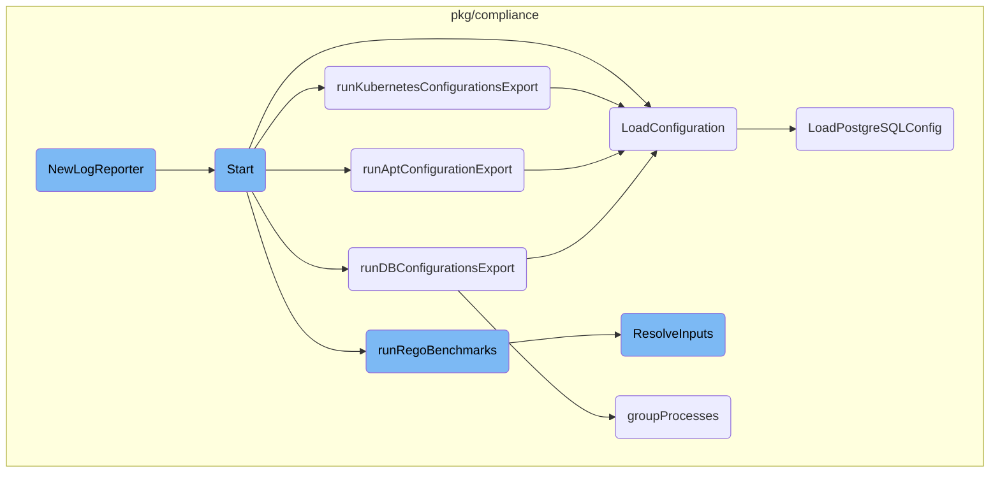
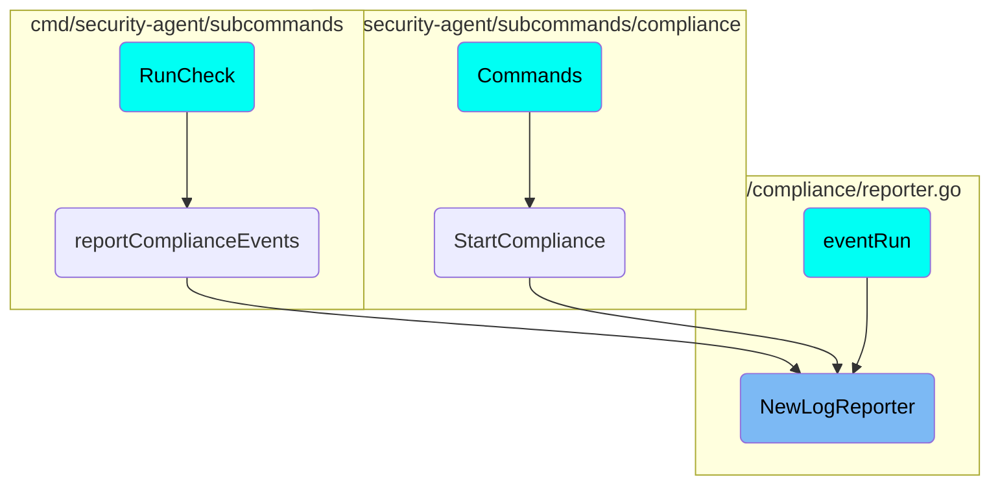

This document provides an overview of the <SwmToken path="pkg/compliance/reporter.go" pos="40:2:2" line-data="// NewLogReporter instantiates a new log LogReporter">`NewLogReporter`</SwmToken> function, which is responsible for creating a new instance of <SwmToken path="pkg/compliance/reporter.go" pos="40:12:12" line-data="// NewLogReporter instantiates a new log LogReporter">`LogReporter`</SwmToken>. It sets up essential components like the auditor, pipeline provider, and log source, and merges configuration tags before returning the <SwmToken path="pkg/compliance/reporter.go" pos="40:12:12" line-data="// NewLogReporter instantiates a new log LogReporter">`LogReporter`</SwmToken> instance.

The <SwmToken path="pkg/compliance/reporter.go" pos="40:2:2" line-data="// NewLogReporter instantiates a new log LogReporter">`NewLogReporter`</SwmToken> function starts by setting up an auditor to track logs. It then initializes a pipeline provider that manages the flow of log data. After that, it creates a log source with specific configurations. Finally, it combines tags from the configuration and returns the <SwmToken path="pkg/compliance/reporter.go" pos="40:12:12" line-data="// NewLogReporter instantiates a new log LogReporter">`LogReporter`</SwmToken> instance, which is now ready to handle log reporting tasks.

# Flow drill down



<SwmSnippet path="/pkg/compliance/reporter.go" line="40">

---

## <SwmToken path="pkg/compliance/reporter.go" pos="40:2:2" line-data="// NewLogReporter instantiates a new log LogReporter">`NewLogReporter`</SwmToken>

The <SwmToken path="pkg/compliance/reporter.go" pos="40:2:2" line-data="// NewLogReporter instantiates a new log LogReporter">`NewLogReporter`</SwmToken> function is responsible for creating a new instance of <SwmToken path="pkg/compliance/reporter.go" pos="40:12:12" line-data="// NewLogReporter instantiates a new log LogReporter">`LogReporter`</SwmToken>. It sets up an auditor, a pipeline provider, and initializes a log source. The function also merges tags from the configuration and returns the <SwmToken path="pkg/compliance/reporter.go" pos="40:12:12" line-data="// NewLogReporter instantiates a new log LogReporter">`LogReporter`</SwmToken> instance.

```go
// NewLogReporter instantiates a new log LogReporter
func NewLogReporter(hostname string, sourceName, sourceType string, endpoints *config.Endpoints, dstcontext *client.DestinationsContext) *LogReporter {
	// setup the auditor
	auditor := auditor.NewNullAuditor()
	auditor.Start()

	// setup the pipeline provider that provides pairs of processor and sender
	pipelineProvider := pipeline.NewProvider(config.NumberOfPipelines, auditor, &diagnostic.NoopMessageReceiver{}, nil, endpoints, dstcontext, agentimpl.NewStatusProvider(), hostnameimpl.NewHostnameService(), coreconfig.Datadog())
	pipelineProvider.Start()

	logSource := sources.NewLogSource(
		sourceName,
		&config.LogsConfig{
			Type:    sourceType,
			Service: sourceName,
			Source:  sourceName,
		},
	)
	logChan := pipelineProvider.NextPipelineChan()

	tags := []string{
```

---

</SwmSnippet>

<SwmSnippet path="/pkg/compliance/agent.go" line="201">

---

## Start

The <SwmToken path="pkg/compliance/agent.go" pos="201:2:2" line-data="// Start starts the compliance agent.">`Start`</SwmToken> method initializes and starts various components of the compliance agent. It sets up telemetry, loads Kubernetes configuration, and starts multiple goroutines for different configuration exporters and benchmarks. The method ensures that all components are properly started and waits for their completion.

```go
// Start starts the compliance agent.
func (a *Agent) Start() error {
	telemetry, err := telemetry.NewContainersTelemetry(a.telemetrySender, a.wmeta)
	if err != nil {
		log.Errorf("could not start containers telemetry: %v", err)
		return err
	}

	ctx, cancel := context.WithCancel(context.Background())
	a.telemetry = telemetry
	a.cancel = cancel
	a.finish = make(chan struct{})

	status.Set(
		"Checks",
		expvar.Func(func() interface{} {
			return a.getChecksStatus()
		}),
	)

	_, k8sResourceData := k8sconfig.LoadConfiguration(ctx, a.opts.HostRoot)
```

---

</SwmSnippet>

<SwmSnippet path="/pkg/compliance/agent.go" line="444">

---

### <SwmToken path="pkg/compliance/agent.go" pos="444:9:9" line-data="func (a *Agent) runDBConfigurationsExport(ctx context.Context) {">`runDBConfigurationsExport`</SwmToken>

The <SwmToken path="pkg/compliance/agent.go" pos="444:9:9" line-data="func (a *Agent) runDBConfigurationsExport(ctx context.Context) {">`runDBConfigurationsExport`</SwmToken> method periodically collects and reports database configurations. It groups processes, loads configurations, and reports them. The method handles both <SwmToken path="pkg/compliance/agent.go" pos="461:16:18" line-data="					log.Warnf(&quot;error reporting DB configuration from system-probe: %s&quot;, err)">`system-probe`</SwmToken> and direct configuration loading.

```go
func (a *Agent) runDBConfigurationsExport(ctx context.Context) {
	checkInterval := a.opts.CheckIntervalLowPriority
	runTicker := time.NewTicker(checkInterval)
	defer runTicker.Stop()

	for runCount := uint64(0); ; runCount++ {
		if sleepRandomJitter(ctx, checkInterval, runCount, a.opts.Hostname, "db-configuration") {
			return
		}
		procs, err := process.ProcessesWithContext(ctx)
		if err != nil {
			continue
		}
		groups := groupProcesses(procs, dbconfig.GetProcResourceType)
		for keyGroup, proc := range groups {
			if keyGroup.containerID != "" {
				if err := a.reportDBConfigurationFromSystemProbe(ctx, keyGroup.containerID, proc.Pid); err != nil {
					log.Warnf("error reporting DB configuration from system-probe: %s", err)
				}
			} else {
				resourceType, resource, ok := dbconfig.LoadConfiguration(ctx, a.opts.HostRoot, proc)
```

---

</SwmSnippet>

<SwmSnippet path="/pkg/compliance/agent.go" line="413">

---

### <SwmToken path="pkg/compliance/agent.go" pos="413:9:9" line-data="func (a *Agent) runAptConfigurationExport(ctx context.Context) {">`runAptConfigurationExport`</SwmToken>

The <SwmToken path="pkg/compliance/agent.go" pos="413:9:9" line-data="func (a *Agent) runAptConfigurationExport(ctx context.Context) {">`runAptConfigurationExport`</SwmToken> method filters and exports APT configurations. It uses SECL rule filters to determine if the rule is accepted and then periodically loads and reports APT configurations.

```go
func (a *Agent) runAptConfigurationExport(ctx context.Context) {
	ruleFilterModel, err := rules.NewRuleFilterModel("")
	if err != nil {
		log.Errorf("failed to run apt configuration export: %v", err)
		return
	}

	seclRuleFilter := secl.NewSECLRuleFilter(ruleFilterModel)
	accepted, err := seclRuleFilter.IsRuleAccepted(&secl.RuleDefinition{
		Filters: []string{aptconfig.SeclFilter},
	})
	if !accepted || err != nil {
		return
	}

	checkInterval := a.opts.CheckIntervalLowPriority
	runTicker := time.NewTicker(checkInterval)
	defer runTicker.Stop()

	for runCount := uint64(0); ; runCount++ {
		if sleepRandomJitter(ctx, checkInterval, runCount, a.opts.Hostname, "apt-configuration") {
```

---

</SwmSnippet>

<SwmSnippet path="/pkg/compliance/agent.go" line="392">

---

### <SwmToken path="pkg/compliance/agent.go" pos="392:9:9" line-data="func (a *Agent) runKubernetesConfigurationsExport(ctx context.Context) {">`runKubernetesConfigurationsExport`</SwmToken>

The <SwmToken path="pkg/compliance/agent.go" pos="392:9:9" line-data="func (a *Agent) runKubernetesConfigurationsExport(ctx context.Context) {">`runKubernetesConfigurationsExport`</SwmToken> method checks if the environment is Kubernetes and then periodically loads and reports Kubernetes configurations.

```go
func (a *Agent) runKubernetesConfigurationsExport(ctx context.Context) {
	if !config.IsKubernetes() {
		return
	}

	checkInterval := a.opts.CheckIntervalLowPriority
	runTicker := time.NewTicker(checkInterval)
	defer runTicker.Stop()

	for runCount := uint64(0); ; runCount++ {
		if sleepRandomJitter(ctx, checkInterval, runCount, a.opts.Hostname, "kubernetes-configuration") {
			return
		}
		k8sResourceType, k8sResourceData := k8sconfig.LoadConfiguration(ctx, a.opts.HostRoot)
		a.reportResourceLog(checkInterval, NewResourceLog(a.opts.Hostname, k8sResourceType, k8sResourceData))
		if sleepAborted(ctx, runTicker.C) {
			return
		}
	}
}
```

---

</SwmSnippet>

<SwmSnippet path="/pkg/compliance/dbconfig/loader.go" line="81">

---

### <SwmToken path="pkg/compliance/dbconfig/loader.go" pos="81:2:2" line-data="// LoadConfiguration loads and returns an optional DBResource associated with the">`LoadConfiguration`</SwmToken>

The <SwmToken path="pkg/compliance/dbconfig/loader.go" pos="81:2:2" line-data="// LoadConfiguration loads and returns an optional DBResource associated with the">`LoadConfiguration`</SwmToken> function loads and returns a database resource configuration based on the process PID. It supports multiple database types like <SwmToken path="pkg/compliance/dbconfig/loader.go" pos="228:12:12" line-data="// LoadPostgreSQLConfig loads and extracts the PostgreSQL configuration data found on the system.">`PostgreSQL`</SwmToken>, <SwmToken path="pkg/compliance/dbconfig/loader.go" pos="145:12:12" line-data="// LoadMongoDBConfig loads and extracts the MongoDB configuration data found">`MongoDB`</SwmToken>, and Cassandra.

```go
// LoadConfiguration loads and returns an optional DBResource associated with the
// given process PID.
func LoadConfiguration(ctx context.Context, rootPath string, proc *process.Process) (string, *DBConfig, bool) {
	resourceType, ok := GetProcResourceType(proc)
	if !ok {
		return "", nil, false
	}
	var conf *DBConfig
	switch resourceType {
	case postgresqlResourceType:
		conf, ok = LoadPostgreSQLConfig(ctx, rootPath, proc)
	case mongoDBResourceType:
		conf, ok = LoadMongoDBConfig(ctx, rootPath, proc)
	case cassandraResourceType:
		conf, ok = LoadCassandraConfig(ctx, rootPath, proc)
	default:
		ok = false
	}
	if !ok || conf == nil {
		return "", nil, false
	}
```

---

</SwmSnippet>

<SwmSnippet path="/pkg/compliance/agent.go" line="293">

---

### <SwmToken path="pkg/compliance/agent.go" pos="293:9:9" line-data="func (a *Agent) runRegoBenchmarks(ctx context.Context) {">`runRegoBenchmarks`</SwmToken>

The <SwmToken path="pkg/compliance/agent.go" pos="293:9:9" line-data="func (a *Agent) runRegoBenchmarks(ctx context.Context) {">`runRegoBenchmarks`</SwmToken> method loads and executes Rego benchmarks periodically. It resolves inputs for each rule and evaluates them, reporting any events or errors.

```go
func (a *Agent) runRegoBenchmarks(ctx context.Context) {
	benchmarks, err := LoadBenchmarks(a.opts.ConfigDir, "*.yaml", func(r *Rule) bool {
		return r.IsRego() && a.opts.RuleFilter(r)
	})
	if err != nil {
		log.Warnf("could not load rego benchmarks: %v", err)
		return
	}
	if len(benchmarks) == 0 {
		log.Infof("no rego benchmark to run")
		return
	}
	a.addBenchmarks(benchmarks...)

	checkInterval := a.opts.CheckInterval
	runTicker := time.NewTicker(checkInterval)
	throttler := time.NewTicker(defaultEvalThrottling)
	defer runTicker.Stop()
	defer throttler.Stop()

	log.Debugf("will be executing %d rego benchmarks every %s", len(benchmarks), checkInterval)
```

---

</SwmSnippet>

<SwmSnippet path="/pkg/compliance/resolver.go" line="170">

---

### <SwmToken path="pkg/compliance/resolver.go" pos="170:9:9" line-data="func (r *defaultResolver) ResolveInputs(ctx context.Context, rule *Rule) (ResolvedInputs, error) {">`ResolveInputs`</SwmToken>

The <SwmToken path="pkg/compliance/resolver.go" pos="170:9:9" line-data="func (r *defaultResolver) ResolveInputs(ctx context.Context, rule *Rule) (ResolvedInputs, error) {">`ResolveInputs`</SwmToken> function resolves the inputs required for a given rule. It handles various input types like files, processes, groups, audits, Docker, Kubernetes, and packages, and returns the resolved inputs.

```go
func (r *defaultResolver) ResolveInputs(ctx context.Context, rule *Rule) (ResolvedInputs, error) {
	resolvingContext := ResolvingContext{
		RuleID:     rule.ID,
		Hostname:   r.opts.Hostname,
		InputSpecs: make(map[string]*InputSpec),
	}

	// We deactivate all docker rules, or kubernetes cluster rules if adequate
	// clients could not be setup.
	if rule.HasScope(DockerScope) && r.dockerCl == nil {
		return nil, ErrIncompatibleEnvironment
	}
	if rule.HasScope(KubernetesClusterScope) && r.kubernetesCl == nil {
		return nil, ErrIncompatibleEnvironment
	}

	if len(rule.InputSpecs) == 0 {
		return nil, fmt.Errorf("no inputs for rule %s", rule.ID)
	}

	ctx, cancel := context.WithTimeout(ctx, inputsResolveTimeout)
```

---

</SwmSnippet>

<SwmSnippet path="/pkg/compliance/dbconfig/loader.go" line="228">

---

### <SwmToken path="pkg/compliance/dbconfig/loader.go" pos="228:2:2" line-data="// LoadPostgreSQLConfig loads and extracts the PostgreSQL configuration data found on the system.">`LoadPostgreSQLConfig`</SwmToken>

The <SwmToken path="pkg/compliance/dbconfig/loader.go" pos="228:2:2" line-data="// LoadPostgreSQLConfig loads and extracts the PostgreSQL configuration data found on the system.">`LoadPostgreSQLConfig`</SwmToken> function loads and extracts <SwmToken path="pkg/compliance/dbconfig/loader.go" pos="228:12:12" line-data="// LoadPostgreSQLConfig loads and extracts the PostgreSQL configuration data found on the system.">`PostgreSQL`</SwmToken> configuration data from the system. It parses command-line arguments to locate the configuration file and reads its contents.

```go
// LoadPostgreSQLConfig loads and extracts the PostgreSQL configuration data found on the system.
func LoadPostgreSQLConfig(ctx context.Context, hostroot string, proc *process.Process) (*DBConfig, bool) {
	var result DBConfig

	// Let's try to parse the -D command line argument containing the data
	// directory of PG. Configuration file may be located in this directory.
	result.ProcessUser, _ = proc.UsernameWithContext(ctx)
	result.ProcessName, _ = proc.NameWithContext(ctx)

	var hintPath string
	cmdline, _ := proc.CmdlineSlice()
	for i, arg := range cmdline {
		if arg == "-D" && i+1 < len(cmdline) {
			hintPath = filepath.Join(cmdline[i+1], "postgresql.conf")
			break
		}
		if arg == "--config-file" && i+1 < len(cmdline) {
			hintPath = filepath.Clean(cmdline[i+1])
			break
		}
		if strings.HasPrefix(arg, "--config-file=") {
```

---

</SwmSnippet>

<SwmSnippet path="/pkg/compliance/agent.go" line="528">

---

### <SwmToken path="pkg/compliance/agent.go" pos="528:2:2" line-data="func groupProcesses(procs []*process.Process, getKey func(*process.Process) (string, bool)) map[procGroup]*process.Process {">`groupProcesses`</SwmToken>

The <SwmToken path="pkg/compliance/agent.go" pos="528:2:2" line-data="func groupProcesses(procs []*process.Process, getKey func(*process.Process) (string, bool)) map[procGroup]*process.Process {">`groupProcesses`</SwmToken> function groups processes based on a key derived from the process. It deduplicates scans by grouping processes running in the same container or locally.

```go
func groupProcesses(procs []*process.Process, getKey func(*process.Process) (string, bool)) map[procGroup]*process.Process {
	groups := make(map[procGroup]*process.Process)
	for _, proc := range procs {
		key, ok := getKey(proc)
		if !ok {
			continue
		}
		// if the process does not run in any form of container, containerID
		// is the empty string "" and it can be run locally
		containerID, _ := utils.GetProcessContainerID(proc.Pid)
		// We dedupe our scans based on the resource type and the container
		// ID, assuming that we will scan the same configuration for each
		// containers running the process.
		groupKey := procGroup{
			key:         key,
			containerID: containerID,
		}
		if _, ok := groups[groupKey]; !ok {
			groups[groupKey] = proc
		}
	}
```

---

</SwmSnippet>

# Where is this flow used?

This flow is used multiple times in the codebase as represented in the following diagram:



&nbsp;

*This is an auto-generated document by Swimm AI 🌊 and has not yet been verified by a human*

<SwmMeta version="3.0.0" repo-id="Z2l0aHViJTNBJTNBZGF0YWRvZy1hZ2VudCUzQSUzQVN3aW1tLURlbW8=" repo-name="datadog-agent"><sup>Powered by [Swimm](/)</sup></SwmMeta>
