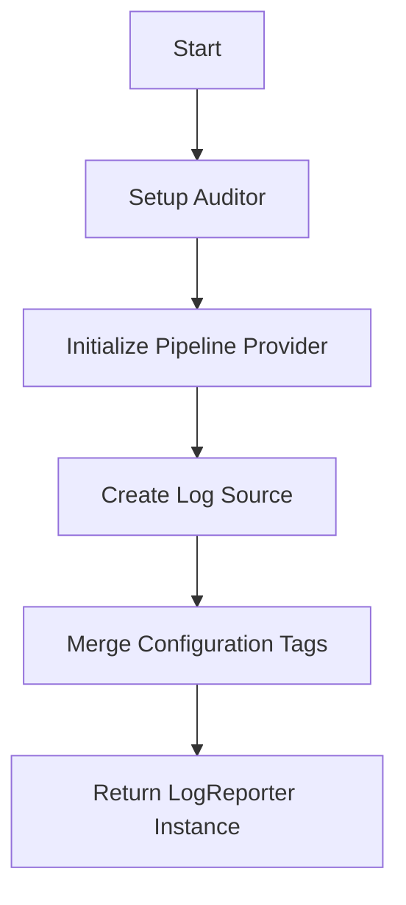

This document will cover the NewLogReporter feature, which includes:

1. Setting up the auditor
2. Initializing the pipeline provider
3. Creating the log source
4. Merging configuration tags
5. Returning the LogReporter instance.

Technical document: <SwmLink doc-title="Overview of NewLogReporter">[Overview of NewLogReporter](/.swm/overview-of-newlogreporter.0pkij0hp.sw.md)</SwmLink>

# [Setting up the auditor](https://app.swimm.io/repos/Z2l0aHViJTNBJTNBZGF0YWRvZy1hZ2VudCUzQSUzQVN3aW1tLURlbW8=/docs/0pkij0hp#setup-the-auditor)

The auditor is responsible for tracking logs to ensure that all log data is accounted for. This step involves initializing the auditor and starting it. This ensures that any log data processed by the LogReporter is tracked and can be audited if necessary.

# [Initializing the pipeline provider](https://app.swimm.io/repos/Z2l0aHViJTNBJTNBZGF0YWRvZy1hZ2VudCUzQSUzQVN3aW1tLURlbW8=/docs/0pkij0hp#setup-the-pipeline-provider-that-provides-pairs-of-processor-and-sender)

The pipeline provider manages the flow of log data. It sets up the necessary infrastructure to process and send log data. This step ensures that log data is efficiently processed and sent to the appropriate destinations.

# [Creating the log source](https://app.swimm.io/repos/Z2l0aHViJTNBJTNBZGF0YWRvZy1hZ2VudCUzQSUzQVN3aW1tLURlbW8=/docs/0pkij0hp#logsource--sourcesnewlogsource)

A log source is created with specific configurations. This includes setting the source name, type, and other relevant details. The log source acts as the origin point for log data, ensuring that logs are correctly categorized and processed.

&nbsp;

*This is an auto-generated document by Swimm AI 🌊 and has not yet been verified by a human*

<SwmMeta version="3.0.0" repo-id="Z2l0aHViJTNBJTNBZGF0YWRvZy1hZ2VudCUzQSUzQVN3aW1tLURlbW8=" repo-name="datadog-agent">Powered by [Swimm](/)</SwmMeta>
