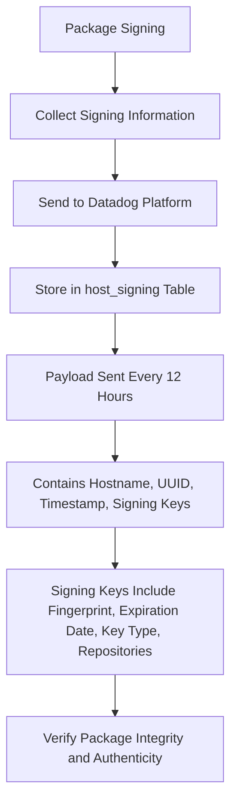

# Overview of Package Signing

Package Signing refers to the process of verifying the integrity and authenticity of Linux packages before they are installed on a system. This is achieved by using cryptographic signatures.

# Collection and Storage

The signing information is collected and sent to the Datadog platform as part of the `inventories` product. This data is stored in the `host_signing` table. The payload containing the signing information is sent every 12 hours and includes details such as the hostname, a unique identifier (UUID), timestamp, and a list of signing keys.

# Signing Keys

Each signing key in the payload includes fields like the key fingerprint, expiration date, key type, and associated repositories. This ensures that the packages are from trusted sources and have not been tampered with.

# Configuration Options

The collection of package signing metadata is enabled by default but can be turned off using the `inventories_enabled` or <SwmToken path="comp/metadata/packagesigning/packagesigningimpl/packagesigning.go" pos="142:10:10" line-data="	isInConfigurationFile := conf.GetBool(&quot;enable_signing_metadata_collection&quot;)">`enable_signing_metadata_collection`</SwmToken> configuration options.

# Payload Format

The payload is a JSON dict with a list of keys, each having the following fields: <SwmToken path="test/e2e/cws-tests/tests/lib/config.py" pos="28:4:4" line-data="def gen_datadog_agent_config(hostname=&quot;myhost&quot;, log_level=&quot;INFO&quot;, tags=None, rc_enabled=False, rc_key=None):">`hostname`</SwmToken>, <SwmToken path="comp/metadata/packagesigning/packagesigningimpl/packagesigning.go" pos="34:16:16" line-data="	&quot;github.com/DataDog/datadog-agent/pkg/util/uuid&quot;">`uuid`</SwmToken>, <SwmToken path="tasks/diff.py" pos="99:1:1" line-data="    timestamp = int(datetime.datetime.now(datetime.UTC).timestamp())">`timestamp`</SwmToken>, <SwmToken path="comp/metadata/packagesigning/packagesigningimpl/packagesigning.go" pos="66:11:11" line-data="	SigningKeys []signingKey `json:&quot;signing_keys&quot;`">`signing_keys`</SwmToken>, `fingerprint`, `expiration_date`, `key_type`, `repositories`, <SwmToken path="tasks/kernel_matrix_testing/ci.py" pos="43:3:3" line-data="    def name(self) -&gt; str:">`name`</SwmToken>, <SwmToken path="comp/metadata/packagesigning/packagesigningimpl/packagesigning.go" pos="117:5:5" line-data="	is.InventoryPayload.Enabled = isPackageSigningEnabled(deps.Config, is.log)">`Enabled`</SwmToken>, `gpgcheck`, `repo_gpgcheck`.

# Package Signing Endpoints

The <SwmToken path="comp/metadata/packagesigning/packagesigningimpl/packagesigning.go" pos="132:10:10" line-data="		Endpoint:      api.NewAgentEndpointProvider(is.writePayloadAsJSON, &quot;/metadata/package-signing&quot;, &quot;GET&quot;),">`writePayloadAsJSON`</SwmToken> function is an HTTP handler that writes the package signing payload as JSON to the response writer. It uses the <SwmToken path="comp/metadata/packagesigning/packagesigningimpl/packagesigning.go" pos="191:3:3" line-data="	// GetAsJSON already return scrubbed data">`GetAsJSON`</SwmToken> method to retrieve the scrubbed data and handles any errors by setting a JSON error response.

<SwmSnippet path="/comp/metadata/packagesigning/packagesigningimpl/packagesigning.go" line="190">

---

The <SwmToken path="comp/metadata/packagesigning/packagesigningimpl/packagesigning.go" pos="190:9:9" line-data="func (is *pkgSigning) writePayloadAsJSON(w http.ResponseWriter, _ *http.Request) {">`writePayloadAsJSON`</SwmToken> function is an HTTP handler that writes the package signing payload as JSON to the response writer. It uses the <SwmToken path="comp/metadata/packagesigning/packagesigningimpl/packagesigning.go" pos="191:3:3" line-data="	// GetAsJSON already return scrubbed data">`GetAsJSON`</SwmToken> method to retrieve the scrubbed data and handles any errors by setting a JSON error response.

```go
func (is *pkgSigning) writePayloadAsJSON(w http.ResponseWriter, _ *http.Request) {
	// GetAsJSON already return scrubbed data
	scrubbed, err := is.GetAsJSON()
	if err != nil {
		httputils.SetJSONError(w, err, 500)
		return
	}
	w.Write(scrubbed)
}
```

---

</SwmSnippet>

# Endpoint Definition

The endpoint for package signing is defined using <SwmToken path="comp/metadata/packagesigning/packagesigningimpl/packagesigning.go" pos="132:4:6" line-data="		Endpoint:      api.NewAgentEndpointProvider(is.writePayloadAsJSON, &quot;/metadata/package-signing&quot;, &quot;GET&quot;),">`api.NewAgentEndpointProvider`</SwmToken>. It specifies the handler function <SwmToken path="comp/metadata/packagesigning/packagesigningimpl/packagesigning.go" pos="132:10:10" line-data="		Endpoint:      api.NewAgentEndpointProvider(is.writePayloadAsJSON, &quot;/metadata/package-signing&quot;, &quot;GET&quot;),">`writePayloadAsJSON`</SwmToken>, the URL path <SwmPath>[test/new-e2e/tests/agent-platform/package-signing/](test/new-e2e/tests/agent-platform/package-signing/)</SwmPath>, and the HTTP method <SwmToken path="comp/metadata/packagesigning/packagesigningimpl/packagesigning.go" pos="132:24:24" line-data="		Endpoint:      api.NewAgentEndpointProvider(is.writePayloadAsJSON, &quot;/metadata/package-signing&quot;, &quot;GET&quot;),">`GET`</SwmToken>.

<SwmSnippet path="/comp/metadata/packagesigning/packagesigningimpl/packagesigning.go" line="128">

---

The endpoint for package signing is defined using <SwmToken path="comp/metadata/packagesigning/packagesigningimpl/packagesigning.go" pos="132:4:6" line-data="		Endpoint:      api.NewAgentEndpointProvider(is.writePayloadAsJSON, &quot;/metadata/package-signing&quot;, &quot;GET&quot;),">`api.NewAgentEndpointProvider`</SwmToken>. It specifies the handler function <SwmToken path="comp/metadata/packagesigning/packagesigningimpl/packagesigning.go" pos="132:10:10" line-data="		Endpoint:      api.NewAgentEndpointProvider(is.writePayloadAsJSON, &quot;/metadata/package-signing&quot;, &quot;GET&quot;),">`writePayloadAsJSON`</SwmToken>, the URL path <SwmPath>[test/new-e2e/tests/agent-platform/package-signing/](test/new-e2e/tests/agent-platform/package-signing/)</SwmPath>, and the HTTP method <SwmToken path="comp/metadata/packagesigning/packagesigningimpl/packagesigning.go" pos="132:24:24" line-data="		Endpoint:      api.NewAgentEndpointProvider(is.writePayloadAsJSON, &quot;/metadata/package-signing&quot;, &quot;GET&quot;),">`GET`</SwmToken>.

```go
	return provides{
		Comp:          is,
		Provider:      provider,
		FlareProvider: is.FlareProvider(),
		Endpoint:      api.NewAgentEndpointProvider(is.writePayloadAsJSON, "/metadata/package-signing", "GET"),
	}
```

---

</SwmSnippet>

&nbsp;

*This is an auto-generated document by Swimm AI 🌊 and has not yet been verified by a human*

<SwmMeta version="3.0.0" repo-id="Z2l0aHViJTNBJTNBZGF0YWRvZy1hZ2VudCUzQSUzQVN3aW1tLURlbW8=" repo-name="datadog-agent"><sup>Powered by [Swimm](/)</sup></SwmMeta>
