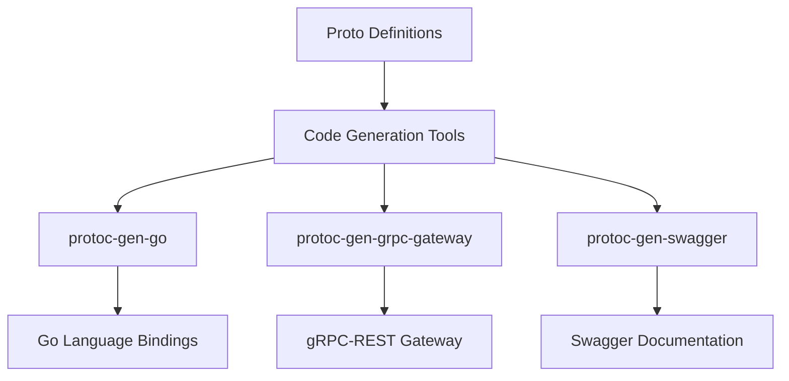

# Overview of Protocol Buffers

Protocol Buffers (protobuf) is a language-neutral, platform-neutral, extensible mechanism for serializing structured data. It is used extensively in the Datadog Agent for defining the structure of data and services for <SwmToken path="pkg/proto/datadog/api/v1/api.proto" pos="19:8:8" line-data="            get: &quot;/v1/grpc/host&quot;">`grpc`</SwmToken> communication.

## Proto Definitions and Code Generation

The <SwmToken path="pkg/proto/datadog/api/v1/api.proto" pos="5:10:11" line-data="import &quot;datadog/model/v1/model.proto&quot;;">`.proto`</SwmToken> files define the structure of the data and the services for <SwmToken path="pkg/proto/datadog/api/v1/api.proto" pos="19:8:8" line-data="            get: &quot;/v1/grpc/host&quot;">`grpc`</SwmToken> communication. The code generation process involves using tools like `protoc-gen-go` to generate Go language bindings from these <SwmToken path="pkg/proto/datadog/api/v1/api.proto" pos="5:10:11" line-data="import &quot;datadog/model/v1/model.proto&quot;;">`.proto`</SwmToken> files. Additionally, `protoc-gen-grpc-gateway` is used to generate a gRPC-REST gateway, enabling RESTful HTTP API access to the <SwmToken path="pkg/proto/datadog/api/v1/api.proto" pos="19:8:8" line-data="            get: &quot;/v1/grpc/host&quot;">`grpc`</SwmToken> services. Optional tools like `protoc-gen-swagger` can be used to generate Swagger documentation for the APIs.

## <SwmToken path="pkg/proto/datadog/api/v1/api.proto" pos="19:8:8" line-data="            get: &quot;/v1/grpc/host&quot;">`grpc`</SwmToken>: Protobuf and Gateway Code Generation

This section explains the packages needed for generating code from <SwmToken path="pkg/proto/datadog/api/v1/api.proto" pos="5:10:11" line-data="import &quot;datadog/model/v1/model.proto&quot;;">`.proto`</SwmToken> files, including `protoc-gen-go` for Go language bindings and `protoc-gen-grpc-gateway` for gRPC-REST gateway.

<SwmSnippet path="/pkg/proto/datadog/process/process.proto" line="1">

---

This example defines a simple <SwmToken path="pkg/proto/datadog/api/v1/api.proto" pos="5:10:11" line-data="import &quot;datadog/model/v1/model.proto&quot;;">`.proto`</SwmToken> file for a process-related service, showing how to structure data and service definitions. The <SwmToken path="pkg/proto/datadog/process/process.proto" pos="7:2:2" line-data="// ProcessStatRequest is the request to get process stats.">`ProcessStatRequest`</SwmToken> message includes a repeated field of process <SwmToken path="tasks/gitlab_helpers.py" pos="90:10:10" line-data="def print_gitlab_object(get_object, ctx, ids, repo=&#39;DataDog/datadog-agent&#39;, jq: str | None = None, jq_colors=True):">`ids`</SwmToken>.

```protocol buffer
syntax = "proto3";

package datadog.process;

option go_package = "pkg/proto/pbgo/process"; // golang

// ProcessStatRequest is the request to get process stats.
message ProcessStatRequest {
  repeated int32 pids = 1;
}
```

---

</SwmSnippet>

<SwmSnippet path="/pkg/proto/datadog/trace/span.proto" line="1">

---

This example provides another <SwmToken path="pkg/proto/datadog/api/v1/api.proto" pos="5:10:11" line-data="import &quot;datadog/model/v1/model.proto&quot;;">`.proto`</SwmToken> file for tracing spans, illustrating the use of various data types and options. The <SwmToken path="pkg/proto/datadog/trace/span.proto" pos="7:2:2" line-data="message SpanLink {">`SpanLink`</SwmToken> message includes fields for trace ID and other metadata.

```protocol buffer
syntax = "proto3";

package datadog.trace;

option go_package="pkg/proto/pbgo/trace";

message SpanLink {
   // @gotags: json:"trace_id" msg:"trace_id"
   uint64 traceID = 1;                         // Required.
   // @gotags: json:"trace_id_high" msg:"trace_id_high,omitempty"
```

---

</SwmSnippet>

## Agent and <SwmToken path="pkg/proto/datadog/api/v1/api.proto" pos="24:2:2" line-data="service AgentSecure {">`AgentSecure`</SwmToken> APIs

The Agent and <SwmToken path="pkg/proto/datadog/api/v1/api.proto" pos="24:2:2" line-data="service AgentSecure {">`AgentSecure`</SwmToken> APIs define various endpoints for interacting with the Datadog Agent. These endpoints are accessible via <SwmToken path="pkg/proto/datadog/api/v1/api.proto" pos="19:8:8" line-data="            get: &quot;/v1/grpc/host&quot;">`grpc`</SwmToken> calls and are mapped to HTTP methods for RESTful access.

<SwmSnippet path="/pkg/proto/datadog/api/v1/api.proto" line="15">

---

The <SwmToken path="pkg/proto/datadog/api/v1/api.proto" pos="17:3:3" line-data="    rpc GetHostname (datadog.model.v1.HostnameRequest) returns (datadog.model.v1.HostnameReply) {">`GetHostname`</SwmToken> endpoint is part of the <SwmToken path="pkg/proto/datadog/api/v1/api.proto" pos="15:2:2" line-data="service Agent {">`Agent`</SwmToken> service. It is defined to get the hostname of the agent and is accessible via a <SwmToken path="pkg/proto/datadog/api/v1/api.proto" pos="19:8:8" line-data="            get: &quot;/v1/grpc/host&quot;">`grpc`</SwmToken> call. It is mapped to the HTTP GET method at the path <SwmPath>[comp/core/workloadmeta/collectors/internal/host/](comp/core/workloadmeta/collectors/internal/host/)</SwmPath>, allowing clients to retrieve the hostname by making a GET request to this URL.

```protocol buffer
service Agent {
    // get the hostname
    rpc GetHostname (datadog.model.v1.HostnameRequest) returns (datadog.model.v1.HostnameReply) {
        option (google.api.http) = {
            get: "/v1/grpc/host"
        };
    }
```

---

</SwmSnippet>

<SwmSnippet path="/pkg/proto/datadog/api/v1/api.proto" line="25">

---

The <SwmToken path="pkg/proto/datadog/api/v1/api.proto" pos="45:3:3" line-data="    rpc TaggerStreamEntities(datadog.model.v1.StreamTagsRequest) returns (stream datadog.model.v1.StreamTagsResponse) {">`TaggerStreamEntities`</SwmToken> endpoint is part of the <SwmToken path="pkg/proto/datadog/api/v1/api.proto" pos="24:2:2" line-data="service AgentSecure {">`AgentSecure`</SwmToken> service. It subscribes to added, removed, or changed entities in the Tagger and streams them to clients as events. This endpoint can be accessed via a <SwmToken path="pkg/proto/datadog/api/v1/api.proto" pos="29:17:17" line-data="    //      -XPOST -k https://localhost:5001/v1/grpc/tagger/stream_entities">`grpc`</SwmToken> call and is mapped to the HTTP POST method at the path <SwmToken path="pkg/proto/datadog/api/v1/api.proto" pos="29:14:21" line-data="    //      -XPOST -k https://localhost:5001/v1/grpc/tagger/stream_entities">`/v1/grpc/tagger/stream_entities`</SwmToken>. Clients can stream entity events by making a POST request to this URL.

```protocol buffer
    // subscribes to added, removed, or changed entities in the Tagger
    // and streams them to clients as events.
    // can be called through the HTTP gateway, and events will be streamed as JSON:
    //   $  curl -H "authorization: Bearer $(cat /etc/datadog-agent/auth_token)" \
    //      -XPOST -k https://localhost:5001/v1/grpc/tagger/stream_entities
    //   {
    //    "result": {
    //        "entity": {
    //            "id": {
    //                "prefix": "kubernetes_pod_uid",
    //                "uid": "4025461f832caf3fceb7fc2a32f879c6"
    //            },
    //            "hash": "cad4fc8fc409fcc1",
    //            "lowCardinalityTags": [
    //                "kube_namespace:kube-system",
    //                "pod_phase:running"
    //            ]
    //        }
    //    }
    //}
    rpc TaggerStreamEntities(datadog.model.v1.StreamTagsRequest) returns (stream datadog.model.v1.StreamTagsResponse) {
```

---

</SwmSnippet>

&nbsp;

*This is an auto-generated document by Swimm AI 🌊 and has not yet been verified by a human*

<SwmMeta version="3.0.0" repo-id="Z2l0aHViJTNBJTNBZGF0YWRvZy1hZ2VudCUzQSUzQVN3aW1tLURlbW8=" repo-name="datadog-agent"><sup>Powered by [Swimm](/)</sup></SwmMeta>
