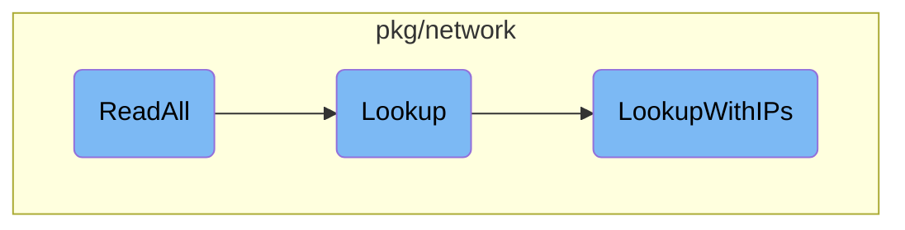
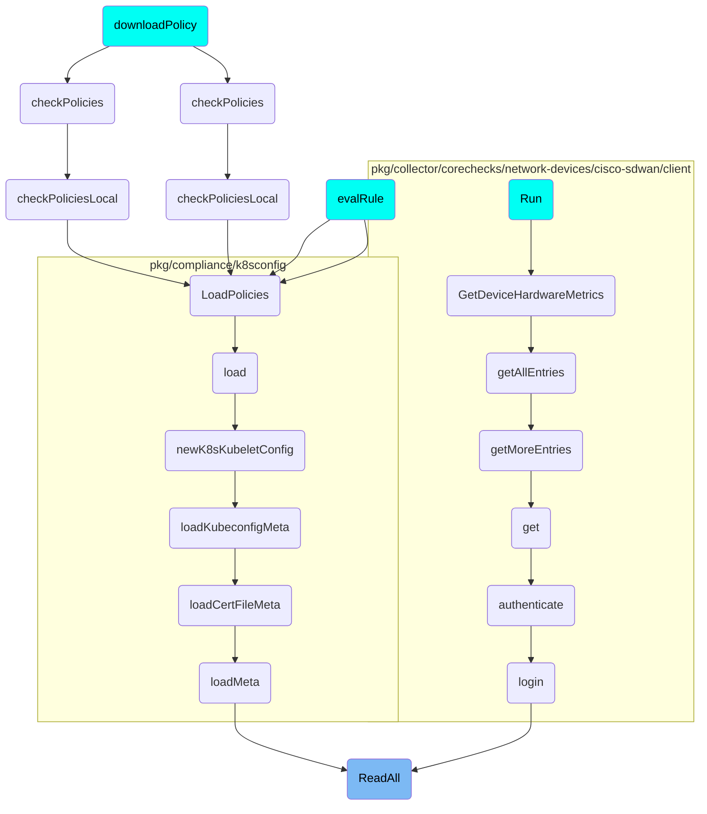

This document explains the <SwmToken path="pkg/network/protocols/events/batch_reader.go" pos="58:2:2" line-data="// ReadAll batches from eBPF (concurrently) and execute the given">`ReadAll`</SwmToken> function, which is responsible for batching data from <SwmToken path="pkg/network/protocols/events/batch_reader.go" pos="58:8:8" line-data="// ReadAll batches from eBPF (concurrently) and execute the given">`eBPF`</SwmToken> and executing a callback function for each batch. It uses a worker pool to process batches concurrently across multiple <SwmToken path="tasks/gotest.py" pos="247:1:1" line-data="    cpus=None,">`cpus`</SwmToken>, ensuring synchronization and proper termination of goroutines.

The <SwmToken path="pkg/network/protocols/events/batch_reader.go" pos="58:2:2" line-data="// ReadAll batches from eBPF (concurrently) and execute the given">`ReadAll`</SwmToken> function starts by locking to ensure synchronization. It then checks if the process has been stopped. If not, it initializes a wait group to manage multiple <SwmToken path="tasks/gotest.py" pos="247:1:1" line-data="    cpus=None,">`cpus`</SwmToken>. For each CPU, it enqueues a job in the worker pool to process a batch of data. Once all jobs are done, it waits for all goroutines to complete before returning.

# Flow drill down



<SwmSnippet path="/pkg/network/protocols/events/batch_reader.go" line="58">

---

## <SwmToken path="pkg/network/protocols/events/batch_reader.go" pos="58:2:2" line-data="// ReadAll batches from eBPF (concurrently) and execute the given">`ReadAll`</SwmToken>

The <SwmToken path="pkg/network/protocols/events/batch_reader.go" pos="58:2:2" line-data="// ReadAll batches from eBPF (concurrently) and execute the given">`ReadAll`</SwmToken> function is responsible for batching data from <SwmToken path="pkg/network/protocols/events/batch_reader.go" pos="58:8:8" line-data="// ReadAll batches from eBPF (concurrently) and execute the given">`eBPF`</SwmToken> and executing a callback function for each batch. It uses a worker pool to process batches concurrently across multiple <SwmToken path="tasks/gotest.py" pos="247:1:1" line-data="    cpus=None,">`cpus`</SwmToken>. The function ensures synchronization using a lock and waits for all goroutines to complete before returning.

```go
// ReadAll batches from eBPF (concurrently) and execute the given
// callback function for each batch
func (r *batchReader) ReadAll(f func(cpu int, b *batch)) {
	// This lock is used only for the purposes of synchronizing termination
	// and it's only held while *enqueing* the jobs.
	r.Lock()
	if r.stopped {
		r.Unlock()
		return
	}

	var wg sync.WaitGroup
	wg.Add(r.numCPUs)

	for i := 0; i < r.numCPUs; i++ {
		cpu := i // required to properly capture this variable in the function closure
		r.workerPool.Do(func() {
			defer wg.Done()
			batchID, key := r.generateBatchKey(cpu)

			b := batchPool.Get()
```

---

</SwmSnippet>

<SwmSnippet path="/pkg/network/gateway_lookup_linux.go" line="114">

---

## Lookup

The <SwmToken path="pkg/network/gateway_lookup_linux.go" pos="114:2:2" line-data="// Lookup performs a gateway lookup for connection stats">`Lookup`</SwmToken> function performs a gateway lookup for connection statistics. It determines the destination IP address and then calls <SwmToken path="pkg/network/gateway_lookup_linux.go" pos="121:5:5" line-data="	return g.LookupWithIPs(cs.Source, dest, cs.NetNS)">`LookupWithIPs`</SwmToken> to perform the actual lookup using the source and destination <SwmToken path="tasks/kernel_matrix_testing/ci.py" pos="126:1:1" line-data="        ips: set[str] = set()">`ips`</SwmToken> along with the network namespace.

```go
// Lookup performs a gateway lookup for connection stats
func (g *gatewayLookup) Lookup(cs *ConnectionStats) *Via {
	dest := cs.Dest
	if cs.IPTranslation != nil {
		dest = cs.IPTranslation.ReplSrcIP
	}

	return g.LookupWithIPs(cs.Source, dest, cs.NetNS)
}
```

---

</SwmSnippet>

<SwmSnippet path="/pkg/network/gateway_lookup_linux.go" line="124">

---

## <SwmToken path="pkg/network/gateway_lookup_linux.go" pos="124:2:2" line-data="// LookupWithIPs performs a gateway lookup given the">`LookupWithIPs`</SwmToken>

The <SwmToken path="pkg/network/gateway_lookup_linux.go" pos="124:2:2" line-data="// LookupWithIPs performs a gateway lookup given the">`LookupWithIPs`</SwmToken> function performs a gateway lookup given the source, destination, and namespace. It first checks the route cache for an existing entry. If no gateway is found, it returns nil. Otherwise, it looks up the subnet information, caches the result, and returns the gateway information. The function also handles various error conditions and updates telemetry metrics.

```go
// LookupWithIPs performs a gateway lookup given the
// source, destination, and namespace
func (g *gatewayLookup) LookupWithIPs(source util.Address, dest util.Address, netns uint32) *Via {
	r, ok := g.routeCache.Get(source, dest, netns)
	if !ok {
		return nil
	}

	// if there is no gateway, we don't need to add subnet info
	// for gateway resolution in the backend
	if r.Gateway.IsZero() || r.Gateway.IsUnspecified() {
		return nil
	}

	gatewayLookupTelemetry.subnetCacheLookups.Inc()
	v, ok := g.subnetCache.Get(r.IfIndex)
	if !ok {
		gatewayLookupTelemetry.subnetCacheMisses.Inc()

		var s Subnet
		var err error
```

---

</SwmSnippet>

# Where is this flow used?

This flow is used multiple times in the codebase as represented in the following diagram:

(Note - these are only some of the entry points of this flow)



&nbsp;

*This is an auto-generated document by Swimm AI 🌊 and has not yet been verified by a human*

<SwmMeta version="3.0.0" repo-id="Z2l0aHViJTNBJTNBZGF0YWRvZy1hZ2VudCUzQSUzQVN3aW1tLURlbW8=" repo-name="datadog-agent"><sup>Powered by [Swimm](/)</sup></SwmMeta>
