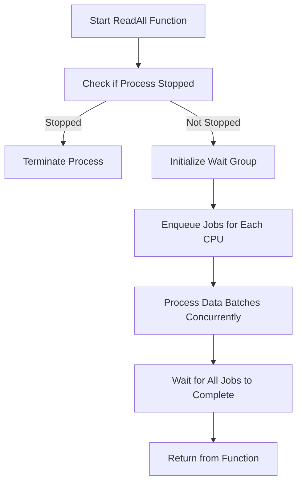

This document will cover the ReadAll function, which includes:

1. Synchronizing the process
2. Managing multiple <SwmToken path="tasks/gotest.py" pos="247:1:1" line-data="    cpus=None,">`cpus`</SwmToken>
3. Processing data batches concurrently
4. Ensuring proper termination

Technical document: <SwmLink doc-title="Overview of ReadAll Function">[Overview of ReadAll Function](/.swm/overview-of-readall-function.pgdwp9w8.sw.md)</SwmLink>

# [Synchronizing the process](https://app.swimm.io/repos/Z2l0aHViJTNBJTNBZGF0YWRvZy1hZ2VudCUzQSUzQVN3aW1tLURlbW8=/docs/pgdwp9w8#the-readall-function-starts-by-locking-to-ensure-synchronization)

The ReadAll function begins by locking the process to ensure that no other operations interfere with its execution. This is crucial for maintaining data integrity and preventing race conditions. By locking the process, we ensure that the function can safely check the status and proceed without interruptions.

# [Managing multiple CPUs](https://app.swimm.io/repos/Z2l0aHViJTNBJTNBZGF0YWRvZy1hZ2VudCUzQSUzQVN3aW1tLURlbW8=/docs/pgdwp9w8#it-then-checks-if-the-process-has-been-stopped-if-not-it-initializes-a-wait-group-to-manage-multiple-cpus)

After ensuring synchronization, the function checks if the process has been stopped. If the process is still active, it initializes a wait group. This wait group is responsible for managing the tasks across multiple <SwmToken path="tasks/gotest.py" pos="247:1:1" line-data="    cpus=None,">`cpus`</SwmToken>. By using a wait group, we can efficiently distribute the workload and ensure that all <SwmToken path="tasks/gotest.py" pos="247:1:1" line-data="    cpus=None,">`cpus`</SwmToken> are utilized effectively.

&nbsp;

*This is an auto-generated document by Swimm AI 🌊 and has not yet been verified by a human*

<SwmMeta version="3.0.0" repo-id="Z2l0aHViJTNBJTNBZGF0YWRvZy1hZ2VudCUzQSUzQVN3aW1tLURlbW8=" repo-name="datadog-agent">Powered by [Swimm](/)</SwmMeta>
