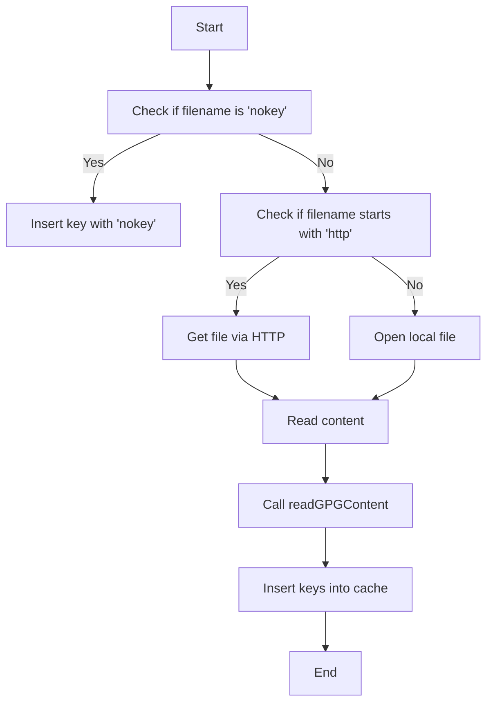

## Introduction

The <SwmToken path="comp/metadata/packagesigning/packagesigningimpl/readgpg.go" pos="39:2:2" line-data="// readGPGFile parse a gpg file (local or http) and extract signing keys information">`readGPGFile`</SwmToken> function is responsible for parsing GPG files, which can be either local or accessed via HTTP, to extract signing keys information. This function handles various scenarios, including cases where the GPG file might not contain a key or there is an issue retrieving the URI content.

## Functionality

The function reads the content of the GPG file and then calls another function, <SwmToken path="comp/metadata/packagesigning/packagesigningimpl/readgpg.go" pos="74:2:2" line-data="// readGPGContent extract keys from a byte slice (direct usage when reading from rpm db)">`readGPGContent`</SwmToken>, to extract the keys from the byte slice. The extracted keys are then inserted into a cache, which is a map of signing keys, using the <SwmToken path="comp/metadata/packagesigning/packagesigningimpl/readgpg.go" pos="46:1:1" line-data="		insertKey(cacheKeys, gpgFile.filename, epochDate, nil, keyType, gpgFile.repositories)">`insertKey`</SwmToken> function. This process ensures that the signing keys are properly cached and associated with the relevant repositories.

<SwmSnippet path="/comp/metadata/packagesigning/packagesigningimpl/readgpg.go" line="39">

---

The <SwmToken path="comp/metadata/packagesigning/packagesigningimpl/readgpg.go" pos="39:2:2" line-data="// readGPGFile parse a gpg file (local or http) and extract signing keys information">`readGPGFile`</SwmToken> function starts by checking if the filename is 'nokey'. If it is, it inserts a key with 'nokey' and returns. If the filename starts with 'http', it retrieves the file via HTTP. Otherwise, it opens the local file.

```go
// readGPGFile parse a gpg file (local or http) and extract signing keys information
// Some files can contain a list of repositories.
// We insert information even if the key is not found (nokey file or issue in getting the URI content)
func readGPGFile(cacheKeys map[string]signingKey, gpgFile repoFile, keyType string, client *http.Client) error {
	var reader io.Reader
	epochDate := time.Date(1970, 01, 01, 0, 0, 0, 0, time.UTC)
	if gpgFile.filename == "nokey" {
		insertKey(cacheKeys, gpgFile.filename, epochDate, nil, keyType, gpgFile.repositories)
		return nil
	}
	// Nominal case
	if strings.HasPrefix(gpgFile.filename, "http") {
		response, err := client.Get(gpgFile.filename)
		if err != nil {
			insertKey(cacheKeys, "keynotfound", epochDate, nil, keyType, gpgFile.repositories)
			return err
		}
		defer response.Body.Close()
		reader = response.Body
	} else {
```

---

</SwmSnippet>

<SwmSnippet path="/comp/metadata/packagesigning/packagesigningimpl/readgpg.go" line="74">

---

The <SwmToken path="comp/metadata/packagesigning/packagesigningimpl/readgpg.go" pos="74:2:2" line-data="// readGPGContent extract keys from a byte slice (direct usage when reading from rpm db)">`readGPGContent`</SwmToken> function is called by <SwmToken path="comp/metadata/packagesigning/packagesigningimpl/readgpg.go" pos="39:2:2" line-data="// readGPGFile parse a gpg file (local or http) and extract signing keys information">`readGPGFile`</SwmToken> to extract keys from a byte slice. It reads the key ring and armored key ring, then iterates through the keys to extract their fingerprints and other relevant information. The extracted keys are then inserted into a cache using the <SwmToken path="comp/metadata/packagesigning/packagesigningimpl/readgpg.go" pos="87:1:1" line-data="		insertKey(cacheKeys, fingerprint, key.PrimaryKey.CreationTime, keyLifetime, keyType, repositories)">`insertKey`</SwmToken> function.

```go
// readGPGContent extract keys from a byte slice (direct usage when reading from rpm db)
func readGPGContent(cacheKeys map[string]signingKey, content []byte, keyType string, repositories []pkgUtils.Repository) error {
	keyList, err := pgp.ReadKeyRing(bytes.NewReader(content))
	if err != nil {
		keyList, err = pgp.ReadArmoredKeyRing(bytes.NewReader(content))
		if err != nil {
			return err
		}
	}
	for _, key := range keyList {
		fingerprint := strings.ToUpper(hex.EncodeToString(key.PrimaryKey.Fingerprint))
		i := key.PrimaryIdentity()
		keyLifetime := i.SelfSignature.KeyLifetimeSecs
		insertKey(cacheKeys, fingerprint, key.PrimaryKey.CreationTime, keyLifetime, keyType, repositories)
		// Insert also subkeys
		for _, subkey := range key.Subkeys {
			fingerprint = strings.ToUpper(hex.EncodeToString(subkey.PublicKey.Fingerprint))
			keyLifetime = subkey.Sig.KeyLifetimeSecs
			insertKey(cacheKeys, fingerprint, subkey.PublicKey.CreationTime, keyLifetime, keyType, repositories)
		}
	}
```

---

</SwmSnippet>

<SwmSnippet path="/comp/metadata/packagesigning/packagesigningimpl/readgpg.go" line="98">

---

The <SwmToken path="comp/metadata/packagesigning/packagesigningimpl/readgpg.go" pos="98:2:2" line-data="// insertKey will manage addition in the cacheKeys map: create a new entry or update an existing one (repositories part)">`insertKey`</SwmToken> function manages the addition of keys to the cache, creating new entries or updating existing ones with repository information.

```go
// insertKey will manage addition in the cacheKeys map: create a new entry or update an existing one (repositories part)
func insertKey(cacheKeys map[string]signingKey, fingerprint string, keyCreationTime time.Time, keyLifetime *uint32, keyType string, repositories []pkgUtils.Repository) {
	expDate := noExpDate
	if keyLifetime != nil {
		expiry := keyCreationTime.Add(time.Duration(*keyLifetime) * time.Second)
		expDate = expiry.Format(formatDate)
	}
	// We don't want to merge fingerprints when they exist with different key types
	index := fingerprint + keyType
	if currentKey, ok := cacheKeys[index]; ok {
		currentKey.Repositories = mergeRepositoryLists(currentKey.Repositories, repositories)
		cacheKeys[index] = currentKey
	} else {
		cacheKeys[index] = signingKey{
			Fingerprint:    fingerprint,
			ExpirationDate: expDate,
			KeyType:        keyType,
			Repositories:   repositories,
		}
	}
}
```

---

</SwmSnippet>

&nbsp;

*This is an auto-generated document by Swimm AI 🌊 and has not yet been verified by a human*

<SwmMeta version="3.0.0" repo-id="Z2l0aHViJTNBJTNBZGF0YWRvZy1hZ2VudCUzQSUzQVN3aW1tLURlbW8=" repo-name="datadog-agent"><sup>Powered by [Swimm](/)</sup></SwmMeta>
