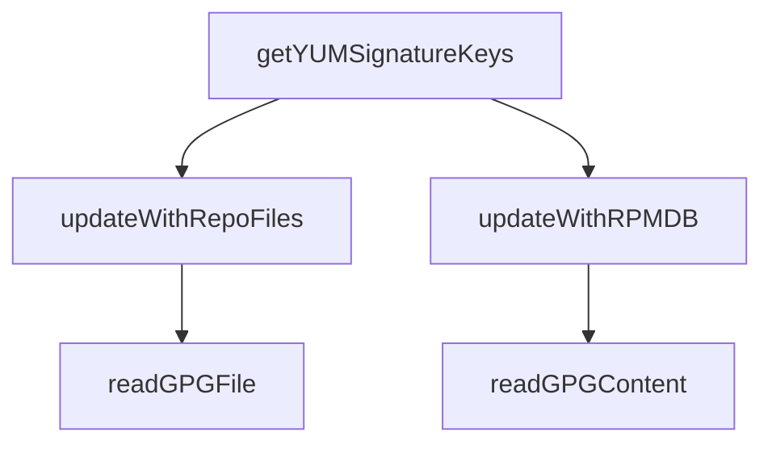

# Overview of RPM Signing

RPM signing ensures the authenticity and integrity of RPM packages by using GPG keys. This process allows users to verify that the packages have not been tampered with.

<SwmSnippet path="/comp/metadata/packagesigning/packagesigningimpl/rpmsigning.go" line="23">

---

# Retrieving YUM Signature Keys

The function <SwmToken path="comp/metadata/packagesigning/packagesigningimpl/rpmsigning.go" pos="23:2:2" line-data="// getYUMSignatureKeys returns the list of keys used to sign RPM packages. Ignore any issues in reading files or rpmdb">`getYUMSignatureKeys`</SwmToken> retrieves the list of keys used to sign RPM packages. It reads repository files and the RPM database to gather the necessary keys.

```go
// getYUMSignatureKeys returns the list of keys used to sign RPM packages. Ignore any issues in reading files or rpmdb
func getYUMSignatureKeys(pkgManager string, client *http.Client, logger log.Component) []signingKey {
	cacheKeys := make(map[string]signingKey)
	err := updateWithRepoFiles(cacheKeys, pkgManager, client)
	if err != nil {
		logger.Debugf("Error while reading repo files: %s", err)
	}
	err = updateWithRPMDB(cacheKeys)
	if err != nil {
		logger.Debugf("Error while reading rpmdb: %s", err)
	}
	var keyList []signingKey
	for _, key := range cacheKeys {
		keyList = append(keyList, key)
	}
	return keyList
}
```

---

</SwmSnippet>

<SwmSnippet path="/comp/metadata/packagesigning/packagesigningimpl/rpmsigning.go" line="41">

---

# Parsing Repository Files

The function <SwmToken path="comp/metadata/packagesigning/packagesigningimpl/rpmsigning.go" pos="41:2:2" line-data="func updateWithRepoFiles(cacheKeys map[string]signingKey, pkgManager string, client *http.Client) error {">`updateWithRepoFiles`</SwmToken> parses the main configuration file and repository files to extract GPG keys, updating the cache with the keys found.

```go
func updateWithRepoFiles(cacheKeys map[string]signingKey, pkgManager string, client *http.Client) error {
	var mainConf pkgUtils.MainData
	var reposPerKey map[string][]pkgUtils.Repository
	var err error
	repoConfig, repoFilesDir := pkgUtils.GetRepoPathFromPkgManager(pkgManager)
	if repoConfig == "" {
		return errors.New("No repo config file found for this distribution:" + pkgManager)
	}

	// First parsing of the main config file
	if _, err := os.Stat(repoConfig); err != nil {
		return err
	}
	defaultValue := strings.Contains(repoConfig, "zypp") // Settings are enabled by default on SUSE, disabled otherwise
	mainConf, reposPerKey, err = pkgUtils.ParseRPMRepoFile(repoConfig,
		pkgUtils.MainData{Gpgcheck: defaultValue, LocalpkgGpgcheck: defaultValue, RepoGpgcheck: defaultValue})
	if err != nil {
		return err
	}
	for name, repos := range reposPerKey {
		err := readGPGFile(cacheKeys, repoFile{name, repos}, "repo", client)
```

---

</SwmSnippet>

<SwmSnippet path="/comp/metadata/packagesigning/packagesigningimpl/rpmsigning.go" line="90">

---

# Extracting GPG Keys from RPM Database

The function <SwmToken path="comp/metadata/packagesigning/packagesigningimpl/rpmsigning.go" pos="90:2:2" line-data="func updateWithRPMDB(cacheKeys map[string]signingKey) error {">`updateWithRPMDB`</SwmToken> extracts the list of GPG keys from the RPM database by executing the <SwmToken path="comp/metadata/packagesigning/packagesigningimpl/rpmsigning.go" pos="94:18:18" line-data="	cmd := exec.CommandContext(ctx, &quot;/usr/bin/rpm&quot;, &quot;-qa&quot;, &quot;gpg-pubkey*&quot;)">`rpm`</SwmToken> command and reading the GPG content to update the cache with the keys.

```go
func updateWithRPMDB(cacheKeys map[string]signingKey) error {
	// It seems not possible to get the expiration date from rpmdb, so we extract the list of keys and call gpg
	ctx, cancel := context.WithTimeout(context.Background(), 2*time.Second)
	defer cancel()
	cmd := exec.CommandContext(ctx, "/usr/bin/rpm", "-qa", "gpg-pubkey*")
	output, err := cmd.CombinedOutput()
	if err != nil || ctx.Err() != nil {
		if ctx.Err() != nil {
			return ctx.Err()
		}
		return err
	}
	scanner := bufio.NewScanner(strings.NewReader(string(output)))
	for scanner.Scan() {
		publicKey := scanner.Text()
		rpmCmd := exec.CommandContext(ctx, "/usr/bin/rpm", "-qi", publicKey, "--qf", "'%{PUBKEYS}\n'")
		rpmKey, err := rpmCmd.CombinedOutput()
		if err != nil || ctx.Err() != nil {
			if ctx.Err() != nil {
				return ctx.Err()
			}
```

---

</SwmSnippet>

&nbsp;

*This is an auto-generated document by Swimm AI 🌊 and has not yet been verified by a human*

<SwmMeta version="3.0.0" repo-id="Z2l0aHViJTNBJTNBZGF0YWRvZy1hZ2VudCUzQSUzQVN3aW1tLURlbW8=" repo-name="datadog-agent"><sup>Powered by [Swimm](/)</sup></SwmMeta>
