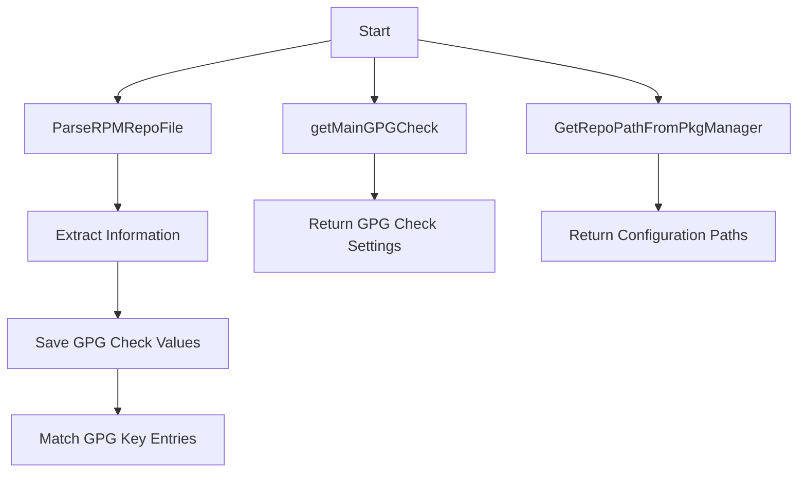

# Overview

Rpm Utilities refer to the utilities and functions related to handling RPM package manager configurations and repositories. These utilities include functions to parse RPM repository files, extract information, and manage GPG checks for repositories.

<SwmSnippet path="/comp/metadata/packagesigning/utils/rpm.go" line="89">

---

# <SwmToken path="comp/metadata/packagesigning/utils/rpm.go" pos="89:2:2" line-data="// ParseRPMRepoFile extracts information from yum repo files">`ParseRPMRepoFile`</SwmToken>

The <SwmToken path="comp/metadata/packagesigning/utils/rpm.go" pos="89:2:2" line-data="// ParseRPMRepoFile extracts information from yum repo files">`ParseRPMRepoFile`</SwmToken> function is used to extract information from yum repo files. It saves the global GPG check value when encountering a main table and matches several entries in the GPG key field. The function processes the file line by line, identifying and extracting relevant fields and values.

```go
// ParseRPMRepoFile extracts information from yum repo files
// Save the global gpgcheck value when encountering a [main] table (should only occur on `/etc/yum.conf`)
// Match several entries in gpgkey field, either file references (file://) or http(s)://. From observations,
// these reference can be separated either by space or by new line. We assume it possible to mix file and http references
func ParseRPMRepoFile(inputFile string, mainConf MainData) (MainData, map[string][]Repository, error) {
	main := mainConf
	file, err := os.Open(inputFile)
	if err != nil {
		return main, nil, err
	}
	defer file.Close()
	reposPerKey := make(map[string][]Repository)
	nextLine := multiLine{inside: false, name: ""}
	repo := repoData{enabled: true, gpgcheck: main.Gpgcheck, repoGpgcheck: main.RepoGpgcheck}
	var repos []repoData

	scanner := bufio.NewScanner(file)
	for scanner.Scan() {
		line := scanner.Text()
		currentTable := table.FindString(line)
		// Check entering a new table
```

---

</SwmSnippet>

<SwmSnippet path="/comp/metadata/packagesigning/utils/rpm.go" line="33">

---

# <SwmToken path="comp/metadata/packagesigning/utils/rpm.go" pos="33:2:2" line-data="// getMainGPGCheck returns gpgcheck and repo_gpgcheck setting for [main] table">`getMainGPGCheck`</SwmToken>

The <SwmToken path="comp/metadata/packagesigning/utils/rpm.go" pos="33:2:2" line-data="// getMainGPGCheck returns gpgcheck and repo_gpgcheck setting for [main] table">`getMainGPGCheck`</SwmToken> function returns the GPG check and repo GPG check settings for the main table. It determines the configuration file path based on the package manager and parses the RPM repo file to extract the GPG check settings.

```go
// getMainGPGCheck returns gpgcheck and repo_gpgcheck setting for [main] table
func getMainGPGCheck(pkgManager string) (bool, bool, error) {
	repoConfig, _ := GetRepoPathFromPkgManager(pkgManager)
	if repoConfig == "" {
		// if we end up in a non supported distribution
		return false, false, errors.New("No repo config file found for this distribution:" + pkgManager)
	}
	defaultValue := strings.Contains(repoConfig, "zypp") // Settings are enabled by default on SUSE, disabled otherwise
	mainConf, _, err := ParseRPMRepoFile(repoConfig, MainData{Gpgcheck: defaultValue, LocalpkgGpgcheck: defaultValue, RepoGpgcheck: defaultValue})
	if err != nil {
		return defaultValue, defaultValue, err
	}
	return mainConf.Gpgcheck, mainConf.RepoGpgcheck, nil
}
```

---

</SwmSnippet>

<SwmSnippet path="/comp/metadata/packagesigning/utils/rpm.go" line="48">

---

# <SwmToken path="comp/metadata/packagesigning/utils/rpm.go" pos="48:2:2" line-data="// GetRepoPathFromPkgManager returns the path to the configuration file and the path to the repository files for RH or SUSE based OS">`GetRepoPathFromPkgManager`</SwmToken>

The <SwmToken path="comp/metadata/packagesigning/utils/rpm.go" pos="48:2:2" line-data="// GetRepoPathFromPkgManager returns the path to the configuration file and the path to the repository files for RH or SUSE based OS">`GetRepoPathFromPkgManager`</SwmToken> function returns the path to the configuration file and the path to the repository files for RH or SUSE based OS.

```go
// GetRepoPathFromPkgManager returns the path to the configuration file and the path to the repository files for RH or SUSE based OS
func GetRepoPathFromPkgManager(pkgManager string) (string, string) {
	if pkgManager == "yum" {
		return YumConf, YumRepo
	} else if pkgManager == "dnf" {
		return dnfConf, YumRepo
	} else if pkgManager == "zypper" {
		return zyppConf, zyppRepo
	}
	return "", ""
}
```

---

</SwmSnippet>

<SwmSnippet path="/comp/metadata/packagesigning/utils/rpm.go" line="60">

---

# Repository Struct

The <SwmToken path="comp/metadata/packagesigning/utils/rpm.go" pos="60:2:2" line-data="// Repository is a struct to store the repo name">`Repository`</SwmToken> struct is used to store the repository name, enabled status, and GPG check settings.

```go
// Repository is a struct to store the repo name
type Repository struct {
	Name         string `json:"name"`
	Enabled      bool   `json:"enabled"`
	GPGCheck     bool   `json:"gpgcheck"`
	RepoGPGCheck bool   `json:"repo_gpgcheck"`
}
```

---

</SwmSnippet>

<SwmSnippet path="/comp/metadata/packagesigning/utils/rpm.go" line="68">

---

# <SwmToken path="comp/metadata/packagesigning/utils/rpm.go" pos="68:2:2" line-data="// MainData contains the global definitions of gpg checks">`MainData`</SwmToken> Struct

The <SwmToken path="comp/metadata/packagesigning/utils/rpm.go" pos="68:2:2" line-data="// MainData contains the global definitions of gpg checks">`MainData`</SwmToken> struct contains the global definitions of GPG checks.

```go
// MainData contains the global definitions of gpg checks
type MainData struct {
	Gpgcheck         bool
	LocalpkgGpgcheck bool
	RepoGpgcheck     bool
}
```

---

</SwmSnippet>

&nbsp;

*This is an auto-generated document by Swimm AI 🌊 and has not yet been verified by a human*

<SwmMeta version="3.0.0" repo-id="Z2l0aHViJTNBJTNBZGF0YWRvZy1hZ2VudCUzQSUzQVN3aW1tLURlbW8=" repo-name="datadog-agent"><sup>Powered by [Swimm](/)</sup></SwmMeta>
