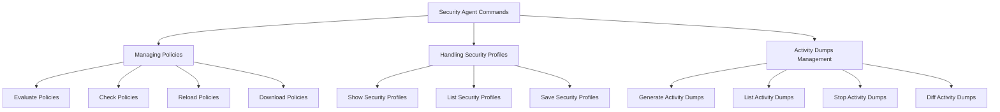

This document will cover the overview of Security Agent Commands, which includes:

1. Managing Policies
2. Handling Security Profiles
3. Activity Dumps Management

Technical document: <SwmLink doc-title="Overview of Security Agent Commands">[Overview of Security Agent Commands](/.swm/overview-of-security-agent-commands.zy90fnct.sw.md)</SwmLink>

# [Managing Policies](https://app.swimm.io/repos/Z2l0aHViJTNBJTNBZGF0YWRvZy1hZ2VudCUzQSUzQVN3aW1tLURlbW8=/docs/zy90fnct#commonpolicycommands)

The 'Managing Policies' section includes commands that allow users to handle various policy-related tasks. These tasks include evaluating policies, checking their status, reloading them, and downloading new policies. This organization helps users ensure that their security policies are up-to-date and functioning correctly.

# [Evaluate Policies](https://app.swimm.io/repos/Z2l0aHViJTNBJTNBZGF0YWRvZy1hZ2VudCUzQSUzQVN3aW1tLURlbW8=/docs/zy90fnct#evalcommands)

The 'Evaluate Policies' command allows users to evaluate event data against a specified rule. This is useful for ensuring that the policies are correctly identifying and handling security events as expected.

# [Check Policies](https://app.swimm.io/repos/Z2l0aHViJTNBJTNBZGF0YWRvZy1hZ2VudCUzQSUzQVN3aW1tLURlbW8=/docs/zy90fnct#commoncheckpoliciescommands)

The 'Check Policies' command provides a report on the status of the policies. This helps users understand if their policies are correctly configured and if there are any issues that need to be addressed.

# [Reload Policies](https://app.swimm.io/repos/Z2l0aHViJTNBJTNBZGF0YWRvZy1hZ2VudCUzQSUzQVN3aW1tLURlbW8=/docs/zy90fnct#commonreloadpoliciescommands)

The 'Reload Policies' command allows users to reload the policies without restarting the agent. This ensures that the latest configurations are applied immediately, helping maintain security without downtime.

# [Download Policies](https://app.swimm.io/repos/Z2l0aHViJTNBJTNBZGF0YWRvZy1hZ2VudCUzQSUzQVN3aW1tLURlbW8=/docs/zy90fnct#downloadpolicycommands)

The 'Download Policies' command enables users to download policies from a specified source. This is useful for updating the policies to the latest versions available.

# [Handling Security Profiles](https://app.swimm.io/repos/Z2l0aHViJTNBJTNBZGF0YWRvZy1hZ2VudCUzQSUzQVN3aW1tLURlbW8=/docs/zy90fnct#securityprofilecommands)

The 'Handling Security Profiles' section includes commands for managing security profiles. Users can show, list, and save security profiles, which helps in maintaining and organizing security configurations.

# [Show Security Profiles](https://app.swimm.io/repos/Z2l0aHViJTNBJTNBZGF0YWRvZy1hZ2VudCUzQSUzQVN3aW1tLURlbW8=/docs/zy90fnct#securityprofileshowcommands)

The 'Show Security Profiles' command allows users to display the content of a security profile file. This is useful for reviewing the details of a specific security profile.

# [List Security Profiles](https://app.swimm.io/repos/Z2l0aHViJTNBJTNBZGF0YWRvZy1hZ2VudCUzQSUzQVN3aW1tLURlbW8=/docs/zy90fnct#listsecurityprofilecommands)

The 'List Security Profiles' command provides a list of active security profiles. This helps users keep track of which profiles are currently in use.

# [Save Security Profiles](https://app.swimm.io/repos/Z2l0aHViJTNBJTNBZGF0YWRvZy1hZ2VudCUzQSUzQVN3aW1tLURlbW8=/docs/zy90fnct#savesecurityprofilecommands)

The 'Save Security Profiles' command allows users to save a security profile to disk. This is useful for preserving the current state of a security profile for future use.

# [Activity Dumps Management](https://app.swimm.io/repos/Z2l0aHViJTNBJTNBZGF0YWRvZy1hZ2VudCUzQSUzQVN3aW1tLURlbW8=/docs/zy90fnct#activitydumpcommands)

The 'Activity Dumps Management' section includes commands for generating, listing, stopping, and computing differences between activity dumps. This helps users monitor and analyze security-related activities.

# [Generate Activity Dumps](https://app.swimm.io/repos/Z2l0aHViJTNBJTNBZGF0YWRvZy1hZ2VudCUzQSUzQVN3aW1tLURlbW8=/docs/zy90fnct#generatecommands)

The 'Generate Activity Dumps' command allows users to create activity dumps. This is useful for capturing and analyzing security-related activities over a period of time.

# [List Activity Dumps](https://app.swimm.io/repos/Z2l0aHViJTNBJTNBZGF0YWRvZy1hZ2VudCUzQSUzQVN3aW1tLURlbW8=/docs/zy90fnct#listcommands)

The 'List Activity Dumps' command provides a list of all running activity dumps. This helps users keep track of ongoing monitoring activities.

# [Stop Activity Dumps](https://app.swimm.io/repos/Z2l0aHViJTNBJTNBZGF0YWRvZy1hZ2VudCUzQSUzQVN3aW1tLURlbW8=/docs/zy90fnct#stopcommands)

The 'Stop Activity Dumps' command allows users to stop an ongoing activity dump. This is useful for terminating monitoring activities that are no longer needed.

# [Diff Activity Dumps](https://app.swimm.io/repos/Z2l0aHViJTNBJTNBZGF0YWRvZy1hZ2VudCUzQSUzQVN3aW1tLURlbW8=/docs/zy90fnct#diffcommands)

The 'Diff Activity Dumps' command enables users to compute the difference between two activity dumps. This is useful for comparing security-related activities over different periods.

&nbsp;

*This is an auto-generated document by Swimm AI 🌊 and has not yet been verified by a human*

<SwmMeta version="3.0.0" repo-id="Z2l0aHViJTNBJTNBZGF0YWRvZy1hZ2VudCUzQSUzQVN3aW1tLURlbW8=" repo-name="datadog-agent">Powered by [Swimm](/)</SwmMeta>
