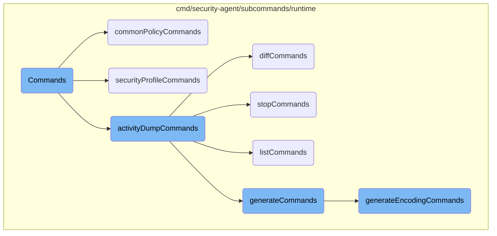
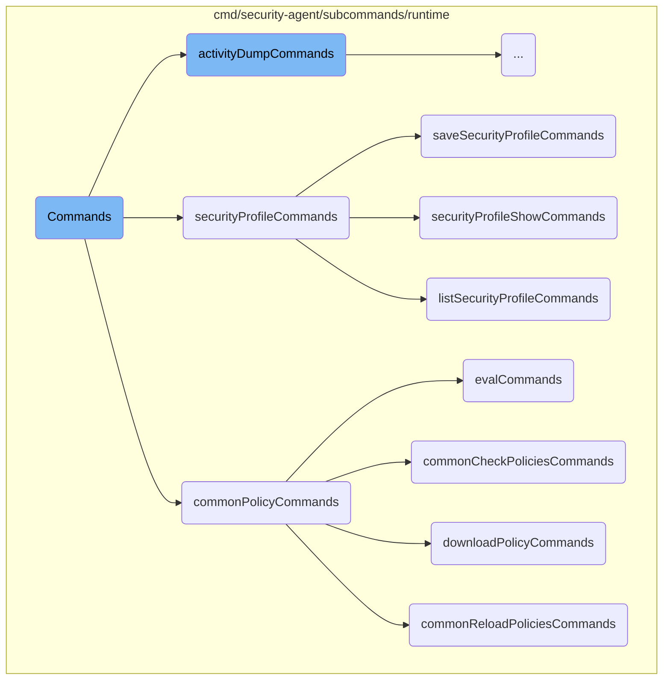
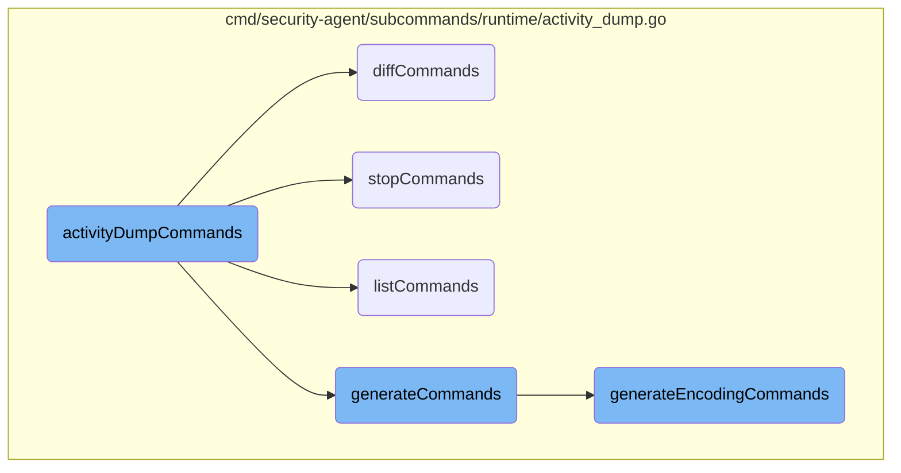

This document outlines the structure and purpose of various commands available in the Datadog Agent's security agent runtime. It explains how these commands are organized and their specific functionalities.

The commands are organized into a main command structure with several subcommands. Each subcommand handles a specific task, such as managing policies, security profiles, or activity dumps. For example, the <SwmToken path="cmd/security-agent/subcommands/runtime/command_linux.go" pos="27:5:5" line-data="	runtimeCmd.AddCommand(commonPolicyCommands(globalParams)...)">`commonPolicyCommands`</SwmToken> group includes commands for evaluating, checking, reloading, and downloading policies. Similarly, the <SwmToken path="cmd/security-agent/subcommands/runtime/command_linux.go" pos="30:5:5" line-data="	runtimeCmd.AddCommand(securityProfileCommands(globalParams)...)">`securityProfileCommands`</SwmToken> group includes commands for showing, listing, and saving security profiles. This organization helps users efficiently manage different aspects of the security agent through a structured command-line interface.

Here is a high level diagram of the flow, showing only the most important functions:



# Flow drill down

First, we'll zoom into this section of the flow:



<SwmSnippet path="/cmd/security-agent/subcommands/runtime/command_linux.go" line="20">

---

## Commands

The <SwmToken path="cmd/security-agent/subcommands/runtime/command_linux.go" pos="20:2:2" line-data="// Commands returns the config commands">`Commands`</SwmToken> function initializes the main command structure for the runtime agent utility commands. It adds several subcommands, including <SwmToken path="cmd/security-agent/subcommands/runtime/command_linux.go" pos="27:5:5" line-data="	runtimeCmd.AddCommand(commonPolicyCommands(globalParams)...)">`commonPolicyCommands`</SwmToken>, <SwmToken path="cmd/security-agent/subcommands/runtime/command_linux.go" pos="28:5:5" line-data="	runtimeCmd.AddCommand(selfTestCommands(globalParams)...)">`selfTestCommands`</SwmToken>, <SwmToken path="cmd/security-agent/subcommands/runtime/command_linux.go" pos="29:5:5" line-data="	runtimeCmd.AddCommand(activityDumpCommands(globalParams)...)">`activityDumpCommands`</SwmToken>, <SwmToken path="cmd/security-agent/subcommands/runtime/command_linux.go" pos="30:5:5" line-data="	runtimeCmd.AddCommand(securityProfileCommands(globalParams)...)">`securityProfileCommands`</SwmToken>, <SwmToken path="cmd/security-agent/subcommands/runtime/command_linux.go" pos="31:5:5" line-data="	runtimeCmd.AddCommand(processCacheCommands(globalParams)...)">`processCacheCommands`</SwmToken>, <SwmToken path="cmd/security-agent/subcommands/runtime/command_linux.go" pos="32:5:5" line-data="	runtimeCmd.AddCommand(networkNamespaceCommands(globalParams)...)">`networkNamespaceCommands`</SwmToken>, and <SwmToken path="cmd/security-agent/subcommands/runtime/command_linux.go" pos="33:5:5" line-data="	runtimeCmd.AddCommand(discardersCommands(globalParams)...)">`discardersCommands`</SwmToken>. This setup allows the runtime agent to handle various command-line operations efficiently.

```go
// Commands returns the config commands
func Commands(globalParams *command.GlobalParams) []*cobra.Command {
	runtimeCmd := &cobra.Command{
		Use:   "runtime",
		Short: "runtime Agent utility commands",
	}

	runtimeCmd.AddCommand(commonPolicyCommands(globalParams)...)
	runtimeCmd.AddCommand(selfTestCommands(globalParams)...)
	runtimeCmd.AddCommand(activityDumpCommands(globalParams)...)
	runtimeCmd.AddCommand(securityProfileCommands(globalParams)...)
	runtimeCmd.AddCommand(processCacheCommands(globalParams)...)
	runtimeCmd.AddCommand(networkNamespaceCommands(globalParams)...)
	runtimeCmd.AddCommand(discardersCommands(globalParams)...)

	// Deprecated
	runtimeCmd.AddCommand(checkPoliciesCommands(globalParams)...)
	runtimeCmd.AddCommand(reloadPoliciesCommands(globalParams)...)

	return []*cobra.Command{runtimeCmd}
```

---

</SwmSnippet>

<SwmSnippet path="/cmd/security-agent/subcommands/runtime/command.go" line="64">

---

## <SwmToken path="cmd/security-agent/subcommands/runtime/command.go" pos="64:2:2" line-data="func commonPolicyCommands(globalParams *command.GlobalParams) []*cobra.Command {">`commonPolicyCommands`</SwmToken>

The <SwmToken path="cmd/security-agent/subcommands/runtime/command.go" pos="64:2:2" line-data="func commonPolicyCommands(globalParams *command.GlobalParams) []*cobra.Command {">`commonPolicyCommands`</SwmToken> function creates a command group related to policy operations. It includes subcommands for evaluating policies (<SwmToken path="cmd/security-agent/subcommands/runtime/command.go" pos="70:5:5" line-data="	commonPolicyCmd.AddCommand(evalCommands(globalParams)...)">`evalCommands`</SwmToken>), checking policies (<SwmToken path="cmd/security-agent/subcommands/runtime/command.go" pos="71:5:5" line-data="	commonPolicyCmd.AddCommand(commonCheckPoliciesCommands(globalParams)...)">`commonCheckPoliciesCommands`</SwmToken>), reloading policies (<SwmToken path="cmd/security-agent/subcommands/runtime/command.go" pos="72:5:5" line-data="	commonPolicyCmd.AddCommand(commonReloadPoliciesCommands(globalParams)...)">`commonReloadPoliciesCommands`</SwmToken>), and downloading policies (<SwmToken path="cmd/security-agent/subcommands/runtime/command.go" pos="73:5:5" line-data="	commonPolicyCmd.AddCommand(downloadPolicyCommands(globalParams)...)">`downloadPolicyCommands`</SwmToken>). This grouping helps in organizing policy-related functionalities under a single command.

```go
func commonPolicyCommands(globalParams *command.GlobalParams) []*cobra.Command {
	commonPolicyCmd := &cobra.Command{
		Use:   "policy",
		Short: "Policy related commands",
	}

	commonPolicyCmd.AddCommand(evalCommands(globalParams)...)
	commonPolicyCmd.AddCommand(commonCheckPoliciesCommands(globalParams)...)
	commonPolicyCmd.AddCommand(commonReloadPoliciesCommands(globalParams)...)
	commonPolicyCmd.AddCommand(downloadPolicyCommands(globalParams)...)

	return []*cobra.Command{commonPolicyCmd}
```

---

</SwmSnippet>

<SwmSnippet path="/cmd/security-agent/subcommands/runtime/security_profile.go" line="38">

---

## <SwmToken path="cmd/security-agent/subcommands/runtime/security_profile.go" pos="38:2:2" line-data="func securityProfileCommands(globalParams *command.GlobalParams) []*cobra.Command {">`securityProfileCommands`</SwmToken>

The <SwmToken path="cmd/security-agent/subcommands/runtime/security_profile.go" pos="38:2:2" line-data="func securityProfileCommands(globalParams *command.GlobalParams) []*cobra.Command {">`securityProfileCommands`</SwmToken> function sets up commands related to security profiles. It includes subcommands for showing security profiles (<SwmToken path="cmd/security-agent/subcommands/runtime/security_profile.go" pos="44:5:5" line-data="	securityProfileCmd.AddCommand(securityProfileShowCommands(globalParams)...)">`securityProfileShowCommands`</SwmToken>), listing active security profiles (<SwmToken path="cmd/security-agent/subcommands/runtime/security_profile.go" pos="45:5:5" line-data="	securityProfileCmd.AddCommand(listSecurityProfileCommands(globalParams)...)">`listSecurityProfileCommands`</SwmToken>), and saving security profiles (<SwmToken path="cmd/security-agent/subcommands/runtime/security_profile.go" pos="46:5:5" line-data="	securityProfileCmd.AddCommand(saveSecurityProfileCommands(globalParams)...)">`saveSecurityProfileCommands`</SwmToken>). This structure allows users to manage security profiles through the command line.

```go
func securityProfileCommands(globalParams *command.GlobalParams) []*cobra.Command {
	securityProfileCmd := &cobra.Command{
		Use:   "security-profile",
		Short: "security profile commands",
	}

	securityProfileCmd.AddCommand(securityProfileShowCommands(globalParams)...)
	securityProfileCmd.AddCommand(listSecurityProfileCommands(globalParams)...)
	securityProfileCmd.AddCommand(saveSecurityProfileCommands(globalParams)...)

	return []*cobra.Command{securityProfileCmd}
```

---

</SwmSnippet>

<SwmSnippet path="/cmd/security-agent/subcommands/runtime/security_profile.go" line="204">

---

### <SwmToken path="cmd/security-agent/subcommands/runtime/security_profile.go" pos="204:2:2" line-data="func saveSecurityProfileCommands(globalParams *command.GlobalParams) []*cobra.Command {">`saveSecurityProfileCommands`</SwmToken>

The <SwmToken path="cmd/security-agent/subcommands/runtime/security_profile.go" pos="204:2:2" line-data="func saveSecurityProfileCommands(globalParams *command.GlobalParams) []*cobra.Command {">`saveSecurityProfileCommands`</SwmToken> function defines the command for saving a security profile to disk. It requires the <SwmToken path="tasks/kernel_matrix_testing/ci.py" pos="43:3:3" line-data="    def name(self) -&gt; str:">`name`</SwmToken> and <SwmToken path="tasks/modules.py" pos="83:3:3" line-data="    def tag(self, agent_version):">`tag`</SwmToken> flags to identify the workload selector for the profile. The command uses the <SwmToken path="cmd/security-agent/subcommands/runtime/security_profile.go" pos="213:3:5" line-data="			return fxutil.OneShot(saveSecurityProfile,">`fxutil.OneShot`</SwmToken> function to execute the <SwmToken path="cmd/security-agent/subcommands/runtime/security_profile.go" pos="213:7:7" line-data="			return fxutil.OneShot(saveSecurityProfile,">`saveSecurityProfile`</SwmToken> operation, ensuring the profile is saved with the provided parameters.

```go
func saveSecurityProfileCommands(globalParams *command.GlobalParams) []*cobra.Command {
	cliParams := &securityProfileCliParams{
		GlobalParams: globalParams,
	}

	securityProfileSaveCmd := &cobra.Command{
		Use:   "save",
		Short: "saves the requested security profile to disk",
		RunE: func(cmd *cobra.Command, args []string) error {
			return fxutil.OneShot(saveSecurityProfile,
				fx.Supply(cliParams),
				fx.Supply(core.BundleParams{
					ConfigParams: config.NewSecurityAgentParams(globalParams.ConfigFilePaths),
					SecretParams: secrets.NewEnabledParams(),
					LogParams:    log.ForOneShot(command.LoggerName, "info", true)}),
				core.Bundle(),
			)
		},
	}

	securityProfileSaveCmd.Flags().StringVar(
```

---

</SwmSnippet>

<SwmSnippet path="/cmd/security-agent/subcommands/runtime/security_profile.go" line="51">

---

### <SwmToken path="cmd/security-agent/subcommands/runtime/security_profile.go" pos="51:2:2" line-data="func securityProfileShowCommands(globalParams *command.GlobalParams) []*cobra.Command {">`securityProfileShowCommands`</SwmToken>

The <SwmToken path="cmd/security-agent/subcommands/runtime/security_profile.go" pos="51:2:2" line-data="func securityProfileShowCommands(globalParams *command.GlobalParams) []*cobra.Command {">`securityProfileShowCommands`</SwmToken> function defines the command for displaying the content of a security profile file. It uses the <SwmToken path="tasks/libs/build/ninja.py" pos="193:4:4" line-data="def as_list(input):">`input`</SwmToken> flag to specify the path to the security profile file. The command leverages the <SwmToken path="cmd/security-agent/subcommands/runtime/security_profile.go" pos="60:3:5" line-data="			return fxutil.OneShot(showSecurityProfile,">`fxutil.OneShot`</SwmToken> function to execute the <SwmToken path="cmd/security-agent/subcommands/runtime/security_profile.go" pos="60:7:7" line-data="			return fxutil.OneShot(showSecurityProfile,">`showSecurityProfile`</SwmToken> operation, allowing users to view the profile's content.

```go
func securityProfileShowCommands(globalParams *command.GlobalParams) []*cobra.Command {
	cliParams := &securityProfileCliParams{
		GlobalParams: globalParams,
	}

	securityProfileShowCmd := &cobra.Command{
		Use:   "show",
		Short: "dump the content of a security-profile file",
		RunE: func(cmd *cobra.Command, args []string) error {
			return fxutil.OneShot(showSecurityProfile,
				fx.Supply(cliParams),
				fx.Supply(core.BundleParams{
					ConfigParams: config.NewSecurityAgentParams(globalParams.ConfigFilePaths),
					SecretParams: secrets.NewEnabledParams(),
					LogParams:    log.ForOneShot(command.LoggerName, "info", true)}),
				core.Bundle(),
			)
		},
	}

	securityProfileShowCmd.Flags().StringVar(
```

---

</SwmSnippet>

<SwmSnippet path="/cmd/security-agent/subcommands/runtime/security_profile.go" line="97">

---

### <SwmToken path="cmd/security-agent/subcommands/runtime/security_profile.go" pos="97:2:2" line-data="func listSecurityProfileCommands(globalParams *command.GlobalParams) []*cobra.Command {">`listSecurityProfileCommands`</SwmToken>

The <SwmToken path="cmd/security-agent/subcommands/runtime/security_profile.go" pos="97:2:2" line-data="func listSecurityProfileCommands(globalParams *command.GlobalParams) []*cobra.Command {">`listSecurityProfileCommands`</SwmToken> function defines the command for listing active security profiles. It includes an <SwmToken path="cmd/security-agent/subcommands/runtime/security_profile.go" pos="119:2:4" line-data="		&quot;include-cache&quot;,">`include-cache`</SwmToken> flag to determine whether profiles in the Security Profile manager's LRU cache should be returned. The command uses the <SwmToken path="cmd/security-agent/subcommands/runtime/security_profile.go" pos="106:3:5" line-data="			return fxutil.OneShot(listSecurityProfiles,">`fxutil.OneShot`</SwmToken> function to execute the <SwmToken path="cmd/security-agent/subcommands/runtime/security_profile.go" pos="106:7:7" line-data="			return fxutil.OneShot(listSecurityProfiles,">`listSecurityProfiles`</SwmToken> operation, providing a list of active profiles.

```go
func listSecurityProfileCommands(globalParams *command.GlobalParams) []*cobra.Command {
	cliParams := &securityProfileCliParams{
		GlobalParams: globalParams,
	}

	securityProfileListCmd := &cobra.Command{
		Use:   "list",
		Short: "get the list of active security profiles",
		RunE: func(cmd *cobra.Command, args []string) error {
			return fxutil.OneShot(listSecurityProfiles,
				fx.Supply(cliParams),
				fx.Supply(core.BundleParams{
					ConfigParams: config.NewSecurityAgentParams(globalParams.ConfigFilePaths),
					SecretParams: secrets.NewEnabledParams(),
					LogParams:    log.ForOneShot(command.LoggerName, "info", true)}),
				core.Bundle(),
			)
		},
	}

	securityProfileListCmd.Flags().BoolVar(
```

---

</SwmSnippet>

<SwmSnippet path="/cmd/security-agent/subcommands/runtime/command.go" line="88">

---

### <SwmToken path="cmd/security-agent/subcommands/runtime/command.go" pos="88:2:2" line-data="func evalCommands(globalParams *command.GlobalParams) []*cobra.Command {">`evalCommands`</SwmToken>

The <SwmToken path="cmd/security-agent/subcommands/runtime/command.go" pos="88:2:2" line-data="func evalCommands(globalParams *command.GlobalParams) []*cobra.Command {">`evalCommands`</SwmToken> function defines the command for evaluating event data against a specified rule. It requires the <SwmToken path="cmd/security-agent/subcommands/runtime/command.go" pos="109:16:18" line-data="	evalCmd.Flags().StringVar(&amp;evalArgs.ruleID, &quot;rule-id&quot;, &quot;&quot;, &quot;Rule ID to evaluate&quot;)">`rule-id`</SwmToken> and <SwmToken path="cmd/security-agent/subcommands/runtime/command.go" pos="111:16:18" line-data="	evalCmd.Flags().StringVar(&amp;evalArgs.eventFile, &quot;event-file&quot;, &quot;&quot;, &quot;File of the event data&quot;)">`event-file`</SwmToken> flags to identify the rule and event data file, respectively. The command uses the <SwmToken path="cmd/security-agent/subcommands/runtime/command.go" pos="97:3:5" line-data="			return fxutil.OneShot(evalRule,">`fxutil.OneShot`</SwmToken> function to execute the <SwmToken path="cmd/security-agent/subcommands/runtime/command.go" pos="97:7:7" line-data="			return fxutil.OneShot(evalRule,">`evalRule`</SwmToken> operation, allowing users to evaluate events based on defined rules.

```go
func evalCommands(globalParams *command.GlobalParams) []*cobra.Command {
	evalArgs := &evalCliParams{
		GlobalParams: globalParams,
	}

	evalCmd := &cobra.Command{
		Use:   "eval",
		Short: "Evaluate given event data against the give rule",
		RunE: func(cmd *cobra.Command, args []string) error {
			return fxutil.OneShot(evalRule,
				fx.Supply(evalArgs),
				fx.Supply(core.BundleParams{
					ConfigParams: config.NewSecurityAgentParams(globalParams.ConfigFilePaths),
					SecretParams: secrets.NewEnabledParams(),
					LogParams:    log.ForOneShot(command.LoggerName, "off", false)}),
				core.Bundle(),
			)
		},
	}

	evalCmd.Flags().StringVar(&evalArgs.dir, "policies-dir", pkgconfig.DefaultRuntimePoliciesDir, "Path to policies directory")
```

---

</SwmSnippet>

<SwmSnippet path="/cmd/security-agent/subcommands/runtime/command.go" line="121">

---

### <SwmToken path="cmd/security-agent/subcommands/runtime/command.go" pos="121:2:2" line-data="func commonCheckPoliciesCommands(globalParams *command.GlobalParams) []*cobra.Command {">`commonCheckPoliciesCommands`</SwmToken>

The <SwmToken path="cmd/security-agent/subcommands/runtime/command.go" pos="121:2:2" line-data="func commonCheckPoliciesCommands(globalParams *command.GlobalParams) []*cobra.Command {">`commonCheckPoliciesCommands`</SwmToken> function defines the command for checking policies and returning a report. It includes flags for specifying the policies directory and whether to evaluate loaded policies. The command uses the <SwmToken path="cmd/security-agent/subcommands/runtime/command.go" pos="130:3:5" line-data="			return fxutil.OneShot(checkPolicies,">`fxutil.OneShot`</SwmToken> function to execute the <SwmToken path="cmd/security-agent/subcommands/runtime/command.go" pos="130:7:7" line-data="			return fxutil.OneShot(checkPolicies,">`checkPolicies`</SwmToken> operation, providing a report on the policies' status.

```go
func commonCheckPoliciesCommands(globalParams *command.GlobalParams) []*cobra.Command {
	cliParams := &checkPoliciesCliParams{
		GlobalParams: globalParams,
	}

	commonCheckPoliciesCmd := &cobra.Command{
		Use:   "check",
		Short: "Check policies and return a report",
		RunE: func(cmd *cobra.Command, args []string) error {
			return fxutil.OneShot(checkPolicies,
				fx.Supply(cliParams),
				fx.Supply(core.BundleParams{
					ConfigParams: config.NewSecurityAgentParams(globalParams.ConfigFilePaths),
					SecretParams: secrets.NewEnabledParams(),
					LogParams:    log.ForOneShot(command.LoggerName, "off", false)}),
				core.Bundle(),
			)
		},
	}

	commonCheckPoliciesCmd.Flags().StringVar(&cliParams.dir, "policies-dir", pkgconfig.DefaultRuntimePoliciesDir, "Path to policies directory")
```

---

</SwmSnippet>

<SwmSnippet path="/cmd/security-agent/subcommands/runtime/command.go" line="194">

---

### <SwmToken path="cmd/security-agent/subcommands/runtime/command.go" pos="194:2:2" line-data="func downloadPolicyCommands(globalParams *command.GlobalParams) []*cobra.Command {">`downloadPolicyCommands`</SwmToken>

The <SwmToken path="cmd/security-agent/subcommands/runtime/command.go" pos="194:2:2" line-data="func downloadPolicyCommands(globalParams *command.GlobalParams) []*cobra.Command {">`downloadPolicyCommands`</SwmToken> function defines the command for downloading policies. It includes flags for checking policies after downloading, specifying the output path, and selecting the source of policies to download. The command uses the <SwmToken path="cmd/security-agent/subcommands/runtime/command.go" pos="203:3:5" line-data="			return fxutil.OneShot(downloadPolicy,">`fxutil.OneShot`</SwmToken> function to execute the <SwmToken path="cmd/security-agent/subcommands/runtime/command.go" pos="203:7:7" line-data="			return fxutil.OneShot(downloadPolicy,">`downloadPolicy`</SwmToken> operation, enabling users to download and manage policies.

```go
func downloadPolicyCommands(globalParams *command.GlobalParams) []*cobra.Command {
	downloadPolicyArgs := &downloadPolicyCliParams{
		GlobalParams: globalParams,
	}

	downloadPolicyCmd := &cobra.Command{
		Use:   "download",
		Short: "Download policies",
		RunE: func(cmd *cobra.Command, args []string) error {
			return fxutil.OneShot(downloadPolicy,
				fx.Supply(downloadPolicyArgs),
				fx.Supply(core.BundleParams{
					ConfigParams: config.NewSecurityAgentParams(globalParams.ConfigFilePaths),
					SecretParams: secrets.NewEnabledParams(),
					LogParams:    log.ForOneShot(command.LoggerName, "off", false)}),
				core.Bundle(),
			)
		},
	}

	downloadPolicyCmd.Flags().BoolVar(&downloadPolicyArgs.check, "check", false, "Check policies after downloading")
```

---

</SwmSnippet>

<SwmSnippet path="/cmd/security-agent/subcommands/runtime/command.go" line="150">

---

### <SwmToken path="cmd/security-agent/subcommands/runtime/command.go" pos="150:2:2" line-data="func commonReloadPoliciesCommands(globalParams *command.GlobalParams) []*cobra.Command {">`commonReloadPoliciesCommands`</SwmToken>

The <SwmToken path="cmd/security-agent/subcommands/runtime/command.go" pos="150:2:2" line-data="func commonReloadPoliciesCommands(globalParams *command.GlobalParams) []*cobra.Command {">`commonReloadPoliciesCommands`</SwmToken> function defines the command for reloading policies. It uses the <SwmToken path="cmd/security-agent/subcommands/runtime/command.go" pos="155:3:5" line-data="			return fxutil.OneShot(reloadRuntimePolicies,">`fxutil.OneShot`</SwmToken> function to execute the <SwmToken path="cmd/security-agent/subcommands/runtime/command.go" pos="155:7:7" line-data="			return fxutil.OneShot(reloadRuntimePolicies,">`reloadRuntimePolicies`</SwmToken> operation, ensuring that the policies are reloaded with the latest configurations. This command helps in keeping the policies up-to-date without restarting the agent.

```go
func commonReloadPoliciesCommands(globalParams *command.GlobalParams) []*cobra.Command {
	commonReloadPoliciesCmd := &cobra.Command{
		Use:   "reload",
		Short: "Reload policies",
		RunE: func(cmd *cobra.Command, args []string) error {
			return fxutil.OneShot(reloadRuntimePolicies,
				fx.Supply(core.BundleParams{
					ConfigParams: config.NewSecurityAgentParams(globalParams.ConfigFilePaths),
					SecretParams: secrets.NewEnabledParams(),
					LogParams:    log.ForOneShot(command.LoggerName, "info", true)}),
				core.Bundle(),
			)
		},
	}
	return []*cobra.Command{commonReloadPoliciesCmd}
```

---

</SwmSnippet>

Now, lets zoom into this section of the flow:



<SwmSnippet path="/cmd/security-agent/subcommands/runtime/activity_dump.go" line="48">

---

## <SwmToken path="cmd/security-agent/subcommands/runtime/activity_dump.go" pos="48:2:2" line-data="func activityDumpCommands(globalParams *command.GlobalParams) []*cobra.Command {">`activityDumpCommands`</SwmToken>

The <SwmToken path="cmd/security-agent/subcommands/runtime/activity_dump.go" pos="48:2:2" line-data="func activityDumpCommands(globalParams *command.GlobalParams) []*cobra.Command {">`activityDumpCommands`</SwmToken> function initializes the main command for activity dumps and adds subcommands like <SwmToken path="cmd/security-agent/subcommands/runtime/activity_dump.go" pos="54:5:5" line-data="	activityDumpCmd.AddCommand(generateCommands(globalParams)...)">`generateCommands`</SwmToken>, <SwmToken path="cmd/security-agent/subcommands/runtime/activity_dump.go" pos="55:5:5" line-data="	activityDumpCmd.AddCommand(listCommands(globalParams)...)">`listCommands`</SwmToken>, <SwmToken path="cmd/security-agent/subcommands/runtime/activity_dump.go" pos="56:5:5" line-data="	activityDumpCmd.AddCommand(stopCommands(globalParams)...)">`stopCommands`</SwmToken>, and <SwmToken path="cmd/security-agent/subcommands/runtime/activity_dump.go" pos="57:5:5" line-data="	activityDumpCmd.AddCommand(diffCommands(globalParams)...)">`diffCommands`</SwmToken>. This setup allows users to manage activity dumps through a structured command-line interface.

```go
func activityDumpCommands(globalParams *command.GlobalParams) []*cobra.Command {
	activityDumpCmd := &cobra.Command{
		Use:   "activity-dump",
		Short: "activity dump command",
	}

	activityDumpCmd.AddCommand(generateCommands(globalParams)...)
	activityDumpCmd.AddCommand(listCommands(globalParams)...)
	activityDumpCmd.AddCommand(stopCommands(globalParams)...)
	activityDumpCmd.AddCommand(diffCommands(globalParams)...)
	return []*cobra.Command{activityDumpCmd}
}
```

---

</SwmSnippet>

<SwmSnippet path="/cmd/security-agent/subcommands/runtime/activity_dump.go" line="193">

---

## <SwmToken path="cmd/security-agent/subcommands/runtime/activity_dump.go" pos="193:2:2" line-data="func diffCommands(globalParams *command.GlobalParams) []*cobra.Command {">`diffCommands`</SwmToken>

The <SwmToken path="cmd/security-agent/subcommands/runtime/activity_dump.go" pos="193:2:2" line-data="func diffCommands(globalParams *command.GlobalParams) []*cobra.Command {">`diffCommands`</SwmToken> function creates a subcommand to compute the difference between two activity dumps. It sets up the necessary flags for specifying the origin and target files and the output format.

```go
func diffCommands(globalParams *command.GlobalParams) []*cobra.Command {
	cliParams := &activityDumpCliParams{
		GlobalParams: globalParams,
	}

	activityDumpDiffCmd := &cobra.Command{
		Use:   "diff",
		Short: "compute the diff between two activity dumps",
		RunE: func(cmd *cobra.Command, args []string) error {
			return fxutil.OneShot(diffActivityDump,
				fx.Supply(cliParams),
				fx.Supply(core.BundleParams{
					ConfigParams: config.NewSecurityAgentParams(globalParams.ConfigFilePaths),
					SecretParams: secrets.NewEnabledParams(),
					LogParams:    log.ForOneShot(command.LoggerName, "info", true)}),
				core.Bundle(),
			)
		},
	}

	activityDumpDiffCmd.Flags().StringVar(
```

---

</SwmSnippet>

<SwmSnippet path="/cmd/security-agent/subcommands/runtime/activity_dump.go" line="79">

---

## <SwmToken path="cmd/security-agent/subcommands/runtime/activity_dump.go" pos="79:2:2" line-data="func stopCommands(globalParams *command.GlobalParams) []*cobra.Command {">`stopCommands`</SwmToken>

The <SwmToken path="cmd/security-agent/subcommands/runtime/activity_dump.go" pos="79:2:2" line-data="func stopCommands(globalParams *command.GlobalParams) []*cobra.Command {">`stopCommands`</SwmToken> function creates a subcommand to stop an ongoing activity dump. It includes flags for filtering the activity dump by name or container ID.

```go
func stopCommands(globalParams *command.GlobalParams) []*cobra.Command {
	cliParams := &activityDumpCliParams{
		GlobalParams: globalParams,
	}

	activityDumpStopCmd := &cobra.Command{
		Use:   "stop",
		Short: "stops the first activity dump that matches the provided selector",
		RunE: func(cmd *cobra.Command, args []string) error {
			return fxutil.OneShot(stopActivityDump,
				fx.Supply(cliParams),
				fx.Supply(core.BundleParams{
					ConfigParams: config.NewSecurityAgentParams(globalParams.ConfigFilePaths),
					SecretParams: secrets.NewEnabledParams(),
					LogParams:    log.ForOneShot(command.LoggerName, "info", true)}),
				core.Bundle(),
			)
		},
	}

	activityDumpStopCmd.Flags().StringVar(
```

---

</SwmSnippet>

<SwmSnippet path="/cmd/security-agent/subcommands/runtime/activity_dump.go" line="61">

---

## <SwmToken path="cmd/security-agent/subcommands/runtime/activity_dump.go" pos="61:2:2" line-data="func listCommands(globalParams *command.GlobalParams) []*cobra.Command {">`listCommands`</SwmToken>

The <SwmToken path="cmd/security-agent/subcommands/runtime/activity_dump.go" pos="61:2:2" line-data="func listCommands(globalParams *command.GlobalParams) []*cobra.Command {">`listCommands`</SwmToken> function creates a subcommand to list all running activity dumps. It uses the <SwmToken path="cmd/security-agent/subcommands/runtime/activity_dump.go" pos="66:3:5" line-data="			return fxutil.OneShot(listActivityDumps,">`fxutil.OneShot`</SwmToken> utility to execute the listing operation.

```go
func listCommands(globalParams *command.GlobalParams) []*cobra.Command {
	activityDumpListCmd := &cobra.Command{
		Use:   "list",
		Short: "get the list of running activity dumps",
		RunE: func(cmd *cobra.Command, args []string) error {
			return fxutil.OneShot(listActivityDumps,
				fx.Supply(core.BundleParams{
					ConfigParams: config.NewSecurityAgentParams(globalParams.ConfigFilePaths),
					SecretParams: secrets.NewEnabledParams(),
					LogParams:    log.ForOneShot(command.LoggerName, "info", true)}),
				core.Bundle(),
			)
		},
	}

	return []*cobra.Command{activityDumpListCmd}
}
```

---

</SwmSnippet>

<SwmSnippet path="/cmd/security-agent/subcommands/runtime/activity_dump.go" line="115">

---

## <SwmToken path="cmd/security-agent/subcommands/runtime/activity_dump.go" pos="115:2:2" line-data="func generateCommands(globalParams *command.GlobalParams) []*cobra.Command {">`generateCommands`</SwmToken>

The <SwmToken path="cmd/security-agent/subcommands/runtime/activity_dump.go" pos="115:2:2" line-data="func generateCommands(globalParams *command.GlobalParams) []*cobra.Command {">`generateCommands`</SwmToken> function creates a subcommand for generating activity dumps. It adds the <SwmToken path="cmd/security-agent/subcommands/runtime/activity_dump.go" pos="121:5:5" line-data="	activityDumpGenerateCmd.AddCommand(generateEncodingCommands(globalParams)...)">`generateEncodingCommands`</SwmToken> subcommand to handle encoding operations.

```go
func generateCommands(globalParams *command.GlobalParams) []*cobra.Command {
	activityDumpGenerateCmd := &cobra.Command{
		Use:   "generate",
		Short: "generate command for activity dumps",
	}

	activityDumpGenerateCmd.AddCommand(generateEncodingCommands(globalParams)...)

	return []*cobra.Command{activityDumpGenerateCmd}
}
```

---

</SwmSnippet>

<SwmSnippet path="/cmd/security-agent/subcommands/runtime/activity_dump.go" line="126">

---

## <SwmToken path="cmd/security-agent/subcommands/runtime/activity_dump.go" pos="126:2:2" line-data="func generateEncodingCommands(globalParams *command.GlobalParams) []*cobra.Command {">`generateEncodingCommands`</SwmToken>

The <SwmToken path="cmd/security-agent/subcommands/runtime/activity_dump.go" pos="126:2:2" line-data="func generateEncodingCommands(globalParams *command.GlobalParams) []*cobra.Command {">`generateEncodingCommands`</SwmToken> function creates a subcommand to encode an activity dump into various formats. It sets up flags for specifying input and output paths, compression options, and storage formats.

```go
func generateEncodingCommands(globalParams *command.GlobalParams) []*cobra.Command {
	cliParams := &activityDumpCliParams{
		GlobalParams: globalParams,
	}

	activityDumpGenerateEncodingCmd := &cobra.Command{
		Use:   "encoding",
		Short: "encode an activity dump to the requested formats",
		RunE: func(cmd *cobra.Command, args []string) error {
			return fxutil.OneShot(generateEncodingFromActivityDump,
				fx.Supply(cliParams),
				fx.Supply(core.BundleParams{
					ConfigParams: config.NewSecurityAgentParams(globalParams.ConfigFilePaths),
					SecretParams: secrets.NewEnabledParams(),
					LogParams:    log.ForOneShot(command.LoggerName, "info", true)}),
				core.Bundle(),
			)
		},
	}

	activityDumpGenerateEncodingCmd.Flags().StringVar(
```

---

</SwmSnippet>

&nbsp;

*This is an auto-generated document by Swimm AI 🌊 and has not yet been verified by a human*

<SwmMeta version="3.0.0" repo-id="Z2l0aHViJTNBJTNBZGF0YWRvZy1hZ2VudCUzQSUzQVN3aW1tLURlbW8=" repo-name="datadog-agent"><sup>Powered by [Swimm](/)</sup></SwmMeta>
